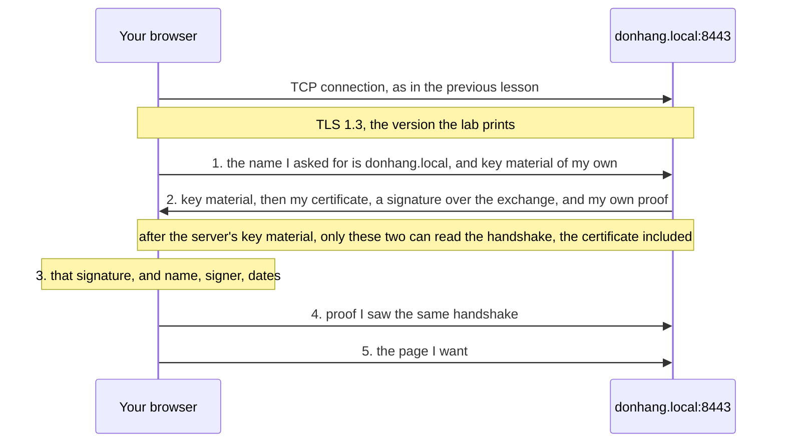

## Bạn cần biết trước

- [[foundation.l1.tcp-vs-udp]] — bạn đã thấy một kết nối được thiết lập bằng ba thông điệp ngắn. Bài này thêm một cuộc trao đổi thứ hai lên trên đó.
- [[foundation.l1.dns]] — bạn đã thấy một cái tên được đổi thành địa chỉ, và file hosts của máy bạn ghi đè lên lần tra cứu đó. Ở đây bạn kiểm tra xem máy ở địa chỉ đó có đúng là có quyền mang cái tên ấy không.

## Tình huống

Lab Đơn Hàng phục vụ cùng những trang ấy ở hai địa chỉ. Địa chỉ thứ nhất là `localhost:8080`, cái tên chỉ chính máy của bạn, và nó mở ra ngay, không một lời thắc mắc. Địa chỉ thứ hai là `donhang.local:8443`, viết theo dạng `https`, mà bạn tới được sau khi thêm `127.0.0.1 donhang.local` vào file hosts: dòng đó cũng trỏ cái tên về chính máy của bạn. Địa chỉ này thì không mở: trình duyệt chặn kết nối lại, hoặc hỏi bạn có chắc muốn đi tiếp không. Không có gì hỏng cả: cả hai đều tới cùng một Caddy, chương trình phục vụ các trang của lab. Vậy ở địa chỉ thứ hai, trình duyệt kiểm tra điều gì mà ở địa chỉ thứ nhất nó chưa bao giờ kiểm tra?

## Khái niệm cốt lõi

- **TLS** (lớp mã hóa trên TCP, là chữ S trong HTTPS) — lớp được thêm lên trên một kết nối TCP đã mở. Nó kiểm tra server có đúng là máy mà cái tên đại diện hay không, trước khi có trang nào được xin. Khi hai bên đã thiết lập xong key (những giá trị dùng để mã hóa byte rồi đọc lại chúng), nó mã hóa những gì hai bên gửi: biến chúng thành các byte chỉ hai bên đọc được.
- chứng chỉ (certificate) — một file nhỏ server đưa ra trong lần kiểm tra đó. Nó liệt kê những cái tên mà server đại diện, ghi hai mốc ngày mà chỉ trong khoảng giữa chúng nó mới được dùng, và mang một public key: nửa công khai của một cặp key, còn nửa riêng tư (private key) thì chỉ server giữ.
- đơn vị cấp chứng chỉ (certificate authority) — bên đã ký chứng chỉ đó. Chữ ký là một dấu chỉ người giữ private key mới tạo được, và ai có public key tương ứng cũng kiểm tra được. Hệ điều hành và trình duyệt trên máy bạn mang sẵn danh sách các đơn vị cấp chứng chỉ mà chúng chấp nhận. Một chữ ký không dẫn về được danh sách đó thì không có giá trị gì. Một đơn vị có tên trong danh sách chỉ được phép ký cho một cái tên sau khi đã kiểm tra rằng người yêu cầu thực sự kiểm soát cái tên đó, và chính bước này gắn cái tên với key trong chứng chỉ.
- HTTPS — xin trang qua một kết nối TLS thay vì một kết nối trần, và đó là ý nghĩa của dạng `https` trong địa chỉ. Port là 443, trừ khi địa chỉ ghi port khác, như lab ghi 8443.
- ổ khóa (padlock) — tên gọi cho lời báo của trình duyệt rằng các bước kiểm tra trên kết nối này đã qua. Đó là một nhận định về kết nối, không phải về trang web phía sau.

## Cơ chế hoạt động



Trước tiên, trình duyệt mở một kết nối TCP. Nó nói tên trang mình muốn và gửi đi nguyên liệu để tạo key. Một máy trên một port có thể giữ chứng chỉ cho nhiều cái tên, nên phải cho nó biết là tên nào. Cuộc trao đổi này, gọi là TLS handshake, chính là bước thiết lập phần mã hóa. Vì vậy, với cách thiết lập thông thường mà lab đang dùng, cái tên đi ra trước khi có gì được mã hóa. Một số cách thiết lập giấu được nó.

Server trả lời bằng nguyên liệu tạo key của mình, rồi tới chứng chỉ. Hai phần nguyên liệu này trở thành key mà cả hai đầu dùng. Mỗi bên còn giữ một giá trị riêng không bao giờ gửi đi, tạo ra cho riêng kết nối này, và đó không phải private key của chứng chỉ. Vì thế thấy được cả hai phần nguyên liệu cũng không đủ để dựng lại các key đó. TLS có nhiều phiên bản đánh số. Ở bản 1.3 mà lab dùng, mọi thông điệp handshake sau phần nguyên liệu của server đều được mã hóa. Dù vậy, chứng chỉ vẫn được đưa cho bất kỳ ai kết nối tới.

Server còn ký lên toàn bộ cuộc trao đổi bằng private key của mình, và key này không bao giờ được gửi đi. Ở bước 3, trình duyệt kiểm tra chữ ký đó bằng public key trong chứng chỉ. Một máy chỉ có bản sao của chứng chỉ thì không tạo được chữ ký nào qua được bước này. Trình duyệt còn kiểm tra ba điều đọc từ chứng chỉ: chứng chỉ có liệt kê cái tên bạn đã xin không, bên ký có nằm trong danh sách của máy bạn không (trực tiếp, hoặc qua một đơn vị khác có trong danh sách), và thời điểm hiện tại có nằm giữa hai mốc ngày không. Chỉ cần một điều không qua là trang bị chặn. Một số trình duyệt cho bạn xác nhận để đi tiếp dù vậy.

Server kết thúc bước 2 bằng một bằng chứng tính trên các thông điệp tới lúc đó. Ở bước 4, trình duyệt gửi bằng chứng của riêng nó, nên cả hai đều biết mình đã thấy cùng những thông điệp và không có gì ở giữa sửa chúng. Chỉ khi đó, ở bước 5, trình duyệt mới xin trang.

## Trong hệ thống Đơn Hàng

Trang HTTPS là phần cuối của `Caddyfile`, file cho Caddy biết phải phục vụ cái gì.

```caddyfile file=Caddyfile tag=stage-0 lines=93-99
# The same site over HTTPS, with a certificate Caddy signs itself.
# lesson: foundation.l1.tls-and-https
donhang.local:8443 {
	tls internal
	root * /srv/www
	file_server
}
```

Dòng `donhang.local:8443 {` là một địa chỉ: mọi thứ cho tới dấu ngoặc nhọn đóng đều trả lời cho `donhang.local` ở port 8443. `root * /srv/www` và `file_server` phục vụ cùng thư mục với trang `:8080` thường. Dòng quan trọng là `tls internal`: nó bảo Caddy tự tạo một đơn vị cấp chứng chỉ của riêng mình và dùng đơn vị đó ký chứng chỉ cho `donhang.local`. Không có gì trong lab đưa đơn vị đó vào danh sách của trình duyệt, và toàn bộ khác biệt nằm ở đó.

Một script đọc lại chứng chỉ từ kết nối. Nó chạy trên máy lab, chiếc máy Linux nhỏ của lab dùng để chạy script, và danh sách của máy này cũng không có đơn vị của Caddy. Caddy chạy trên một máy nhỏ thứ hai mà lab khởi động. Lab không cấp cho máy này địa chỉ riêng, nên nó dùng chung địa chỉ với máy lab. Vì thế trên máy lab, `127.0.0.1` port 8443 chính là Caddy đang lắng nghe, và file hosts của máy lab đã trỏ sẵn `donhang.local` về đó.

```bash file=scripts/network/inspect-cert.sh tag=stage-0 lines=7-19
echo "the certificate the site presents:"
echo | openssl s_client -connect donhang.local:8443 -servername donhang.local 2>/dev/null \
  | openssl x509 -noout -subject -issuer -dates

echo
echo "the names this certificate is valid for:"
echo | openssl s_client -connect donhang.local:8443 -servername donhang.local 2>/dev/null \
  | openssl x509 -noout -ext subjectAltName

echo
echo "what the two sides agreed to use:"
echo | openssl s_client -connect donhang.local:8443 -servername donhang.local 2>/dev/null \
  | grep -E '^ +(Protocol|Cipher) +:'
```

```text output=true
the certificate the site presents:
subject=
issuer=CN=Caddy Local Authority - ECC Intermediate
notBefore=...
notAfter=...

the names this certificate is valid for:
X509v3 Subject Alternative Name: critical
    DNS:donhang.local

what the two sides agreed to use:
    Protocol  : TLSv1.3
    Cipher    : TLS_AES_128_GCM_SHA256
```

`openssl s_client` mở một kết nối TLS tới `donhang.local:8443` và in ra những gì nhận về. Sau đó `openssl x509 -noout` chỉ in các trường được ghi phía sau nó, còn `grep -E` chỉ giữ lại hai dòng `Protocol` và `Cipher`.

Phần đầu có tên bên ký nhưng không có tên trang nào: `subject=` (trường trước đây dùng để ghi tên trang) để trống, nên cái tên nằm ở phần thứ hai, dưới `X509v3 Subject Alternative Name`, trong đó `DNS:` đánh dấu một cái tên chứ không phải một lần tra cứu. Trình duyệt so cái tên với trường này, không phải với subject. Issuer là đơn vị mà `tls internal` đã tạo ra. Phần thứ ba in phiên bản, `TLSv1.3`, được hai bên thống nhất trong handshake chứ không phải mặc định có sẵn. Bạn có thể bỏ qua `echo |`, `2>/dev/null`, chữ `critical` ở cuối dòng, phần còn lại trong tên của issuer và dòng `Cipher`, vì các bài sau sẽ giải thích. Các mốc ngày in ra là `...` vì bản in này che đi những giá trị thay đổi giữa các lần chạy.

Để ý điều script không bao giờ làm: không có gì trong nó dừng lại khi gặp một bên ký không được chấp nhận, nên nó vẫn in ra chứng chỉ của đúng trang mà trình duyệt từ chối. Bước kiểm tra thất bại là về chuyện ai đã ký, không phải về mã hóa. Trình duyệt, bên thực sự từ chối, đã chạy các bước kiểm tra và biết bước nào thất bại. TLS cũng có mã lỗi riêng cho chứng chỉ hết hạn và cho bên ký không được chấp nhận.

## Người mới hay nghĩ rằng…

- **"HTTPS nghĩa là trang web đáng tin."** → Thực ra các bước kiểm tra chỉ nói rằng byte được giấu đi trên đường truyền và server giữ private key cho cái tên bạn đã gõ. Không bước nào xem ai đứng sau cái tên đó hay trang web làm gì với những gì bạn gửi. Bạn sẽ nhận ra khi một cửa hàng giả, ở một cái tên chỉ lệch một chữ so với tên thật, vẫn hiện cùng ổ khóa, với một chứng chỉ thật cho chính cái tên của nó.
- **"Mã hóa giấu được mọi thứ, kể cả tôi đang vào trang nào."** → Thực ra địa chỉ và port không bao giờ được mã hóa, và thông thường cái tên trong thông điệp đầu tiên đi ra trước khi có mã hóa. Thứ được giấu là bạn đã xin trang nào và gửi kèm những gì. Bạn sẽ nhận ra khi một mạng bạn không kiểm soát liệt kê được các trang web mà một laptop đã mở, nhưng không xem được một trang cụ thể nào trong số đó.
- **"Chứng chỉ hết hạn vẫn mã hóa được, nên thật ra chẳng có gì sai."** → Thực ra bước kiểm tra ngày thất bại chỉ vì ngày, dù phần mã hóa có chạy tốt đến đâu. Nếu không ai chịu trách nhiệm thay chứng chỉ trước mốc ngày sau của nó, thì đây không phải xui xẻo mà là một ngày chắc chắn sẽ tới. Bạn sẽ nhận ra khi một trang hôm qua còn chạy bỗng lỗi với tất cả mọi người cùng lúc, vào một ngày không ai thay đổi gì.

## Thử ngay (3 phút)

1. Khởi động lab bằng `scripts/up.sh`, rồi chạy `scripts/network/inspect-cert.sh`. Đọc dòng `issuer=` và cái tên dưới tiêu đề thứ hai, rồi so hai mốc `notBefore` và `notAfter` với ngày hôm nay.
2. Thêm `127.0.0.1 donhang.local` vào file hosts của máy bạn, rồi mở `donhang.local` ở port 8443 trong trình duyệt, dùng dạng `https` của địa chỉ.

Kết quả mong đợi: script in ra một issuer có chứa `Caddy Local Authority`, một cái tên hợp lệ `DNS:donhang.local`, và `Protocol  : TLSv1.3`. Trình duyệt chặn lại hoặc hỏi bạn xác nhận, như trong tình huống. Trong ba bước kiểm tra ở trên, tên và ngày đều qua, nên bước thất bại là ai đã ký.

## Liên hệ

- [[foundation.l1.tcp-vs-udp]] — tầng nằm bên dưới: cuộc trao đổi này bắt đầu khi handshake ở đó đã xong.
- [[foundation.l1.dns]] — nơi cái tên được kiểm tra đến từ: chứng chỉ phải liệt kê đúng cái tên đã được tra ra ở đó.
- [[devops.l1.reverse-proxy-and-tls]] — cùng ý tưởng nhìn từ phía server: ai lấy chứng chỉ về và ai gia hạn nó.
- [[backend.l4.pki-and-signing]] — cùng ý tưởng ở tầng sâu hơn nhiều: chữ ký chứng minh ai đã ký bằng cách nào.

## Tóm tắt 5 dòng

1. TLS nằm trên một kết nối TCP đã mở, kiểm tra server có đúng là máy mà cái tên đại diện không, và mã hóa những gì hai bên gửi.
2. Chứng chỉ gắn các cái tên với một public key. Trượt bước kiểm tra tên, bên ký hoặc ngày thì trang bị chặn hoặc bạn bị hỏi xác nhận.
3. Ổ khóa báo kết quả của các bước kiểm tra đó và không gì khác: không nói ai đứng sau cái tên, cũng không nói họ làm gì với những gì bạn gửi.
4. Địa chỉ và port vẫn lộ ra với mạng, và thông thường cả cái tên được xin. Bạn đã xin trang nào thì không lộ.
5. Một chứng chỉ có thể làm một trang đang chạy tốt ngừng hoạt động mà không cần sửa dòng code nào, và trình duyệt, bên chạy các bước kiểm tra, biết bước nào đã thất bại.
