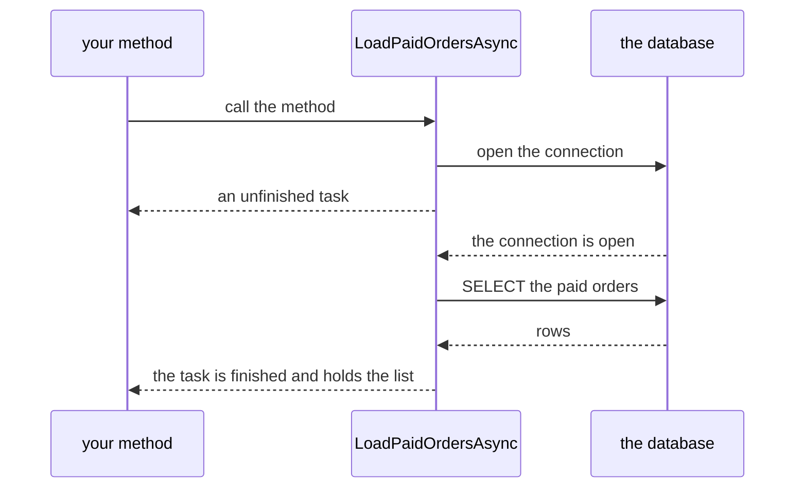

## Before you start

- [[foundation.l1.threads-and-async-intro]] — you saw that waiting for a database or a network reply is idle time, and that async/await hands the thread back for the length of that wait. This lesson reads one such method line by line.
- [[foundation.l1.oop-interface-vs-abstract]] — you learned to read a signature as a promise about what a caller gets back. This lesson looks at a return type that promises a result later instead of now.

## The situation

You open `LoadOrdersAsync.cs` in the console project of the example repository, the file behind the `load-orders` sample that prints every paid order. The method doing the work, `LoadPaidOrdersAsync`, is declared `async Task<List<string>>`, and almost every line of its body starts with `await`. You want that list inside a small helper of your own that is not marked `async`, so you call the method without `await` and try to walk the answer with a `foreach`. The build fails. You reach for `.Result` instead, which compiles, and then a wrong password in the text that tells the database who you are throws something you have never seen before. What is that return type actually handing you?

## Core concepts

- task — the object an async method hands back, standing for work that is already under way and not necessarily finished; when the work ends, the task holds either the result or the failure. `Task<List<string>>` reads as "a list of strings, later".
- `async` — a modifier on a method that allows `await` inside its body and, when the method gives a value back, has the compiler hand back a task instead of a plain value; on its own it starts no thread.
- `await` — an operator saying the method cannot continue past this point until the task it names has finished; while that task is unfinished, the method gives control back to its caller.
- continuation — the rest of a method after an `await`, which the runtime — the thing that runs your compiled program — runs once the awaited task completes, possibly on a different thread from the one that began the method.
- blocking — holding a thread while it does nothing but wait for something else to end; `.Result` and `.Wait()` on a task do exactly that.

## How it works



In the situation above, your call runs `LoadPaidOrdersAsync` straight away, on your own thread. It keeps running until the first `await` whose work is not already done — here, opening the connection to the database. At that point the method stops and hands your code a `Task<List<string>>`. The list does not exist yet. The task is a receipt for it.

If you `await` that task, your own method stops the same way and returns control to its caller. When the connection is open, `LoadPaidOrdersAsync` picks up again, sends the `SELECT` and waits once more; when the rows arrive it fills the list and marks the task finished. Only then does the rest of your method — its continuation — run. No thread waits through any of this.

Without `await`, the work still starts but your code walks on holding a receipt instead of a list. That is why the `foreach` refuses to compile: a task is not a collection of strings.

`.Result` and `.Wait()` close the gap from the other side: they hold the current thread until the task finishes, so the waiting you removed comes back. In some kinds of program the rest of a method must resume on one particular thread; if that is the thread you are holding, the rest can never run and the program stops for good. A console program like this sample has no such rule, so `.Result` here only puts the waiting back.

Failure travels with the task too. An exception raised inside an async method that returns a task is not thrown at the call: it is stored in the task and thrown again where you `await` it. `.Result` brings it out too, wrapped in an `AggregateException` — a failure whose only job is to hold another one.

## In the Đơn Hàng system

This is the whole method behind the `load-orders` sample. `NpgsqlConnection` and `NpgsqlCommand` are the PostgreSQL classes that talk to the database, and `ConnectionString` is the text holding the address, user and password; none of that matters here, only the `await`s do. The `cancellationToken` belongs to a later lesson.

```csharp file=samples/DonHang.Samples/Samples/Data/LoadOrdersAsync.cs tag=stage-0 lines=12-28
    public static async Task<List<string>> LoadPaidOrdersAsync(CancellationToken cancellationToken)
    {
        await using var connection = new NpgsqlConnection(ConnectionString);
        await connection.OpenAsync(cancellationToken);

        await using var command = new NpgsqlCommand(
            "SELECT id, status FROM orders WHERE status = 'paid' ORDER BY id", connection);
        await using var reader = await command.ExecuteReaderAsync(cancellationToken);

        var orders = new List<string>();
        while (await reader.ReadAsync(cancellationToken))
        {
            orders.Add($"order {reader.GetInt32(0)} is {reader.GetString(1)}");
        }

        return orders;
    }
```

Three of the `await`s mark a moment where the method would otherwise sit and wait for the database: opening the connection, running the query, pulling each row.

The three `await using` declarations are a different thing — one of them shares its line with the `await` on `ExecuteReaderAsync`. Writing `using` in front of a variable means the runtime closes that variable for you when the method ends, which is why you see no close line in the code; `await using` means that closing is itself waited on. So its waiting happens at the end of the method, not on the line you see it.

Between all of them the code is ordinary and reads top to bottom, which is what lets you write a loop here the same way you would in a method with no `await` in it.

The `while` loop is worth staring at: the reader gives back one row at a time, `0` and `1` are the `id` and `status` columns of the query, and the method may stop and resume once per row; `orders` keeps everything added so far across every stop, because the local variables of an async method are preserved until it ends.

The declared return type is `Task<List<string>>`, but the `return` statement hands back a `List<string>`; the compiler puts the list into the task for you.

The caller shows the shape to copy.

```csharp file=samples/DonHang.Samples/Samples/Data/LoadOrdersAsync.cs tag=stage-0 lines=30-36
    public static async Task RunAsync()
    {
        foreach (var order in await LoadPaidOrdersAsync(CancellationToken.None))
        {
            Console.WriteLine(order);
        }
    }
```

`RunAsync` is itself `async` and returns `Task`, because a method that awaits must be marked `async`, and an `async` method never hands a plain value back: a task carrying the value when there is one, plain `Task` when there is nothing, so its caller can still `await` it and know when it ended. The `await` sits between `in` and the call, so the `foreach` walks the list rather than the task. Awaiting spreads outwards: the caller of `RunAsync` awaits it in turn, and here that caller is `Program.cs`, the entry point of the console program.

## Beginners often think…

- **"Forgetting `await` just makes the call run to the end before it returns."** → Actually the call still starts the work and returns immediately with an unfinished task, so the two halves of your code now run in an order nobody chose. You notice this when a list comes back empty, or when a failure that should have stopped the program stops nothing, because the exception sat in a task nobody ever looked at.
- **"`.Result` is a convenient shortcut when I need the value now."** → Actually it blocks the thread until the task finishes and, when the work failed, throws an `AggregateException` wrapping the real one instead of the real one. You notice this when a screen or a request hangs forever with no error at all, or when the error names `AggregateException` and the message you need sits in its `InnerException`.
- **"An `async` method runs my code on another thread."** → Actually `async` only lets the compiler split the method at each `await`; it starts nothing. You notice this when marking a slow loop of pure arithmetic `async` changes nothing, because there was never any waiting to give back.

## Try it (3 minutes)

1. In the example repository, open `samples/DonHang.Samples/Samples/Data/LoadOrdersAsync.cs` and delete the word `await` from the `foreach` line of `RunAsync`, leaving the call itself alone.
2. Run `dotnet build samples/DonHang.Samples`, read the message, then put the `await` back and build again. Nothing needs to be running for this; the database is only touched when the sample runs.

Expected result: the build fails, and the message says the `foreach` cannot walk over a `Task<List<string>>`. The call gave you the receipt; only `await` turns it into the list.

<details><summary>Suggested answer</summary>

The compiler is not complaining about timing — it is complaining about a type. `LoadPaidOrdersAsync(...)` is an expression of type `Task<List<string>>`, and that type cannot be walked item by item. Putting `await` in front changes the type of the expression to `List<string>`, which can.

</details>

## Connections

- [[foundation.l1.threads-and-async-intro]] — it showed you why giving a thread back during a wait is worth doing at all; this lesson is the syntax that does it, and the two ways of undoing it by accident.
- [[backend.l1.request-lifecycle]] — the same idea one layer up: a server handles many requests at the same time, and each request gives its thread back while it waits on a database.

## Five-line summary

1. An `async` method hands back a task that stands for work already started, and `await` is what turns that task into the result.
2. The method runs on the calling thread until its first unfinished `await`, then returns control; the rest of it runs when the awaited work ends.
3. Calling without `await` starts the work but hands your code a task, not a value — usually a bug.
4. `.Result` and `.Wait()` hold the thread until the task ends, which can stop a program for good when the continuation needs that same thread.
5. An exception inside an async method is stored in its task and thrown again at the `await`, not at the call.
