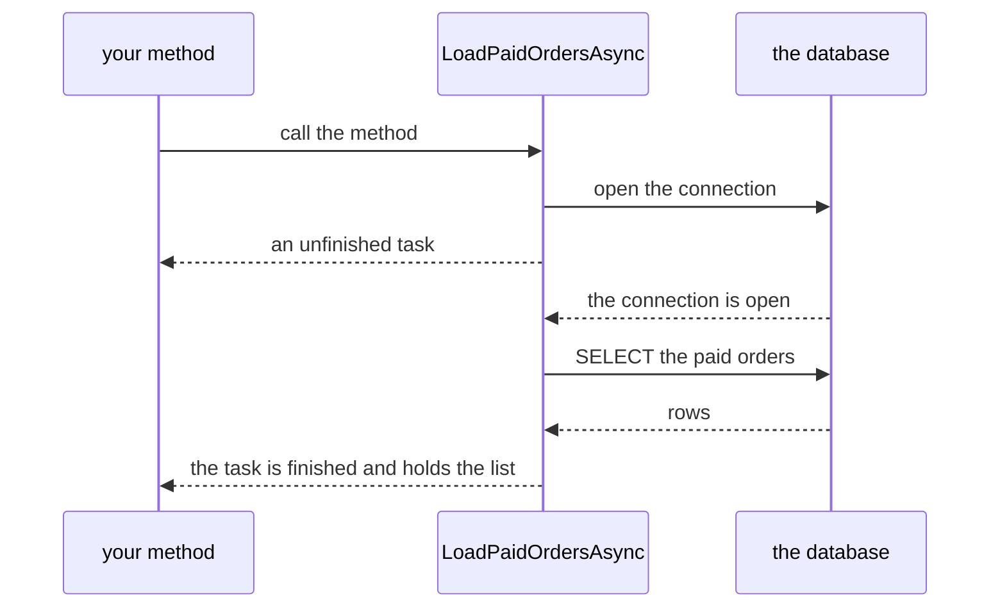

## Bạn cần biết trước

- [[foundation.l1.threads-and-async-intro]] — bạn đã thấy chờ database hay chờ phản hồi qua mạng là thời gian rảnh, và async/await trả thread lại trong suốt lần chờ đó. Bài này đọc từng dòng một phương thức như thế.
- [[foundation.l1.oop-interface-vs-abstract]] — bạn đã học đọc một signature như lời hứa về thứ nơi gọi sẽ nhận lại. Bài này xem một kiểu trả về hứa đưa kết quả sau chứ không phải ngay bây giờ.

## Tình huống

Bạn mở `LoadOrdersAsync.cs` trong project console của repo ví dụ, file đứng sau sample `load-orders` in ra mọi đơn hàng đã thanh toán. Phương thức làm việc chính, `LoadPaidOrdersAsync`, được khai báo `async Task<List<string>>`, và gần như dòng nào trong thân nó cũng bắt đầu bằng `await`. Bạn muốn lấy danh sách đó vào một hàm phụ nhỏ tự viết, không đánh dấu `async`, nên bạn gọi phương thức mà không có `await` rồi thử duyệt kết quả bằng `foreach`. Build lỗi. Bạn chuyển sang dùng `.Result`, lần này compile được, rồi một mật khẩu sai trong đoạn text báo cho database biết bạn là ai ném ra một thứ bạn chưa từng thấy. Kiểu trả về đó thực ra đưa cho bạn cái gì?

## Khái niệm cốt lõi

- task — đối tượng mà phương thức async trả về, đại diện cho phần việc đã bắt đầu chạy và chưa chắc đã xong. Khi phần việc kết thúc, task giữ kết quả hoặc lỗi. `Task<List<string>>` đọc là "một danh sách string, nhưng để sau".
- `async` — modifier đặt trên phương thức, cho phép dùng `await` trong thân, và khi phương thức trả một giá trị thì compiler trả về một task thay cho giá trị trần. Tự nó không khởi động thread nào.
- `await` — toán tử nói rằng phương thức không đi tiếp qua điểm này được cho tới khi task nó chỉ tới đã xong. Trong lúc task đó chưa xong, phương thức trả quyền điều khiển về cho nơi gọi.
- continuation — phần còn lại của phương thức sau một `await`. Runtime, thứ chạy chương trình đã compile của bạn, chạy phần này khi task được chờ hoàn tất, có thể trên một thread khác với thread đã bắt đầu phương thức.
- blocking — giữ một thread mà nó không làm gì ngoài chờ thứ khác kết thúc. `.Result` và `.Wait()` trên một task làm đúng điều đó.

## Cơ chế hoạt động



Lời gọi của bạn chạy `LoadPaidOrdersAsync` ngay lập tức, trên chính thread của bạn. Nó chạy tới `await` đầu tiên mà phần việc chưa xong sẵn, ở đây là mở connection. Lúc đó phương thức dừng lại và đưa cho code của bạn một `Task<List<string>>`: tờ biên nhận cho một danh sách chưa tồn tại.

Nếu bạn `await` task đó, phương thức của bạn cũng dừng y như vậy và trả quyền điều khiển về cho nơi gọi nó. Khi connection đã mở, `LoadPaidOrdersAsync` chạy tiếp, gửi câu `SELECT` rồi lại chờ. Khi các dòng về tới, nó đổ đầy danh sách và đánh dấu task đã xong. Chỉ tới lúc đó phần còn lại của phương thức bạn, tức continuation, mới chạy. Suốt quá trình này thread của bạn không ngồi chờ, thread của nơi gọi phương thức bạn cũng vậy.

Không có `await`, phần việc vẫn bắt đầu, nhưng code của bạn đi tiếp với tờ biên nhận trong tay chứ không phải danh sách. Vì thế `foreach` không compile: task không phải một tập hợp string. Đôi khi đó là chủ ý, và bạn sẽ await task đó sau. Lỗi thật là không bao giờ await nó.

`.Result` và `.Wait()` lấy giá trị mà không cần `await` bằng cách giữ thread hiện tại cho tới khi task xong. Ở một số chương trình, như app desktop, phần còn lại của phương thức mặc định chạy tiếp trên một thread cố định. Nếu bạn đang giữ chính thread đó, phần còn lại không bao giờ chạy và chương trình đứng im luôn. Sample console này không có quy tắc như vậy.

Exception phát sinh trong một phương thức async trả về task không bị ném ra ngay ở lời gọi: nó được cất trong task và ném ra lại ở chỗ bạn `await`. `.Result` cũng lôi nó ra, nhưng bọc trong một `AggregateException`, loại lỗi chuyên dùng để chứa các lỗi khác. Ở đây nó chứa đúng một lỗi, lỗi thật.

## Trong hệ thống Đơn Hàng

Đây là toàn bộ phương thức đứng sau sample `load-orders`. `NpgsqlConnection` và `NpgsqlCommand` là các class làm việc với database, còn `ConnectionString` là đoạn text chứa địa chỉ, user và mật khẩu. Những thứ đó không quan trọng ở đây, chỉ các `await` là quan trọng. `cancellationToken` thuộc về một bài sau.

```csharp file=samples/DonHang.Samples/Samples/Data/LoadOrdersAsync.cs tag=stage-0 lines=12-28
    public static async Task<List<string>> LoadPaidOrdersAsync(CancellationToken cancellationToken)
    {
        await using var connection = new NpgsqlConnection(ConnectionString);
        await connection.OpenAsync(cancellationToken);

        await using var command = new NpgsqlCommand(
            "SELECT id, status FROM orders WHERE status = 'paid' ORDER BY id", connection);
        await using var reader = await command.ExecuteReaderAsync(cancellationToken);

        var orders = new List<string>();
        while (await reader.ReadAsync(cancellationToken))
        {
            orders.Add($"order {reader.GetInt32(0)} is {reader.GetString(1)}");
        }

        return orders;
    }
```

Ba trong số các `await` đánh dấu những lúc lẽ ra phương thức phải ngồi chờ database: mở connection, chạy query, kéo từng dòng về.

Ba khai báo `await using` là chuyện khác, một trong số đó nằm chung dòng với `await` trên `ExecuteReaderAsync`. Viết `using` trước một biến nghĩa là compiler sẽ đóng connection, command và reader ở cuối block, ở đây là cuối phương thức, nên bạn không thấy dòng đóng nào. `await using` nghĩa là chính lần đóng đó cũng được chờ, ở cuối phương thức, chứ không phải ở dòng bạn nhìn thấy. Ngoài sáu chỗ này, code đọc từ trên xuống như mọi phương thức khác.

Trong vòng `while`, reader trả về từng dòng một, `0` và `1` là cột `id` và `status` của query, và phương thức có thể dừng rồi chạy tiếp một lần cho mỗi dòng. `orders` vẫn giữ mọi thứ đã thêm qua mọi lần dừng, vì biến cục bộ của phương thức async được giữ lại cho tới khi phương thức kết thúc.

Kiểu trả về khai báo là `Task<List<string>>`, nhưng câu lệnh `return` trả về một `List<string>`. Compiler tự bỏ danh sách vào task giúp bạn.

Nơi gọi cho thấy khuôn mẫu nên làm theo.

```csharp file=samples/DonHang.Samples/Samples/Data/LoadOrdersAsync.cs tag=stage-0 lines=30-36
    public static async Task RunAsync()
    {
        foreach (var order in await LoadPaidOrdersAsync(CancellationToken.None))
        {
            Console.WriteLine(order);
        }
    }
```

Bản thân `RunAsync` cũng là `async` và trả về `Task`, vì phương thức có await phải được đánh dấu `async`, và phương thức `async` không bao giờ trả về giá trị trần: ở đây là task mang giá trị khi có giá trị, `Task` trơn khi không có gì, để nơi gọi nó vẫn `await` được. `await` nằm giữa `in` và lời gọi, nên `foreach` duyệt danh sách chứ không phải task. Await lan dần ra ngoài: nơi gọi `RunAsync` lại await nó, và ở đây nơi gọi đó là `Program.cs`, điểm vào của chương trình console. Code trong file này nằm ngoài mọi phương thức và không có từ khóa `async`, vì khi code kiểu này dùng `await`, compiler tự sinh một điểm vào `async` cho nó.

## Người mới hay nghĩ rằng…

- **"Quên `await` chỉ làm lời gọi chạy hết rồi mới trả về."** → Thực ra lời gọi vẫn bắt đầu phần việc và trả về ở `await` chưa xong đầu tiên, đưa cho bạn một task chưa xong, nên hai nửa code của bạn giờ chạy theo thứ tự không ai chọn. Bạn sẽ nhận ra khi phương thức bạn quên await đổ dữ liệu vào một danh sách bạn đang cầm, và code của bạn đọc danh sách đó trước khi đổ xong, hoặc khi một lỗi lẽ ra phải dừng chương trình lại chẳng dừng gì cả, vì exception nằm trong một task không ai ngó tới.
- **"`.Result` là lối tắt tiện lợi khi cần giá trị ngay."** → Thực ra nó chặn thread cho tới khi task xong, và khi phần việc lỗi, nó ném ra một `AggregateException` bọc lỗi thật thay vì chính lỗi thật. Bạn sẽ nhận ra khi cửa sổ app desktop đứng hình mà không có lỗi nào, hoặc khi lỗi báo tên `AggregateException` còn thông điệp bạn cần lại nằm trong lỗi được bọc bên trong, lộ ra qua `InnerException`.
- **"Phương thức `async` chạy code của tôi trên thread khác."** → Thực ra `async` chỉ cho compiler cắt phương thức ở mỗi `await`, nó không khởi động gì cả. Bạn sẽ nhận ra khi đánh dấu `async` cho một vòng lặp tính toán thuần túy chạy chậm mà chẳng thay đổi gì, vì ngay từ đầu đã không có lần chờ nào để trả thread lại.

## Thử ngay (3 phút)

1. Trong repo ví dụ, mở `samples/DonHang.Samples/Samples/Data/LoadOrdersAsync.cs` và xóa chữ `await` ở dòng `foreach` của `RunAsync`, giữ nguyên lời gọi.
2. Chạy `dotnet build samples/DonHang.Samples`, đọc thông báo, rồi đặt `await` lại chỗ cũ và build lần nữa. Không cần chạy gì trước, vì database chỉ được đụng tới khi sample chạy.

Kết quả mong đợi: build lỗi, thông báo lỗi nhắc tới `foreach` và kiểu `Task<List<string>>`. Lời gọi đưa bạn tờ biên nhận, chỉ `await` mới biến nó thành danh sách.

<details><summary>Gợi ý đáp án</summary>

Compiler không phàn nàn về thời điểm, nó phàn nàn về kiểu. `LoadPaidOrdersAsync(...)` là biểu thức kiểu `Task<List<string>>`, và kiểu này không duyệt từng phần tử được. Đặt `await` phía trước đổi kiểu của biểu thức thành `List<string>`, kiểu duyệt được.

</details>

## Liên hệ

- [[foundation.l1.threads-and-async-intro]] — bài đó cho bạn thấy vì sao trả thread lại trong lúc chờ là đáng làm. Bài này là cú pháp để làm điều đó, cùng hai cách vô tình phá bỏ nó.
- [[backend.l1.request-lifecycle]] — cùng ý tưởng áp dụng cho server xử lý nhiều request cùng lúc.

## Tóm tắt 5 dòng

1. Phương thức `async` trả về một task đại diện cho phần việc đã bắt đầu, và `await` là thứ biến task đó thành kết quả.
2. Phương thức chạy trên thread gọi nó tới `await` chưa xong đầu tiên, rồi trả quyền điều khiển. Phần còn lại chạy khi phần việc được chờ kết thúc.
3. Gọi mà không có `await` vẫn bắt đầu phần việc nhưng đưa cho code của bạn một task, không phải giá trị, thường là bug.
4. `.Result` và `.Wait()` giữ thread cho tới khi task kết thúc, có thể làm chương trình đứng im luôn khi continuation cần chính thread đó.
5. Exception trong phương thức async được cất trong task và ném ra lại ở `await`, không phải ở lời gọi.
