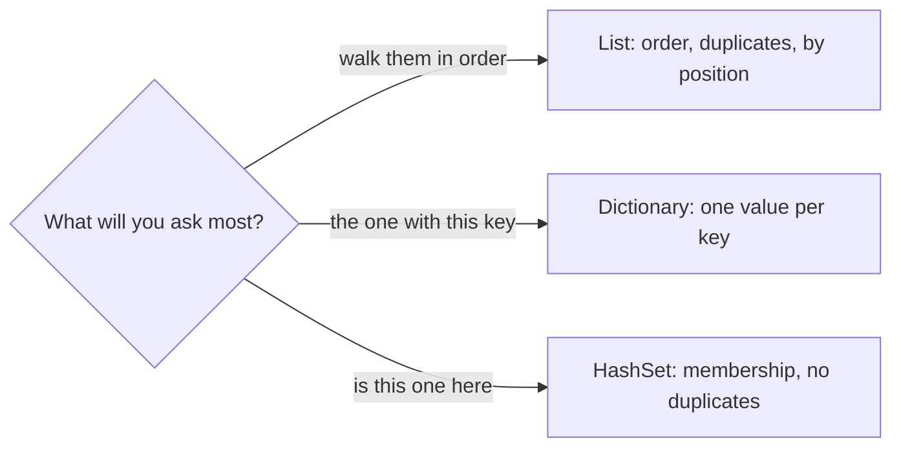

## Before you start

- [[foundation.l1.memory-stack-heap]] — you saw that a variable of a class type holds a reference to an object on the heap. A collection holds many of those references at once; this lesson is about how it arranges them.

## The situation

You are adding a sample to `DonHang.Samples` that prints order lines with the product name beside each one, and the products arrive as a `List<Product>`, a handful of rows from `db/seed.sql`, the file that fills the database with sample data. For every line you walk that list until the ids match, and it prints instantly. Then a second rule arrives — refuse a line whose product is already in the basket — and you write a second walk, this time over the ids already in the basket. Both work fine on a handful of products. A teammate asks what this code does when the catalogue holds fifty thousand rows. Which collection answers which question?

## Core concepts

- collection — an object that holds many values of one kind and decides how you reach them.
- list — a collection that keeps values in the order you added them, allows the same value twice, and hands you a value by its position; C# spells it `List<T>`.
- hash code — a number a value computes about itself, so a collection can file it in one of many small groups instead of one long row.
- **hash map** — a collection that stores a value under a key and finds it by the key's hash code, so the cost of one lookup barely grows as the collection grows; C# spells it `Dictionary<TKey, TValue>`.
- set — a collection that holds each value at most once and answers "is this value in here" by hash code; C# spells it `HashSet<T>`.

## How it works



In the situation you walked a list twice: over the products to find one id, then over the basket ids to ask whether one was there. The sample asks both, plus what a list is made for: walking them in order.

A `List<T>` keeps values in a row and hands you the one at a position. Order is part of the deal; the same value may appear twice. What it cannot do cheaply is find by content: `Contains`, `IndexOf`, or a `foreach` with an `if` all compare from the front until they match, so the work grows with the catalogue. A handful costs nothing; twenty order lines against fifty thousand products means a million comparisons, not fifty thousand and twenty — a slowness junior code meets over and over.

A `Dictionary<TKey, TValue>` answers a different question: the value filed under this key. It asks the key for its hash code and compares only inside the small group that number names. It keeps more groups as it fills, so a lookup barely costs more as it grows. You can also walk its entries, though the order they come back in is not promised.

The key carries two duties. Unless its type defines equality and a hash code by value, every instance counts as its own key, so a key you rebuild cannot find the entry you added. A `record`, a C# type whose compiler-written `Equals` and `GetHashCode` compare field values, has both; a plain `class` compares by reference. And it must not change while stored: a key whose hash code moves is filed in the wrong group and cannot be found.

A `HashSet<T>` holds values and answers membership the same way. Adding one already there changes nothing — that is how you say "each id once".

## In the Đơn Hàng system

`DonHang.Samples` is the console project of the example repository. One of its samples, which the runner knows by the name `collections-choice`, asks all three questions of the same short product list, where each `Product` carries an id, a name and a price.

```csharp file=samples/DonHang.Samples/Samples/Data/CollectionsChoice.cs tag=stage-0 lines=10-27
        var products = new List<Product>
        {
            new(1, "Bàn phím cơ", 1_250_000),
            new(2, "Chuột không dây", 450_000),
            new(3, "Tai nghe", 890_000),
        };

        // Keeps the order you put things in, and lets you walk them.
        foreach (var product in products)
            Console.WriteLine($"{product.Id} {product.Name}");

        // Answers "the one with this id" without looking at the others.
        var byId = products.ToDictionary(product => product.Id);
        Console.WriteLine($"product 2 is {byId[2].Name}");

        // Answers "is this one in here" and refuses duplicates.
        var idsInBasket = new HashSet<int> { 2, 3, 2 };
        Console.WriteLine($"{idsInBasket.Count} distinct ids, contains 3: {idsInBasket.Contains(3)}");
```

Read the three comments as three questions. The `foreach` needs order, so the list is the right shape for it. `ToDictionary` walks the list once and files each product under `product.Id`, and it refuses to finish if two products produce the same id; after that, `byId[2]` goes straight to one entry instead of comparing its way there. That square-bracket lookup, `byId[2]`, throws `KeyNotFoundException` when the id is absent, so use `TryGetValue` when you are not sure it is there: it answers true or false and hands the value back through an `out` parameter instead of throwing. The set is written with three values but keeps two, and `Contains(3)` answers without comparing against every value it holds.

## Beginners often think…

- **"A list is fine for everything while the data is small — and the data stays small."** → Actually the seed file is small and the live catalogue is not, and a walk placed inside a loop over another collection multiplies rather than adds. You notice this when a screen that was instant against `db/seed.sql` takes seconds after the first real import.
- **"A dictionary keeps items in the order I put them in."** → Actually `Dictionary<TKey, TValue>` does not specify the order in which it returns its entries, so code that depends on it can change behaviour after an unrelated edit. You notice this when a report's rows come out in a new order once entries are removed and added.
- **"Any type works as a key out of the box."** → Actually the dictionary files a key by its hash code and then compares candidates for equality, so a type that defines neither gives every instance its own identity; a `record` gets both from the compiler, a plain `class` does not. You notice this when a lookup with a freshly built key misses the entry you added with an equal one.

## Try it (3 minutes)

1. From the root of the example repository, run `dotnet run --project samples/DonHang.Samples -- collections-choice`.
2. Read the last line of the output. Then change `byId[2]` to `byId[99]` in `samples/DonHang.Samples/Samples/Data/CollectionsChoice.cs` and run the same command again.

Expected result: the first run prints the three products in the order they were written, then `product 2 is Chuột không dây`, then a line saying two distinct ids — the set dropped the repeated `2` — and that `3` is present. The second run stops with a `KeyNotFoundException`: that is what the dictionary does when nothing is filed under the key you asked for.

## Connections

- [[foundation.l1.memory-stack-heap]] — where the products themselves sit; this lesson is about the arrangement a collection keeps, not about the objects it reaches.
- [[foundation.l1.complexity-intro]] — the next step up: it puts names and shapes on "grows with the number of items" and "barely grows".
- [[foundation.l1.sql-index-intro]] — the same trade one layer down: pay once to build a lookup structure so that later questions need not read every row.

## Five-line summary

1. Choose a collection by the question you will ask it most often, not by the one you type fastest.
2. A list keeps order and duplicates and reaches a value by position, but finding by content means comparing from the front.
3. A dictionary files one value under each key and finds it by the key's hash code, so a lookup barely costs more as it grows.
4. A set holds each value once and answers membership the same way, which is how you say "no duplicates" without checking by hand.
5. Unless a key's type defines equality and a hash code by value, each instance is its own key; a stored key must not change.
