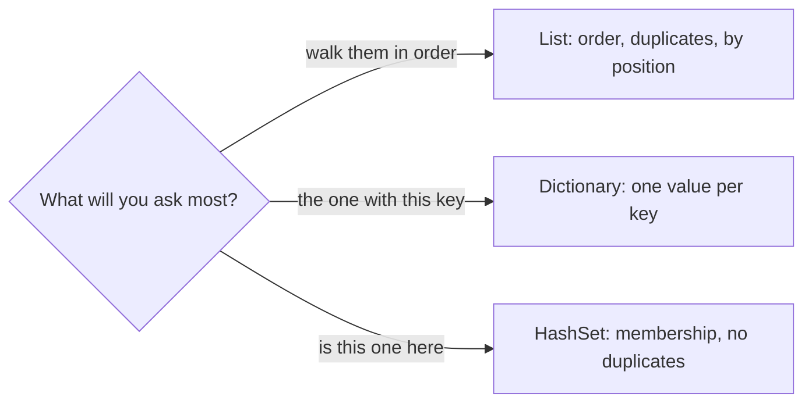

## Bạn cần biết trước

- [[foundation.l1.memory-stack-heap]] — bạn đã thấy biến có kiểu là class giữ một tham chiếu tới đối tượng nằm trên heap. Một collection giữ nhiều tham chiếu như vậy cùng lúc. Bài này nói về cách nó sắp xếp chúng.

## Tình huống

Bạn đang thêm một sample vào `DonHang.Samples`, project console trong code Đơn Hàng. Sample này in các dòng của đơn hàng, cạnh mỗi dòng là tên sản phẩm. Sản phẩm đến dưới dạng một `List<Product>`, gồm vài dòng mẫu lấy từ `db/seed.sql`. Với mỗi dòng đơn, bạn duyệt list đó cho tới khi id khớp, và kết quả in ra ngay lập tức. Rồi một quy tắc thứ hai đến: từ chối dòng nào có sản phẩm đã nằm trong giỏ. Bạn viết thêm một vòng duyệt nữa, lần này qua các id đã có trong giỏ. Với vài sản phẩm, cả hai đều chạy tốt. Một đồng nghiệp hỏi: đoạn code này sẽ ra sao khi danh mục có năm mươi nghìn dòng? Collection nào trả lời câu hỏi nào?

## Khái niệm cốt lõi

- collection — đối tượng giữ nhiều giá trị cùng loại và quyết định cách bạn lấy tới chúng.
- list — collection giữ giá trị theo đúng thứ tự bạn thêm vào, cho phép cùng một giá trị xuất hiện hai lần, và trao cho bạn giá trị theo vị trí. Trong C# nó là `List<T>`.
- hash code — một con số mà giá trị tự tính về chính nó, để collection xếp nó vào một trong nhiều nhóm nhỏ thay vì một hàng dài duy nhất.
- **hash map** (cấu trúc tra cứu theo khóa gần như tức thì, Dictionary trong C#) — collection cất một giá trị dưới một khóa và tìm lại nó bằng hash code của khóa, nên chi phí của một lần tra cứu gần như không tăng khi collection lớn lên. Trong C# nó là `Dictionary<TKey, TValue>`.
- set — collection giữ mỗi giá trị tối đa một lần và trả lời câu "giá trị này có ở đây không" bằng hash code. Trong C# nó là `HashSet<T>`.

## Cơ chế hoạt động



Trong tình huống trên, bạn đã duyệt list hai lần. Vòng duyệt qua sản phẩm hỏi "cái nào có khóa này". Vòng duyệt qua id trong giỏ hỏi "cái này có ở đây không".

`List<T>` trao cho bạn giá trị theo vị trí. Điều nó không làm rẻ được là tìm theo nội dung: `Contains`, `IndexOf`, `Find`, hay một `foreach` kèm `if`, tất cả đều so sánh từ đầu cho tới khi khớp, nên khối lượng công việc tăng theo danh mục. Đó chính là sự chậm mà đồng nghiệp hỏi tới: hai mươi lần duyệt qua năm mươi nghìn sản phẩm tốn tới một triệu phép so sánh. Còn xếp sản phẩm theo id một lần chỉ tốn một lần duyệt năm mươi nghìn, cộng hai mươi lần tra cứu nhanh.

`Dictionary<TKey, TValue>` trả lời một câu hỏi khác: giá trị nào được cất dưới khóa này. Nó hỏi khóa để lấy hash code, rồi chỉ so sánh bên trong nhóm nhỏ mà con số đó chỉ tới. Khi đầy dần, nó giữ thêm nhóm, nên mỗi nhóm chỉ dài vài giá trị và một lần tra cứu gần như không tốn thêm khi nó lớn lên.

Khóa gánh hai trách nhiệm. Nếu class dùng làm khóa không tự định nghĩa phép so sánh bằng và hash code theo giá trị, mỗi instance được tính là một khóa riêng, nên một khóa bạn tạo lại sẽ không tìm thấy mục bạn đã thêm. `record`, kiểu C# có `Equals` và `GetHashCode` do compiler viết sẵn để so sánh giá trị các field, có đủ cả hai. `class` thường thì so sánh theo tham chiếu. Và khóa đã cất vào thì không được thay đổi: khi hash code của nó tính từ giá trị các field, đổi một field là đổi con số, mục đó vẫn nằm trong nhóm lúc được cất, còn lần tra cứu lại tìm ở một nhóm khác.

`HashSet<T>` giữ các giá trị và trả lời câu hỏi "có ở đây không" theo cùng cách. Thêm một giá trị đã có sẵn thì không thay đổi gì. Đó là cách bạn nói "mỗi id chỉ một lần".

## Trong hệ thống Đơn Hàng

Một trong các sample của `DonHang.Samples`, chạy bằng cách truyền tên `collections-choice` cho project đó, hỏi cả ba câu trên cùng một danh sách sản phẩm ngắn. Mỗi `Product` mang một id, một tên và một giá. Sample tự viết tay ba sản phẩm thay vì đọc `db/seed.sql`, nên chạy được mà không cần database.

```csharp file=samples/DonHang.Samples/Samples/Data/CollectionsChoice.cs tag=stage-0 lines=10-27
        var products = new List<Product>
        {
            new(1, "Bàn phím cơ", 1_250_000),
            new(2, "Chuột không dây", 450_000),
            new(3, "Tai nghe", 890_000),
        };

        // Keeps the order you put things in, and lets you walk them.
        foreach (var product in products)
            Console.WriteLine($"{product.Id} {product.Name}");

        // Answers "the one with this id" without looking at the others.
        var byId = products.ToDictionary(product => product.Id);
        Console.WriteLine($"product 2 is {byId[2].Name}");

        // Answers "is this one in here" and refuses duplicates.
        var idsInBasket = new HashSet<int> { 2, 3, 2 };
        Console.WriteLine($"{idsInBasket.Count} distinct ids, contains 3: {idsInBasket.Contains(3)}");
```

Đọc ba comment như ba câu hỏi. `foreach` cần thứ tự, nên list là hình dạng đúng cho nó. `ToDictionary` duyệt list một lần và cất mỗi sản phẩm dưới `product.Id`. Nếu hai sản phẩm cho ra cùng một id, nó ném exception thay vì chạy xong. Sau đó, `byId[2]` đi thẳng tới một mục thay vì so sánh dần tới đó. Lần tra cứu bằng ngoặc vuông này, `byId[2]`, ném `KeyNotFoundException` khi id không có. Vì vậy hãy dùng `TryGetValue` khi bạn không chắc id có ở đó: nó trả lời true hoặc false và trao lại giá trị qua một tham số `out` thay vì ném exception. Set được viết với ba giá trị nhưng chỉ giữ hai, và `Contains(3)` trả lời mà không phải so với từng giá trị nó đang giữ.

## Người mới hay nghĩ rằng…

- **"Khi dữ liệu còn nhỏ thì list dùng cho mọi thứ cũng được, mà dữ liệu thì cứ nhỏ mãi."** → Thực ra file seed thì nhỏ nhưng danh mục thật thì không, và một vòng duyệt đặt bên trong vòng lặp qua một collection khác sẽ nhân lên chứ không cộng thêm. Bạn sẽ nhận ra khi một màn hình vốn hiện ngay lập tức với `db/seed.sql` phải mất vài giây sau lần nhập dữ liệu thật đầu tiên.
- **"Dictionary giữ các mục theo đúng thứ tự tôi thêm vào."** → Thực ra `Dictionary<TKey, TValue>` không quy định thứ tự trả về các mục, nên code dựa vào thứ tự đó có thể đổi hành vi sau một lần sửa chẳng liên quan. Bạn sẽ nhận ra khi các dòng của một báo cáo ra theo thứ tự mới sau khi có mục bị xóa rồi thêm lại.
- **"Kiểu nào cũng dùng làm khóa được ngay."** → Thực ra dictionary xếp khóa theo hash code rồi so sánh bằng giữa các ứng viên, nên một class không định nghĩa cả hai sẽ cho mỗi instance một danh tính riêng. `record` được compiler viết sẵn cả hai, `class` thường thì không. Bạn sẽ nhận ra khi tra cứu bằng một khóa vừa tạo mới lại trượt mục bạn đã thêm bằng một khóa bằng nó.

## Thử ngay (3 phút)

1. Từ thư mục gốc của code Đơn Hàng, chạy `dotnet run --project samples/DonHang.Samples -- collections-choice`.
2. Kiểm tra dòng cuối báo hai id khác nhau và có `3`. Sau đó đổi `byId[2]` thành `byId[99]` trong `samples/DonHang.Samples/Samples/Data/CollectionsChoice.cs`, chạy lại đúng lệnh đó, rồi đổi lại thành `byId[2]`.

Kết quả mong đợi: lần chạy đầu in ba sản phẩm theo đúng thứ tự đã viết, rồi `product 2 is Chuột không dây`, rồi một dòng báo hai id khác nhau (set đã bỏ số `2` lặp lại) và có `3`. Lần chạy thứ hai dừng với `KeyNotFoundException`: đó là điều dictionary làm khi không có gì được cất dưới khóa bạn hỏi.

## Liên hệ

- [[foundation.l1.memory-stack-heap]] — nơi chính các sản phẩm nằm. Bài này nói về cách sắp xếp mà collection giữ, không nói về các đối tượng nó trỏ tới.
- [[foundation.l1.complexity-intro]] — bước tiếp theo: bài đó đặt tên và hình dạng cho "tăng theo số phần tử" và "gần như không tăng".
- [[foundation.l1.sql-index-intro]] — cùng sự đánh đổi đó, nhưng bên trong database.

## Tóm tắt 5 dòng

1. Chọn collection theo câu hỏi bạn sẽ hỏi nó thường xuyên nhất, không theo thói quen.
2. List giữ thứ tự và giá trị trùng, lấy giá trị theo vị trí, nhưng tìm theo nội dung nghĩa là so sánh từ đầu.
3. Dictionary cất một giá trị dưới mỗi khóa và tìm nó bằng hash code của khóa, nên tra cứu gần như không tốn thêm khi nó lớn lên.
4. Set giữ mỗi giá trị một lần và trả lời "có ở đây không" theo cùng cách, đó là cách nói "không trùng" mà không phải tự kiểm tra.
5. Nếu class của khóa không định nghĩa phép so sánh bằng và hash code theo giá trị, mỗi instance là một khóa riêng. Khóa đã cất thì không được đổi.
