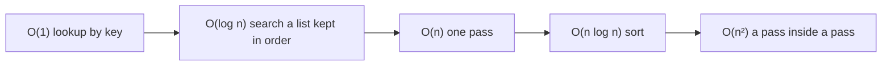

## Before you start

- [[foundation.l1.collections-in-practice]] — you chose between a list, a dictionary and a set by the question you would ask most often. This lesson gives a name to the difference between "barely grows" and "grows with the number of items".
- [[foundation.l1.sql-index-intro]] — you saw the database read every row to answer a `WHERE`, and jump straight to matching rows once an index existed. The same two shapes appear in C# code.

## The situation

You are writing a sample in `DonHang.Samples`, the console project of the example repository, that counts how many orders came from a customer the database already knows. You have one array holding the customer id of each order and another holding the ids in `customers`. A loop inside a loop is the first thing you write, and against the 12 orders and 5 customers that `db/seed.sql` puts in the database it finishes before you see it start. Then you point the same code at a day with a thousand orders and a thousand customers, and it stops being instant. Nothing changed except the size. How much more work should you have expected it to do?

## Core concepts

- input size, written `n` — the number of things the code works on: ids in the array, rows in `orders`, items in a list. **Big-O** names how the work grows as `n` grows, keeping only the fastest-growing part and ignoring every constant; it is written `O(1)`, `O(n)`, `O(n²)`.
- constant, `O(1)` — the work does not change as `n` grows; one lookup in a `Dictionary<TKey, TValue>` is the example you already have.
- logarithmic, `O(log n)` — each step throws away half of what is left, so doubling `n` costs one more step; looking for a name in a list already kept in order works this way: compare with the middle one and half the list is gone.
- linear, `O(n)` — the work grows in step with `n`; one pass over the array.
- `O(n log n)` — one pass over the input where each item costs a logarithmic step; putting a collection in order with the sort the library gives you — `List<T>.Sort`, `Array.Sort`, `OrderBy` — works this way, so it grows faster than `O(n)` but far slower than `O(n²)`.
- quadratic, `O(n²)` — the work grows with `n` multiplied by itself; a pass inside a pass over the same data.

## How it works



The diagram is a ladder: it reads left to right as "grows more steeply", not as "slower today". Big-O keeps only the fastest-growing part and drops every constant, so two passes over the array and one pass are both `O(n)`.

In the situation above, the outer loop runs once per order and the inner loop walks every customer for each of those runs. Twelve orders against five customers cost sixty comparisons; a thousand against a thousand cost a million. The work is the product of the two sizes, not their sum, and that product is what `O(n²)` names.

Read the shape off the loops and off any call that itself walks or searches a collection — building a set, `Contains` on a list, a call that counts matching items — not off the number of statements. A single line can be a whole pass. No loop and no search is `O(1)`: the cost is the same whether the collection holds five items or five million.

A quadratic method with a cheap body can beat a linear one with an expensive body while `n` stays small. That is why an estimate is not the end of the job: it names the shape, and a measurement settles what the constants do at the size you actually run at. The estimate is cheap, because you can do it while reading the code; only the measurement needs a run on real data to separate two options of the same shape.

## In the Đơn Hàng system

You run this sample by passing the name `nested-loops` to that console project. It answers the counting question of the situation twice, over two arrays of a thousand ids each.

```csharp file=samples/DonHang.Samples/Samples/Data/NestedLoops.cs tag=stage-0 lines=6-25
    // Quadratic: for every order it walks the whole customer list again.
    public static int CountKnownCustomersSlowly(int[] orderCustomerIds, int[] customerIds)
    {
        var found = 0;
        foreach (var orderCustomerId in orderCustomerIds)
        {
            foreach (var customerId in customerIds)
            {
                if (orderCustomerId == customerId) found++;
            }
        }
        return found;
    }

    // Linear: the set is built once, and each question then costs the same.
    public static int CountKnownCustomersQuickly(int[] orderCustomerIds, int[] customerIds)
    {
        var known = new HashSet<int>(customerIds);
        return orderCustomerIds.Count(known.Contains);
    }
```

Compare the two bodies, not the two names. The slow method has one `foreach` inside another over a different array, so its cost is the two sizes multiplied. The fast one pays once to put every customer id into a `HashSet<int>` — a single pass — and then asks it one question per order, which is what `Count(known.Contains)` does: it walks `orderCustomerIds` once and asks the set about each id. Each of those questions costs about the same as the last, because the hash code tells the set where to look instead of making it compare with every id. Nothing about the second method is cleverer; it stops repeating work it has already done. The same trade is what an index does in the database: without one, answering a `WHERE` reads every row and grows in step with the table.

The two counts the sample prints are read off the shapes — a thousand times a thousand comparisons, one lookup per order — not measured inside these two methods.

## Beginners often think…

- **"Big-O tells me how many milliseconds the code takes."** → Actually it names a shape of growth and deliberately drops the constants that milliseconds are made of, so the same `O(n)` code is fast on one machine and slow on another. You notice this when a rewrite that is obviously better on paper measures the same as the old one on today's data, and far better once the data grows.
- **"Nested loops are always a problem."** → Actually only loops over something that grows with the input matter: an inner loop over a collection whose size is fixed multiplies the cost by a constant, which leaves the shape linear. You notice this when a warning about a nested loop turns out to concern twenty items that will never be more than twenty.
- **"`O(1)` means fast."** → Actually it means the cost does not change as `n` grows, and says nothing about how large that unchanging cost is; a single step that reads a file is constant and still slower than a thousand comparisons. You notice this when replacing a linear scan with a constant-time call makes a small collection slower, not faster.

## Try it (3 minutes)

1. Before you run anything, work out on paper what the slow way would cost if both arrays held 2,000 ids instead of 1,000, and what the fast way would cost.
2. From the root of the example repository, run `dotnet run --project samples/DonHang.Samples -- nested-loops`. The sample builds its own two arrays, so nothing has to be running.

Expected result: the run prints `slow way: 1000 matches, 1000000 comparisons` and then `fast way: 1000 matches, 1000 lookups` — the same answer, a thousand times the work.

<details><summary>Suggested answer</summary>

Doubling the input doubles the linear way to 2,000 lookups and quadruples the quadratic way to 4,000,000 comparisons. That ratio, not either number on its own, is what `O(n²)` is telling you.

</details>

## Connections

- [[foundation.l1.collections-in-practice]] — it told you which collection answers which question; this lesson names the price you pay for answering with the wrong one.
- [[foundation.l1.sql-index-intro]] — the same shapes one layer down: an index turns reading every row into a search over values kept in order, exactly as the set turns the inner loop into one lookup.

## Five-line summary

1. Big-O names how the work grows as the input grows, so you can see the expensive shape before writing or running the code.
2. Read the shape off loops and off calls that walk a collection: no loop is constant, one pass linear, nested passes quadratic.
3. Discarding half the remaining work each step is logarithmic, a library's sort is `O(n log n)`, and the ladder orders your options.
4. Big-O drops constants, so it predicts how the cost changes with size, never how many milliseconds one run takes.
5. Estimate first because reading the loops is cheap, then measure, because two options of the same shape can differ a lot on real data.
