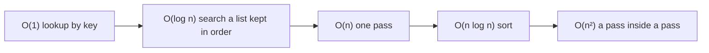

## Bạn cần biết trước

- [[foundation.l1.collections-in-practice]] — bạn đã chọn giữa list, dictionary và set theo câu hỏi bạn sẽ hỏi thường xuyên nhất. Bài này đặt tên cho khác biệt giữa "gần như không tăng" và "tăng theo số phần tử".
- [[foundation.l1.sql-index-intro]] — bạn đã thấy database đọc từng dòng để trả lời một `WHERE`, và khi đã có index thì tìm các dòng khớp bằng cách dò trong các mục đã xếp thứ tự của index. Hai hình dạng đó cũng xuất hiện trong code C#.

## Tình huống

Bạn đang viết một sample trong `DonHang.Samples`, project console trong code Đơn Hàng. Sample này đếm các đơn hàng đến từ những khách hàng mà database đã biết. Bạn có một mảng chứa customer id của từng đơn và một mảng khác chứa các id trong `customers`. Bạn viết một vòng lặp lồng trong một vòng lặp, và với 12 đơn hàng cùng 5 khách hàng trong `db/seed.sql`, nó chạy xong trước khi bạn kịp thấy nó bắt đầu. Rồi bạn cho cùng đoạn code đó chạy với một nghìn đơn hàng và một nghìn khách hàng. Nó vẫn xong nhanh, nhưng phép so sánh bên trong giờ chạy một triệu lần thay vì sáu mươi. Không có gì thay đổi ngoài kích thước. Lẽ ra bạn nên đoán trước khối lượng công việc tăng lên bao nhiêu?

## Khái niệm cốt lõi

- kích thước đầu vào, viết là `n` — số thứ mà code xử lý: số id trong mảng, số dòng trong `orders`, số phần tử trong một list. **Big-O** (cách nói thời gian/bộ nhớ tăng thế nào khi dữ liệu tăng: O(1), O(log n), O(n), O(n²)) gọi tên cách khối lượng công việc tăng khi `n` tăng. Nó chỉ giữ phần tăng nhanh nhất và bỏ qua mọi hệ số cố định (một hằng số), chẳng hạn con số 2 khi duyệt mảng hai lần. Nó được viết là `O(1)`, `O(n)`, `O(n²)`.
- hằng số, `O(1)` — khối lượng công việc không đổi khi `n` tăng. Một lần tra cứu trong `Dictionary<TKey, TValue>` là ví dụ bạn đã biết.
- logarit, `O(log n)` — mỗi bước loại đi một nửa phần còn lại, nên `n` gấp đôi chỉ tốn thêm một bước. Tìm một cái tên trong list đã được giữ theo thứ tự hoạt động như vậy: so với phần tử ở giữa là loại được một nửa list.
- tuyến tính, `O(n)` — khối lượng công việc tăng đều theo `n`. Một lần duyệt qua mảng là ví dụ.
- `O(n log n)` — `n` nhân với `log n`, nhiều hơn tuyến tính một chút. Hàm sắp xếp mà thư viện có sẵn — `List<T>.Sort`, `Array.Sort`, `OrderBy` — tốn chừng đó, nên nó tăng nhanh hơn `O(n)` nhưng chậm hơn `O(n²)` rất nhiều.
- bình phương, `O(n²)` — khối lượng công việc tăng theo `n` nhân với chính nó. Đó là một lần duyệt nằm trong một lần duyệt khác, khi cả hai cùng đi qua thứ tăng theo đầu vào.

## Cơ chế hoạt động



Sơ đồ là một cái thang: đọc từ trái sang phải theo nghĩa "tăng dốc hơn", không phải "hôm nay chậm hơn". Từ trái qua: tra cứu theo khóa, tìm kiếm chia đôi một list đã sắp xếp, một lần duyệt, hàm sắp xếp của thư viện, một lần duyệt nằm trong một lần duyệt. Big-O bỏ mọi hằng số, nên duyệt mảng hai lần hay một lần đều là `O(n)`. Nó cũng chỉ giữ phần tăng nhanh nhất: một lần duyệt lồng trong lần duyệt khác, sau đó thêm một lần duyệt nữa, tốn `n²` cộng `n`, và Big-O chỉ giữ `n²`, vì `n` quá nhỏ bên cạnh nó.

Trong tình huống trên, vòng lặp ngoài chạy một lần cho mỗi đơn hàng, còn vòng lặp trong đi qua mọi khách hàng trong mỗi lần chạy đó. Mười hai đơn với năm khách tốn sáu mươi phép so sánh. Một nghìn với một nghìn tốn một triệu. Khối lượng công việc là tích của hai kích thước, không phải tổng, và tích đó chính là thứ `O(n²)` gọi tên.

Hãy đọc hình dạng từ các vòng lặp và từ mọi lời gọi có duyệt hoặc tìm trong một collection — tạo một set, `Contains` trên một list, một lời gọi đếm các phần tử khớp — chứ không phải từ số câu lệnh. Một dòng duy nhất có thể là cả một lần duyệt. Không có vòng lặp và không có tìm kiếm thì là `O(1)`: chi phí như nhau dù collection chứa năm phần tử hay năm triệu.

Một method bình phương có thân rẻ có thể thắng một method tuyến tính có thân đắt khi `n` còn nhỏ. Vì thế ước lượng chưa phải là xong: nó gọi tên hình dạng, còn phép đo — bấm giờ cả hai phương án trên cùng dữ liệu — mới cho biết các hằng số ảnh hưởng thế nào ở kích thước thật. Ước lượng chỉ tốn một lần đọc code. Chỉ phép đo mới chọn được giữa hai phương án cùng hình dạng, hoặc giữa hai hình dạng khác nhau khi `n` còn nhỏ.

## Trong hệ thống Đơn Hàng

Bạn chạy sample này bằng cách truyền tên `nested-loops` cho project console đó. Nó trả lời câu hỏi đếm trong tình huống hai lần, trên hai mảng mỗi mảng một nghìn id.

```csharp file=samples/DonHang.Samples/Samples/Data/NestedLoops.cs tag=stage-0 lines=6-25
    // Quadratic: for every order it walks the whole customer list again.
    public static int CountKnownCustomersSlowly(int[] orderCustomerIds, int[] customerIds)
    {
        var found = 0;
        foreach (var orderCustomerId in orderCustomerIds)
        {
            foreach (var customerId in customerIds)
            {
                if (orderCustomerId == customerId) found++;
            }
        }
        return found;
    }

    // Linear: the set is built once, and each question then costs the same.
    public static int CountKnownCustomersQuickly(int[] orderCustomerIds, int[] customerIds)
    {
        var known = new HashSet<int>(customerIds);
        return orderCustomerIds.Count(known.Contains);
    }
```

Hãy so hai thân method, đừng so hai cái tên. Method chậm có một `foreach` nằm trong một `foreach` khác, duyệt qua một mảng khác, nên chi phí của nó là hai kích thước nhân với nhau. Method nhanh trả một lần để đưa mọi customer id vào một `HashSet<int>` — đúng một lần duyệt — rồi hỏi nó một câu cho mỗi đơn hàng. `Count(known.Contains)` làm đúng điều đó: nó đi qua `orderCustomerIds` một lần và hỏi set về từng id. Mỗi câu hỏi tốn gần bằng câu trước, vì hash code chỉ cho set chỗ cần tìm thay vì bắt nó so với mọi id. Điều này đúng khi hash code rải các id ra đều, và với id kiểu int thì đúng như vậy. Nếu nhiều giá trị có chung một hash code, set sẽ phải so với từng giá trị đó. Một lần tra cứu trong set và một lần so sánh hai số int không phải là hai bước cùng cỡ. Chỉ phép đo mới cho biết thời gian của chúng chênh nhau ra sao. Index trong database cũng đánh đổi đúng như vậy: không có index, trả lời một `WHERE` nghĩa là đọc mọi dòng, và chi phí tăng đều theo kích thước bảng.

Cả hai mảng đều chứa các id từ 1 đến 1.000, nên mỗi đơn hàng khớp với đúng một khách hàng. Hai method chỉ tính số lần khớp. Số phép so sánh và số lần tra cứu in cạnh số lần khớp được viết thẳng vào thông điệp dựa trên các hình dạng ở trên, code không đếm chúng.

## Người mới hay nghĩ rằng…

- **"Big-O cho tôi biết code chạy mất bao nhiêu mili giây."** → Thực ra nó gọi tên một hình dạng tăng trưởng và cố ý bỏ đi các hằng số, mà mili giây lại được tạo nên từ chính các hằng số đó. Vì vậy cùng một đoạn code `O(n)` có thể nhanh trên máy này và chậm trên máy khác. Bạn sẽ nhận ra khi một bản viết lại rõ ràng tốt hơn trên giấy lại đo ra y như bản cũ với dữ liệu hôm nay, và tốt hơn hẳn khi dữ liệu lớn lên.
- **"Vòng lặp lồng nhau lúc nào cũng là vấn đề."** → Thực ra chỉ vòng lặp đi qua thứ tăng theo đầu vào mới đáng lo. Một vòng lặp trong đi qua collection có kích thước cố định chỉ nhân chi phí với một hằng số, nên hình dạng vẫn là tuyến tính. Bạn sẽ nhận ra khi một cảnh báo về vòng lặp lồng nhau hóa ra chỉ liên quan tới hai mươi phần tử và sẽ không bao giờ vượt quá hai mươi.
- **"`O(1)` nghĩa là nhanh."** → Thực ra nó nghĩa là chi phí không đổi khi `n` tăng, và không nói gì về độ lớn của chi phí không đổi đó. Một bước duy nhất đọc một file là hằng số, nhưng dễ dàng tốn hơn cả nghìn phép so sánh. Bạn sẽ nhận ra khi thay một lần quét tuyến tính bằng một lời gọi thời gian hằng số lại làm một collection nhỏ chậm đi, chứ không nhanh lên.

## Thử ngay (3 phút)

1. Trước khi chạy gì, hãy tính trên giấy xem cách chậm sẽ tốn bao nhiêu nếu cả hai mảng chứa 2.000 id thay vì 1.000, và cách nhanh sẽ tốn bao nhiêu.
2. Từ thư mục gốc của code Đơn Hàng, chạy `dotnet run --project samples/DonHang.Samples -- nested-loops` (mọi thứ sau `--` được truyền cho sample). Sample tự tạo hai mảng của nó, nên không cần chạy thứ gì khác.

Kết quả mong đợi: lần chạy in `slow way: 1000 matches, 1000000 comparisons` rồi `fast way: 1000 matches, 1000 lookups` — cùng một đáp án, nhưng số bước gấp một nghìn lần.

<details><summary>Gợi ý đáp án</summary>

Đầu vào gấp đôi thì cách tuyến tính tăng gấp đôi, thành 2.000 lần tra cứu, còn cách bình phương tăng gấp bốn, thành 4.000.000 phép so sánh. Chính tỉ lệ đó, chứ không phải từng con số riêng lẻ, là điều `O(n²)` đang nói với bạn.

</details>

## Liên hệ

- [[foundation.l1.collections-in-practice]] — bài đó cho bạn biết collection nào trả lời câu hỏi nào. Bài này gọi tên cái giá bạn phải trả khi trả lời bằng collection sai.
- [[foundation.l1.sql-index-intro]] — cũng những hình dạng đó nhưng bên trong database: index cho database tìm các dòng khớp mà không phải đọc mọi dòng, giống như set biến vòng lặp trong thành một lần tra cứu.

## Tóm tắt 5 dòng

1. Big-O gọi tên cách khối lượng công việc tăng khi đầu vào tăng, để bạn thấy hình dạng tốn kém ngay khi đọc code, trước khi chạy nó.
2. Đọc hình dạng từ vòng lặp và từ lời gọi duyệt collection: không vòng lặp, không tìm kiếm là hằng số, một lần duyệt là tuyến tính, duyệt lồng nhau là bình phương.
3. Mỗi bước loại đi một nửa phần việc còn lại là logarit, hàm sắp xếp của thư viện là `O(n log n)`, và cái thang đó xếp hạng các phương án của bạn.
4. Big-O bỏ các hằng số, nên nó dự đoán chi phí thay đổi thế nào theo kích thước, không bao giờ cho biết một lần chạy mất bao nhiêu mili giây.
5. Ước lượng trước vì đọc vòng lặp thì rẻ, rồi mới đo, vì hai phương án cùng hình dạng vẫn có thể chênh nhau nhiều trên dữ liệu thật.
