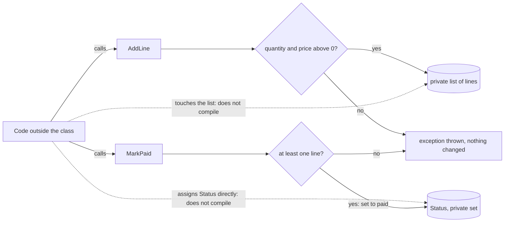

## Before you start

- [[foundation.l1.memory-stack-heap]] — you saw that two variables can hold a reference to the same object, so a change made through one is seen through the other; this lesson decides which code may make that change.

## The situation

You are asked to add one rule to Đơn Hàng: an order with no lines cannot be marked paid. You are handed `OrderExposed` from the samples project. Every field on it is public, so marking an order paid is one assignment to `Status`, and the total is a plain number any code can overwrite. You write your check next to the assignment you are adding. Then you notice that other code holding a reference to the same order can skip your check, set `Status` itself, or store a negative `TotalVnd`, and the compiler accepts all of it. Where does the rule have to live so that no code can go around it?

## Core concepts

- state — the values an object holds at a given moment; for an order, its status, its lines (each one a product with a quantity and a unit price) and its total.
- rule — a condition the business needs every order to meet, such as "an order with no lines cannot be paid".
- `public` and `private` — `public` lets code anywhere use a member; `private` lets only code declared inside the same class use it, and the compiler rejects every other use.
- setter — the `set` part of a property, which runs when code assigns a value to it; its counterpart, the getter, is the `get` part, which runs when code reads the property. A `public` property declared with `private set` can be read from anywhere but assigned only inside its class.
- **encapsulation** — keeping an object's state private and letting outside code change it only by calling the object's own methods, which check the rules first, so each rule lives in one place.

## How it works



In the situation above, the rule needs a home that every change to `Status` must pass through. That home is a method on the order itself. The samples project has a second order class built this way, `OrderEncapsulated`, and the diagram shows it. Follow the diagram from the left.

Code outside the class has two ways to change an order: call `AddLine` or call `MarkPaid`. The dotted arrows are the ways it no longer has. `Status` has a setter that only the class can use, and the lines sit in a private list, so a statement outside the class that assigns `Status` or touches the list does not compile.

`AddLine` checks the quantity and the price before anything else. If either is zero or less, it throws an exception and the list stays as it was. Only a line that passed both checks reaches the private list. `MarkPaid` checks that the list has at least one line. If it has none, it throws, and `Status` stays `"new"`. Otherwise it sets `Status` to `"paid"`.

The total is missing from the diagram because the order does not store it. `TotalVnd` is worked out from the lines each time something reads it, so no code can set it to a number of its own.

This answers the situation's question. The rule lives inside the class, in the one method allowed to change the status, and every caller goes through it without repeating it. Your check next to the assignment was not wrong, only in the wrong place: it protected one caller, while the method protects all of them.

## In the Đơn Hàng system

Đơn Hàng has no application yet at this tag, so no running service has an order class. The samples project, a console program with one file per lesson, holds both versions of the order side by side. First, the one from the situation:

```csharp file=samples/DonHang.Samples/Samples/Oop/OrderExposed.cs tag=stage-0 lines=4-19
// Every field is public, so any code anywhere can put an order into a state
// the business does not allow: paid but empty, or with a negative total.
public sealed class OrderExposed
{
    public int Id;
    public string Status = "new";
    public int TotalVnd;
    public List<OrderLineExposed> Lines = new();
}

public sealed class OrderLineExposed
{
    public int ProductId;
    public int Quantity;
    public int UnitPriceVnd;
}
```

The comment at the top names the two states the business forbids. Look at `TotalVnd`: it is stored next to `Lines`, not worked out from them, so code can add a line and forget the total, or write any number at all. A field is only a storage place, and assigning it runs none of the class's code, so this class has nowhere to refuse a value.

Now the encapsulated version. Lines 1–10, above this block, declare the class, then the order lines as a `private` field named `lines` on line 6, a constructor that takes only the id, and an `Id` that can only be read.

```csharp file=samples/DonHang.Samples/Samples/Oop/OrderEncapsulated.cs tag=stage-0 lines=11-35
    public string Status { get; private set; } = "new";
    public int TotalVnd => lines.Sum(line => line.Quantity * line.UnitPriceVnd);

    public void AddLine(int productId, int quantity, int unitPriceVnd)
    {
        if (quantity <= 0)
            throw new ArgumentOutOfRangeException(nameof(quantity), "a line needs a quantity");
        if (unitPriceVnd <= 0)
            throw new ArgumentOutOfRangeException(nameof(unitPriceVnd), "a line needs a price");

        lines.Add(new OrderLineExposed
        {
            ProductId = productId,
            Quantity = quantity,
            UnitPriceVnd = unitPriceVnd,
        });
    }

    public void MarkPaid()
    {
        if (lines.Count == 0)
            throw new InvalidOperationException("an order with no lines cannot be paid");

        Status = "paid";
    }
```

Line 11 is where the decision moves. `Status` is now a property instead of a field, and its setter is `private`. Because of that word, the class alone decides the status: line 34, `Status = "paid";` inside `MarkPaid`, is the only statement that can change it after the starting value `"new"`. Line 12 makes the total a calculation over `lines` rather than a stored number.

One detail is easy to miss. Each order line is still an `OrderLineExposed` with public fields. That is safe here because the class creates every order line inside `AddLine` and never hands out the list or any line, so no code outside holds a reference to one. As in the previous lesson, code can change an object only through a reference to it.

This is the payoff. With `OrderExposed`, an order that is paid with no lines could have come from any line of code anywhere, and finding it means searching them all. With `OrderEncapsulated`, code outside the class, which can use only its public members, cannot produce that order at all: the direct assignment does not compile, and `MarkPaid` refuses the empty list. The question "how did this order get like this" stops being hard to answer, because that state cannot be reached.

## Beginners often think…

- **"Making every field private and giving each one a public getter and setter is encapsulation."** → Actually a public setter that just stores what it is given lets any code decide the value, just as the public field did; only the syntax changed. `OrderExposed` rewritten that way would still accept a paid order with no lines, because the answer to "who may set the status" would still be "anyone". You notice this when you search for where a value was set and find the setter called from many files, each with a different check or none.
- **"Encapsulation is about hiding code from other developers."** → Actually every developer can open `OrderEncapsulated.cs` and read every line; `private` limits which code may use a member, not who may read the file. What is kept away is the state, so that no code changes it without passing the rules. You notice this when a teammate makes a field public "just for this one call": nobody's view of the source changed, but the class's rule can now be broken.

## Try it (3 minutes)

1. From the root of the example repository, run `dotnet test samples/DonHang.Samples.Tests --filter OrderEncapsulatedTests`. `dotnet test` first builds the code, then runs the tests in `DonHang.Samples.Tests`, small pieces of code that call `OrderEncapsulated` and check what happens, and prints how many passed and failed. `--filter OrderEncapsulatedTests` keeps only the two tests for this class; one of them checks that an empty order cannot be paid.
2. In `samples/DonHang.Samples/Samples/Oop/OrderEncapsulated.cs`, delete the word `private` on line 11, so `Status` gets a public setter. Run the same command again, then undo your edit.
3. Before opening the answer, decide what the edit changed for the rule "no lines, no payment".

Expected result: both runs build and report 2 passed and 0 failed. The edit broke nothing that the compiler or the tests can see.

<details><summary>Suggested answer</summary>

The rule now holds only for code that chooses to call `MarkPaid`. With a public setter, code outside the class can set `Status` to `"paid"` on an order with no lines, and the compiler accepts it. The tests still pass because they call `AddLine` and `MarkPaid` and never assign `Status` themselves. The property looks almost the same as before, but the decision about the status has left the class.

</details>

## Connections

- [[foundation.l1.memory-stack-heap]] — the fix for the surprise in that lesson: a shared reference lets any holder change an object, and encapsulation leaves holders only the class's own methods, such as `MarkPaid`, which check the rules first.
- [[foundation.l1.oop-polymorphism]] — the next step: once each class owns its behaviour, one call can run different code depending on the kind of object.
- [[design.l1.solid-srp]] — the same question one level up: not only who may change a value, but what one class should be in charge of.
- [[design.l3.aggregates-and-invariants]] — the same idea for a group of objects that must change together, guarded by one entry point the way `MarkPaid` guards one order.

## Five-line summary

1. Keep an object's state private and change it only through its methods, so each rule is checked in one place no caller can skip.
2. Public fields let any code holding a reference put an object into a state the business forbids, and the compiler accepts it.
3. A public setter that only stores the value is not encapsulation: any code still decides the value; who decides matters, not the syntax.
4. `OrderEncapsulated` refuses bad lines in `AddLine` and empty payments in `MarkPaid`, and works out its total from its lines.
5. Once outside code cannot produce a forbidden state, the bug "how did this object get like this" becomes impossible instead of hard to find.
