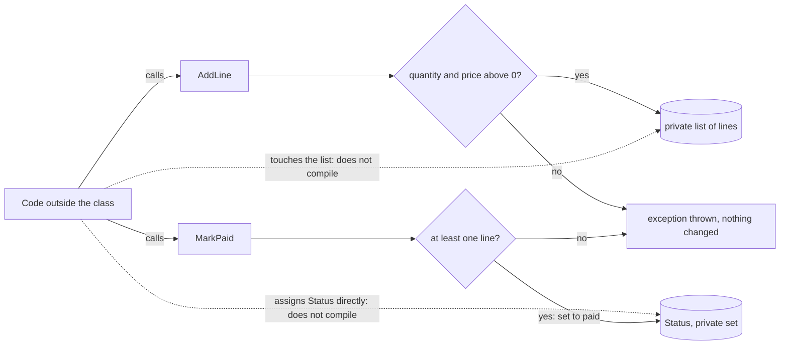

## Bạn cần biết trước

- [[foundation.l1.memory-stack-heap]] — bạn đã thấy hai biến có thể cùng giữ tham chiếu tới một đối tượng, nên thay đổi qua biến này cũng hiện ra qua biến kia. Bài này quyết định code nào được phép làm thay đổi đó.

## Tình huống

Bạn được giao thêm một quy tắc cho Đơn Hàng: đơn không có dòng hàng nào thì không được đánh dấu đã thanh toán. Bạn nhận `OrderExposed` từ project samples, chương trình console chứa code C# của những bài như bài này. Mọi field của nó đều public, nên đánh dấu đã thanh toán chỉ là một phép gán vào `Status`, còn tổng tiền là một con số thường mà code nào cũng ghi đè được. Bạn viết phần kiểm tra ngay cạnh phép gán đó. Rồi bạn để ý rằng code khác đang giữ tham chiếu tới cùng đơn hàng có thể bỏ qua phần kiểm tra của bạn, gán `Status`, hoặc lưu một `TotalVnd` âm, và compiler vẫn chấp nhận. Quy tắc phải nằm ở đâu để không code nào đi vòng qua được?

## Khái niệm cốt lõi

- trạng thái — các giá trị một đối tượng đang giữ tại một thời điểm. Với một đơn hàng, đó là trạng thái đơn, các dòng hàng (mỗi dòng là một sản phẩm kèm số lượng và đơn giá) và tổng tiền.
- quy tắc — điều kiện nghiệp vụ đòi mọi đơn hàng phải thỏa, chẳng hạn "đơn không có dòng hàng nào thì không được thanh toán".
- `public` và `private` — `public` cho code ở bất kỳ đâu dùng một member. `private` chỉ cho code khai báo bên trong cùng class dùng nó, và compiler từ chối mọi chỗ dùng khác.
- setter — phần `set` của một property, chạy khi code gán giá trị cho property đó. Đi cặp với nó là getter, phần `get`, chạy khi code đọc property. Một property `public` khai báo với `private set` thì đọc được từ bất kỳ đâu nhưng chỉ gán được bên trong class của nó.
- **đóng gói** (encapsulation) — giữ trạng thái của đối tượng ở chế độ private và chỉ cho code bên ngoài đổi nó bằng cách gọi phương thức của chính đối tượng, những phương thức kiểm tra quy tắc trước, nhờ vậy mỗi quy tắc chỉ nằm ở một chỗ.

## Cơ chế hoạt động



Trong tình huống trên, quy tắc cần một chỗ ở mà mọi thay đổi của `Status` đều phải đi qua. Chỗ đó là một phương thức nằm ngay trên đơn hàng. Project samples có một class đơn hàng thứ hai viết theo cách này, `OrderEncapsulated`, và sơ đồ vẽ chính class đó. Hãy đọc sơ đồ từ bên trái.

Code bên ngoài class có hai đường để đổi một đơn hàng: gọi `AddLine` hoặc gọi `MarkPaid`. Các mũi tên chấm là những đường nó không còn nữa. `Status` có setter mà chỉ class dùng được, còn các dòng hàng nằm trong một list private, nên câu lệnh nào bên ngoài class gán `Status` hay đụng vào list đều không biên dịch được.

`AddLine` kiểm tra số lượng và đơn giá trước mọi thứ khác. Nếu một trong hai bằng 0 hoặc nhỏ hơn, nó ném exception và list giữ nguyên như cũ. Chỉ dòng hàng qua được cả hai phép kiểm tra mới vào list private. `MarkPaid` kiểm tra list có ít nhất một dòng. Nếu không có dòng nào, nó ném exception, và `Status` vẫn là `"new"`. Ngược lại, nó đặt `Status` thành `"paid"`.

Tổng tiền không có trong sơ đồ vì đơn hàng không lưu nó. `TotalVnd` được tính từ các dòng hàng mỗi lần có code đọc, nên không code nào đặt nó thành một con số tự chọn được.

Đây là câu trả lời cho câu hỏi của tình huống. Quy tắc nằm bên trong class, trong phương thức duy nhất được phép đổi trạng thái đơn, và mọi bên gọi đều đi qua nó mà không phải viết lại. Phần kiểm tra bạn đặt cạnh phép gán không sai, chỉ sai chỗ: nó bảo vệ một bên gọi, còn phương thức bảo vệ tất cả.

## Trong hệ thống Đơn Hàng

Đơn Hàng chưa có ứng dụng, nên chưa chương trình nào đang chạy có class đơn hàng. Project samples, một chương trình console có các file xếp theo bài học, đặt hai phiên bản đơn hàng cạnh nhau. Trước hết là phiên bản trong tình huống:

```csharp file=samples/DonHang.Samples/Samples/Oop/OrderExposed.cs tag=stage-0 lines=4-19
// Every field is public, so any code anywhere can put an order into a state
// the business does not allow: paid but empty, or with a negative total.
public sealed class OrderExposed
{
    public int Id;
    public string Status = "new";
    public int TotalVnd;
    public List<OrderLineExposed> Lines = new();
}

public sealed class OrderLineExposed
{
    public int ProductId;
    public int Quantity;
    public int UnitPriceVnd;
}
```

Comment ở đầu nêu tên hai trạng thái mà nghiệp vụ cấm. Hãy nhìn `TotalVnd`: nó được lưu cạnh `Lines` chứ không tính từ `Lines`, nên code có thể thêm một dòng rồi quên cập nhật tổng, hoặc ghi vào bất kỳ con số nào. Field chỉ là chỗ chứa, và gán vào nó không chạy dòng code nào của class, nên class này không có chỗ nào để từ chối một giá trị.

Giờ đến phiên bản đóng gói. Dòng 1–10, phía trên khối này, khai báo class, rồi các dòng hàng dưới dạng field `private` tên `lines` ở dòng 6, một constructor public chỉ nhận id, và một `Id` mà constructor đặt một lần, còn code khác chỉ đọc được.

```csharp file=samples/DonHang.Samples/Samples/Oop/OrderEncapsulated.cs tag=stage-0 lines=11-35
    public string Status { get; private set; } = "new";
    public int TotalVnd => lines.Sum(line => line.Quantity * line.UnitPriceVnd);

    public void AddLine(int productId, int quantity, int unitPriceVnd)
    {
        if (quantity <= 0)
            throw new ArgumentOutOfRangeException(nameof(quantity), "a line needs a quantity");
        if (unitPriceVnd <= 0)
            throw new ArgumentOutOfRangeException(nameof(unitPriceVnd), "a line needs a price");

        lines.Add(new OrderLineExposed
        {
            ProductId = productId,
            Quantity = quantity,
            UnitPriceVnd = unitPriceVnd,
        });
    }

    public void MarkPaid()
    {
        if (lines.Count == 0)
            throw new InvalidOperationException("an order with no lines cannot be paid");

        Status = "paid";
    }
```

Dòng 11 là nơi quyền quyết định đổi chỗ. `Status` giờ là property thay vì field, và setter của nó là `private`. Nhờ đúng một chữ đó, chỉ class quyết định trạng thái đơn: dòng 34, `Status = "paid";` bên trong `MarkPaid`, là câu lệnh duy nhất đổi được nó sau giá trị ban đầu `"new"`. Dòng 12 biến tổng tiền thành phép tính trên `lines` thay vì một con số được lưu.

Có một chi tiết dễ bỏ sót. Mỗi dòng hàng vẫn là một `OrderLineExposed` với field public. Ở đây điều đó an toàn vì class tạo mọi dòng hàng bên trong `AddLine`, và file kết thúc ngay sau `MarkPaid`, không có member nào trả về `lines` hay một dòng hàng, nên không code nào bên ngoài giữ tham chiếu tới chúng. Như bài trước, code chỉ đổi được một đối tượng khi có tham chiếu tới nó.

Đây là cái bạn thu về. Với `OrderExposed`, một đơn đã thanh toán mà không có dòng hàng nào có thể đến từ bất kỳ dòng code nào ở bất kỳ đâu, và muốn tìm ra thì phải lục hết. Với `OrderEncapsulated`, code bên ngoài class, vốn chỉ dùng được các member public, không tạo ra được đơn như thế: phép gán trực tiếp không biên dịch được, còn `MarkPaid` từ chối list rỗng. Câu hỏi "sao đơn này lại ra nông nỗi này" không còn khó trả lời nữa, vì trạng thái đó không thể xảy ra.

## Người mới hay nghĩ rằng…

- **"Cho mọi field thành private rồi thêm cho mỗi field một getter và setter public là đóng gói."** → Thực ra setter public chỉ lưu thứ nó nhận được thì vẫn để code nào cũng quyết định được giá trị, y như field public trước đó. Chỉ cú pháp đổi. `OrderExposed` viết lại theo kiểu đó vẫn chấp nhận một đơn đã thanh toán mà không có dòng hàng nào, vì câu trả lời cho "ai được đặt trạng thái đơn" vẫn là "bất kỳ ai". Bạn sẽ nhận ra khi tìm xem một giá trị được đặt ở đâu và thấy setter bị gọi từ nhiều file, mỗi file kiểm tra một kiểu hoặc chẳng kiểm tra gì.
- **"Đóng gói là để giấu code khỏi các lập trình viên khác."** → Thực ra lập trình viên nào cũng mở được `OrderEncapsulated.cs` và đọc từng dòng. `private` giới hạn code nào được dùng một member, không giới hạn ai được đọc file. Thứ bị giữ lại là trạng thái, để không code nào đổi được nó mà không qua các quy tắc. Bạn sẽ nhận ra khi một đồng đội chuyển một field thành public "chỉ cho lời gọi này thôi": cách mọi người nhìn thấy mã nguồn không đổi, nhưng quy tắc của class giờ đã có thể bị phá.

## Thử ngay (3 phút)

1. Từ thư mục gốc của repo ví dụ, chạy `dotnet test samples/DonHang.Samples.Tests --filter OrderEncapsulatedTests`. `dotnet test` build code trước, rồi chạy các test trong `DonHang.Samples.Tests`, tức những đoạn code nhỏ gọi các sample và kiểm tra kết quả, rồi in ra bao nhiêu test pass và bao nhiêu fail. `--filter OrderEncapsulatedTests` chỉ giữ lại hai test của class này, một trong hai kiểm tra rằng đơn rỗng không thanh toán được.
2. Trong `samples/DonHang.Samples/Samples/Oop/OrderEncapsulated.cs`, xóa chữ `private` ở dòng 11 để `Status` có setter public. Chạy lại đúng lệnh đó, rồi hoàn tác thay đổi.
3. Trước khi mở đáp án, hãy tự quyết định thay đổi đó đã làm gì với quy tắc "không có dòng hàng thì không thanh toán".

Kết quả mong đợi: cả hai lần chạy đều build được và báo 2 passed, 0 failed. Thay đổi không làm hỏng thứ gì mà compiler hay test nhìn thấy.

<details><summary>Gợi ý đáp án</summary>

Giờ quy tắc chỉ còn đúng với code nào tự chọn gọi `MarkPaid`. Với setter public, code bên ngoài class có thể đặt `Status` thành `"paid"` cho một đơn không có dòng hàng nào, và compiler chấp nhận. Test vẫn pass vì chúng gọi `AddLine` và `MarkPaid`, không bao giờ tự gán `Status`. Property trông gần như cũ, nhưng quyền quyết định trạng thái đơn đã rời khỏi class.

</details>

## Liên hệ

- [[foundation.l1.memory-stack-heap]] — cách chữa bất ngờ trong bài đó: tham chiếu dùng chung cho bất kỳ ai đang giữ nó đổi được đối tượng, còn đóng gói chỉ để lại cho họ các phương thức của chính class, như `MarkPaid`, vốn kiểm tra quy tắc trước.
- [[foundation.l1.oop-polymorphism]] — bước tiếp theo: khi mỗi class tự nắm hành vi của mình, cùng một lời gọi có thể chạy code khác nhau tùy loại đối tượng.
- [[design.l1.solid-srp]] — cùng câu hỏi ở tầng cao hơn: không chỉ ai được đổi một giá trị, mà một class nên chịu trách nhiệm những gì.
- [[design.l3.aggregates-and-invariants]] — cùng ý tưởng cho một nhóm đối tượng phải đổi cùng nhau, với một lối vào duy nhất canh giữ cả nhóm, giống cách `MarkPaid` canh một đơn hàng.

## Tóm tắt 5 dòng

1. Giữ trạng thái của đối tượng ở chế độ private và chỉ đổi nó qua phương thức của chính đối tượng, để mỗi quy tắc được kiểm tra ở một chỗ mà không bên gọi nào bỏ qua được.
2. Field public cho mọi code đang giữ tham chiếu đưa đối tượng vào trạng thái mà nghiệp vụ cấm, và compiler vẫn chấp nhận.
3. Setter public chỉ lưu giá trị thì không phải đóng gói: code nào cũng vẫn quyết định giá trị. Điều quan trọng là ai quyết định, không phải cú pháp.
4. `OrderEncapsulated` từ chối dòng hàng sai trong `AddLine` và thanh toán đơn rỗng trong `MarkPaid`, và tự tính tổng tiền từ các dòng hàng.
5. Khi code bên ngoài không tạo ra được trạng thái bị cấm, lỗi "sao đối tượng này lại ra nông nỗi này" trở thành không thể xảy ra thay vì khó tìm.
