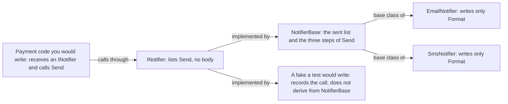

## Before you start

- [[foundation.l1.oop-polymorphism]] — you called an abstract method through a base type and the object's own class answered; this lesson sets that base type beside a second kind of type that can be called the same way.

## The situation

You are asked to tell a customer when their order is paid. In the code that marks an order paid, you create an `EmailNotifier` and call its `Send`. A week later, two new needs arrive together.

Some customers have no email address, so the same code must sometimes use `SmsNotifier` instead. And you want a test of that payment code which checks that a message went out, without printing or sending anything. Both needs mean the payment code must stop creating its notifier with `new` and receive one instead, say as a parameter, so each case can hand it a different object. What type should that parameter have, so that each of these objects fits?

## Core concepts

- **interface** — a type that lists methods a class promises to have; `INotifier` lists one, `Send`, and says nothing about how it works.
- implements — a class implements an interface when it names the interface after its `:` and supplies every method the interface lists, or when it derives from a class that does; if a listed method is missing, the code does not compile.
- abstract class — a class marked `abstract`, like `ShippingFee` in the previous lesson: it cannot be created with `new`, and besides abstract methods it can hold fields and finished methods that every class deriving from it inherits, meaning the derived class has them without writing them again.
- depends on — code depends on a type when it declares a variable or parameter of that type and calls methods through it; only objects whose class is, derives from or implements that type fit there.
- fake — an object a test creates in place of the real one: its class has the methods the tested code calls, but it skips the real work, such as sending. The fake in this lesson only records the calls.

## How it works



Start at the left. In the situation above, the payment code depends on `INotifier`: it receives a parameter declared as `INotifier` and calls `Send` through it. The compiler allows that call because `INotifier` lists `Send`.

`INotifier` is the contract. Any object whose class implements it fits that parameter. `NotifierBase` implements it by supplying `Send`, so `EmailNotifier` and `SmsNotifier`, which derive from `NotifierBase`, fit as well. When the real program runs, the payment code can be handed either one, and none of its lines changes.

`NotifierBase` is the skeleton. It holds state, the list of messages already sent, and the steps of `Send`: format the message, add it to the list, print it. One step is left open, the abstract method `Format`. Each derived class writes that step and inherits the rest, so the list and the printing are written once, not once per notifier.

The fake, beside `NotifierBase` in the diagram, shows why the payment code asks for the contract. A fake needs none of those steps; it only records that `Send` was called. It implements `INotifier` directly, so it fits. Had the payment code asked for `NotifierBase`, the fake would have to derive from it and would run all three steps, printing included: C# lets a derived class override only a method marked `abstract`, `virtual` or `override`, and `Send` is none of them.

The two kinds of type also differ in number. A class can implement many interfaces, listed after its `:` with commas, but it can derive from only one class. And an interface cannot keep state like the `sent` list, because it cannot declare fields that each object holds.

## In the Đơn Hàng system

The repository has no ordering application yet, and nothing in it calls `INotifier`. The samples project holds the contract and the skeleton, each in its own file.

```csharp file=samples/DonHang.Samples/Samples/Oop/INotifier.cs tag=stage-0 lines=3-8
// lesson: foundation.l1.oop-interface-vs-abstract
// A contract: what a notifier can do, with nothing said about how.
public interface INotifier
{
    void Send(int orderId, string subject);
}
```

Line 7 is the whole contract: `Send` takes an order id and a subject, returns nothing, and has no body. Line 5 uses `interface` where a class would use `class`; the `I` that starts the name is a naming habit in C#, not a rule. You cannot create an `INotifier` with `new`, only an object of a class that implements it. C# also lets an interface give a method a default body; `INotifier` does not, and even then an interface cannot hold a field like `sent`, so the skeleton still needs a class.

```csharp file=samples/DonHang.Samples/Samples/Oop/NotifierBase.cs tag=stage-0 lines=3-25
// lesson: foundation.l1.oop-interface-vs-abstract
// A skeleton: shared state and shared steps, with one step left to fill in.
public abstract class NotifierBase : INotifier
{
    private readonly List<string> sent = new();

    public IReadOnlyList<string> Sent => sent;

    public void Send(int orderId, string subject)
    {
        var message = Format(orderId, subject);
        sent.Add(message);
        Console.WriteLine(message);
    }

    protected abstract string Format(int orderId, string subject);
}

public sealed class EmailNotifier : NotifierBase
{
    protected override string Format(int orderId, string subject) =>
        $"email about order {orderId}: {subject}";
}
```

Line 5 says two things: `NotifierBase` is abstract, so it cannot be created with `new`, and it implements `INotifier`. Line 7 is its state, a `private` field only this class's own code can touch. Line 9 lets other code read that list through `IReadOnlyList<string>`, an interface from .NET that offers ways to read a list and none to add to it; `List<string>` implements it, so `sent` fits. Lines 11–16 are the shared steps, written once. Line 18 is the open step: `abstract`, so each derived class that can be created with `new` must supply it, and `protected`, so only `NotifierBase` and classes deriving from it can call it. Lines 21–25 supply it for email, and `sealed` only stops other classes deriving from `EmailNotifier`; `SmsNotifier`, on lines 27–31 of the same file, differs only in the word `sms`.

When you meet an interface your own team wrote in front of one of its classes, it is usually there for that swap: a fake in tests, a different class when the real program runs. `INotifier` has a reason to exist: email and SMS already sit behind it, and a fake could join them. An interface that only one class will ever implement is not wrong, but it needs a reason too. That reason is usually testing, where the fake is the second class, or a boundary: the place where your code hands work to something outside it, such as an email service or the database. Without either, the interface is one more file to keep in step with its class.

## Beginners often think…

- **"Every class needs an interface."** → Actually an interface pays for itself when something behind it must be swapped: a fake in tests, or another class at a boundary. `OrderEncapsulated` from the encapsulation lesson has none, and its tests create it with `new` and call it directly, because it works only on its own fields and there is nothing to swap. You notice this when every new method means editing two files, the class and its interface, and no code ever puts anything but that one class behind the interface.
- **"Abstract class and interface are two interchangeable ways to write the same thing."** → Actually they answer different questions: an interface says what callers may call, an abstract class hands its derived classes fields and finished steps. Swap them and something breaks: as an interface, `NotifierBase` would have nowhere to keep the `sent` list; as an abstract class, `INotifier` would use up the one base class each notifier gets, so a class or fake that already derives from another class could never become a notifier. You notice this when such a class must be handed to code that asks for a `NotifierBase`: the compiler rejects a second class after the `:` with error `CS1721`. Had that code asked for `INotifier`, the class could list it after its base class, supply `Send`, and compile.

## Try it (3 minutes)

1. In the Đơn Hàng repository, open `samples/DonHang.Samples/Samples/Oop/NotifierBase.cs` and delete lines 11–16, the whole `Send` method. Leave line 5 as it is.
2. From the repository root, run `dotnet build samples/DonHang.Samples` and read the error. Then undo the deletion.

Expected result: the build fails with one error, `CS0535`, saying `'NotifierBase' does not implement interface member 'INotifier.Send(int, string)'`, and it points at line 5, where `NotifierBase` names `INotifier`; the last lines of the build output report 1 error. The compiler holds the class to the contract it named on line 5. `EmailNotifier` and `SmsNotifier` get no error of their own: they take `Send` from the skeleton, and the skeleton is where it went missing.

## Connections

- [[foundation.l1.oop-polymorphism]] — the prerequisite: there a call went through the abstract class `ShippingFee`; here the same kind of call goes through an interface.
- [[foundation.l1.oop-encapsulation]] — a lighter form of the same idea: line 9's `IReadOnlyList<string>` offers other code no method that adds to the `sent` list, though the object it hands out is still the class's own list, unlike `OrderEncapsulated`, which hands out none.
- [[design.l1.test-doubles]] — where the fake from this lesson gets company: the kinds of stand-in objects tests use, and when each one fits.
- [[design.l1.dependency-injection-intro]] — the next step after depending on a contract: how the payment code is handed its `INotifier` instead of creating one with `new`.

## Five-line summary

1. An interface says what callers may call; an abstract class hands fields and finished steps to the classes that derive from it.
2. A class can implement many interfaces but derive from only one class, and an interface cannot keep per-object state.
3. Code that depends on an interface accepts any class that implements it: a fake in tests, email or SMS when the real program runs.
4. `NotifierBase` implements `INotifier`, keeps the sent list and the steps of `Send`, and leaves only `Format` to `EmailNotifier` and `SmsNotifier`.
5. An interface that only one class implements needs a reason, usually a fake for tests or a boundary with something outside your code.
