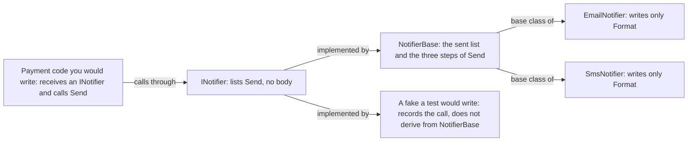

## Bạn cần biết trước

- [[foundation.l1.oop-polymorphism]] — bạn đã gọi một phương thức abstract qua kiểu cơ sở và chính class của đối tượng trả lời. Bài này đặt kiểu cơ sở đó cạnh một loại kiểu thứ hai cũng gọi được theo cùng cách.

## Tình huống

Bạn được giao báo cho khách biết khi đơn của họ đã thanh toán. Trong đoạn code đánh dấu đơn đã thanh toán, bạn tạo một `EmailNotifier` và gọi `Send` của nó. Một tuần sau, hai yêu cầu mới đến cùng lúc.

Một số khách không có địa chỉ email, nên cùng đoạn code đó đôi khi phải dùng `SmsNotifier`. Và bạn muốn có một test cho đoạn code thanh toán, kiểm tra rằng một tin nhắn đã được gửi đi, mà không in hay gửi thứ gì. Cả hai yêu cầu đều có nghĩa là code thanh toán phải thôi tự tạo notifier bằng `new` mà nhận một cái từ bên ngoài, chẳng hạn qua tham số, để mỗi trường hợp đưa vào một đối tượng khác nhau. Tham số đó nên có kiểu gì để đối tượng nào trong số này cũng vừa?

## Khái niệm cốt lõi

- **interface** (hợp đồng liệt kê phương thức mà một kiểu cam kết cung cấp, không có cài đặt) — một kiểu liệt kê các phương thức mà một class hứa sẽ có. `INotifier` liệt kê một phương thức, `Send`, và không nói gì về cách nó chạy.
- implement — một class implement một interface khi nó ghi tên interface sau dấu `:` và cung cấp mọi phương thức interface liệt kê, hoặc khi nó kế thừa từ một class làm điều đó. Nếu thiếu một phương thức có trong danh sách, code không biên dịch được.
- abstract class — class được đánh dấu `abstract`, như `ShippingFee` ở bài trước: không tạo được bằng `new`, và ngoài các phương thức abstract, nó có thể chứa field và các phương thức viết sẵn mà mọi class kế thừa từ nó đều thừa hưởng, tức class con có chúng mà không phải viết lại.
- phụ thuộc vào — code phụ thuộc vào một kiểu khi nó khai báo biến hoặc tham số thuộc kiểu đó và gọi phương thức qua nó. Chỉ đối tượng có class là kiểu đó, kế thừa từ kiểu đó hoặc implement kiểu đó mới vừa chỗ ấy.
- fake — đối tượng mà test tạo ra thay cho đối tượng thật: class của nó có các phương thức mà code được test gọi, nhưng bỏ qua phần việc thật, như gửi tin. Fake trong bài này chỉ ghi lại các lần gọi.

## Cơ chế hoạt động



Bắt đầu từ bên trái. Trong tình huống trên, code thanh toán phụ thuộc vào `INotifier`: nó nhận một tham số khai báo kiểu `INotifier` và gọi `Send` qua đó. Compiler cho phép lời gọi này vì `INotifier` có liệt kê `Send`.

`INotifier` là hợp đồng. Đối tượng nào có class implement nó đều vừa tham số đó. `NotifierBase` implement nó bằng cách cung cấp `Send`, nên `EmailNotifier` và `SmsNotifier`, vốn kế thừa từ `NotifierBase`, cũng vừa. Khi chương trình thật chạy, code thanh toán có thể nhận một trong hai, và không dòng nào của nó phải đổi.

`NotifierBase` là khung. Nó giữ trạng thái, tức danh sách tin nhắn đã gửi, và các bước của `Send`: định dạng tin nhắn, thêm vào danh sách, in ra. Một bước được để ngỏ, là phương thức abstract `Format`. Mỗi class con viết bước đó và thừa hưởng phần còn lại, nên danh sách và phần in ra chỉ viết một lần, không phải mỗi notifier một lần.

Fake, nằm cạnh `NotifierBase` trong sơ đồ, cho thấy vì sao code thanh toán đòi hợp đồng. Fake không cần bước nào trong số đó, chỉ ghi lại rằng `Send` đã được gọi. Nó implement thẳng `INotifier`, nên nó vừa. Nếu code thanh toán đòi `NotifierBase`, fake sẽ phải kế thừa từ đó và chạy cả ba bước, kể cả bước in ra: C# chỉ cho class con override phương thức được đánh dấu `abstract`, `virtual` hoặc `override`, mà `Send` không thuộc loại nào.

Hai loại kiểu này còn khác nhau về số lượng. Một class có thể implement nhiều interface, liệt kê sau dấu `:` và cách nhau bằng dấu phẩy, nhưng chỉ kế thừa được từ một class. Và interface không giữ được trạng thái như danh sách `sent`, vì nó không khai báo được field mà mỗi đối tượng tự giữ.

## Trong hệ thống Đơn Hàng

Repository chưa có ứng dụng đặt hàng, và chưa có chỗ nào gọi `INotifier`. Project samples chứa hợp đồng và khung, mỗi thứ một file.

```csharp file=samples/DonHang.Samples/Samples/Oop/INotifier.cs tag=stage-0 lines=3-8
// lesson: foundation.l1.oop-interface-vs-abstract
// A contract: what a notifier can do, with nothing said about how.
public interface INotifier
{
    void Send(int orderId, string subject);
}
```

Dòng 7 là toàn bộ hợp đồng: `Send` nhận một id đơn và một tiêu đề, không trả về gì, và không có thân. Dòng 5 dùng `interface` ở chỗ một class sẽ dùng `class`. Chữ `I` đầu tên là thói quen đặt tên trong C#, không phải quy tắc. Bạn không tạo được một `INotifier` bằng `new`, chỉ tạo được đối tượng của một class implement nó. C# cũng cho interface đặt thân mặc định cho một phương thức. `INotifier` không làm vậy, và kể cả khi làm, interface vẫn không giữ được field như `sent`, nên khung vẫn cần một class.

```csharp file=samples/DonHang.Samples/Samples/Oop/NotifierBase.cs tag=stage-0 lines=3-25
// lesson: foundation.l1.oop-interface-vs-abstract
// A skeleton: shared state and shared steps, with one step left to fill in.
public abstract class NotifierBase : INotifier
{
    private readonly List<string> sent = new();

    public IReadOnlyList<string> Sent => sent;

    public void Send(int orderId, string subject)
    {
        var message = Format(orderId, subject);
        sent.Add(message);
        Console.WriteLine(message);
    }

    protected abstract string Format(int orderId, string subject);
}

public sealed class EmailNotifier : NotifierBase
{
    protected override string Format(int orderId, string subject) =>
        $"email about order {orderId}: {subject}";
}
```

Dòng 5 nói hai điều: `NotifierBase` là abstract, nên không tạo được bằng `new`, và nó implement `INotifier`. Dòng 7 là trạng thái của nó, một field `private` mà chỉ code của chính class này đụng tới được. Dòng 9 cho code khác đọc danh sách đó qua `IReadOnlyList<string>`, một interface của .NET có các cách đọc danh sách nhưng không có cách nào để thêm vào. `List<string>` implement interface này, nên `sent` vừa. Dòng 11–16 là các bước dùng chung, viết một lần. Dòng 18 là bước để ngỏ: `abstract`, nên mọi class con tạo được bằng `new` đều phải cung cấp nó, và `protected`, nên chỉ `NotifierBase` và các class kế thừa từ nó gọi được nó. Dòng 21–25 cung cấp bước này cho email, còn `sealed` chỉ ngăn class khác kế thừa từ `EmailNotifier`. `SmsNotifier`, ở dòng 27–31 cùng file, chỉ khác ở chữ `sms`.

Khi bạn gặp một interface do chính đội mình viết, đứng trước một class của đội, nó thường có mặt vì sự hoán đổi đó: một fake trong test, một class khác khi chương trình thật chạy. `INotifier` có lý do để tồn tại: email và SMS đã đứng sau nó, và một fake có thể nhập hội. Một interface mà mãi mãi chỉ có một class implement thì không sai, nhưng cũng cần lý do. Lý do đó thường là test, nơi fake là class thứ hai, hoặc là một ranh giới: chỗ code của bạn giao việc cho thứ nằm ngoài nó, như một dịch vụ email hay database. Thiếu cả hai, interface chỉ là thêm một file phải giữ khớp với class của nó.

## Người mới hay nghĩ rằng…

- **"Class nào cũng cần một interface."** → Thực ra interface chỉ đáng giá khi thứ đứng sau nó phải hoán đổi được: một fake trong test, hoặc một class khác ở ranh giới. `OrderEncapsulated` ở bài đóng gói không có interface nào, và test của nó tạo nó bằng `new` rồi gọi thẳng, vì nó chỉ làm việc trên field của chính nó và chẳng có gì để hoán đổi. Bạn sẽ nhận ra khi mỗi phương thức mới đều bắt bạn sửa hai file, class và interface của nó, trong khi chưa code nào đặt thứ gì khác ngoài đúng class đó sau interface.
- **"Abstract class và interface là hai cách viết thay thế nhau cho cùng một thứ."** → Thực ra chúng trả lời những câu hỏi khác nhau: interface nói bên gọi được gọi gì, còn abstract class trao cho class con các field và các bước viết sẵn. Đổi chỗ chúng là có thứ hỏng: nếu là interface, `NotifierBase` không có chỗ giữ danh sách `sent`. Nếu là abstract class, `INotifier` sẽ chiếm mất suất class cơ sở duy nhất của mỗi notifier, nên một class hay fake đã kế thừa từ class khác sẽ không bao giờ trở thành notifier được. Bạn sẽ nhận ra khi phải đưa một class như vậy cho code đòi `NotifierBase`: compiler từ chối class thứ hai sau dấu `:` với lỗi `CS1721`. Nếu code đó đòi `INotifier`, class kia có thể ghi nó sau class cơ sở của mình, cung cấp `Send`, và biên dịch được.

## Thử ngay (3 phút)

1. Trong repository Đơn Hàng, mở `samples/DonHang.Samples/Samples/Oop/NotifierBase.cs` và xóa dòng 11–16, tức toàn bộ phương thức `Send`. Giữ nguyên dòng 5.
2. Từ thư mục gốc của repository, chạy `dotnet build samples/DonHang.Samples` và đọc lỗi. Sau đó hoàn tác phần đã xóa.

Kết quả mong đợi: build thất bại với một lỗi, `CS0535`, báo `'NotifierBase' does not implement interface member 'INotifier.Send(int, string)'`, và chỉ vào dòng 5, nơi `NotifierBase` ghi tên `INotifier`. Những dòng cuối của kết quả build báo 1 lỗi. Compiler buộc class giữ đúng hợp đồng mà nó đã ghi tên ở dòng 5. `EmailNotifier` và `SmsNotifier` không có lỗi riêng: chúng lấy `Send` từ khung, và khung mới là chỗ bị mất phương thức này.

## Liên hệ

- [[foundation.l1.oop-polymorphism]] — bài cần học trước: ở đó lời gọi đi qua abstract class `ShippingFee`, ở đây cùng kiểu lời gọi ấy đi qua một interface.
- [[foundation.l1.oop-encapsulation]] — một dạng nhẹ hơn của cùng ý tưởng: `IReadOnlyList<string>` ở dòng 9 không cho code khác phương thức nào để thêm vào danh sách `sent`, dù đối tượng nó trao ra vẫn chính là danh sách của class, khác với `OrderEncapsulated`, vốn không trao ra danh sách nào.
- [[design.l1.test-doubles]] — nơi fake của bài này có thêm bạn: các loại đối tượng đóng thế mà test dùng, và khi nào loại nào hợp.
- [[design.l1.dependency-injection-intro]] — bước tiếp theo sau khi phụ thuộc vào một hợp đồng: code thanh toán được trao `INotifier` như thế nào thay vì tự tạo bằng `new`.

## Tóm tắt 5 dòng

1. Interface nói bên gọi được gọi gì. Abstract class trao field và các bước viết sẵn cho những class kế thừa từ nó.
2. Một class có thể implement nhiều interface nhưng chỉ kế thừa được từ một class, và interface không giữ được trạng thái riêng của từng đối tượng.
3. Code phụ thuộc vào một interface chấp nhận bất kỳ class nào implement nó: một fake trong test, email hay SMS khi chương trình thật chạy.
4. `NotifierBase` implement `INotifier`, giữ danh sách đã gửi và các bước của `Send`, chỉ để lại `Format` cho `EmailNotifier` và `SmsNotifier`.
5. Interface chỉ có một class implement thì cần một lý do, thường là fake cho test hoặc một ranh giới với thứ nằm ngoài code của bạn.
