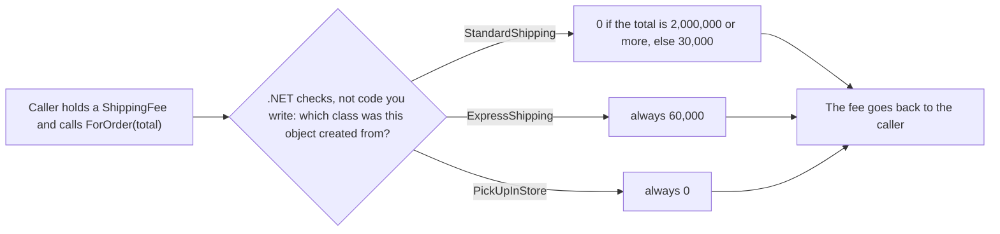

## Before you start

- [[foundation.l1.oop-encapsulation]] — you moved a rule into the class that owns the data, so callers use one method instead of repeating the check; this lesson moves a whole behaviour into the class that owns it, one class per kind.

## The situation

You are asked to add delivery fees to Đơn Hàng. A customer picks one of three kinds: standard, express or pick up in store. You write a `switch` on the kind, held as a string, right inside the code that shows the order total. The invoice code needs the fee too, and there is no method to call, only those lines, so it gets its own copy of that `switch`.

Later a fourth kind is added. You edit every copy you can find, miss one, and an invoice goes out with the wrong fee. How can code get the right fee for an order without ever asking which kind it holds?

## Core concepts

- derives from — a class declared as `class StandardShipping : ShippingFee` derives from `ShippingFee`; the name after the `:` is the class it builds on.
- base type — a class that other classes derive from; a variable declared as `ShippingFee` can hold an object of any class that derives from `ShippingFee`.
- abstract method — a method the base type declares with `abstract` and no body; every class that derives directly from it and is not itself abstract must supply the body, marked `override`. A class marked `abstract`, like `ShippingFee`, cannot be created with `new`, and only such a class may declare an abstract method.
- actual type — the class named after `new` when the object was created, which can be more specific than the declared type of the variable holding it.
- **polymorphism** — a call to an abstract method, written once through a variable declared as the base type, runs the override in the object's actual type, chosen while the program runs, so different objects answer the same call differently.

## How it works



In the situation above, the caller is any code that needs a fee: the order total, the invoice, a test. It holds a variable of the base type `ShippingFee` and makes one call, `ForOrder(total)`. It never asks which kind of delivery it holds.

The diamond's arrows are the three classes, one per kind; each box is that class's fee rule. When the call runs, .NET looks at the actual type of the object in the variable and runs that class's `override` of `ForOrder`. The compiler checked only that `ShippingFee` has a `ForOrder` taking an `int`; which of the three bodies runs is settled each time the line executes. That is polymorphism.

Compare this with the `switch`. There, each place that needed the fee asked "which kind is this?" and kept its own list of answers. Moving that `switch` into one shared method removes the copies; while the fee is the only question, that can be enough. Once a second question about the kind, such as the delivery time, needs its own `switch`, each new kind must be added to every one, and the compiler does not notice a miss. Here each kind is a class that owns its answers, written once.

Adding a fourth kind now means adding a fourth class that derives from `ShippingFee` and overrides `ForOrder`. No caller changes, because no caller named a kind. If the new class forgets `ForOrder`, it does not compile, because an abstract method must get a body in every class that derives directly from it and is not abstract.

One place still names a class: the code that creates the object with `new` when the customer picks a delivery kind. Adding a kind also means teaching that one place to create the new class.

## In the Đơn Hàng system

There is no ordering application in the repository yet. The samples project holds the three delivery kinds as three classes, and the tests are their only callers.

```csharp file=samples/DonHang.Samples/Samples/Oop/ShippingFee.cs tag=stage-0 lines=1-23
namespace DonHang.Samples.Oop;

// lesson: foundation.l1.oop-polymorphism
// One call site, three answers: the caller never asks which kind this is.
public abstract class ShippingFee
{
    public abstract int ForOrder(int totalVnd);
}

public sealed class StandardShipping : ShippingFee
{
    public override int ForOrder(int totalVnd) => totalVnd >= 2_000_000 ? 0 : 30_000;
}

public sealed class ExpressShipping : ShippingFee
{
    public override int ForOrder(int totalVnd) => 60_000;
}

public sealed class PickUpInStore : ShippingFee
{
    public override int ForOrder(int totalVnd) => 0;
}
```

In the comment on line 4, a call site is a line of code that makes the call. Line 7 is everything the base type promises: a method `ForOrder` that takes the order total in VND and returns a fee. Because of `abstract` on line 7, `ForOrder` has no body; because of `abstract` on line 5, you cannot create a plain `ShippingFee` object, only one of the classes that derive from it. Lines 12, 17 and 22 are the three answers, each marked `override`. Standard delivery is free when the total is 2,000,000 VND or more and costs 30,000 otherwise; express always costs 60,000; pick-up costs nothing. The underscores in `2_000_000` only separate digits, and `sealed` only stops further classes deriving from these three.

The test `EveryKindAnswersTheSameCall` in `samples/DonHang.Samples.Tests/SamplesTests.cs` uses the classes the way the situation wanted. A test is a method that calls the code and compares what comes back with values written in the test itself; `dotnet test` runs every test in the project and reports each one that fails. It puts one object of each class into an array created as `new ShippingFee[]`, makes the same call, `kind.ForOrder(2_000_000)`, on every element, and expects `0`, `60_000` and `0`. Nothing in that call says which kind it is looking at.

This file is also small enough to argue the other way. Polymorphism has a cost: to learn what `fee.ForOrder(total)` returns, you first find out which class the object is, then open that class, so a reader jumps between more places. Three stable kinds, each a one-line rule, needed in one place, can stay a single `switch` in one method, and that is a fine choice. When a second `switch` over the same kinds appears, or new kinds keep arriving, the extra classes start paying for themselves.

## Beginners often think…

- **"Polymorphism is method overloading."** → Actually overloading means several methods with the same name and different parameter lists, and the compiler picks one from the declared types of the arguments, before the program runs. Polymorphism picks the method while the program runs, from the object's actual type. You notice this when you write one same-named method per delivery kind, pass it a variable declared as `ShippingFee`, and the call does not compile: the compiler sees only the declared type `ShippingFee`, and none of those methods takes a `ShippingFee`.
- **"Deriving from a base type is the only way to get polymorphism."** → Actually C# has another way, the subject of the next lesson: a type that names methods a class promises to provide, which many unrelated classes can each promise. A call made through that type also runs the method of the object's actual class. You notice this when `StandardShipping` and a payment class must both print a line on the invoice through one shared call. `StandardShipping` already names `ShippingFee` after its `:`, and a C# class can name only one class there, so it cannot also derive from an invoice-line class.

## Try it (3 minutes)

1. In the Đơn Hàng repository, open `samples/DonHang.Samples.Tests/SamplesTests.cs` and go to line 21. Swap `new ExpressShipping()` and `new PickUpInStore()`, so the array holds standard, pick-up, express. Do not touch line 23, the call.
2. From the repository root, run `dotnet test samples/DonHang.Samples.Tests` and read the one failure. Then undo the swap.

Expected result: six tests pass and `EveryKindAnswersTheSameCall` fails. The `dotnet test` output lists the expected values `[0, 60000, 0]` and the actual values `[0, 0, 60000]`, each after a type name you can ignore. The call on line 23 did not change, yet the express fee moved to third place, because that is where the express object now sits: the result followed the object, not the line of code. Line 23 names only `ShippingFee`, never a kind; each object brought its own fee rule with it.

## Connections

- [[foundation.l1.oop-encapsulation]] — the same move one step further: there a rule moved into the class that owns the data; here each kind's behaviour moves into its own class.
- [[foundation.l1.oop-interface-vs-abstract]] — the next lesson: `ShippingFee` is an abstract class, and that lesson sets abstract classes beside another way to have one call answered by many classes.
- [[design.l2.strategy-pattern]] — the same idea at design level, where the behaviour is chosen or swapped while the program runs; that lesson gives it its design name.

## Five-line summary

1. When code calls an abstract method through a base type, the override that runs is chosen while the program runs, from the object's actual type.
2. That replaces a `switch` over "which kind" copied into every caller with one class per kind, each owning its answer.
3. Adding a kind means adding a class: no caller changes, and the compiler rejects a new non-abstract class that skips the abstract method.
4. `ShippingFee` declares `ForOrder` once; `StandardShipping`, `ExpressShipping` and `PickUpInStore` each override it, and the tests call it without asking which kind.
5. Polymorphism costs a jump to another place when reading, so a single `switch` over three stable kinds used in one place is fine.
