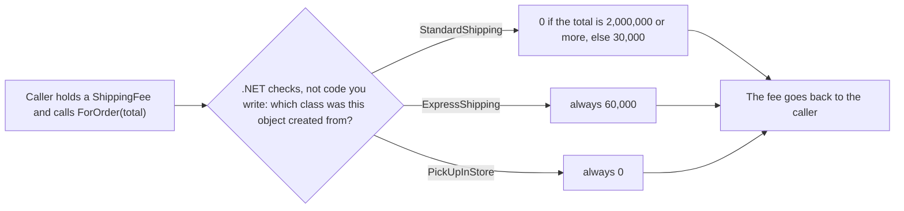

## Bạn cần biết trước

- [[foundation.l1.oop-encapsulation]] — bạn đã chuyển một quy tắc vào class sở hữu dữ liệu, để bên gọi dùng một phương thức thay vì lặp lại phần kiểm tra. Bài này chuyển cả một hành vi vào class sở hữu nó, mỗi loại một class.

## Tình huống

Bạn được giao thêm phí giao hàng cho Đơn Hàng. Khách chọn một trong ba loại: giao tiêu chuẩn, giao nhanh hoặc nhận tại cửa hàng. Bạn viết một `switch` trên loại giao hàng, lưu dưới dạng chuỗi, ngay trong đoạn code hiển thị tổng tiền đơn. Code xuất hóa đơn cũng cần phí, mà không có phương thức nào để gọi, chỉ có mấy dòng đó, nên nó có bản sao `switch` của riêng mình.

Sau đó có thêm loại thứ tư. Bạn sửa mọi bản sao tìm được, sót một chỗ, và một hóa đơn đi ra với phí sai. Làm sao để code lấy đúng phí cho một đơn mà không bao giờ phải hỏi nó đang giữ loại nào?

## Khái niệm cốt lõi

- kế thừa từ — class khai báo `class StandardShipping : ShippingFee` thì kế thừa từ `ShippingFee`. Tên sau dấu `:` là class mà nó xây tiếp lên.
- kiểu cơ sở — class mà các class khác kế thừa từ nó. Biến khai báo kiểu `ShippingFee` giữ được đối tượng của bất kỳ class nào kế thừa từ `ShippingFee`.
- phương thức abstract — phương thức mà kiểu cơ sở khai báo với `abstract` và không có thân. Mọi class kế thừa trực tiếp từ kiểu cơ sở mà bản thân không abstract đều phải cung cấp thân, đánh dấu `override`. Class đánh dấu `abstract`, như `ShippingFee`, không tạo được bằng `new`, và class nào khai báo phương thức abstract thì chính nó cũng phải đánh dấu `abstract`.
- kiểu thật — class ghi sau `new` khi đối tượng được tạo. Nó có thể cụ thể hơn kiểu khai báo của biến đang giữ đối tượng.
- **đa hình** (polymorphism) — lời gọi tới một phương thức abstract, viết một lần qua biến khai báo kiểu cơ sở, sẽ chạy bản override trong kiểu thật của đối tượng, chọn lúc chương trình chạy, nên các đối tượng khác nhau trả lời cùng một lời gọi theo cách khác nhau. Bài này minh họa bằng phương thức abstract trên kiểu cơ sở. Mục "Người mới hay nghĩ rằng…" nêu tên một con đường khác.

## Cơ chế hoạt động



Trong tình huống trên, bên gọi là bất kỳ code nào cần phí, chẳng hạn phần tổng tiền đơn hay hóa đơn. Nó giữ một biến thuộc kiểu cơ sở `ShippingFee`, gọi đúng một lần, `ForOrder(total)`, và không bao giờ hỏi mình đang giữ loại nào.

Mỗi mũi tên đi ra từ hình thoi là một class, và ô nó chỉ tới là quy tắc tính phí của class đó. Khi lời gọi chạy, .NET, hệ thống chạy chương trình C# đã biên dịch của bạn, nhìn vào kiểu thật của đối tượng trong biến. Nó chạy bản `override` của `ForOrder` trong class đó, và phí trả về quay lại bên gọi. Compiler chỉ kiểm tra rằng `ShippingFee` có `ForOrder` nhận một `int`. Thân nào chạy thì được quyết định mỗi lần dòng đó thực thi. Đó là đa hình.

Với `switch`, mỗi chỗ cần phí đều hỏi "đây là loại nào?" và giữ danh sách câu trả lời riêng. Gom `switch` vào một phương thức dùng chung thì hết bản sao, và khi phí là câu hỏi duy nhất, thế có thể là đủ. Rồi một câu hỏi thứ hai về loại giao hàng, chẳng hạn thời gian giao, cần `switch` riêng của nó. Giờ mỗi loại mới phải được thêm vào mọi `switch`, và vì loại là chuỗi, compiler không phát hiện chỗ bị sót. Ở đây mỗi loại là một class tự nắm các câu trả lời của mình.

Thêm loại thứ tư nghĩa là thêm một class kế thừa từ `ShippingFee` và override `ForOrder`. Không bên gọi nào phải đổi. Nếu class mới quên `ForOrder`, code không biên dịch được: phương thức abstract cần thân trong mọi class không abstract kế thừa trực tiếp từ class khai báo nó.

Vẫn còn một chỗ gọi tên class: đoạn code nhìn lựa chọn của khách một lần rồi tạo đối tượng tương ứng bằng `new`. Thêm một loại cũng có nghĩa là dạy chỗ đó biết class mới.

## Trong hệ thống Đơn Hàng

Repo chưa có ứng dụng đặt hàng. Project samples giữ ba loại giao hàng dưới dạng ba class, và các test là bên gọi duy nhất của chúng.

```csharp file=samples/DonHang.Samples/Samples/Oop/ShippingFee.cs tag=stage-0 lines=1-23
namespace DonHang.Samples.Oop;

// lesson: foundation.l1.oop-polymorphism
// One call site, three answers: the caller never asks which kind this is.
public abstract class ShippingFee
{
    public abstract int ForOrder(int totalVnd);
}

public sealed class StandardShipping : ShippingFee
{
    public override int ForOrder(int totalVnd) => totalVnd >= 2_000_000 ? 0 : 30_000;
}

public sealed class ExpressShipping : ShippingFee
{
    public override int ForOrder(int totalVnd) => 60_000;
}

public sealed class PickUpInStore : ShippingFee
{
    public override int ForOrder(int totalVnd) => 0;
}
```

Trong comment ở dòng 4, call site là dòng code thực hiện lời gọi. Dòng 7 là toàn bộ những gì kiểu cơ sở hứa: một phương thức `ForOrder` nhận tổng tiền đơn tính bằng VND và trả về phí. Vì có `abstract` ở dòng 7, `ForOrder` không có thân. Vì có `abstract` ở dòng 5, bạn không tạo được một đối tượng `ShippingFee` trơn, chỉ tạo được đối tượng của các class kế thừa từ nó. Dòng 12, 17 và 22 là ba câu trả lời, mỗi dòng đánh dấu `override`. Giao tiêu chuẩn miễn phí khi tổng từ 2.000.000 VND trở lên, còn lại tốn 30.000. Giao nhanh luôn tốn 60.000. Nhận tại cửa hàng không tốn gì. Dấu gạch dưới trong `2_000_000` chỉ để tách chữ số, còn `sealed` chỉ ngăn class khác kế thừa tiếp từ ba class này.

Test `EveryKindAnswersTheSameCall` trong `samples/DonHang.Samples.Tests/SamplesTests.cs` dùng các class đúng như tình huống mong muốn. Test là một phương thức gọi code rồi so kết quả trả về với các giá trị ghi sẵn trong chính test. `dotnet test` chạy mọi test trong project và báo từng test fail. Test này đặt mỗi class một đối tượng vào một mảng tạo bằng `new ShippingFee[]`, gọi cùng một lời gọi, `kind.ForOrder(2_000_000)`, trên từng phần tử, và mong nhận `0`, `60_000` và `0`. Không chỗ nào trong lời gọi đó nói nó đang nhìn loại nào.

File này cũng đủ nhỏ để lập luận theo chiều ngược lại. Đa hình có cái giá của nó: muốn biết `fee.ForOrder(total)` trả về gì, trước hết bạn phải tìm xem đối tượng thuộc class nào, rồi mở class đó, nên người đọc phải nhảy qua nhiều chỗ hơn. Ba loại ổn định, mỗi loại một quy tắc một dòng, chỉ cần ở một chỗ, thì cứ để là một `switch` trong một phương thức, và đó là lựa chọn tốt. Khi xuất hiện `switch` thứ hai trên cùng các loại đó, hoặc loại mới cứ tiếp tục tới, các class thêm vào bắt đầu đáng công.

## Người mới hay nghĩ rằng…

- **"Đa hình là overload phương thức."** → Thực ra overload là có nhiều phương thức cùng tên nhưng danh sách tham số khác nhau, và compiler chọn một cái dựa trên kiểu khai báo của các đối số, trước khi chương trình chạy. Đa hình chọn phương thức lúc chương trình chạy, dựa trên kiểu thật của đối tượng. Bạn sẽ nhận ra khi viết mỗi loại giao hàng một phương thức cùng tên, truyền vào một biến khai báo kiểu `ShippingFee`, và lời gọi không biên dịch được: compiler chỉ thấy kiểu khai báo `ShippingFee`, mà không phương thức nào trong số đó nhận `ShippingFee`.
- **"Kế thừa từ kiểu cơ sở là cách duy nhất để có đa hình."** → Thực ra C# còn con đường khác, chủ đề của bài tiếp theo: một kiểu nêu tên các phương thức mà class hứa cung cấp, và nhiều class không liên quan có thể cùng hứa. Lời gọi qua kiểu đó cũng chạy phương thức trong class thật của đối tượng. Bạn sẽ nhận ra khi `StandardShipping` và một class thanh toán cùng phải trả lời một lời gọi chung để in một dòng hóa đơn. `StandardShipping` đã ghi `ShippingFee` sau dấu `:`, mà một class C# chỉ ghi được một class ở đó, nên nó không thể kế thừa thêm từ một class dòng hóa đơn.

## Thử ngay (3 phút)

1. Trong repo Đơn Hàng, mở `samples/DonHang.Samples.Tests/SamplesTests.cs` và đi tới dòng 21. Đổi chỗ `new ExpressShipping()` và `new PickUpInStore()`, để mảng chứa tiêu chuẩn, nhận tại cửa hàng, giao nhanh. Đừng đụng vào dòng 23, dòng gọi.
2. Từ thư mục gốc của repo, chạy `dotnet test samples/DonHang.Samples.Tests` và đọc lỗi duy nhất. Sau đó hoàn tác thay đổi.

Kết quả mong đợi: sáu test pass và `EveryKindAnswersTheSameCall` fail. Output của `dotnet test` liệt kê giá trị mong đợi `[0, 60000, 0]` và giá trị thực tế `[0, 0, 60000]`, mỗi cái đi sau một tên kiểu mà bạn có thể bỏ qua. Lời gọi ở dòng 23 không đổi, vậy mà phí giao nhanh chuyển xuống vị trí thứ ba, vì đối tượng giao nhanh giờ nằm ở đó: kết quả đi theo đối tượng, không theo dòng code. Dòng 23 gọi `ForOrder` trên từng phần tử của mảng `ShippingFee[]` từ dòng 21 và không bao giờ gọi tên `StandardShipping`, `ExpressShipping` hay `PickUpInStore`. Mỗi đối tượng tự mang theo quy tắc tính phí của mình.

## Liên hệ

- [[foundation.l1.oop-encapsulation]] — cùng bước đi đó, tiến thêm một nấc: ở bài đó, một quy tắc chuyển vào class sở hữu dữ liệu. Ở đây, hành vi của mỗi loại chuyển vào class riêng của nó.
- [[foundation.l1.oop-interface-vs-abstract]] — bài tiếp theo: `ShippingFee` là một abstract class, và bài đó đặt abstract class cạnh một con đường khác để một lời gọi được nhiều class trả lời.
- [[design.l2.strategy-pattern]] — cùng ý tưởng ở tầng thiết kế, nơi hành vi được chọn hoặc hoán đổi lúc chương trình chạy. Bài đó đặt cho nó tên gọi trong thiết kế.

## Tóm tắt 5 dòng

1. Khi code gọi một phương thức abstract qua kiểu cơ sở, bản override nào chạy được chọn lúc chương trình chạy, dựa trên kiểu thật của đối tượng.
2. Nhờ vậy, thay cho một `switch` "loại nào" chép vào mọi bên gọi là mỗi loại một class, tự nắm câu trả lời của mình.
3. Thêm một loại là thêm một class: không bên gọi nào phải đổi, và compiler từ chối class không abstract mới nào bỏ qua phương thức abstract.
4. `ShippingFee` khai báo `ForOrder` một lần. `StandardShipping`, `ExpressShipping` và `PickUpInStore` mỗi class override nó, và các test gọi nó mà không hỏi loại nào.
5. Đa hình khiến người đọc phải nhảy sang chỗ khác, nên một `switch` trên ba loại ổn định, dùng ở một chỗ, là ổn.
