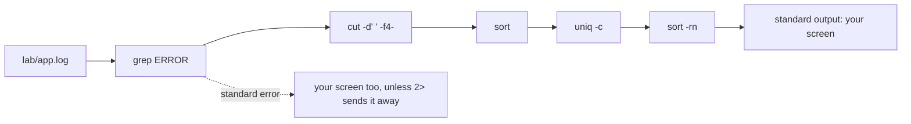

## Before you start

- [[foundation.l1.terminal-basics]] — you saw the shell read a line, run the program its first word names, and show what comes back. This lesson changes the last part: where that output goes, and what may stand between two programs.

## The situation

An order in Đơn Hàng was paid, but the customer says no email arrived. The application log sits in the repository at `lab/app.log`; the lab box from [[foundation.l1.terminal-basics]] sees the same file at `/repo/lab/app.log`. You run `cat lab/app.log` and 37 lines scroll past.

You need three things from that file: how many lines say `ERROR`, which line numbers they sit on, and which message repeats most often. Your eyes give you none of the three, and on the machine that runs this system for real the same file holds tens of thousands of lines, growing while you read. How do you get from a whole file down to only the lines that answer a question?

## Core concepts

- standard output — where a program writes its ordinary results; unless you say otherwise, it arrives on your screen.
- standard error — a second, separate stream for messages about trouble, pointed at your screen as well, so the two look like one column although they are not.
- standard input — where a program reads from when you hand it no file name to open.
- **pipe** — the `|` between two commands, which makes the left program's standard output the right program's standard input, with no file in between.
- filter — a small program that reads standard input, or a file whose name you give it as `grep ERROR lab/app.log` does, keeps or reshapes lines, and writes standard output; `grep`, `sort`, `uniq`, `cut`, `head`, `tail` and `wc` are the ones every chain in this lesson is built from.
- redirect — `>`, `>>` or `2>`, which sends one stream to a file instead of the screen, and `<`, which feeds a file into standard input. The `2` is the number standard error carries, which is also why `>&2` in section 5 points a stream at it.

## How it works



The shell gives every command it starts three connections, whether the command uses them or not: standard input, standard output and standard error. When you type one command alone, all three stay attached to your screen, which is why results and complaints arrive in the same column.

The `|` character changes one of them. In `grep ERROR lab/app.log | head -3`, the shell starts both programs and attaches the left one's standard output to the right one's standard input. `head -3` does not have to know where its lines come from; it reads, prints three and stops. The two run at the same time rather than one after the other, so an answer can appear long before the left program has read the whole file.

Now follow the diagram from the left; the first arrow is the file being opened, not a `|`, and only the arrows between two commands are pipes. `grep ERROR lab/app.log` opens the file whose name follows it and keeps the lines holding that word, dropping the rest. `cut -d' ' -f4-` cuts each line at every single space, and this log has one space between fields, so keeping everything from the fourth piece onward drops the date, the time and the word `ERROR`, leaving the message. `sort` brings equal messages together, because `uniq -c` collapses only lines that are already neighbours, printing each one with the number of times it appeared. `sort -rn` reads that count as a number and puts the largest first.

Standard error stays out of all this, as the dashed edge shows. `>` sends standard output to a file and leaves failures on your screen, `>>` adds to the end of a file where `>` empties it first, and `2>` is how you catch the failures instead.

## In the Đơn Hàng system

`scripts/terminal/pipes.sh` runs inside the lab box, moves to a scratch folder, builds a six-line file there, and then takes it apart, so the messages it quotes are that machine's and not your own.

```bash file=scripts/terminal/pipes.sh tag=stage-0 lines=7-28
cd /tmp
printf 'a\nb\na\nc\na\nb\n' > letters.txt

echo "how many of each line:"
sort letters.txt | uniq -c | sort -rn

echo
echo "how many lines contain an a:"
grep -c a letters.txt

echo
echo "this line goes to standard output"
echo "this line goes to standard error" >&2

echo
ls /nowhere 2> errors.txt || echo "the command failed; its message went to errors.txt:"
cat errors.txt

echo
printf 'first\n' > out.txt
printf 'second\n' >> out.txt
cat out.txt
```

```text output=true
how many of each line:
      3 a
      2 b
      1 c

how many lines contain an a:
3

this line goes to standard output
this line goes to standard error

the command failed; its message went to errors.txt:
ls: cannot access '/nowhere': No such file or directory

first
second
```

The first two lines write `letters.txt`: six lines holding three `a`, two `b` and one `c`, in a scratch folder so nothing lands in the repository. `printf` prints exactly what you give it, spelling the end of each line as `\n`, where `echo` adds that ending for you. `sort letters.txt | uniq -c | sort -rn` is the counting chain this lesson reuses on the log: sort so equal lines touch, collapse them with a count, sort by that count. `grep -c a letters.txt` answers `3` for that six-line file because it counts lines that contain an `a`, not letters; a line reading `aaa` would still add only 1 to that count.

`>&2` sends the second `echo` to standard error while the first goes to standard output; on screen the two look identical. The lines after them prove the streams are separate, because `2>` catches the failure of `ls /nowhere` in `errors.txt` and `cat` prints it back. What `||` does belongs to [[foundation.l1.shell-scripts]].

The last three lines show `>` creating `out.txt` and `>>` adding to it, which is why `cat` prints both words.

`scripts/terminal/find-errors-in-log.sh` is the situation above, answered.

```bash file=scripts/terminal/find-errors-in-log.sh tag=stage-0 lines=4-26
# Everything below runs inside the lab box; this line puts it there.
[ -f /.dockerenv ] || exec "$(dirname "$0")/../lab-run.sh" "$0" "$@"

log=/repo/lab/app.log

echo "lines in the log:"
wc -l < "$log"

echo
echo "how many are errors:"
grep -c ERROR "$log"

echo
echo "the first three, with line numbers:"
grep -n ERROR "$log" | head -3

echo
echo "the last one:"
grep ERROR "$log" | tail -1

echo
echo "how often each message appears:"
grep ERROR "$log" | cut -d' ' -f4- | sort | uniq -c | sort -rn
```

```text output=true
lines in the log:
37

how many are errors:
6

the first three, with line numbers:
6:2026-03-19 16:10:07 ERROR PaymentClient timeout while calling the payment gateway
8:2026-03-19 16:10:12 ERROR PaymentClient timeout while calling the payment gateway
16:2026-03-19 16:15:09 ERROR NotificationService could not send email to ha.pham@example.com

the last one:
2026-03-19 16:35:02 ERROR NotificationService could not send email to ha.pham@example.com

how often each message appears:
      3 PaymentClient timeout while calling the payment gateway
      2 NotificationService could not send email to ha.pham@example.com
      1 Db deadlock detected while updating orders
```

The second line of the block above puts the run inside the lab box: it checks whether it is already in there and, if not, starts the same file again inside it, so the numbers below are the same for everyone; the pieces that line is built from belong to [[foundation.l1.shell-scripts]]. `log=/repo/lab/app.log` gives that path a short name, and `"$log"` puts the path back wherever it is written. `wc -l` counts lines and prints the file name beside the count when it is handed one; `wc -l < "$log"` hands the file in through standard input instead of naming it, so `wc` prints `37` alone. `grep -c` counts the error lines, and `grep -n` puts each match's line number in front of it before `head -3` keeps the first three. `tail -1` keeps the last line instead of the first. The final chain is the diagram above: it says the email failure that started the situation happened twice and the timeout three times; the third line it turned up is a different kind of trouble the same chain found, which this lesson does not follow.

That pair is usually where you start when a running system misbehaves and you can reach its log: `grep` for the lines that name the trouble, `tail` for what happened last, before installing or opening anything else.

## Beginners often think…

- **"The pipe runs the second command after the first has finished."** → Actually the shell starts both and lets lines flow as they are produced, so the right-hand program is reading while the left one is still writing. You notice this when `grep ERROR` over a very large file with `head -3` after it answers in a moment instead of minutes.
- **"Errors and normal output go to the same place."** → Actually they are two streams that merely point at the same screen by default, and `>` moves only one of them. You notice this when a command you sent into a file still prints its failure on your screen, and the file you were watching stays empty.
- **"`>` adds to the end of the file."** → Actually `>` empties the file before the program writes its first line, and `>>` is the one that adds. You notice this when a second run leaves you with only the last command's output, and what you gathered before is gone.

## Try it (3 minutes)

1. From the top folder of the example repository, in the same terminal you used in the previous lesson's Try it, run `grep -c ERROR lab/app.log`, then `grep -c WARN lab/app.log`. Now build a chain of your own: `grep WARN lab/app.log | cut -d' ' -f4- | sort | uniq -c | sort -rn`.
2. Separate the streams. Run `grep ERROR missing.log > found.txt` and watch your screen, then run the same line with `2> problem.txt` added at the end. Look at both files with `cat`.

Expected result: the first two commands print `6` and `5`. The chain prints four lines, `2 PaymentClient slow response from the payment gateway` first, then three messages that happened once each. In step 2 the first run leaves a failure naming `missing.log` on your screen while `found.txt` is created empty; the second run leaves your screen clean and puts that same failure line into `problem.txt`.

## Connections

- [[foundation.l1.terminal-basics]] — the same loop one step further: instead of showing you a program's output, the shell hands it straight to the next program.
- [[foundation.l1.shell-scripts]] — where a chain worth typing twice becomes a file you keep; this lesson is its prerequisite.
- [[foundation.l1.reading-code]] — the fastest way from something you saw on screen to the line that produced it is `grep` over the source, chained exactly like this.
- [[foundation.l2.debugger-and-logging]] — the other half of the skill: writing the log lines that commands like these will one day have to search.

## Five-line summary

1. A pipe makes one program's standard output the next program's standard input, so small filters chained together answer questions no single command answers.
2. Every program has standard input, standard output and standard error; the last two both reach your screen but are not one stream.
3. `grep`, `sort`, `uniq -c`, `cut`, `head`, `tail` and `wc` are the filters worth knowing; `grep -c` counts matching lines, `grep -n` numbers them.
4. `>` writes standard output to a file, emptying it first, `>>` adds to the end, `2>` catches standard error, `<` feeds a file in.
5. When a running system misbehaves and its log is reachable, `grep` and `tail` usually start the search, before installing or opening anything else.
