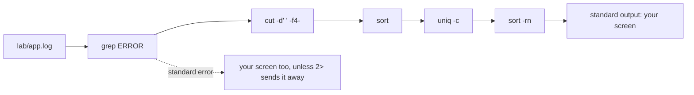

## Bạn cần biết trước

- [[foundation.l1.terminal-basics]] — bạn đã thấy shell đọc một dòng, chạy chương trình mà từ đầu tiên gọi tên, rồi hiện những gì trả về. Bài này đổi phần cuối: output đó đi đâu, và thứ gì có thể đứng giữa hai chương trình.

## Tình huống

Một đơn hàng trong Đơn Hàng đã được thanh toán, nhưng khách nói không nhận được email nào. Log của ứng dụng là một file mà chương trình đang chạy ghi vào mỗi sự kiện một dòng (ngày, giờ, một từ chỉ mức độ như `ERROR` hay `WARN`, rồi đến thông điệp). File này nằm ở `lab/app.log`, còn hộp lab từ [[foundation.l1.terminal-basics]] thấy nó ở `/repo/lab/app.log`. Gõ `cat lab/app.log` thì 37 dòng cuộn qua.

Bạn cần ba thứ: bao nhiêu dòng có chữ `ERROR`, chúng nằm ở dòng số mấy, và thông điệp nào lặp lại nhiều nhất. Ở nơi hệ thống này chạy thật, file đó có hàng chục nghìn dòng và vẫn đang dài thêm trong lúc bạn đọc. Làm sao đi từ cả một file tới đúng những dòng trả lời câu hỏi?

## Khái niệm cốt lõi

- standard output — một trong ba stream (đường nối một chiều chở văn bản) mà shell cấp cho chương trình. Stream này chở kết quả bình thường và, nếu bạn không nói gì khác, hiện ra trên màn hình.
- standard error — một stream riêng cho thông báo khi có trục trặc, cũng trỏ vào màn hình, nên hai stream trông như một cột dù thật ra không phải.
- standard input — nơi chương trình đọc vào khi bạn không đưa tên file nào để nó mở.
- **pipe** (Nối output của lệnh này thành input của lệnh kia bằng ký tự |) — dấu `|` giữa hai lệnh, biến standard output của chương trình bên trái thành standard input của chương trình bên phải, không có file nào ở giữa.
- filter — một chương trình nhỏ đọc standard input, hoặc một file mà bạn đưa tên như `grep ERROR lab/app.log`, giữ lại hay sửa dạng các dòng, rồi ghi ra standard output. `grep`, `sort`, `uniq`, `cut`, `head`, `tail` và `wc` là những filter bài này nối với nhau.
- redirect — `>`, `>>` hoặc `2>`, gửi một stream vào file thay vì ra màn hình, và `<`, đưa một file vào standard input. `2` là số hiệu của standard error. Trong `>&2` (mục 5), dấu `&` cho biết 2 là stream đó, không phải file tên `2`.

## Cơ chế hoạt động



Shell cấp cho mọi lệnh nó khởi chạy ba đường nối, dù lệnh có dùng hay không: standard input, standard output và standard error. Khi bạn gõ một lệnh đứng riêng, cả ba đều gắn vào màn hình, nên kết quả và lời phàn nàn hiện ra trong cùng một cột.

Ký tự `|` đổi một trong ba đường đó. Với `grep ERROR lab/app.log | head -3`, shell khởi chạy cả hai chương trình và gắn standard output của chương trình bên trái vào standard input của chương trình bên phải. `head -3` không cần biết các dòng đến từ đâu: nó đọc, in ba dòng rồi dừng. Hai chương trình chạy cùng lúc chứ không lần lượt, nên khi dòng khớp xuất hiện dày, câu trả lời có thể hiện ra từ lâu trước khi chương trình bên trái đọc hết file.

Giờ đi theo sơ đồ từ bên trái. Mũi tên đầu tiên là file được mở, không phải một `|`, và chỉ những mũi tên nằm giữa hai lệnh mới là pipe. `grep ERROR lab/app.log` mở file có tên đứng sau nó, giữ những dòng chứa từ đó và bỏ phần còn lại. `cut -d' ' -f4-` cắt mỗi dòng ở từng dấu cách. Log này có đúng một dấu cách giữa các trường, nên giữ mọi thứ từ mẩu thứ tư trở đi sẽ bỏ ngày, giờ và chữ `ERROR`, chỉ còn thông điệp. `sort` đưa các thông điệp giống nhau lại gần nhau, vì `uniq -c` chỉ gộp những dòng đã đứng cạnh nhau, và in mỗi dòng kèm số lần nó xuất hiện. `sort -rn` đọc số đếm đó như một con số và đặt số lớn nhất lên đầu.

Standard error đứng ngoài tất cả chuyện này, như đường nét đứt cho thấy. `>` gửi standard output vào file và để lỗi lại trên màn hình. `>>` ghi thêm vào cuối file, còn `>` xóa trắng file trước. `2>` là cách bạn bắt lấy lỗi.

## Trong hệ thống Đơn Hàng

`scripts/terminal/pipes.sh` chạy trong hộp lab, chuyển sang một thư mục nháp, tạo ở đó một file sáu dòng rồi mổ xẻ nó, nên các thông báo nó in ra là của máy đó chứ không phải của máy bạn.

```bash file=scripts/terminal/pipes.sh tag=stage-0 lines=7-28
cd /tmp
printf 'a\nb\na\nc\na\nb\n' > letters.txt

echo "how many of each line:"
sort letters.txt | uniq -c | sort -rn

echo
echo "how many lines contain an a:"
grep -c a letters.txt

echo
echo "this line goes to standard output"
echo "this line goes to standard error" >&2

echo
ls /nowhere 2> errors.txt || echo "the command failed; its message went to errors.txt:"
cat errors.txt

echo
printf 'first\n' > out.txt
printf 'second\n' >> out.txt
cat out.txt
```

```text output=true
how many of each line:
      3 a
      2 b
      1 c

how many lines contain an a:
3

this line goes to standard output
this line goes to standard error

the command failed; its message went to errors.txt:
ls: cannot access '/nowhere': No such file or directory

first
second
```

Hai dòng đầu ghi ra `letters.txt`: sáu dòng gồm ba `a`, hai `b` và một `c`, trong thư mục nháp để không có gì rơi vào repository. `printf` không tự thêm ký tự xuống dòng, bạn phải viết từng cái thành `\n`, còn `echo` thì tự thêm. `sort letters.txt | uniq -c | sort -rn` là chuỗi đếm mà bài này dùng lại cho log: sắp xếp để các dòng giống nhau đứng sát nhau, gộp chúng kèm số đếm, rồi sắp theo số đếm đó. `grep -c a letters.txt` trả lời `3` với file sáu dòng này vì nó đếm số dòng có chứa `a`, không đếm số chữ. Một dòng `aaa` cũng chỉ cộng thêm 1 vào số đếm đó.

`>&2` gửi lệnh `echo` thứ hai sang standard error, còn lệnh thứ nhất đi ra standard output. Trên màn hình hai dòng trông y hệt nhau. Các dòng tiếp theo chứng minh hai stream là riêng biệt, vì `2>` bắt lỗi của `ls /nowhere` vào `errors.txt` và `cat` in nó ra lại. `||` làm gì thì thuộc về [[foundation.l1.shell-scripts]].

Ba dòng cuối cho thấy `>` tạo `out.txt` và `>>` ghi thêm vào đó.

`scripts/terminal/find-errors-in-log.sh` là lời giải cho tình huống ở trên.

```bash file=scripts/terminal/find-errors-in-log.sh tag=stage-0 lines=4-26
# Everything below runs inside the lab box; this line puts it there.
[ -f /.dockerenv ] || exec "$(dirname "$0")/../lab-run.sh" "$0" "$@"

log=/repo/lab/app.log

echo "lines in the log:"
wc -l < "$log"

echo
echo "how many are errors:"
grep -c ERROR "$log"

echo
echo "the first three, with line numbers:"
grep -n ERROR "$log" | head -3

echo
echo "the last one:"
grep ERROR "$log" | tail -1

echo
echo "how often each message appears:"
grep ERROR "$log" | cut -d' ' -f4- | sort | uniq -c | sort -rn
```

```text output=true
lines in the log:
37

how many are errors:
6

the first three, with line numbers:
6:2026-03-19 16:10:07 ERROR PaymentClient timeout while calling the payment gateway
8:2026-03-19 16:10:12 ERROR PaymentClient timeout while calling the payment gateway
16:2026-03-19 16:15:09 ERROR NotificationService could not send email to ha.pham@example.com

the last one:
2026-03-19 16:35:02 ERROR NotificationService could not send email to ha.pham@example.com

how often each message appears:
      3 PaymentClient timeout while calling the payment gateway
      2 NotificationService could not send email to ha.pham@example.com
      1 Db deadlock detected while updating orders
```

Dòng thứ hai của khối trên đưa lần chạy vào trong hộp lab: nếu chưa ở trong đó, nó khởi chạy lại chính file này bên trong hộp, nên các con số bên dưới giống nhau với mọi người. Dòng đó hoạt động thế nào thuộc về [[foundation.l1.shell-scripts]]. `log=/repo/lab/app.log` đặt cho đường dẫn đó một cái tên ngắn, và `"$log"` đặt đường dẫn trở lại ở bất cứ chỗ nào nó được viết.

`wc -l` đếm số dòng và in tên file bên cạnh số đếm khi được đưa tên file. `wc -l < "$log"` đưa file vào qua standard input thay vì gọi tên, nên `wc` chỉ in `37`. `grep -c` đếm các dòng lỗi, còn `grep -n` đặt số dòng trước mỗi dòng khớp, rồi `head -3` giữ ba dòng đầu. Bỏ `| head -3` đi thì nó liệt kê đủ sáu dòng. `tail -1` giữ dòng cuối thay vì dòng đầu. Chuỗi cuối cùng chính là sơ đồ ở trên: nó cho biết lỗi gửi email khởi đầu tình huống đã xảy ra hai lần, còn timeout ba lần. Dòng thứ ba là trục trặc mà bài này không lần theo.

Khi một hệ thống đang chạy gặp trục trặc và bạn truy cập được log của nó, `grep` và `tail` thường là chỗ bắt đầu: `grep` để tìm các dòng nhắc tới trục trặc, `tail` để xem chuyện gì xảy ra sau cùng, trước khi mở code hay thêm công cụ mới.

## Người mới hay nghĩ rằng…

- **"Pipe chạy lệnh thứ hai sau khi lệnh thứ nhất xong."** → Thực ra shell khởi chạy cả hai cùng lúc, nên chương trình bên phải đang đọc trong khi chương trình bên trái vẫn đang ghi. Bạn sẽ nhận ra khi `grep ERROR` chạy trên một file rất lớn toàn dòng lỗi, có `head -3` phía sau, trả lời từ lâu trước khi cả file kịp được đọc hết.
- **"Lỗi và output bình thường đi về cùng một chỗ."** → Thực ra đó là hai stream, chỉ tình cờ cùng trỏ vào màn hình theo mặc định, và `>` chỉ chuyển một trong hai. Bạn sẽ nhận ra khi một lệnh đã được gửi vào file vẫn in lỗi ra màn hình, còn file bạn đang theo dõi thì vẫn trống.
- **"`>` ghi thêm vào cuối file."** → Thực ra `>` xóa trắng file trước khi chương trình ghi dòng đầu tiên, còn `>>` mới là thứ ghi thêm. Bạn sẽ nhận ra khi lần chạy thứ hai chỉ để lại output của lệnh cuối, và những gì bạn gom được trước đó đã mất.

## Thử ngay (3 phút)

1. Từ thư mục gốc của repository ví dụ, trong chính terminal bạn đã dùng ở phần Thử ngay của bài trước (terminal Linux và Git Bash đều có các filter này), chạy `grep -c ERROR lab/app.log`, rồi `grep -c WARN lab/app.log`. Giờ tự dựng một chuỗi: `grep WARN lab/app.log | cut -d' ' -f4- | sort | uniq -c | sort -rn`.
2. Tách hai stream ra. Chạy `grep ERROR missing.log > found.txt` và nhìn màn hình, rồi chạy lại đúng dòng đó với `2> problem.txt` thêm vào cuối. Xem cả hai file bằng `cat`, rồi xóa chúng bằng `rm found.txt problem.txt`.

Kết quả mong đợi: hai lệnh đầu in `6` và `5`. Chuỗi lệnh in bốn dòng, đầu tiên là `2 PaymentClient slow response from the payment gateway`, sau đó là ba thông điệp mỗi cái xảy ra một lần. Ở bước 2, lần chạy đầu để lại trên màn hình một dòng lỗi nhắc tới `missing.log`, trong khi `found.txt` được tạo ra nhưng trống. Lần chạy thứ hai để màn hình sạch và đưa đúng dòng lỗi đó vào `problem.txt`.

## Liên hệ

- [[foundation.l1.terminal-basics]] — cùng vòng lặp đó, thêm một bước: shell chuyển output của một chương trình cho chương trình kế tiếp thay vì hiện nó ra.
- [[foundation.l1.shell-scripts]] — nơi một chuỗi lệnh đáng gõ lần thứ hai trở thành một file bạn giữ lại. Bài này là bài tiên quyết của nó.
- [[foundation.l1.reading-code]] — `grep` trên mã nguồn đưa bạn từ thứ hiện trên màn hình tới đúng dòng code đã tạo ra nó.
- [[foundation.l2.debugger-and-logging]] — viết ra những dòng log mà các lệnh này một ngày nào đó sẽ tìm kiếm.

## Tóm tắt 5 dòng

1. Pipe biến standard output của chương trình này thành standard input của chương trình kế tiếp, nên các filter nhỏ nối với nhau trả lời được những câu hỏi mà không lệnh đơn lẻ nào trả lời được.
2. Mỗi chương trình có standard input, standard output và standard error. Hai cái sau cùng hiện trên màn hình nhưng không phải một stream.
3. `grep`, `sort`, `uniq -c`, `cut`, `head`, `tail` và `wc` là những filter đáng biết. `grep -c` đếm số dòng khớp, `grep -n` đánh số cho chúng.
4. `>` ghi standard output vào file và xóa trắng file trước, `>>` ghi thêm vào cuối, `2>` bắt standard error, `<` đưa một file vào.
5. Khi một hệ thống đang chạy gặp trục trặc và bạn truy cập được log, `grep` và `tail` thường là nơi bắt đầu tìm, trước khi mở code hay thêm công cụ mới.
