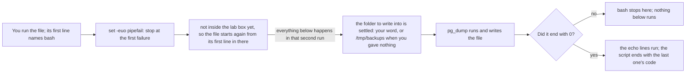

## Before you start

- [[foundation.l1.pipes-and-filters]] — you chained commands with `|`, sent streams into files, and met one line the lesson refused to explain: `[ -f /.dockerenv ] || exec …`. This lesson keeps chains like yours in a file that runs itself, and takes that line apart.

## The situation

You want the shape of the Đơn Hàng database saved on disk before anyone changes a table. In the lab box — the one `scripts/up.sh` starts for you — you type the `pg_dump` line, the command that writes that shape into a file, then print the name of the file it wrote, then count `CREATE TABLE` in it. Tomorrow you need the same three lines, and so does a colleague on another machine. Today the first of them printed a complaint you scrolled past, yet the last line still printed a count, so you believed the file was whole. How do you keep those lines in one file that also tells you when a step failed?

## Core concepts

- script — a plain file of the commands you would otherwise type, run from the first line to the last.
- interpreter line — the file's very first line, `#!/usr/bin/env bash`, which names the program that reads everything below it.
- exit code — the number a command leaves behind when it ends: `0` for "did what it was asked", any other number for "did not"; `$?` holds the code of whichever command finished just before it, and of that one only.
- failure options — `set -e`, `set -u` and `set -o pipefail`, written together as `set -euo pipefail` on line 3 of the script below, which change what bash does when a command ends badly.
- positional parameter — the name a script gives one of its own arguments: `$1` is the first word after the script's name, `$2` the second, `$@` all of them.
- quoting — the `"` marks around `"$1"`, which hand the value over as one word even when it holds spaces.

## How it works



In the situation above, your three lines become one file, whose first line decides which program reads the rest. The two characters `#!`, followed by a path, hand the file to the program at that path. Here that path names `env`, whose job is to start `bash` wherever this machine keeps it, so the file names no folder itself. From there bash runs the file line by line. The next line starts this same file again inside the lab box when the run is not there already.

`set -euo pipefail` comes early because it changes every line below it. `-e` stops the script at the first command that ends in failure, which typing them one at a time could not do. `-u` makes using a name you never set a failure instead of an empty value. `-o pipefail` makes a chain built with `|` count as failed when any command in it fails, not only when the last one does.

Then the script keeps what you gave it under its own name, `out_dir`. `${1:-/tmp/backups}` uses `$1` when you supplied a first word that is not empty, and the folder after `:-` otherwise. The shell cuts what you type into words at the spaces between them, so `/tmp/my backups` arrives as two words unless the quotes you type hold it together; `"$1"` does the same inside the script.

Each command leaves a number behind, `0` for success and any other number for a failure, and that number is all `-e` reads. Two operators consult that code themselves: `left || right` runs the right side only when the left one failed, `left && right` only when it succeeded. `-e` does not stop the script for a failure on the left of either; only the last command of such a line is judged.

## In the Đơn Hàng system

`scripts/terminal/backup-db.sh` is the situation above, kept. It is eighteen lines long, so here it is whole.

```bash file=scripts/terminal/backup-db.sh tag=stage-0 lines=1-18
#!/usr/bin/env bash
# Back up the lab database schema. Takes an optional output directory.
set -euo pipefail
# Everything below runs inside the lab box; this line puts it there.
[ -f /.dockerenv ] || exec "$(dirname "$0")/../lab-run.sh" "$0" "$@"

out_dir="${1:-/tmp/backups}"
mkdir -p "$out_dir"
file="$out_dir/donhang-schema.sql"

pg_dump --host db --username donhang --dbname donhang \
        --schema-only --no-owner --no-privileges > "$file"

echo "wrote $file"
echo "tables in the backup: $(grep -c 'CREATE TABLE' "$file")"

echo
echo "the exit code of the last command was $?"
```

```text output=true
wrote /tmp/backups/donhang-schema.sql
tables in the backup: 6

the exit code of the last command was 0
```

Line 5, the one beginning `[ -f /.dockerenv ]`, is what the previous lesson left for here. That test is a command like any other: it ends with `0` when the file exists and with a number other than `0` when it does not, and the file exists only inside the lab box. So `||` runs `exec` outside the box, where the test failed, and skips it inside, where the test succeeded. `"$0"` is the path of this script and `"$@"` is every argument it was handed, so the same file starts again inside the box with nothing lost, and `exec` puts it there in place of the run you started, not beside it. The rest of the line names what does the starting: `dirname "$0"` prints the folder this script sits in, so the path reaches `lab-run.sh` in the folder above, the script that starts a run inside the box; the `$( … )` brackets make bash run `dirname` first and drop what it printed into that path.

Line 7, `out_dir="${1:-/tmp/backups}"`, gives that name its value; line 8, `mkdir -p "$out_dir"`, creates the folder when it is not there yet and prints nothing either way, and line 9 builds the file name from it. Lines 11 and 12, the `pg_dump` call, are one command spread over two lines by the trailing `\`, and `>` sends what `pg_dump` writes into `"$file"` instead of onto your screen, while its complaints still reach the screen. `--host`, `--username` and `--dbname` name the lab database and `--no-owner --no-privileges` keep the dump plain; only `--schema-only` matters here: it asks for the shape of the database, which tables exist and what each one holds, without the rows in them. Line 15, the `echo` holding `$( … )`, does what line 5 did: the `6` is what `grep -c` printed.

The last two lines are the trap this lesson exists to teach. `$?` holds the code of whichever command finished just before it, and of that one only. On line 18 that is the `echo` on line 17, which was given nothing to print, so it printed the blank line you see and succeeded; line 18 prints `0` after every run. It says nothing about `pg_dump`: with `set -e` above it, a failing `pg_dump` would have stopped the script long before line 18 ever ran. A script ends with the code of its last command, that last `echo` line here, and whatever starts a script reads that number rather than the words it printed: your shell here, the program that runs a build or deployment step elsewhere.

## Beginners often think…

- **"A script keeps going after a command fails, so if the last line ran, everything worked."** → Actually that holds only without `set -e`; with it the script stops at the first command that ends in anything but `0`, and no line below that one runs. You notice this when a script without `set -e` prints its closing line while the file it should have written is empty.
- **"Exit codes are only for programs I write in C#."** → Actually every command leaves one, `mkdir` and `grep` and `pg_dump` alike, and `set -e`, `||`, `&&` and whatever started your script read that number rather than your words. You notice this when a build step reports failure although its log looks ordinary, or reports success although the log is full of complaints.
- **"`$?` tells me whether the script worked."** → Actually `$?` answers for the one command that finished just before it, so its meaning changes on every line. You notice it in this very script: line 18 prints `0` because the empty `echo` on line 17 succeeded, not because the backup did.

## Try it (3 minutes)

1. From the top folder of the example repository, with the lab running from `scripts/up.sh`, run `scripts/terminal/backup-db.sh`. On the next line run `echo $?`.
2. Run the script once more, this time giving it a folder of your own: `scripts/terminal/backup-db.sh /tmp/mine`. Compare the first line of the two runs.

Expected result: the first run prints `wrote /tmp/backups/donhang-schema.sql`, then `tables in the backup: 6`, a blank line, and `the exit code of the last command was 0`; `echo $?` prints `0` as well. The second run prints `wrote /tmp/mine/donhang-schema.sql` and the same count, because `$1` took the place of the default. Both files are written inside the lab box; the path the script prints is the only check you need here. That last `0` came from the empty `echo` above it, not from `pg_dump`.

## Connections

- [[foundation.l1.pipes-and-filters]] — where the chains a script keeps come from; this lesson is what you do with a chain worth typing twice.
- [[foundation.l1.terminal-basics]] — the same commands, moved off your keyboard into a file that repeats them the same way on every machine.
- [[foundation.l1.ssh-and-remote]] — the next lesson runs work on a machine that is not yours, where a code you can test beats a message you must read.
- [[devops.l2.ci-pipeline-anatomy]] — a build or deployment step is a script like this one, and the thing that runs it judges it by the exit code you met here.

## Five-line summary

1. A script is a file of commands bash runs top to bottom, and its first line names the program that reads the rest.
2. Every command ends with an exit code: `0` means success, any other number failure, and that number is what other programs read.
3. `set -euo pipefail` makes bash stop at the first failure instead of carrying on to lines that assume it worked.
4. `$1` and `$2` are the words written after the script's name; the quotes in `"$1"` keep a value with spaces whole.
5. Reading a build or deployment step starts here: it is a script, and whatever runs it decides pass or fail from its exit code.
