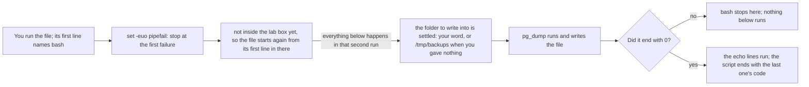

## Bạn cần biết trước

- [[foundation.l1.pipes-and-filters]] — bạn đã nối lệnh bằng `|`, gửi stream vào file, và gặp một dòng mà bài đó không chịu giải thích: `[ -f /.dockerenv ] || exec …`. Bài này giữ những chuỗi lệnh như thế trong một file tự chạy được, và mổ xẻ luôn dòng đó.

## Tình huống

Bạn muốn lưu hình dạng của database Đơn Hàng xuống đĩa trước khi có ai sửa một bảng nào. Trong hộp lab — một nơi riêng giống như một cái máy, có file của riêng nó, do `scripts/up.sh` khởi chạy giúp bạn — bạn gõ dòng `pg_dump` để ghi hình dạng đó vào một file, rồi in tên file ra, rồi đếm số lần `CREATE TABLE` xuất hiện trong đó. Ngày mai bạn cần lại đúng ba dòng này, và một đồng nghiệp trên máy khác cũng cần. Hôm nay dòng đầu tiên đã in ra một lời phàn nàn mà bạn cuộn qua không để ý, nhưng dòng cuối vẫn in ra một con số, nên bạn tin rằng file đã đầy đủ. Làm sao giữ ba dòng đó trong một file, mà file ấy còn báo cho bạn biết khi một bước thất bại?

## Khái niệm cốt lõi

- script — một file thường chứa những lệnh mà lẽ ra bạn sẽ gõ tay, chạy từ dòng đầu tới dòng cuối.
- interpreter line — dòng đầu tiên của file, `#!/usr/bin/env bash`, gọi tên chương trình sẽ đọc mọi thứ bên dưới. Ở đây chương trình đó là bash, chính shell bạn vẫn gõ lệnh vào.
- exit code — con số mà một lệnh để lại khi kết thúc: `0` nghĩa là "đã làm đúng điều được yêu cầu", mọi số khác nghĩa là "không làm được". `$?` giữ code của thứ vừa kết thúc ngay trước nó — một lệnh, hoặc một chuỗi lệnh được tính như một — và chỉ của thứ đó.
- failure options — `set -e`, `set -u` và `set -o pipefail`, viết gộp thành `set -euo pipefail`, thay đổi cách bash xử lý khi một lệnh kết thúc không suôn sẻ.
- positional parameter — cái tên mà script đặt cho từng tham số của chính nó: `$1` là từ đầu tiên sau tên script, `$2` là từ thứ hai, `$@` là tất cả.
- quoting — cặp dấu `"` quanh `"$1"`, giúp giá trị được chuyển đi thành một từ duy nhất kể cả khi nó chứa dấu cách.

## Cơ chế hoạt động



Ba dòng lệnh của bạn trở thành một file. Hai ký tự `#!` ở đầu file, theo sau là một đường dẫn, giao file cho chương trình nằm ở đường dẫn đó. Ở đây đường dẫn trỏ tới `env`, chương trình này khởi chạy `bash` ở bất cứ chỗ nào máy đang cài nó. Từ đó bash chạy file từng dòng một.

`set -euo pipefail` đứng sớm vì nó thay đổi mọi dòng bên dưới. `-e` dừng script ở lệnh đầu tiên kết thúc bằng thất bại. `-u` coi việc dùng tới một cái tên chưa từng được gán là thất bại, thay vì cho ra giá trị rỗng. `-o pipefail` khiến một chuỗi nối bằng `|` bị tính là thất bại khi bất kỳ lệnh nào trong đó thất bại, chứ không chỉ khi lệnh cuối thất bại. Một dòng phía dưới (dòng 5 trong file bên dưới) sau đó khởi chạy lại chính file này bên trong hộp lab nếu lần chạy chưa ở trong đó.

Tiếp theo, script giữ thứ bạn đưa cho nó dưới một cái tên riêng, `out_dir`. `out_dir=…` cất một giá trị dưới tên đó, và viết `$out_dir` ở chỗ sau sẽ đưa giá trị ấy ra. `${1:-/tmp/backups}` dùng `$1` khi bạn đưa vào một từ đầu tiên không rỗng, còn không thì dùng thư mục đứng sau `:-`. Shell cắt những gì bạn gõ thành từng từ ở mỗi dấu cách, nên `/tmp/my backups` tới nơi thành hai từ, trừ khi có dấu ngoặc kép giữ chúng lại với nhau. Bên trong script, bash lại cắt một giá trị thành nhiều từ ở bất cứ chỗ nào nó được đưa cho một lệnh mà không có ngoặc kép, vì thế `"$out_dir"` và `"$file"` đều được đặt trong ngoặc kép.

Hai toán tử khác cũng đọc exit code: `left || right` chỉ chạy vế phải khi vế trái thất bại, `left && right` chỉ chạy khi vế trái thành công. `-e` bỏ qua thất bại ở vế trái của cả hai toán tử. Trên một dòng như vậy, chỉ lệnh viết sau cùng mới có thể dừng script. Ở đây `pg_dump` chạy tiếp theo. Nếu nó kết thúc bằng `0`, các dòng `echo` sẽ chạy và script kết thúc với code của dòng cuối.

## Trong hệ thống Đơn Hàng

`scripts/terminal/backup-db.sh` chính là tình huống ở trên, được giữ lại thành file. File dài mười tám dòng, nên đây là toàn bộ.

```bash file=scripts/terminal/backup-db.sh tag=stage-0 lines=1-18
#!/usr/bin/env bash
# Back up the lab database schema. Takes an optional output directory.
set -euo pipefail
# Everything below runs inside the lab box; this line puts it there.
[ -f /.dockerenv ] || exec "$(dirname "$0")/../lab-run.sh" "$0" "$@"

out_dir="${1:-/tmp/backups}"
mkdir -p "$out_dir"
file="$out_dir/donhang-schema.sql"

pg_dump --host db --username donhang --dbname donhang \
        --schema-only --no-owner --no-privileges > "$file"

echo "wrote $file"
echo "tables in the backup: $(grep -c 'CREATE TABLE' "$file")"

echo
echo "the exit code of the last command was $?"
```

```text output=true
wrote /tmp/backups/donhang-schema.sql
tables in the backup: 6

the exit code of the last command was 0
```

Dòng 5, dòng bắt đầu bằng `[ -f /.dockerenv ]`, là thứ bài trước để dành cho bài này. Phép kiểm tra đó cũng là một lệnh như mọi lệnh khác: nó kết thúc bằng `0` khi đường dẫn đó tồn tại và là một file thường, và bằng một số khác `0` khi không phải vậy. `/.dockerenv` có mặt bên trong hộp lab nhưng không có trên máy khởi chạy hộp. Vì thế `||` chạy `exec` ở bên ngoài hộp, nơi phép kiểm tra thất bại, và bỏ qua nó bên trong hộp, nơi phép kiểm tra thành công. `"$0"` là đường dẫn của script này và `"$@"` là mọi tham số nó nhận được, nên cùng file đó khởi chạy lại bên trong hộp mà không mất gì. `exec` đặt lần chạy mới vào chỗ của lần chạy bạn đã bắt đầu, chứ không chạy song song bên cạnh.

Phần còn lại của dòng gọi tên thứ sẽ khởi chạy: `dirname "$0"` in ra thư mục chứa script này, nên đường dẫn đi tới `lab-run.sh` ở thư mục phía trên, là script khởi chạy một lần chạy bên trong hộp. Cặp ngoặc `$( … )` khiến bash chạy `dirname` trước rồi đặt những gì nó in ra vào đường dẫn đó.

Dòng 7, `out_dir="${1:-/tmp/backups}"`, gán giá trị cho cái tên đó. Dòng 8, `mkdir -p "$out_dir"`, tạo thư mục khi nó chưa có và không in gì trong cả hai trường hợp. Dòng 9 dựng tên file từ đó. Dòng 11 và 12, lời gọi `pg_dump`, là một lệnh trải trên hai dòng nhờ dấu `\` ở cuối. `>` gửi những gì `pg_dump` ghi ra vào `"$file"` thay vì lên màn hình, còn lời phàn nàn của nó vẫn hiện trên màn hình. Các option của `pg_dump` gọi tên database của lab và giữ bản dump ở dạng đơn giản. Ở đây chỉ `--schema-only` là quan trọng: nó yêu cầu hình dạng của database, tức là có những bảng nào và mỗi bảng chứa gì, không kèm các dòng dữ liệu bên trong. Dòng 15 dùng cùng cặp ngoặc `$( … )` như dòng 5: số `6` là thứ `grep -c` in ra.

Hai dòng cuối là cái bẫy. `$?` giữ code của thứ vừa kết thúc ngay trước nó — một lệnh, hoặc một chuỗi lệnh được tính như một — và chỉ của thứ đó. Ở dòng 18, thứ đó là lệnh `echo` ở dòng 17. Lệnh này không được đưa gì để in, nên nó in ra dòng trống bạn thấy và thành công. Nó không nói gì về `pg_dump`: với `set -e` ở phía trên, nếu `pg_dump` thất bại thì script đã dừng từ lâu trước khi tới dòng 18. Một script kết thúc với code của lệnh cuối cùng, và thứ khởi chạy nó đọc con số đó chứ không đọc chữ nó in ra: ở đây là shell của bạn. Ở nơi khác, một bước build hay deploy là một script mà máy khác chạy cho team bạn, và máy đó đánh giá bước ấy theo code của nó.

## Người mới hay nghĩ rằng…

- **"Script vẫn chạy tiếp sau khi một lệnh thất bại, nên nếu dòng cuối đã chạy thì mọi thứ đều ổn."** → Thực ra điều đó chỉ đúng khi không có `set -e`. Có nó, script dừng ở lệnh đầu tiên kết thúc bằng bất cứ số nào khác `0`, và không dòng nào bên dưới được chạy. Bạn sẽ nhận ra khi một script không có `set -e` in ra dòng kết thúc trong khi file lẽ ra nó phải ghi lại trống trơn.
- **"Exit code chỉ dành cho chương trình mình viết bằng C#."** → Thực ra lệnh nào cũng để lại một exit code, và `set -e`, `||`, `&&` cùng thứ đã khởi chạy script đều đọc con số đó chứ không đọc chữ của bạn. Bạn sẽ nhận ra khi một bước build báo thất bại dù log trông bình thường, hoặc báo thành công dù log đầy lời phàn nàn.
- **"`$?` cho mình biết script có chạy đúng không."** → Thực ra `$?` chỉ trả lời cho đúng một lệnh vừa kết thúc ngay trước nó, nên ý nghĩa của nó đổi theo từng dòng. Bạn sẽ nhận ra ngay trong script này: dòng 18 in ra `0` vì lệnh `echo` rỗng ở dòng 17 thành công, chứ không phải vì bản backup thành công.

## Thử ngay (3 phút)

1. Trên máy của mình, từ thư mục gốc của repository ví dụ, khi lab đang chạy nhờ `scripts/up.sh`, chạy `scripts/terminal/backup-db.sh`. Ở dòng kế tiếp, chạy `echo $?`.
2. Chạy script thêm một lần nữa, lần này đưa cho nó một thư mục do bạn chọn: `scripts/terminal/backup-db.sh /tmp/mine`. So sánh dòng đầu tiên của hai lần chạy.

Kết quả mong đợi: lần chạy đầu in `wrote /tmp/backups/donhang-schema.sql`, rồi `tables in the backup: 6` (database của stage-0, các stage sau thêm bảng), một dòng trống, và `the exit code of the last command was 0`. `echo $?` cũng in `0`, vì `lab-run.sh` trả lại code của script. Lần chạy thứ hai in `wrote /tmp/mine/donhang-schema.sql` và cùng số đếm, vì `$1` đã thay chỗ cho giá trị mặc định. Cả hai file đều được ghi bên trong hộp lab. Đường dẫn mà script in ra là thứ duy nhất bạn cần kiểm tra ở đây.

## Liên hệ

- [[foundation.l1.pipes-and-filters]] — nơi xuất phát của những chuỗi lệnh mà script giữ lại.
- [[foundation.l1.terminal-basics]] — cũng những lệnh đó, chuyển từ bàn phím của bạn vào một file.
- [[foundation.l1.ssh-and-remote]] — bài tiếp theo chạy công việc trên một máy không phải của bạn, nơi một code kiểm tra được đáng tin hơn một thông báo phải đọc.
- [[devops.l2.ci-pipeline-anatomy]] — một bước build hay deploy cũng là một script như thế này, và thứ chạy nó đánh giá nó bằng exit code bạn vừa gặp ở đây.

## Tóm tắt 5 dòng

1. Script là một file chứa các lệnh mà bash chạy từ trên xuống dưới, và dòng đầu tiên gọi tên chương trình sẽ đọc phần còn lại.
2. Lệnh nào cũng kết thúc bằng một exit code: `0` là thành công, mọi số khác là thất bại, và con số đó là thứ các chương trình khác đọc.
3. `set -euo pipefail` khiến bash dừng ở thất bại đầu tiên, thay vì chạy tiếp những dòng coi như bước trước đã thành công.
4. `$1` và `$2` là các từ viết sau tên script. Dấu ngoặc kép trong `"$1"` giữ nguyên một giá trị có dấu cách.
5. Script kết thúc với code của lệnh cuối cùng, và thứ đã khởi chạy nó (shell của bạn hoặc một chương trình khác) đọc con số đó, không đọc chữ nó in ra.
