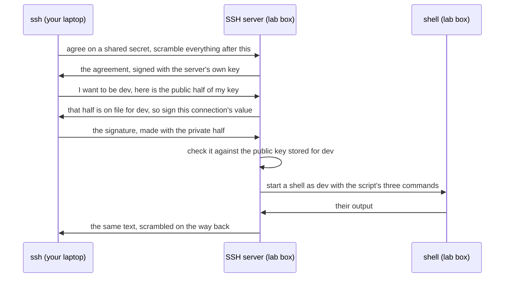

## Before you start

- [[foundation.l1.terminal-basics]] — you learned the loop a shell runs: read a line, run what the first word names, print what comes back. This lesson moves that loop onto a machine that is not yours.

## The situation

You ran `scripts/up.sh` once, and the lab box has been running on your laptop since — a machine of its own, with its own name, its own users and its own disk. Now you type `scripts/terminal/ssh-into-lab.sh` and press Enter. Three answers come back: `donhang-lab`, `dev`, and the names of the files inside a `db` folder. Your laptop is not called `donhang-lab`, you are not `dev`, and no `/repo/db` exists on your disk — yet those names are the ones your editor shows. No window opened, and nothing asked you for a password. Which machine ran those three commands, and why did it let you in?

## Core concepts

- remote shell — the same read-a-line, run-it, show-the-output loop as before, running on another machine while text crosses between you and it.
- SSH — the agreed way that text crosses: both ends scramble what they send, so anything carrying it in between cannot read it.
- SSH server — the program running on the far machine that answers `ssh`, checks who you are and starts what you asked for.
- key pair — two files made together. The private half signs: from some data, it works out a value called a signature. The public half confirms that its own private half made that value from that data, and the private half cannot be worked out from it.
- public key and private key — the public half is the one you hand out, stored on the machine you log in to. The private half stays on your laptop and signs, so anyone who copies that file can log in as you, unless the file is locked with a passphrase — a secret typed before the key can sign; the lab's key is not locked.
- `scp` and `rsync` — commands that carry files over the same kind of connection instead of giving you a shell.

## How it works



In the situation above, `ssh` on your laptop dials the SSH server on the lab box. Their first job is to agree, in the open, on a secret only the two of them end up holding, without ever sending the secret itself. Everything after that is scrambled with it, so nothing in between can read the commands or the answers, as long as `ssh` knows it reached the right machine.

Otherwise a machine in between could make the agreement with you itself, pose as the server, and read everything you send. To rule that out, the server signs the agreement with the private half of a key pair of its own; `ssh` normally records the public half the first time and checks the signature against it on every later connection.

Their second job is proving who you are. `ssh` asks to be `dev` and shows the public half of its key; finding it on file for `dev`, the server asks for a signature over a value belonging to this connection alone. `ssh` signs with the private key on your disk, and the server checks it against the public half. A signature made for one connection is useless to anyone who records it, and the private key never crosses.

Only then does the server start something for you, as `dev`. Given no command, it starts a shell and hands you its prompt. Given a command, a shell there runs just that line, with no prompt, and the connection ends when the line ends.

Whatever runs, runs there: its working directory and every path it opens are that machine's, and its environment variables are mostly the ones that machine set, plus a few `ssh` may carry across from yours. Only the output travels back.

## In the Đơn Hàng system

```bash file=scripts/terminal/ssh-into-lab.sh tag=stage-0 lines=1-10
#!/usr/bin/env bash
# Open a shell on the lab box over SSH and run three commands there, not here.
set -euo pipefail
cd "$(dirname "$0")/../.."

ssh -p 2222 -i secrets/lab_key \
    -o StrictHostKeyChecking=no \
    -o UserKnownHostsFile=/dev/null \
    -o LogLevel=ERROR \
    dev@localhost 'hostname; whoami; ls -1 /repo/db'
```

```text output=true
donhang-lab
dev
queries
schema.sql
seed.sql
```

This script runs on your laptop; only the quoted commands run over there, as line 2 says. Line 1 names the program that runs the file; lines 3 and 4 stop on an unhandled error and move into the example folder.

The `ssh` call, lines 6–10, is one command written across five lines: a `\` at the end of a line means the command carries on to the next one. `-p 2222` says which numbered entrance to knock at on the machine named at the end. A machine has many numbered entrances, and a program that answers connections, like the SSH server, waits at one of them. `-i secrets/lab_key` names the private key file, which `scripts/dev-secrets.sh`, run by `scripts/up.sh`, made on your laptop next to `secrets/lab_key.pub`. The box was started to accept `lab_key.pub` for the user `dev`, with password logins turned off, so over SSH that key is the only way in.

The `-o StrictHostKeyChecking` and `-o UserKnownHostsFile` lines switch off the machine check described above: the second points the record of machine keys at `/dev/null`, a file that stays empty whatever is written to it. They are a lab convenience, not a habit, fine only because that machine is on your own laptop; `-o LogLevel=ERROR` makes the run quieter. The last line names who to be and where: `localhost` is the name a machine uses for itself, so this line knocks on your own laptop, which passes what arrives at entrance 2222 on to the lab box's SSH server, an arrangement made when the box was started. The quotes hold three commands, and the `;` between them makes the shell over there run them one after another.

`hostname` prints the machine's name and `whoami` the user you are: `donhang-lab` and `dev`, not yours. `ls -1 /repo/db` listed, one per line, three names you also see in your editor, because the box is shown the example folder at `/repo`, to read only — set up when the box was started, not by SSH. Being shown a folder means the box itself reads your laptop's folder whenever something opens a path under `/repo`: nothing was copied, and a write into `/repo` is refused.

The box is shown your `secrets/` folder the same way, private half included, so it can find `lab_key.pub`: a shortcut of this lab, since a machine you log in to needs only the `.pub` half. A machine not on your desk usually has no such shortcut: `scp` or `rsync` is one way files get there, and copying files over, then running commands on them, has long been a common way software reached such machines.

## Beginners often think…

- **"The private key is what I put on the server."** → Actually you copy the public half there, and the private half stays with you, because the server only needs to check your signature, never to make one. You notice this in the lab's own setup: the box is told to trust `lab_key.pub`, while the `ssh` line on your laptop names `secrets/lab_key`.
- **"A command run over SSH still uses my laptop's files."** → Actually the command runs as a process on the far machine, so every path it opens is a path over there. You notice this when `ls /` at the box's prompt lists `repo`, which your laptop's top folder lacks.
- **"Once I am in, it is the same as working on my own machine."** → Actually you are on a different disk, as a different user, with different environment variables, and any one of the three can change what a command does. You notice this when a script from your desk prints another path over there, or is refused for lack of permission because `dev` is not you.

## Try it (3 minutes)

1. With the lab up (`scripts/up.sh` if it is not), run `scripts/terminal/ssh-into-lab.sh`. Then run `hostname`, `whoami` and `ls -1 db` in the example folder on your laptop and compare the answers with the script's.
2. Run `ssh -p 2222 -i secrets/lab_key -o StrictHostKeyChecking=no -o UserKnownHostsFile=/dev/null -o LogLevel=ERROR dev@localhost` with nothing after it, so no command is given. Run `ls /` at the prompt you get, then type `exit` to come back.

Expected result: `hostname` and `whoami` differ between the two machines, while the `db` listing matches, because the box is shown the example folder as `/repo`. At the second command's prompt, `ls /` lists `repo` at the top of the box's disk, which your laptop's top folder normally lacks; `exit` brings you back.

## Connections

- [[foundation.l1.terminal-basics]] — the prerequisite: the shell loop this lesson moves onto a machine that is not yours.
- [[foundation.l1.tls-and-https]] — the same two ideas, scrambling and the far machine proving itself, for the web: there the machine usually shows something your browser can trace, signature by signature, to a signer it already trusts, not a key `ssh` recorded the first time.
- [[devops.l1.what-is-deploy]] — where this leads: copying files to a far machine and running commands on them is how software was often put there, before tools automated it.

## Five-line summary

1. SSH gives you a shell on another machine over a scrambled connection, so what you type runs there and its output comes back.
2. A key pair replaces the password: the public half sits on the machine you log in to, the private half stays with you and signs.
3. To let you in, the server checks a signature your private key made for this connection against the public half it stores.
4. `scp` and `rsync` carry files over the same kind of connection, which has long been a common way to reach machines that are not yours.
5. Over SSH a command sees the far machine's paths, permissions and, mostly, its environment variables, so a script from your desk can stop there.
