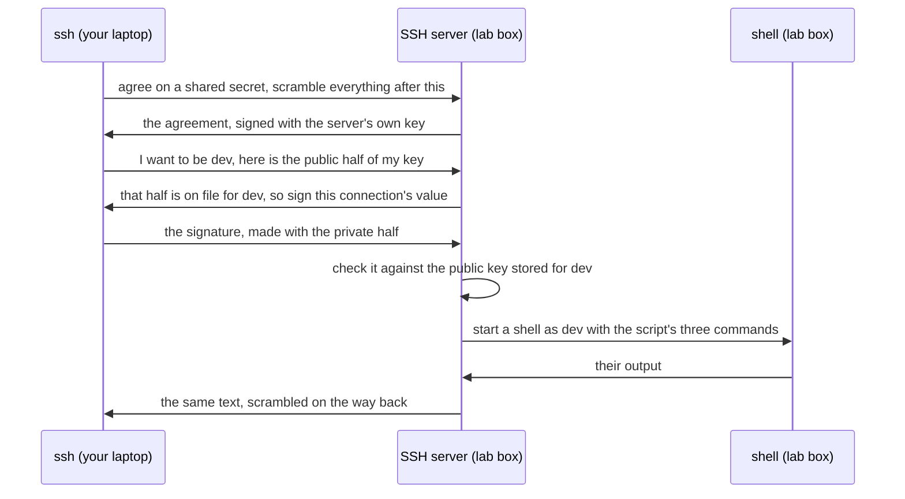

## Bạn cần biết trước

- [[foundation.l1.terminal-basics]] — bạn đã học vòng lặp mà shell chạy: đọc một dòng, chạy thứ mà từ đầu tiên gọi tên, in ra những gì trả về. Bài này chuyển vòng lặp đó sang một máy không phải của bạn.

## Tình huống

Bạn đã chạy `scripts/up.sh` một lần, và từ đó hộp lab vẫn chạy trên laptop của bạn. Nó là một máy riêng, có tên riêng, user riêng và ổ đĩa riêng. Giờ bạn gõ `scripts/terminal/ssh-into-lab.sh` rồi nhấn Enter. Ba câu trả lời hiện ra: `donhang-lab`, `dev`, và tên những thứ nằm trong một thư mục `db`. Laptop của bạn không tên là `donhang-lab`, bạn không phải `dev`, và trên ổ đĩa của bạn không có `/repo/db` nào, vậy mà đó lại đúng là những cái tên editor đang hiện. Không cửa sổ nào mở ra, cũng không có gì hỏi mật khẩu. Máy nào đã chạy ba lệnh đó, và vì sao nó cho bạn vào?

## Khái niệm cốt lõi

- remote shell — vẫn là vòng lặp đọc một dòng, chạy nó, hiện output như trước, nhưng chạy trên một máy khác, còn văn bản thì đi qua lại giữa bạn và máy đó.
- SSH — cách thống nhất để văn bản đi qua lại: hai đầu xáo trộn những gì mình gửi, nên thứ gì chuyên chở nó ở giữa cũng không đọc được.
- SSH server — chương trình chạy trên máy ở xa, trả lời `ssh`, kiểm tra bạn là ai rồi khởi chạy thứ bạn yêu cầu.
- key pair — hai file được tạo cùng nhau. Nửa private dùng để ký: từ một dữ liệu nào đó, nó tính ra một giá trị gọi là chữ ký. Nửa public xác nhận rằng chính nửa private đi cùng nó đã tạo ra giá trị đó từ dữ liệu đó, và không thể tính ngược ra nửa private từ nửa public.
- public key và private key — nửa public là nửa bạn đưa đi, được lưu trên máy bạn đăng nhập vào. Nửa private nằm lại trên laptop và dùng để ký, nên ai chép được file đó đều đăng nhập được với tư cách của bạn, trừ khi file được khóa bằng passphrase, tức một bí mật phải gõ trước khi key ký được. Key của lab không bị khóa.
- `scp` và `rsync` — các lệnh chở file qua cùng kiểu kết nối, thay vì mở cho bạn một shell.

## Cơ chế hoạt động



Trong tình huống trên, `ssh` trên laptop gọi tới SSH server trên hộp lab. Nhiệm vụ đầu tiên của hai bên là thống nhất công khai một bí mật chỉ hai bên cùng giữ, mà không bao giờ gửi chính bí mật đó đi. Làm thế nào thì nằm ngoài bài này. Người đứng xem không bao giờ lấy được bí mật. Mọi thứ sau đó đều được xáo trộn bằng bí mật ấy, thứ gì ở giữa cũng không đọc được, miễn là `ssh` biết mình đã tới đúng máy.

Nếu `ssh` không phân biệt được, một máy ở giữa có thể giả làm server và đọc hết. Vì thế server ký lên thỏa thuận bằng nửa private trong key pair của chính nó. Lần đầu, `ssh` thường hỏi bạn có tin nửa public đó không, ghi lại khi bạn đồng ý, và kiểm tra nó ở mọi lần kết nối sau.

Nhiệm vụ thứ hai là chứng minh bạn là ai. `ssh` xin làm `dev` và đưa ra nửa public của key nó có. Thấy nửa đó có trong hồ sơ, server yêu cầu một chữ ký trên một giá trị chỉ thuộc về kết nối này. `ssh` ký bằng private key trên ổ đĩa của bạn, và server kiểm tra chữ ký bằng nửa public. Chữ ký làm cho một kết nối thì vô dụng với bất kỳ ai ghi lại nó, và private key không bao giờ đi qua đường truyền.

Chỉ khi đó server mới khởi chạy thứ gì đó cho bạn, với tư cách `dev`. Không có lệnh nào kèm theo thì nó khởi chạy một shell và đưa bạn dấu nhắc. Có lệnh kèm theo thì một shell bên đó chỉ chạy đúng dòng ấy, không có dấu nhắc, và kết nối kết thúc khi dòng lệnh chạy xong.

Thứ gì chạy thì chạy ở bên đó: thư mục làm việc và mọi đường dẫn nó mở đều là của máy đó, còn biến môi trường phần lớn là những gì máy đó đặt, cộng thêm vài biến `ssh` có thể mang sang từ máy bạn. Chỉ có output đi ngược về.

## Trong hệ thống Đơn Hàng

```bash file=scripts/terminal/ssh-into-lab.sh tag=stage-0 lines=1-10
#!/usr/bin/env bash
# Open a shell on the lab box over SSH and run three commands there, not here.
set -euo pipefail
cd "$(dirname "$0")/../.."

ssh -p 2222 -i secrets/lab_key \
    -o StrictHostKeyChecking=no \
    -o UserKnownHostsFile=/dev/null \
    -o LogLevel=ERROR \
    dev@localhost 'hostname; whoami; ls -1 /repo/db'
```

```text output=true
donhang-lab
dev
queries
schema.sql
seed.sql
```

Script này chạy trên laptop của bạn. Chỉ các lệnh nằm trong cặp nháy mới chạy bên kia, đúng như dòng 2 nói. Dòng 1 gọi tên chương trình sẽ chạy file. Dòng 3 và 4 dừng lại khi gặp lỗi không được xử lý, và đi lên hai thư mục tính từ script, vào thư mục ví dụ.

Lệnh `ssh`, dòng 6–10, là một lệnh viết trên năm dòng: dấu `\` ở cuối dòng nghĩa là lệnh còn tiếp ở dòng sau. `-p 2222` cho biết gõ vào cửa số mấy trên máy được nêu tên ở cuối. Một chương trình trả lời kết nối, như SSH server, đứng chờ ở một trong rất nhiều cửa đánh số của máy. `-i secrets/lab_key` chỉ ra file private key. File này do `scripts/dev-secrets.sh` tạo trên laptop của bạn, cạnh `secrets/lab_key.pub`, và `scripts/up.sh` là thứ chạy script đó. Hộp được khởi chạy để chấp nhận `lab_key.pub` cho user `dev`, với đăng nhập bằng mật khẩu bị tắt, nên qua SSH thì key đó là đường vào duy nhất.

Hai dòng `-o StrictHostKeyChecking` và `-o UserKnownHostsFile` tắt bước kiểm tra máy đã nói ở trên: dòng thứ hai trỏ nơi ghi key của các máy vào `/dev/null`, một file luôn rỗng dù ghi gì vào. Chúng là tiện lợi của lab, không phải thói quen nên theo, và chỉ ổn vì máy kia nằm ngay trên laptop của bạn. `-o LogLevel=ERROR` làm lần chạy bớt ồn.

Dòng cuối nói làm ai và ở đâu: `localhost` là tên một máy tự gọi chính nó, nên dòng này gõ cửa chính laptop của bạn. Laptop chuyển những gì tới cửa 2222 sang SSH server của hộp lab, một sắp đặt có từ lúc hộp được khởi chạy. Cặp nháy chứa ba lệnh, và dấu `;` giữa chúng khiến shell bên kia chạy lần lượt từng lệnh.

`hostname` in tên máy và `whoami` in user bạn đang là: `donhang-lab` và `dev`, không phải của bạn. `ls -1 /repo/db` liệt kê, mỗi dòng một tên, ba cái tên bạn cũng thấy trong editor, vì hộp được cho xem thư mục ví dụ ở `/repo`, chỉ để đọc. Điều này được sắp đặt khi hộp khởi chạy, không phải do SSH. Được cho xem một thư mục nghĩa là chính hộp đọc thư mục trên laptop của bạn mỗi khi có thứ gì mở một đường dẫn dưới `/repo`: không có gì được chép, và ghi vào `/repo` sẽ bị từ chối.

Hộp cũng được cho xem thư mục `secrets/` của bạn, dưới tên `/keys` và không phải chỉ đọc, gồm cả nửa private, để nó tìm được `lab_key.pub`. Đây là lối tắt của riêng lab này, vì máy bạn đăng nhập vào chỉ cần nửa `.pub`. Một máy không nằm trên bàn bạn thường không có lối tắt như vậy: `scp` hoặc `rsync` là một đường để đưa file tới đó, và chép file sang rồi chạy lệnh trên chúng là một đường để phần mềm có thể tới được những máy như thế.

## Người mới hay nghĩ rằng…

- **"Private key là thứ tôi đặt lên server."** → Thực ra bạn chép nửa public lên đó, còn nửa private ở lại với bạn, vì server chỉ cần kiểm tra chữ ký của bạn, không bao giờ cần tự tạo chữ ký. Bạn sẽ nhận ra điều này ngay trong cách lab được dựng: hộp được bảo tin `lab_key.pub`, còn dòng `ssh` trên laptop lại chỉ tới `secrets/lab_key`.
- **"Lệnh chạy qua SSH vẫn dùng file trên laptop của tôi."** → Thực ra lệnh chạy thành một process trên máy ở xa, nên mọi đường dẫn nó mở đều là đường dẫn bên đó. Bạn sẽ nhận ra khi gõ `ls /` ở dấu nhắc của hộp và thấy `repo`, thứ mà thư mục gốc trên laptop bạn thường không có.
- **"Vào được rồi thì cũng như làm việc trên máy mình."** → Thực ra bạn đang ở trên một ổ đĩa khác, với một user khác, với biến môi trường khác, và chỉ một trong ba thứ đó cũng đủ đổi cách một lệnh chạy. Bạn sẽ nhận ra khi một script từ máy bạn in ra đường dẫn khác ở bên kia, hoặc bị từ chối vì thiếu quyền do `dev` không phải là bạn.

## Thử ngay (3 phút)

1. Khi lab đang chạy (chưa chạy thì gõ `scripts/up.sh`), chạy `scripts/terminal/ssh-into-lab.sh`. Sau đó chạy `hostname`, `whoami` và `ls -1 db` trong thư mục ví dụ trên laptop rồi so sánh.
2. Từ thư mục ví dụ, chạy `ssh -p 2222 -i secrets/lab_key -o StrictHostKeyChecking=no -o UserKnownHostsFile=/dev/null -o LogLevel=ERROR dev@localhost` mà không thêm gì phía sau, tức không kèm lệnh nào. Gõ `ls /` ở dấu nhắc hiện ra, rồi gõ `exit` để quay về.

Kết quả mong đợi: `hostname` và `whoami` khác nhau giữa hai máy, còn danh sách trong `db` thì trùng khớp, vì hộp được cho xem thư mục ví dụ dưới tên `/repo`. Ở dấu nhắc của lệnh thứ hai, `ls /` liệt kê `repo` ở gốc ổ đĩa của hộp, thứ mà thư mục gốc trên laptop bạn thường không có. `exit` đưa bạn trở về.

## Liên hệ

- [[foundation.l1.terminal-basics]] — bài tiên quyết: vòng lặp của shell mà bài này chuyển sang một máy không phải của bạn.
- [[foundation.l1.tls-and-https]] — cùng hai ý tưởng, xáo trộn và máy ở xa tự chứng minh mình, nhưng cho web: ở đó máy thường đưa ra một thứ mà trình duyệt lần ngược được, từng chữ ký một, tới một bên ký nó đã tin sẵn, chứ không phải một key mà `ssh` ghi lại ở lần đầu.
- [[devops.l1.what-is-deploy]] — nơi bài này dẫn tới: chép file sang một máy ở xa rồi chạy lệnh trên chúng là một đường để đưa phần mềm lên đó bằng tay, trước khi công cụ làm thay.

## Tóm tắt 5 dòng

1. SSH cho bạn một shell trên máy khác qua một kết nối được xáo trộn, nên những gì bạn gõ chạy ở bên đó và output của nó quay về.
2. Key pair thay cho mật khẩu: nửa public nằm trên máy bạn đăng nhập vào, nửa private ở lại với bạn và dùng để ký.
3. Để cho bạn vào, server kiểm tra chữ ký mà private key của bạn làm cho kết nối này, bằng nửa public nó đang lưu.
4. `scp` và `rsync` chở file qua cùng kiểu kết nối, là một đường để đưa file lên những máy không phải của bạn.
5. Qua SSH, một lệnh thấy đường dẫn, quyền và phần lớn biến môi trường của máy ở xa, nên một script từ máy bạn có thể dừng lại ở đó.
