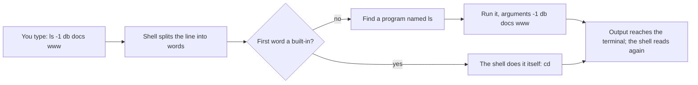

## Before you start

- [[foundation.l1.files-and-permissions]] — you saw that every run stands somewhere on disk and finishes relative paths from there. This lesson hands you the program that moves that standing point and looks at files, one typed line at a time.

## The situation

You type `scripts/up.sh` into a window on your laptop and press Enter, then type `scripts/terminal/tour.sh`. The first line the second one prints is `/repo`, and there is no `/repo` folder anywhere on your laptop. The names listed under it are the folders you can see in your editor, but the place they are listed from is not your machine.

A colleague runs the same file on macOS and gets output identical to yours, line for line, with nothing in it that says which laptop produced it. What read those lines, and where did each command actually run?

## Core concepts

- terminal — the window that draws text and forwards your keystrokes; it displays output, it does not run what you type.
- **shell** — the program behind that window: it reads one line, runs what the line names, shows what comes back, and asks for the next line.
- command line — one such line, where the first word names what to run and the words after it are handed over as typed, unless one of them holds a character the shell acts on.
- argument — one of those later words; in `ls -1 db`, both `-1` and `db` are arguments that `ls` reads for itself.
- built-in — something the shell carries out itself instead of starting a program; `cd` has to be one, because only the shell can change where the shell stands.

## How it works



In the situation above, the window you typed into is a terminal: it draws characters and forwards keystrokes. The shell is the program reading them: it splits each line into words at the blanks, then looks at the first word.

A few first words the shell carries out itself; `cd` is the one you meet first. It has to: each process keeps its own working directory, so a separate program could change only its own and leave the shell where it was.

Most other first words name a program. The shell finds a file of that name in a list of folders it keeps, starts it, hands over the remaining words as arguments, and waits. A first word holding a `/` names a file directly, and the shell runs it without searching. In `ls -1 db docs www` no later word is anything the shell acts on, so all four reach `ls` unchanged; you will meet words like `*`, which the shell replaces with the file names it matches, and `>`, which it keeps to send the output to a file. The output reaches the terminal, and the shell reads again.

The same loop runs wherever a shell runs, and one handful of commands is enough: `pwd` prints where you stand, `ls` lists, `cd` moves, `cat` prints a file, `mkdir` makes a folder, and `cp`, `mv` and `rm` copy, move and delete. They are standard on Linux and macOS, and on Windows inside the terminal you open below.

In bash — the shell Try it opens — Tab completes a name it can see from where it stands, and the Up arrow brings back a line you ran before. Tab fills in nothing when no name here matches, and that is the message: you are standing somewhere else.

## In the Đơn Hàng system

`scripts/terminal/tour.sh` holds lines you could type by hand, and because you typed its path, the shell ran that exact file. The line under the comment at the top starts the same file again inside the lab box — the small Linux machine `scripts/up.sh` starts on your own laptop, a machine with paths of its own rather than a folder you could open in your editor. The lines below it are read by a shell running there and not on your laptop, which is why the example system sits at `/repo` there, and why your colleague's output matches yours exactly. How a shell reads your lines on a machine that is not yours is [[foundation.l1.ssh-and-remote]].

```bash file=scripts/terminal/tour.sh tag=stage-0 lines=4-23
# Everything below runs inside the lab box; this line puts it there.
[ -f /.dockerenv ] || exec "$(dirname "$0")/../lab-run.sh" "$0" "$@"

cd /repo
pwd

echo
ls -1 db docs www

echo
wc -l db/schema.sql

echo
head -2 db/queries/select-basics.sql

echo
cd db/queries
pwd
cd ../..
pwd
```

```text output=true
/repo

db:
queries
schema.sql
seed.sql

docs:
clean-code
craft
git
team

www:
cached.html
index.html
login.html

48 db/schema.sql

-- Ask one table a question: choose columns, filter rows, sort, cut.
SET TIME ZONE 'Asia/Ho_Chi_Minh';

/repo/db/queries
/repo
```

Read the script as lines you could type, in order. `cd /repo` moves, and `pwd` proves the move by printing where the run now stands. `ls -1 db docs www` gives one program three folder names, and `-1` asks for one name per line. `wc -l` counts the lines of a file, `head -2` shows only the first two lines of another, and `echo` with nothing after it prints an empty line — the blank lines between the blocks are those calls, while the two inside the listing come from `ls`.

Now match the output to the lines that produced it. Because `ls` was given more than one folder, it labels each group and separates the groups with a blank line, which is where `db:`, `docs:` and `www:` come from. `48 db/schema.sql` is `wc -l` answering with a count and the name it was handed. The two lines beginning `--` and `SET` are the top of a file you never opened whole. The last two lines are the same `pwd` command answering differently: `cd db/queries` moved the run down two levels, `cd ../..` moved it back, because `..` names the folder one level up.

## Beginners often think…

- **"The terminal is a hacker tool; a file explorer does everything it does."** → Actually the terminal is a window and the shell behind it is an ordinary program, and what you get in exchange for typing is that every line is text: you can paste it to a colleague, keep it, and run it again unchanged. You notice this when something goes wrong on a machine with no screen attached, and the only way to say what you did is to send the lines.
- **"`ls` and `cd` are features of the terminal app."** → Actually `ls` is a separate program sitting in a folder on disk, and `cd` is one of the few things the shell handles itself; neither belongs to the window. You notice this when the same `ls` runs inside a script with no terminal open anywhere, and its lines are still printed with nobody watching.
- **"I have to type the whole path correctly, so clicking is safer."** → Actually the shell completes names for you: type the first letters, press Tab, and it fills in the rest of a name that exists. You notice this when a name refuses to complete — that is not the shell being unhelpful, it is telling you the name is not there.

## Try it (3 minutes)

1. Open a terminal in the folder of the example system. Type `pwd`, then `ls`, then `cd db`; now type `cd qu`, press Tab, press Enter, and run `pwd` again. Press the Up arrow a few times to see the lines you already ran. On Windows the terminal to open is Git Bash, the window installing Git adds; installing it is one-time setup, not part of the three minutes.
2. Go back with `cd ../..`. If the lab box is not up, run `scripts/up.sh` and wait for the line `The lab is up.`; then run `scripts/terminal/tour.sh` and compare its last two printed lines with what your own two `pwd` calls printed.

Expected result: Tab finishes `cd qu` into the `queries` folder's name before you press Enter, and bash may add a `/` at the end. Your two `pwd` calls print a path on your laptop, then the same path with `db/queries` added: the top folder first, then `db/queries`. The script printed `/repo/db/queries` first and `/repo` after, because it moved back up before it ended. The same commands, answering about two different machines in the same shape.

## Connections

- [[foundation.l1.files-and-permissions]] — the ideas this lesson gives you commands for: `pwd` prints the working directory that lesson described, and `cd` is what changes it.
- [[foundation.l1.pipes-and-filters]] — the next step in the same loop: instead of showing a program's output, the shell hands it straight to another program.
- [[foundation.l1.ssh-and-remote]] — the same shell reading your lines on a machine that is not yours, which is why the loop above is worth the practice.

## Five-line summary

1. A shell reads a line, runs the program its first word names, hands it the rest as arguments, and shows the output.
2. The terminal is only the window; `ls` is a separate program, and the few commands the shell does itself, like `cd`, change the shell.
3. `pwd`, `ls`, `cd`, `cat`, `mkdir`, `cp`, `mv` and `rm` are enough to move around and look; Linux, macOS and Git Bash carry them.
4. Tab completion and the history of typed lines save typing, and a name that will not complete says you are not where you thought.
5. The same commands answer in the same shape on your laptop and in the lab box, though the paths differ, and on other machines later.
