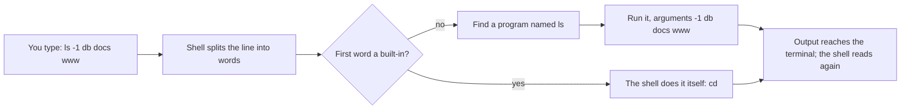

## Bạn cần biết trước

- [[foundation.l1.files-and-permissions]] — bạn đã thấy mỗi lần chạy đều đứng ở một chỗ trên ổ đĩa và ghép các đường dẫn tương đối cho đủ từ chỗ đó. Bài này đưa cho bạn chương trình dời chỗ đứng đó và xem các file, mỗi lần một dòng gõ vào.

## Tình huống

Bạn gõ `scripts/up.sh` vào một cửa sổ trên laptop rồi nhấn Enter, sau đó gõ `scripts/terminal/tour.sh`. Dòng đầu tiên lệnh thứ hai in ra là `/repo`, trong khi trên laptop của bạn không hề có thư mục `/repo` nào. Những cái tên liệt kê bên dưới chính là các thư mục bạn thấy trong editor, nhưng nơi liệt kê chúng không phải máy bạn.

Một đồng nghiệp chạy cùng file đó trên macOS và nhận output giống hệt của bạn, từng dòng một, không có chữ nào cho biết laptop nào đã in ra. Thứ gì đã đọc những dòng đó, và thật ra mỗi lệnh chạy ở đâu?

## Khái niệm cốt lõi

- terminal — cửa sổ vẽ chữ và chuyển tiếp phím bạn gõ. Nó hiện output chứ không chạy những gì bạn gõ.
- **shell** (Chương trình nhận lệnh gõ, chạy chương trình khác và nối chúng lại (bash, zsh, PowerShell)) — chương trình đứng sau cửa sổ đó: đọc một dòng, chạy thứ mà dòng đó gọi tên, hiện những gì trả về, rồi chờ dòng tiếp theo.
- dòng lệnh — một dòng như thế. Từ đầu tiên gọi tên thứ cần chạy, các từ sau được chuyển đi đúng như đã gõ, trừ khi trong đó có ký tự mà shell tự xử lý.
- tham số — một trong những từ phía sau đó. Trong `ls -1 db`, cả `-1` lẫn `db` đều là tham số mà `ls` tự đọc.
- lệnh dựng sẵn (built-in) — thứ shell tự làm thay vì khởi chạy một chương trình. `cd` buộc phải là lệnh dựng sẵn, vì chỉ shell mới đổi được chỗ shell đang đứng.

## Cơ chế hoạt động



Trong tình huống trên, cửa sổ bạn gõ vào là terminal. Shell là chương trình đọc các phím bạn gõ: nó tách mỗi dòng thành các từ ở chỗ khoảng trắng, rồi nhìn từ đầu tiên.

Có những từ đầu tiên mà shell tự làm, và `cd` là từ đầu tiên bạn gặp. Nó buộc phải như vậy: mỗi process giữ thư mục làm việc riêng, nên một chương trình tách riêng chỉ đổi được thư mục của chính nó, còn shell vẫn đứng nguyên chỗ cũ. Khi `cd` xong, thường không in gì, shell đọc dòng tiếp theo.

Phần lớn những từ đầu tiên còn lại là tên một chương trình. Shell tìm file mang tên đó trong một danh sách thư mục nó giữ, khởi chạy file, chuyển các từ còn lại sang làm tham số, rồi chờ. Từ đầu tiên có chứa `/` là tên trực tiếp của một file, và shell chạy file đó mà không tìm kiếm.

Trong `ls -1 db docs www`, không từ nào phía sau là thứ shell tự xử lý, nên cả bốn tới `ls` nguyên vẹn. Sau này bạn sẽ gặp `*`, thứ shell thay bằng các tên file khớp, và `>`, thứ shell giữ lại để gửi output vào file. Output tới terminal, và shell lại đọc tiếp.

Vòng lặp này giống nhau ở mọi nơi có shell chạy, và chỉ cần một nhúm lệnh: `pwd` in ra chỗ bạn đang đứng, `ls` liệt kê, `cd` di chuyển, `cat` in một file, `mkdir` tạo thư mục, còn `cp`, `mv` và `rm` sao chép, di chuyển và xóa. Chúng có sẵn trên Linux, macOS và, trên Windows, Git Bash.

Trong bash, shell mà Git Bash mở ra và cũng là shell đọc `tour.sh` bên dưới, phím Tab điền nốt một cái tên mà nó thấy được từ chỗ đang đứng, còn phím mũi tên lên gọi lại một dòng bạn đã chạy. Tab không điền gì khi không có tên nào ở đây bắt đầu bằng những gì bạn đã gõ. Thường thì điều đó nghĩa là bạn đang đứng ở chỗ khác.

## Trong hệ thống Đơn Hàng

`scripts/terminal/tour.sh` chứa những dòng bạn có thể tự gõ tay, và vì bạn gõ đường dẫn của nó, shell đã chạy đúng file đó. Dòng nằm dưới comment ở đầu file khởi chạy lại chính file này bên trong hộp lab. Bạn chưa cần đọc các phần của dòng đó. Tạm thời, hãy coi hộp lab là một hệ thống Linux riêng mà `scripts/up.sh` khởi động trên laptop của bạn, có thư mục riêng và shell riêng. Các bài sau sẽ cho thấy nó hoạt động thế nào. `scripts/up.sh` cũng làm cho thư mục hệ thống ví dụ của bạn hiện ra bên trong hộp ở `/repo`, nên cùng các thư mục `db`, `docs` và `www` xuất hiện ở đó. Các dòng bên dưới do một shell chạy trong hộp đọc, không phải trên laptop, nên output của đồng nghiệp khớp y hệt output của bạn. Shell đọc các dòng bạn gõ trên một máy không phải của bạn ra sao là chuyện của [[foundation.l1.ssh-and-remote]].

```bash file=scripts/terminal/tour.sh tag=stage-0 lines=4-23
# Everything below runs inside the lab box; this line puts it there.
[ -f /.dockerenv ] || exec "$(dirname "$0")/../lab-run.sh" "$0" "$@"

cd /repo
pwd

echo
ls -1 db docs www

echo
wc -l db/schema.sql

echo
head -2 db/queries/select-basics.sql

echo
cd db/queries
pwd
cd ../..
pwd
```

```text output=true
/repo

db:
queries
schema.sql
seed.sql

docs:
clean-code
craft
git
team

www:
cached.html
index.html
login.html

48 db/schema.sql

-- Ask one table a question: choose columns, filter rows, sort, cut.
SET TIME ZONE 'Asia/Ho_Chi_Minh';

/repo/db/queries
/repo
```

`cd /repo` di chuyển, và `pwd` xác nhận bằng cách in ra chỗ lần chạy đang đứng. `ls -1 db docs www` đưa cho một chương trình ba tên thư mục, còn `-1` yêu cầu mỗi dòng một tên. `wc -l` đếm số dòng của một file, `head -2` chỉ hiện hai dòng đầu của một file khác, và `echo` không kèm gì phía sau thì in một dòng trống. Các dòng trống giữa các khối là do những lần gọi đó, còn hai dòng trống bên trong danh sách là do `ls`.

Giờ ghép output với những dòng đã tạo ra nó. Vì `ls` nhận nhiều hơn một thư mục, nó ghi nhãn cho từng nhóm và ngăn các nhóm bằng một dòng trống, và đó là nguồn gốc của `db:`, `docs:` và `www:`. `48 db/schema.sql` là `wc -l` trả lời bằng một con số kèm cái tên nó được đưa. Hai dòng bắt đầu bằng `--` và `SET` là phần đầu của một file bạn chưa bao giờ mở toàn bộ. Hai dòng cuối là cùng lệnh `pwd` trả lời khác nhau: `cd db/queries` đưa lần chạy xuống hai cấp, `cd ../..` đưa nó trở lại, vì `..` là tên thư mục ở trên một cấp.

## Người mới hay nghĩ rằng…

- **"Terminal là công cụ của hacker, trình quản lý file làm được mọi thứ terminal làm."** → Thực ra terminal chỉ là một cửa sổ và shell đứng sau nó là một chương trình bình thường. Đổi lại công gõ phím, mọi dòng đều là chữ: bạn có thể dán cho đồng nghiệp, giữ lại và chạy lại y nguyên. Bạn sẽ nhận ra khi có sự cố trên một máy không gắn màn hình, và cách duy nhất để nói bạn đã làm gì là gửi những dòng đó.
- **"`ls` và `cd` là tính năng của ứng dụng terminal."** → Thực ra `ls` là một chương trình riêng nằm trong một thư mục trên ổ đĩa, còn `cd` là một trong những thứ shell tự xử lý. Không cái nào thuộc về cửa sổ. Bạn sẽ nhận ra khi cùng lệnh `ls` đó chạy bên trong một script mà không có terminal nào mở, và các dòng của nó vẫn được in ra dù không ai nhìn.
- **"Mình phải gõ đúng cả đường dẫn, nên bấm chuột an toàn hơn."** → Thực ra shell điền tên giúp bạn: gõ vài chữ đầu, nhấn Tab, và nó điền nốt phần còn lại của một cái tên có thật. Bạn sẽ nhận ra khi một cái tên không chịu điền. Đó không phải shell khó tính, mà thường là nó đang báo cái tên đó không có ở đây.

## Thử ngay (3 phút)

1. Trên Windows, mở Git Bash, cửa sổ bash đi kèm Git, công cụ theo dõi thay đổi của code mà một module sau sẽ dạy. Cài đặt nó là việc làm một lần, không tính vào ba phút. Ở hệ điều hành khác, mở một terminal. `cd` tới thư mục của hệ thống ví dụ, thư mục mà editor đang hiện. Trong Git Bash, một thư mục như `C:\Users\you\don-hang` được gõ thành `/c/Users/you/don-hang`. Gõ `pwd`, rồi `ls`, rồi `cd db`. Giờ gõ `cd qu`, nhấn Tab, nhấn Enter, và chạy lại `pwd`. Nhấn phím mũi tên lên vài lần để xem những dòng bạn đã chạy.
2. Quay lại bằng `cd ../..`. Nếu hộp lab chưa chạy, chạy `scripts/up.sh` và chờ dòng `The lab is up.`, rồi chạy `scripts/terminal/tour.sh` và so hai dòng cuối nó in ra với những gì hai lần gọi `pwd` của bạn đã in.

Kết quả mong đợi: Tab điền `cd qu` thành tên thư mục `queries` trước khi bạn nhấn Enter, và bash có thể thêm `/` ở cuối. Hai lần gọi `pwd` in ra một đường dẫn trên laptop, rồi chính đường dẫn đó thêm `db/queries`: thư mục gốc trước, rồi `db/queries`. Script in `/repo/db/queries` trước và `/repo` sau, vì nó đã quay lên trước khi kết thúc. Cùng những lệnh ấy, trả lời về hai máy khác nhau theo cùng một dạng.

## Liên hệ

- [[foundation.l1.files-and-permissions]] — những ý mà bài này cho bạn lệnh để thao tác: `pwd` in ra thư mục làm việc bài đó đã mô tả, và `cd` là thứ đổi nó.
- [[foundation.l1.pipes-and-filters]] — bước tiếp theo trong cùng vòng lặp: thay vì hiện output của một chương trình, shell chuyển thẳng nó cho một chương trình khác.
- [[foundation.l1.ssh-and-remote]] — cùng shell đó đọc các dòng bạn gõ trên một máy không phải của bạn, và đó là lý do vòng lặp trên đáng để luyện.

## Tóm tắt 5 dòng

1. Shell đọc một dòng, chạy chương trình mà từ đầu tiên gọi tên, chuyển phần còn lại làm tham số, rồi hiện output.
2. Terminal là cửa sổ. `ls` là một chương trình riêng, còn `cd` do shell tự làm, vì chỉ shell mới dời được chỗ nó đang đứng.
3. `pwd`, `ls`, `cd`, `cat`, `mkdir`, `cp`, `mv` và `rm` là đủ để di chuyển và xem xét. Linux, macOS và Git Bash đều có chúng.
4. Tab điền tên và lịch sử các dòng đã gõ giúp bớt gõ phím, còn một cái tên không chịu điền thường nghĩa là bạn không đứng ở chỗ mình tưởng.
5. Cùng những lệnh đó trả lời theo cùng một dạng trên laptop và trong hộp lab, dù đường dẫn khác nhau, và sau này trên những máy khác.
