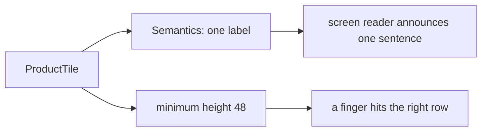

## Before you start

- [[frontend.l1.responsive-basics]] — you know `ProductCatalog` shows the same `ProductTile` in a one-column list or a grid, depending on the width `LayoutBuilder` reports.

## The situation

A customer who cannot see the screen well uses the app with a screen reader, a feature of the phone that reads out what is on screen and lets them tap by moving through items one at a time. On a product row that shows a name and a price as two separate texts, it may announce "Bàn phím cơ" and then, separately, "1250000 đ", with nothing telling the customer the two belong together. Another customer, using the app on a moving bus, keeps hitting the row below the one they meant. Neither of them is doing anything wrong. What does the app owe them?

## Core concepts

- **accessibility** — making an app usable by people using a screen reader, larger text, or limited motor control.
- `Semantics` — a widget that describes its child for assistive tools such as screen readers, for example with a label to read out.
- tap target — the area of the screen that responds to a tap; a small one is hard to hit accurately.

## How it works



**Accessibility** means the app can be used by people who do not use it the way its authors do: with a screen reader, with larger text, or with less precise hands. It is not a separate feature added at the end. It is part of how each widget is built, and it is much cheaper to get right in a small widget like a tile than to fix across many screens later.

A screen reader cannot look at the screen. It reads the description Flutter builds alongside the widget tree, and each text widget adds its own piece to that description. Two texts side by side can be announced as two separate pieces. Wrapping them in a `Semantics` widget with one label, and excluding the pieces inside it, gives the reader a single sentence that says what the row is.

Tap size is the other half. Material design recommends that anything a user taps be at least 48 by 48 logical pixels, the device-independent pixels Flutter lays out in. A smaller target is hard to hit for anyone with limited precision: from a disability, from a small screen, or from a moving bus. Giving the widget a minimum height is the simplest way to keep every row above that size, whatever its text.

## In the Đơn Hàng system

`ProductTile` in `DonHang.App/lib/widgets/product_tile.dart` at stage-1:

```dart file=DonHang.App/lib/widgets/product_tile.dart tag=stage-1 lines=15-35
  Widget build(BuildContext context) {
    return Semantics(
      label: '${product.name}, ${product.priceVnd} đồng',
      button: onTap != null,
      excludeSemantics: true,
      child: InkWell(
        onTap: onTap,
        child: ConstrainedBox(
          constraints: const BoxConstraints(minHeight: 48),
          child: Padding(
            padding: const EdgeInsets.all(12),
            child: Row(
              children: [
                Expanded(child: Text(product.name)),
                Text('${product.priceVnd} đ'),
              ],
            ),
          ),
        ),
      ),
    );
```

The outer `Semantics` gives the tile one label, `'${product.name}, ${product.priceVnd} đồng'`, and `excludeSemantics: true` keeps the two `Text` widgets inside from being announced separately. `button: onTap != null` tells assistive tools the tile can be tapped only when a tap handler was given; in `ProductCatalog` none is, so it is announced as plain content. The `ConstrainedBox` sets a minimum height of 48, so the tile never gets shorter than that, whatever its text.

The widget test checks both, in `DonHang.App/test/product_catalog_test.dart`:

```dart file=DonHang.App/test/product_catalog_test.dart tag=stage-1 lines=38-44
  // lesson: frontend.l1.accessibility-basics
  testWidgets('each tile is at least 48 pixels tall and has a spoken label', (tester) async {
    await tester.pumpWidget(catalogWithWidth(360));

    expect(tester.getSize(find.byType(ProductTile).first).height, greaterThanOrEqualTo(48));
    expect(find.bySemanticsLabel('Bàn phím cơ, 1250000 đồng'), findsOneWidget);
  });
```

`getSize` measures the first tile's height, and `find.bySemanticsLabel` looks for a widget whose semantic label is exactly the sentence a screen reader would announce.

## Beginners often think…

- **"Accessibility only matters for apps built for users who are blind."** → Actually it covers anyone who uses the app differently: larger text, a shaky hand, one hand on a bus handle, or a screen reader. You notice this when people without any disability keep missing a small button, and a bigger tap target fixes it for everyone.
- **"As long as the app looks right, it's accessible; screen readers can figure out anything visible."** → Actually a screen reader only knows what the app describes to it, not what the screen looks like. You notice this when a row that looks like one clear item is read out as separate fragments, until a `Semantics` label joins them.

## Try it (3 minutes)

Using `ProductTile` above, answer:

1. What does a screen reader announce for a tile showing the product "Chuột không dây" at 450000?
2. What would change in that announcement if `excludeSemantics: true` were removed?
3. A long product name wraps onto two lines. Does the minimum height still hold, and does the tile grow?

Expected result: 1 — one sentence, "Chuột không dây, 450000 đồng". 2 — the texts inside could also be exposed as their own separate pieces, so the reader may announce them in addition to the label. 3 — the minimum is still 48; `minHeight` sets only a floor, so a taller tile with two lines of text is allowed and simply grows.

A teammate wants to shrink the rows to fit more products on screen by setting the tile's height to 32. What would you say in review?

<details><summary>Suggested answer</summary>

That 32 pixels is below the 48 by 48 size Material recommends for anything tapped, so rows would become harder to hit accurately for anyone with less precise hands, and more so once the tiles are given a tap handler. If the goal is more products on screen, the grid from `ProductCatalog` shows more of them on wide screens without making each target smaller.

</details>

## Connections

- [[frontend.l1.responsive-basics]] — where `ProductTile` is arranged in a list or a grid.
- [[frontend.l1.the-widget-tree]] — the tree whose description a screen reader reads.

## Five-line summary

1. **Accessibility** is making the app usable with a screen reader, larger text or less precise hands, built into each widget.
2. A screen reader reads the app's description, not the screen, so separate texts can be announced as separate pieces.
3. `ProductTile` wraps its texts in one `Semantics` label, so the reader announces one sentence per product.
4. Material recommends tap targets of at least 48 by 48 logical pixels; `ProductTile` has a minimum height of 48.
5. The widget test checks the tile's height and its spoken label, so a later change cannot break them unnoticed.
