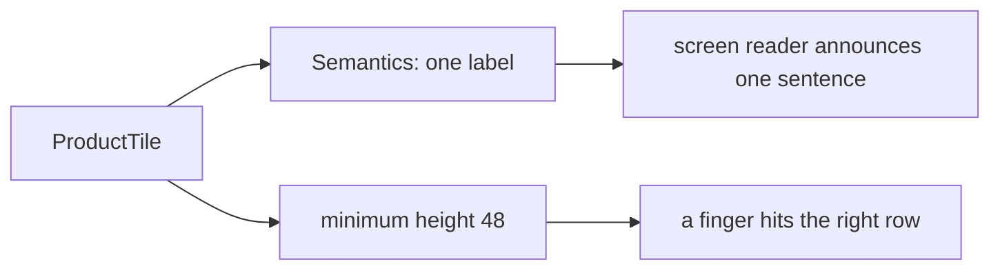

## Before you start

- [[frontend.l1.responsive-basics]] — you know `ProductCatalog` shows the same `ProductTile` in a one-column list or a grid, depending on the width `LayoutBuilder` reports.

## The situation

A customer who cannot see the screen well uses the app with a screen reader, a feature of the phone that reads out what is on screen and lets them tap by moving through items one at a time. On a product row that shows a name and a price as two separate texts, it may announce "Bàn phím cơ" and then, separately, "1250000 đ", or run them together as "Bàn phím cơ 1250000 đ", with nothing saying what the number is. Once rows can be tapped to open a product, another customer, on a moving bus, keeps hitting the row below the one they meant. Neither of them is doing anything wrong. What does the app owe them?

## Core concepts

- **accessibility** — making an app usable by people using a screen reader, larger text, or less precise hands.
- `Semantics` — a widget that describes its child for assistive tools such as screen readers, for example with a label to read out.
- tap target — the area of the screen that responds to a tap; a small one is hard to hit accurately.

## How it works



**Accessibility** means the app can be used by people who do not use it the way its authors do: with a screen reader, with larger text, or with less precise hands. It is not a separate feature added at the end. It is part of how each widget is built: when a small widget like a tile gets it right, every screen that reuses the tile gets it right too.

A screen reader cannot look at the screen. It reads the description Flutter builds alongside the widget tree; each text widget adds its words to it. Depending on the widgets around them, two texts side by side may be read as two separate pieces or run together; either way, nothing tells the listener the number is a price. Wrapping them in a `Semantics` widget with one label, and excluding the pieces inside it, gives the reader one sentence you chose.

Tap size is the other half. Material design, Google's design guidelines that Flutter's Material widgets follow, recommends that anything a user taps be at least 48 by 48 logical pixels. A logical pixel is Flutter's unit of size, which stays about the same physical size on every phone whatever its screen. A smaller target is hard to hit for anyone with limited precision, from a disability or a moving bus. In `ProductCatalog` a tile is as wide as the list or its grid column, and the grid gives every cell a fixed height of 72, so only a list row's height could fall below 48; a minimum height keeps every row above that size.

## In the Đơn Hàng system

`ProductTile` in `DonHang.App/lib/widgets/product_tile.dart` at stage-1:

```dart file=DonHang.App/lib/widgets/product_tile.dart tag=stage-1 lines=15-35
  Widget build(BuildContext context) {
    return Semantics(
      label: '${product.name}, ${product.priceVnd} đồng',
      button: onTap != null,
      excludeSemantics: true,
      child: InkWell(
        onTap: onTap,
        child: ConstrainedBox(
          constraints: const BoxConstraints(minHeight: 48),
          child: Padding(
            padding: const EdgeInsets.all(12),
            child: Row(
              children: [
                Expanded(child: Text(product.name)),
                Text('${product.priceVnd} đ'),
              ],
            ),
          ),
        ),
      ),
    );
```

The outer `Semantics` gives the tile one label, `'${product.name}, ${product.priceVnd} đồng'`, and `excludeSemantics: true` puts that label in place of the two `Text` widgets inside; without it, their words would be added after the label and the name and price read twice. Inside 12 pixels of padding, a `Row` puts the name (stretched by `Expanded` to take the free space) and the price side by side.

`InkWell` is the widget that makes its child respond to a tap and calls `onTap`. `button: onTap != null` marks the tile as a button, so a screen reader adds the hint "button", only when a tap handler was given; in `ProductCatalog` none is, so it is announced as plain content. The catalog does not open products yet; the `ConstrainedBox` minimum height of 48 makes the rows the right size for when a screen passes `onTap`.

A widget test is a test that builds and lays out widgets in a simple test environment, without a real device, much as a unit test runs code without one; `pumpWidget(catalogWithWidth(360))` builds the catalog 360 pixels wide. This test checks the tile's minimum height and its label, so a later change cannot break them unnoticed, in `DonHang.App/test/product_catalog_test.dart`:

```dart file=DonHang.App/test/product_catalog_test.dart tag=stage-1 lines=38-44
  // lesson: frontend.l1.accessibility-basics
  testWidgets('each tile is at least 48 pixels tall and has a spoken label', (tester) async {
    await tester.pumpWidget(catalogWithWidth(360));

    expect(tester.getSize(find.byType(ProductTile).first).height, greaterThanOrEqualTo(48));
    expect(find.bySemanticsLabel('Bàn phím cơ, 1250000 đồng'), findsOneWidget);
  });
```

`getSize` measures the first tile's height, and `find.bySemanticsLabel` looks for a widget whose semantic label is exactly the sentence a screen reader would announce.

## Beginners often think…

- **"Accessibility only matters for apps built for users who are blind."** → Actually it covers anyone who uses the app differently: larger text, a shaky hand, one hand on a bus handle, or a screen reader. You notice this when people without any disability keep missing a small button, and a bigger tap target helps all of them.
- **"As long as the app looks right, it's accessible; screen readers can figure out anything visible."** → Actually a screen reader only knows what the app describes to it, not what the screen looks like. You notice this when a row that looks like one clear item is read out as separate fragments, until a `Semantics` label joins them.

## Try it (3 minutes)

Using `ProductTile` above, answer:

1. What does a screen reader announce for a tile showing the product "Chuột không dây" at 450000?
2. What would change in that announcement if `excludeSemantics: true` were removed?
3. A long product name wraps onto two lines. Does the minimum height still hold, and does the tile grow?

Expected result: 1 — one sentence, "Chuột không dây, 450000 đồng". 2 — the two texts would be added to the same announcement after the label, so the reader says the name and price twice: "Chuột không dây, 450000 đồng, Chuột không dây, 450000 đ". 3 — yes, the tile is still at least 48 tall; `minHeight` sets only a floor. In the one-column list a tile with two lines of text grows taller; in the grid every cell is a fixed 72 high, so it stays 72.

A teammate wants to shrink the rows to fit more products on screen by setting the tile's height to 32. What would you say in review?

<details><summary>Suggested answer</summary>

That 32 pixels is below the 48 by 48 size Material recommends for anything tapped, so rows would become harder to hit accurately for anyone with less precise hands, and more so once the tiles are given a tap handler. If the goal is more products on screen, the grid from `ProductCatalog` shows more of them on wide screens without making each target smaller.

</details>

## Connections

- [[frontend.l1.responsive-basics]] — where `ProductTile` is arranged in a list or a grid.
- [[frontend.l1.the-widget-tree]] — the tree whose description a screen reader reads.

## Five-line summary

1. **Accessibility** is making the app usable with a screen reader, larger text or less precise hands, built into each widget.
2. A screen reader reads the app's description, not the screen, so separate texts can be read with nothing saying what they mean.
3. `ProductTile` wraps its texts in one `Semantics` label, so the reader announces one sentence per product.
4. Material recommends tap targets of at least 48 by 48 logical pixels; `ProductTile` has a minimum height of 48.
5. The widget test checks the tile's height and its spoken label, so a later change cannot break them unnoticed.
