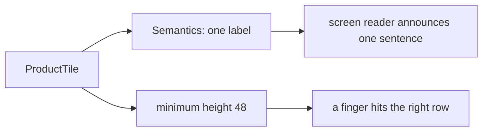

## Bạn cần biết trước

- [[frontend.l1.responsive-basics]] — bạn biết `ProductCatalog` hiện cùng một `ProductTile` trong danh sách một cột hoặc trong lưới, tùy chiều rộng mà `LayoutBuilder` báo.

## Tình huống

Một khách nhìn màn hình không rõ dùng app với screen reader, tính năng của điện thoại đọc to những gì trên màn hình và cho phép chạm bằng cách đi qua từng mục một. Với một dòng sản phẩm hiện tên và giá thành hai đoạn chữ riêng, nó có thể đọc "Bàn phím cơ" rồi tách riêng "1250000 đ", hoặc đọc dính liền thành "Bàn phím cơ 1250000 đ", mà không có gì cho biết con số đó là gì. Khi các dòng đã chạm được để mở sản phẩm, một khách khác đang ngồi trên xe buýt cứ chạm trúng dòng bên dưới dòng mình muốn. Cả hai đều không làm gì sai. Vậy app nợ họ điều gì?

## Khái niệm cốt lõi

- **accessibility** — làm cho app dùng được với người dùng screen reader, chữ to, hoặc đôi tay kém chính xác.
- `Semantics` — widget mô tả widget con của nó cho các công cụ hỗ trợ như screen reader, ví dụ bằng một nhãn để đọc to.
- vùng chạm (tap target) — phần màn hình phản hồi khi được chạm, vùng nhỏ thì khó chạm trúng.

## Cơ chế hoạt động



**Accessibility** nghĩa là app dùng được với cả những người không dùng nó theo cách người viết app dùng: với screen reader, với chữ to, hoặc với đôi tay kém chính xác. Đây không phải tính năng riêng gắn thêm vào cuối. Nó nằm trong cách build từng widget: khi một widget nhỏ như một tile làm đúng, mọi màn hình dùng lại tile đó cũng đúng theo.

Screen reader không nhìn được màn hình. Nó đọc bản mô tả mà Flutter dựng song song với widget tree, và mỗi widget chữ góp chữ của mình vào đó. Tùy các widget xung quanh, hai đoạn chữ đứng cạnh nhau có thể bị đọc thành hai mẩu riêng hoặc dính liền nhau. Dù theo cách nào, cũng không có gì cho người nghe biết con số là giá. Bọc chúng trong một widget `Semantics` có một nhãn, và loại các mẩu bên trong ra, sẽ khiến screen reader đọc đúng một câu do bạn chọn.

Kích thước chạm là nửa còn lại. Material design, bộ hướng dẫn thiết kế của Google mà các widget Material của Flutter tuân theo, khuyến nghị mọi thứ người dùng chạm vào phải có kích thước ít nhất 48 x 48 logical pixel. Logical pixel là đơn vị kích thước của Flutter, giữ kích thước vật lý gần như nhau trên mọi điện thoại, bất kể màn hình ra sao. Vùng chạm nhỏ hơn thì khó chạm trúng với bất kỳ ai thao tác kém chính xác, dù vì khuyết tật hay vì xe buýt đang chạy. Trong `ProductCatalog`, một tile rộng bằng danh sách hoặc bằng cột lưới của nó, còn lưới cho mọi ô chiều cao cố định 72, nên chỉ chiều cao của một dòng trong danh sách mới có thể xuống dưới 48. Chiều cao tối thiểu giữ mọi dòng ở trên mức đó.

## Trong hệ thống Đơn Hàng

`ProductTile` trong `DonHang.App/lib/widgets/product_tile.dart` ở stage-1:

```dart file=DonHang.App/lib/widgets/product_tile.dart tag=stage-1 lines=15-35
  Widget build(BuildContext context) {
    return Semantics(
      label: '${product.name}, ${product.priceVnd} đồng',
      button: onTap != null,
      excludeSemantics: true,
      child: InkWell(
        onTap: onTap,
        child: ConstrainedBox(
          constraints: const BoxConstraints(minHeight: 48),
          child: Padding(
            padding: const EdgeInsets.all(12),
            child: Row(
              children: [
                Expanded(child: Text(product.name)),
                Text('${product.priceVnd} đ'),
              ],
            ),
          ),
        ),
      ),
    );
```

`Semantics` bên ngoài cho tile một nhãn duy nhất, `'${product.name}, ${product.priceVnd} đồng'`, và `excludeSemantics: true` đặt nhãn đó vào chỗ của hai widget `Text` bên trong. Thiếu nó, chữ của hai widget kia sẽ bị nối thêm sau nhãn, và tên cùng giá bị đọc hai lần. Bên trong lớp padding 12 pixel, một `Row` đặt tên (được `Expanded` kéo giãn để chiếm phần trống) và giá cạnh nhau.

`InkWell` là widget khiến widget con của nó phản hồi khi được chạm và gọi `onTap`. `button: onTap != null` đánh dấu tile là một nút, để screen reader đọc thêm gợi ý "button", nhưng chỉ khi có truyền vào một hàm xử lý chạm. Trong `ProductCatalog` không truyền hàm nào, nên tile được đọc như nội dung thường. Catalog chưa mở sản phẩm, còn chiều cao tối thiểu 48 của `ConstrainedBox` giúp các dòng có sẵn kích thước đúng cho lúc một màn hình truyền `onTap`.

Widget test là loại test build và layout các widget trong một môi trường test đơn giản, không cần thiết bị thật, giống như unit test chạy code mà không cần thiết bị. `pumpWidget(catalogWithWidth(360))` build catalog với chiều rộng 360 pixel. Test này kiểm tra chiều cao tối thiểu và nhãn của tile, để một thay đổi sau này không thể làm hỏng chúng mà không ai hay, trong `DonHang.App/test/product_catalog_test.dart`:

```dart file=DonHang.App/test/product_catalog_test.dart tag=stage-1 lines=38-44
  // lesson: frontend.l1.accessibility-basics
  testWidgets('each tile is at least 48 pixels tall and has a spoken label', (tester) async {
    await tester.pumpWidget(catalogWithWidth(360));

    expect(tester.getSize(find.byType(ProductTile).first).height, greaterThanOrEqualTo(48));
    expect(find.bySemanticsLabel('Bàn phím cơ, 1250000 đồng'), findsOneWidget);
  });
```

`getSize` đo chiều cao của tile đầu tiên, còn `find.bySemanticsLabel` tìm widget có nhãn semantics đúng bằng câu mà screen reader sẽ đọc.

## Người mới hay nghĩ rằng…

- **"Accessibility chỉ quan trọng với app làm cho người khiếm thị."** → Thực ra nó bao gồm bất kỳ ai dùng app theo cách khác: chữ to, tay run, một tay đang bám tay vịn trên xe buýt, hay screen reader. Bạn sẽ nhận ra khi cả những người không hề khuyết tật cũng cứ chạm trượt một nút nhỏ, và một vùng chạm lớn hơn giúp được tất cả họ.
- **"Chỉ cần app trông đúng là đã accessible, screen reader tự hiểu được mọi thứ nhìn thấy."** → Thực ra screen reader chỉ biết những gì app mô tả cho nó, chứ không biết màn hình trông ra sao. Bạn sẽ nhận ra khi một dòng trông như một mục rõ ràng lại bị đọc thành các mẩu rời rạc, cho tới khi một nhãn `Semantics` gộp chúng lại.

## Thử ngay (3 phút)

Dựa vào `ProductTile` ở trên, trả lời:

1. Screen reader đọc gì cho một tile hiện sản phẩm "Chuột không dây" giá 450000?
2. Câu đọc đó sẽ thay đổi thế nào nếu bỏ `excludeSemantics: true`?
3. Một tên sản phẩm dài bị xuống thành hai dòng. Chiều cao tối thiểu còn giữ không, và tile có cao lên không?

Kết quả mong đợi: 1 — một câu, "Chuột không dây, 450000 đồng". 2 — hai đoạn chữ sẽ bị nối vào cùng câu đọc, sau nhãn, nên screen reader đọc tên và giá hai lần: "Chuột không dây, 450000 đồng, Chuột không dây, 450000 đ". 3 — có, tile vẫn cao ít nhất 48, vì `minHeight` chỉ đặt mức sàn. Trong danh sách một cột, tile có hai dòng chữ sẽ cao lên. Trong lưới, mọi ô đều cố định cao 72, nên tile vẫn cao 72.

Một đồng đội muốn thu nhỏ các dòng để vừa nhiều sản phẩm hơn trên màn hình, bằng cách đặt chiều cao tile là 32. Khi review, bạn sẽ nói gì?

<details><summary>Gợi ý đáp án</summary>

32 pixel thấp hơn kích thước 48 x 48 mà Material khuyến nghị cho mọi thứ được chạm, nên các dòng sẽ khó chạm trúng hơn với bất kỳ ai có đôi tay kém chính xác, và càng khó hơn khi tile được truyền hàm xử lý chạm. Nếu mục tiêu là hiện nhiều sản phẩm hơn, lưới của `ProductCatalog` đã hiện được nhiều sản phẩm hơn trên màn hình rộng mà không làm vùng chạm nào nhỏ đi.

</details>

## Liên hệ

- [[frontend.l1.responsive-basics]] — nơi `ProductTile` được xếp thành danh sách hoặc lưới.
- [[frontend.l1.the-widget-tree]] — cái cây mà screen reader đọc bản mô tả của nó.

## Tóm tắt 5 dòng

1. **Accessibility** là làm cho app dùng được với screen reader, chữ to hoặc đôi tay kém chính xác, và nó được build sẵn trong từng widget.
2. Screen reader đọc bản mô tả của app chứ không đọc màn hình, nên các đoạn chữ rời có thể bị đọc mà không có gì nói chúng nghĩa là gì.
3. `ProductTile` bọc các đoạn chữ của nó trong một nhãn `Semantics`, nên screen reader đọc một câu cho mỗi sản phẩm.
4. Material khuyến nghị vùng chạm ít nhất 48 x 48 logical pixel, và `ProductTile` có chiều cao tối thiểu 48.
5. Widget test kiểm tra chiều cao và nhãn đọc của tile, để một thay đổi sau này không thể làm hỏng chúng mà không ai hay.
