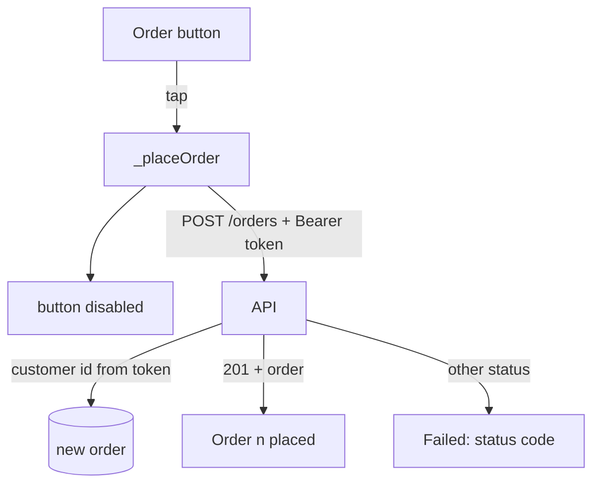

## Before you start

- [[frontend.l1.logging-in-from-the-app]] — you know `ApiClient.login` keeps the token in `_token`, and that `_headers` adds it as an `Authorization: Bearer <token>` header.
- [[backend.l1.creating-a-resource]] — you know a `POST` that creates something answers `201`, and that sending the same `POST` twice creates two resources.

## The situation

The customer has signed in, and the "Place an order" screen shows a single button, "Order 1 keyboard". Tapping it should create an order that belongs to them. Yet the screen never asks who they are, and the request body carries no customer id at all. How does the API know whose order it is? What should the screen show when the order is created, and when it is not, and what stops an impatient double tap from ordering twice?

## Core concepts

- `ApiClient.createOrder` — the method that `POST`s the order's items to `/api/v1/orders` with the headers from `_headers`, and returns the new order's id and status on `201`.
- customer id from the token — the API reads which customer is ordering from the signed token's `sub` claim, never from the request body.
- in-flight request — a request that has been sent and has not yet been answered; while one is in flight, the order button accepts no taps.

## How it works



Placing an order is a `POST` that creates a resource, so success is `201`, not `200`. The request body lists only what is being ordered: for each line, a product id, a quantity and a unit price. It says nothing about who is ordering. That comes from the `Authorization` header the app already attaches after login: the API's authentication middleware checks the token, and the endpoint takes the customer id from the token's `sub` claim. The API signed the token, so the client cannot change the id inside it without the signature failing; an id typed into the body would have no such protection.

What comes back decides what the screen shows. A `201` carries the new order as JSON, and the app reads its id and status. Anything else is a failure, and a `POST` can fail in more than one way: `401` when the token is missing or has expired, `400` when the API rejects the order, `500` when something broke on the server. Each asks the user for something different: sign in again, change the order, or try later.

A `POST` is not idempotent: sending the same request twice creates two orders. A user who taps twice because nothing seemed to happen would do exactly that. So while the request is in flight, the screen shows the loading state and does not accept another tap.

## In the Đơn Hàng system

`ApiClient.createOrder`, in `DonHang.App/lib/api_client.dart`:

```dart file=DonHang.App/lib/api_client.dart tag=stage-1 lines=48-58
  Future<OrderResult> createOrder(List<OrderItemRequest> items) async {
    final response = await http.post(
      Uri.parse('$baseUrl/orders'),
      headers: _headers,
      body: jsonEncode({'items': items.map((item) => item.toJson()).toList()}),
    );
    if (response.statusCode != 201) {
      throw Exception('failed to create order (${response.statusCode})');
    }
    return OrderResult.fromJson(jsonDecode(response.body) as Map<String, dynamic>);
  }
```

`createOrder` sends `_headers`, so the request carries `Content-Type` and, after login, `Authorization: Bearer <token>`. The body is `{"items": [...]}`, with each item turned into JSON by `OrderItemRequest.toJson`: `productId`, `quantity` and `unitPriceVnd`, and no customer id anywhere. On the API side, the create-order request type has only `Items`, and the endpoint, marked `[Authorize]`, reads the customer id from the token. Only `201` counts as success; `OrderResult.fromJson` then reads the new order's `id` and `status`. Any other status becomes an exception whose text holds just the status code. The Problem Details body the API sent, with its title and detail, is never read.

The order screen calls it from `_placeOrder`, in `DonHang.App/lib/screens/create_order_screen.dart`:

```dart file=DonHang.App/lib/screens/create_order_screen.dart tag=stage-1 lines=21-33
  Future<void> _placeOrder() async {
    setState(() => _loading = true);
    try {
      final order = await widget.apiClient.createOrder([
        OrderItemRequest(productId: 1, quantity: 1, unitPriceVnd: 1250000),
      ]);
      setState(() => _result = 'Order ${order.id} placed, status ${order.status}');
    } catch (e) {
      setState(() => _result = 'Failed: $e');
    } finally {
      if (mounted) setState(() => _loading = false);
    }
  }
```

In stage 1 this screen always orders the same thing: one of product 1, the keyboard, at its listed price. `_placeOrder` sets `_loading` first, and the button's `onPressed` is `null` while `_loading` is true, so the button is disabled and shows a spinner until the request ends. On success, the screen shows "Order <id> placed, status <status>"; a new order's status is `new`. On failure it shows "Failed: " followed by the exception, for example "Failed: Exception: failed to create order (500)". `finally` enables the button again, so a later tap places a second, separate order on purpose.

## Beginners often think…

- **"The app should still send a customer_id in the request body; the server can double-check it matches the token."** → Actually the token already names the customer, and the API signed it; an id in the body is only what the client chose to type. If the two disagree, the server can only trust the token, so the extra field adds nothing but a way to be wrong. You notice this when a server that did read the body's id stores an order under someone else's name because a client sent the wrong one.
- **"Showing a generic 'something went wrong' message is good enough for every kind of failure a POST can have."** → Actually a `401` asks the user to sign in again, a `400` asks them to change the order, and a `500` asks them to try later. One message for all three leaves them guessing. You notice this when a user reports "it failed" and nobody can tell whether the login, the order or the server was the problem.

## Try it (3 minutes)

Start the lab (`scripts/up.sh` from the repository root), open the app at `http://localhost:8081`, and open the browser's developer tools on the Network tab.

1. Tap the sign-in icon at the top right, then "Sign in" with the filled-in details. On "Place an order", tap "Order 1 keyboard". In the Network tab, select the `orders` request with method `POST` and look at its request headers and the body it sent.
2. From the repository root, run `docker compose stop db`. Tap the button again, then open that request's response in the Network tab. Run `docker compose start db` afterwards.

Expected result: 1 — "Order <n> placed, status new" under the button; the request has an `Authorization: Bearer …` header, and its body holds only `items`. 2 — "Failed: Exception: failed to create order (500)" on screen, while the response in the Network tab is a Problem Details body with the detail "something went wrong".

In step 1 the body had no customer id. Where did the API get the one it stored with the new order?

<details><summary>Suggested answer</summary>

From the token. The endpoint is marked `[Authorize]`, so the authentication middleware had already checked the `Authorization` header and recorded the caller before `Create` ran. `Create` then read the customer id from the token's `sub` claim, which the API wrote when it issued the token at login. The order belongs to whoever the token names.

</details>

## Connections

- [[frontend.l1.logging-in-from-the-app]] — where the token on this request comes from.
- [[backend.l1.creating-a-resource]] — the `201` this client checks for, from the API's side.
- [[backend.l1.validating-a-jwt]] — how the API checks the token and reads the caller from it.

## Five-line summary

1. `createOrder` `POST`s `{"items": [...]}` to `/api/v1/orders` with the `Authorization` header set at login, and no customer id.
2. The API takes the customer id from the signed token, which the client cannot change without breaking the signature.
3. `201` shows the new order's id and status; any other status becomes "Failed: …" with only the status code.
4. Different failures ask different things of the user, so one generic message for all of them leaves the user guessing.
5. The button is disabled while the request is in flight, so an impatient second tap cannot create a second order.
