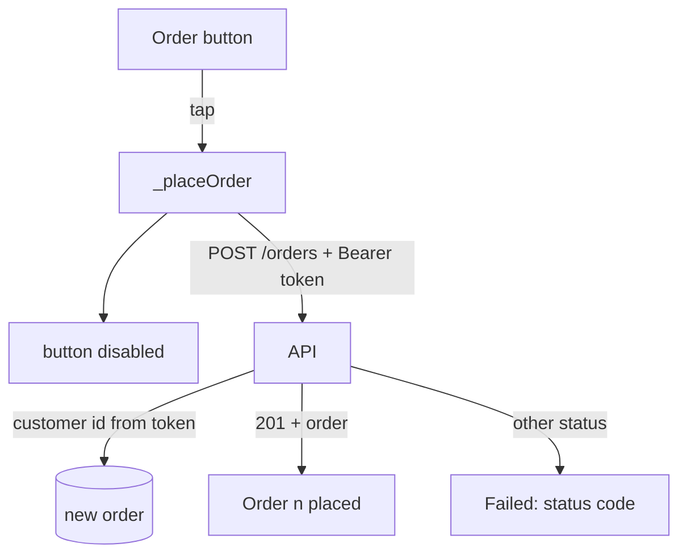

## Bạn cần biết trước

- [[frontend.l1.logging-in-from-the-app]] — bạn biết `ApiClient.login` giữ token trong `_token`, và `_headers` thêm nó thành header `Authorization: Bearer <token>`.
- [[backend.l1.creating-a-resource]] — bạn biết một `POST` tạo ra thứ gì đó sẽ trả `201`, và gửi cùng một `POST` hai lần sẽ tạo ra hai resource.

## Tình huống

Khách hàng đã đăng nhập, và màn hình "Place an order" hiện đúng một nút, "Order 1 keyboard". Bấm vào đó phải tạo ra một đơn thuộc về họ. Vậy mà màn hình không hề hỏi họ là ai, và body của request không mang customer id nào cả. API biết đơn đó của ai bằng cách nào? Màn hình nên hiện gì khi đơn được tạo và khi không, và điều gì ngăn một cú bấm đúp vội vàng đặt hai đơn?

## Khái niệm cốt lõi

- `ApiClient.createOrder` — method `POST` các item của đơn tới `/api/v1/orders` kèm các header từ `_headers`, và trả về id cùng status của đơn mới khi nhận `201`.
- customer id từ token — API đọc khách hàng nào đang đặt đơn từ claim `sub` của token đã ký, field trong payload nơi API đã ghi customer id lúc đăng nhập, không bao giờ từ body của request.
- request đang chạy — một request đã gửi đi mà chưa được trả lời; trong lúc có một request như vậy, nút đặt đơn không nhận thao tác bấm nào.

## Cơ chế hoạt động



Bấm nút sẽ chạy `_placeOrder`, hàm này vô hiệu nút rồi gửi một `POST` tạo ra một resource; API này trả lời một lần tạo thành công bằng `201`, không phải `200`. Body của request chỉ liệt kê thứ được đặt: với mỗi dòng là một product id, một số lượng và một đơn giá, và không có gì về người đặt. Thông tin đó đến từ header `Authorization` mà app đã gắn sau khi đăng nhập: middleware authentication của API kiểm tra token, và endpoint lấy customer id từ claim `sub` của token. API đã ký token, nên client không thể đổi id bên trong mà không làm hỏng chữ ký; một id gõ vào body thì không có sự bảo vệ nào như thế.

Thứ trả về quyết định màn hình hiện gì. Một `201` mang đơn mới dưới dạng JSON, và app đọc id cùng status của nó. Mọi thứ khác là thất bại, và một `POST` có thể thất bại theo nhiều cách: `401` khi token bị thiếu hoặc đã hết hạn, `400` khi API từ chối đơn, `500` khi có gì đó hỏng trên server. Mỗi trường hợp đòi người dùng một việc khác nhau: đăng nhập lại, sửa đơn, hoặc thử lại sau.

`POST` không idempotent: gửi cùng một request hai lần tạo ra hai đơn. Một người dùng bấm hai lần vì tưởng chưa có gì xảy ra sẽ làm đúng như vậy, và đó là lý do nút bị vô hiệu trong lúc request đang chạy.

## Trong hệ thống Đơn Hàng

`ApiClient.createOrder`, trong `DonHang.App/lib/api_client.dart`:

```dart file=DonHang.App/lib/api_client.dart tag=stage-1 lines=48-58
  Future<OrderResult> createOrder(List<OrderItemRequest> items) async {
    final response = await http.post(
      Uri.parse('$baseUrl/orders'),
      headers: _headers,
      body: jsonEncode({'items': items.map((item) => item.toJson()).toList()}),
    );
    if (response.statusCode != 201) {
      throw Exception('failed to create order (${response.statusCode})');
    }
    return OrderResult.fromJson(jsonDecode(response.body) as Map<String, dynamic>);
  }
```

`baseUrl` là `http://localhost:8080/api/v1`, nên request đi tới `/api/v1/orders`. `createOrder` gửi `_headers`, nên nó mang `Content-Type` và, sau khi đăng nhập, `Authorization: Bearer <token>`. Body là `{"items": [...]}`, mỗi item được `OrderItemRequest.toJson` biến thành JSON: `productId`, `quantity` và `unitPriceVnd`, và không có customer id ở đâu cả. Phía API, kiểu request tạo đơn chỉ có `Items`, và method `Create` của endpoint đọc customer id từ token; nó được đánh dấu `[Authorize]`, nên một request không có token hợp lệ sẽ nhận `401` trước khi `Create` chạy.

Quay lại app, chỉ `201` được tính là thành công; khi đó `OrderResult.fromJson` đọc `id` và `status` của đơn mới. Mọi status khác đều thành một exception mà nội dung chỉ chứa mã status. Khi API gửi một body Problem Details có title và detail, như nó làm với `400` và `500`, body đó không bao giờ được đọc.

Màn hình đặt đơn gọi nó từ `_placeOrder`, trong `DonHang.App/lib/screens/create_order_screen.dart`:

```dart file=DonHang.App/lib/screens/create_order_screen.dart tag=stage-1 lines=21-33
  Future<void> _placeOrder() async {
    setState(() => _loading = true);
    try {
      final order = await widget.apiClient.createOrder([
        OrderItemRequest(productId: 1, quantity: 1, unitPriceVnd: 1250000),
      ]);
      setState(() => _result = 'Order ${order.id} placed, status ${order.status}');
    } catch (e) {
      setState(() => _result = 'Failed: $e');
    } finally {
      if (mounted) setState(() => _loading = false);
    }
  }
```

Ở giai đoạn 1 màn hình này luôn đặt cùng một thứ: một cái product 1, bàn phím, theo giá niêm yết. `_placeOrder` bật `_loading` trước tiên. Nút, được dựng ở phía dưới trong cùng file và không hiện ở đây, có `onPressed: _loading ? null : _placeOrder`, nên nó bị vô hiệu và hiện vòng quay cho tới khi request kết thúc. Khi thành công, màn hình hiện "Order <id> placed, status <status>"; status của một đơn mới là `new`. Khi thất bại, nó hiện "Failed: " rồi tới exception, ví dụ "Failed: Exception: failed to create order (500)".

`finally` bật lại nút, nên một lần bấm sau sẽ cố ý đặt một đơn thứ hai, riêng biệt; `if (mounted)` bảo vệ lệnh `setState` cuối cùng này: người dùng có thể đã rời màn hình trong lúc request đang chạy, và `finally` vẫn chạy, nên nó chỉ cập nhật màn hình nếu màn hình vẫn còn trong widget tree. Dòng "Failed: …" vẫn là một thông báo cho mọi loại thất bại, chỉ kèm thêm mã status: lập trình viên phân biệt được `401` với `500`, nhưng người dùng không được gợi ý nên làm gì.

## Người mới hay nghĩ rằng…

- **"App vẫn nên gửi customer_id trong body của request; server có thể kiểm tra lại xem nó có khớp với token không."** → Thực ra token đã cho biết khách hàng là ai, và API đã ký nó; một id trong body chỉ là thứ client chọn gõ vào. Nếu hai id khác nhau, server chỉ có thể tin token, nên field thêm vào chẳng thêm gì ngoài một cách để sai. Bạn sẽ nhận ra khi một server có đọc id trong body lưu đơn dưới tên người khác vì một client gửi nhầm id.
- **"Hiện một thông báo chung chung 'something went wrong' là đủ cho mọi kiểu thất bại mà một POST có thể gặp."** → Thực ra `401` đòi người dùng đăng nhập lại, `400` đòi họ sửa đơn, và `500` đòi họ thử lại sau. Một thông báo cho cả ba khiến họ phải đoán. Bạn sẽ nhận ra khi người dùng báo "nó hỏng rồi" và không ai biết vấn đề nằm ở đăng nhập, ở đơn hàng hay ở server.

## Thử ngay (3 phút)

Khởi động lab (`scripts/up.sh` từ thư mục gốc của repository) và mở app ở `http://localhost:8081`. Mở công cụ dành cho nhà phát triển của trình duyệt (F12 trên hầu hết trình duyệt) ở tab Network, nơi liệt kê từng request trang gửi đi, kèm header, body và response của nó.

1. Bấm biểu tượng đăng nhập ở góc trên bên phải, rồi "Sign in" với thông tin đã điền sẵn; sau đó app tự mở màn hình "Place an order". Bấm "Order 1 keyboard". Trong tab Network, chọn request `orders` có method `POST` và xem các header của request cùng body nó đã gửi.
2. Từ thư mục gốc của repository, chạy `docker compose stop db`, lệnh này dừng database của lab, nên API không lưu đơn được nữa. Bấm nút lần nữa, rồi mở response của request đó trong tab Network. Chạy `docker compose start db` sau đó.

Kết quả mong đợi: 1 — "Order <n> placed, status new" dưới nút; request có header `Authorization: Bearer …`, và body của nó chỉ chứa `items`. 2 — "Failed: Exception: failed to create order (500)" trên màn hình, trong khi response trong tab Network là một body Problem Details với detail "something went wrong".

Ở bước 1, body không có customer id. API lấy customer id mà nó lưu cùng đơn mới từ đâu?

<details><summary>Gợi ý đáp án</summary>

Từ token. Middleware authentication đã kiểm tra header `Authorization` và ghi nhận người gọi, và vì endpoint được đánh dấu `[Authorize]`, một request không có người gọi hợp lệ sẽ bị từ chối bằng `401` trước khi `Create` chạy. Sau đó `Create` đọc customer id từ claim `sub` của token, thứ API đã ghi vào khi cấp token lúc đăng nhập. Đơn thuộc về người mà token chỉ tới.

</details>

## Liên hệ

- [[frontend.l1.logging-in-from-the-app]] — nơi token trên request này bắt nguồn.
- [[backend.l1.creating-a-resource]] — mã `201` mà client này kiểm tra, nhìn từ phía API.
- [[backend.l1.validating-a-jwt]] — cách API kiểm tra token và đọc người gọi từ nó.

## Tóm tắt 5 dòng

1. `createOrder` `POST` `{"items": [...]}` tới `/api/v1/orders` kèm header `Authorization` được gán lúc đăng nhập, và không có customer id.
2. API lấy customer id từ token đã ký, thứ client không đổi được mà không làm hỏng chữ ký.
3. `201` hiện id và status của đơn mới; mọi status khác thành "Failed: …" chỉ kèm mã status.
4. Mỗi kiểu thất bại đòi người dùng một việc khác nhau, nên một thông báo chung cho tất cả khiến họ phải đoán.
5. Nút bị vô hiệu trong lúc request đang chạy, nên một lần bấm thứ hai vội vàng không tạo ra đơn thứ hai.
