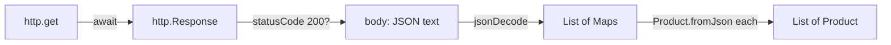

## Before you start

- [[frontend.l1.composing-widgets]] — you know the product screen shows one row per `Product`, and that `ApiClient` is the class that talks to the server.
- [[backend.l1.get-and-status-codes]] — you know `GET /api/v1/products` answers `200` with a JSON list of products.

## The situation

The product screen in the Đơn Hàng app shows real products, with real prices, from PostgreSQL. You have called the same endpoint with `curl` and seen the JSON it returns: a list of objects with `id`, `name` and `priceVnd`. Somewhere between that JSON text and a list of `Product` objects on screen, the app has to send the request, wait for the answer, and turn text into typed Dart values. What does that code look like, and what happens while the app is waiting?

## Core concepts

- `http.get` — the function in Dart's `http` package that sends a GET request and returns a `Future<http.Response>`, an answer that arrives later.
- `jsonDecode` — the function that turns JSON text into plain Dart values: a `List` for a JSON array, a `Map` for a JSON object.
- `fromJson` — a constructor, by convention, that builds a typed Dart object from one of those `Map`s.

## How it works



Fetching data in a Flutter app is three steps. First, `http.get(uri)` sends the GET request. It does not return the answer; it returns a `Future`, a promise that the answer will come. Inside an `async` function, `await` pauses that function until the answer arrives, the same way `await` works in C#. The rest of the app keeps running meanwhile: the browser does the waiting, and the screen can still draw and respond, as in the event-loop lesson.

Second, the answer is an `http.Response`, with a `statusCode` and a `body`. The body is just text, the same JSON you saw with `curl`. Before trusting it, the code checks the status: `200` means the body is the list; anything else means it is not.

Third, `jsonDecode` turns the text into Dart values, but untyped ones: a `List` whose items are `Map`s with string keys. To get a typed `Product`, the code reads each key and checks its type, which is exactly what the API did in the other direction when it turned a `Product` into a `ProductDto` and then into JSON. If a key is missing or has a different type, that check fails loudly instead of quietly producing a half-empty product.

## In the Đơn Hàng system

`ApiClient.fetchProducts`, in `DonHang.App/lib/api_client.dart`:

```dart file=DonHang.App/lib/api_client.dart tag=stage-1 lines=23-30
  Future<List<Product>> fetchProducts() async {
    final response = await http.get(Uri.parse('$baseUrl/products'));
    if (response.statusCode != 200) {
      throw Exception('failed to load products (${response.statusCode})');
    }
    final items = jsonDecode(response.body) as List<dynamic>;
    return items.map((item) => Product.fromJson(item as Map<String, dynamic>)).toList();
  }
```

`baseUrl` is `http://localhost:8080/api/v1`: the app goes through Caddy, like `curl` did. The method is `async` and returns a `Future<List<Product>>`, so whoever calls it also gets an answer that arrives later. It `await`s the response, throws if the status is not `200`, decodes the body as a list, and turns each item into a `Product`:

```dart file=DonHang.App/lib/models.dart tag=stage-1 lines=3-15
class Product {
  final int id;
  final String name;
  final int priceVnd;

  Product({required this.id, required this.name, required this.priceVnd});

  factory Product.fromJson(Map<String, dynamic> json) => Product(
        id: json['id'] as int,
        name: json['name'] as String,
        priceVnd: json['priceVnd'] as int,
      );
}
```

The keys `id`, `name` and `priceVnd` match the JSON the API sends for its `ProductDto`. Each `as` is a checked cast: if `priceVnd` were missing, `json['priceVnd']` would be `null`, and `null as int` throws. The `Future` returned by `fetchProducts` then completes with an error instead of a list, and the screen can show it. The same happens if a value has the wrong type, such as a price sent as text: the check stops it at the edge of the app.

## Beginners often think…

- **"http.get returns the data immediately, since Dart doesn't need async for something this simple."** → Actually a network request takes real time, so `http.get` returns a `Future` straight away and the data arrives later. The calling code must `await` it inside an `async` function, or pass the `Future` on. You notice this when you try to use the result of `http.get` as if it were already a `Response`, and Dart refuses because it is a `Future`.
- **"The JSON returned by the API always matches the Dart class exactly, with no chance of a missing or differently-named field."** → Actually the API and the app are separate programs, changed at different times. `Product.fromJson` depends on three exact key names; if the API renamed one, the cast would fail on every product. You notice this when a change on the server makes the app show an error for data that looks fine in `curl`.

## Try it (3 minutes)

With the lab running:

1. Run `curl -s http://localhost:8080/api/v1/products` and look at the keys of the first object.
2. Compare them with the three keys `Product.fromJson` reads.

Expected result: the objects have exactly `id`, `name` and `priceVnd`, the keys `fromJson` reads, with numbers for `id` and `priceVnd` and a string for `name`.

If the API renamed `priceVnd` to `price`, what would the product screen show, and why?

<details><summary>Suggested answer</summary>

An error instead of the list. `json['priceVnd']` would be `null` for every product, `null as int` would throw inside `fromJson`, and the `Future` from `fetchProducts` would complete with that error; the screen's error branch would then show it.

</details>

## Connections

- [[backend.l1.get-and-status-codes]] — the endpoint and status codes this client relies on.
- [[frontend.l1.futurebuilder-loading-error-empty]] — how the screen shows the `Future` while it loads, fails or turns out empty.

## Five-line summary

1. `http.get` sends a GET request and returns a `Future<http.Response>`; `await` waits for it without freezing the app.
2. `ApiClient.fetchProducts` checks for `200` and throws otherwise, before reading the body.
3. `jsonDecode` turns the JSON body into a `List` of `Map`s, untyped.
4. `Product.fromJson` reads `id`, `name` and `priceVnd` with checked casts, the client-side mirror of the API's DTO.
5. A missing or renamed key makes the cast throw, so the `Future` fails instead of producing a broken product.
