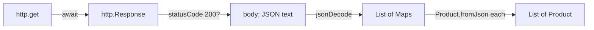

## Bạn cần biết trước

- [[frontend.l1.composing-widgets]] — bạn biết màn hình sản phẩm hiện mỗi `Product` một dòng, và `ApiClient` là class nói chuyện với server.
- [[backend.l1.get-and-status-codes]] — bạn biết `GET /api/v1/products` trả `200` kèm một danh sách sản phẩm dạng JSON.

## Tình huống

Màn hình sản phẩm trong app Đơn Hàng hiện sản phẩm thật, giá thật, lấy từ database. Bạn đã gọi đúng endpoint đó bằng `curl` và thấy JSON nó trả về: một danh sách object có `id`, `name` và `priceVnd`. Ở đâu đó giữa đoạn văn bản JSON ấy và một danh sách object `Product` trên màn hình, app phải gửi request, chờ câu trả lời, và biến văn bản thành giá trị Dart có kiểu. Code đó trông ra sao, và chuyện gì xảy ra trong lúc app đang chờ?

## Khái niệm cốt lõi

- `http.get` — hàm trong package `http` của Dart, một thư viện dựng sẵn được khai báo trong `pubspec.yaml` của app, gửi một request GET và trả về một `Future<http.Response>`, câu trả lời sẽ tới sau.
- `jsonDecode` — hàm biến văn bản JSON thành giá trị Dart thuần: `List` cho mảng JSON, `Map` cho object JSON.
- `fromJson` — theo quy ước, một constructor dựng object Dart có kiểu từ một `Map` như vậy.

## Cơ chế hoạt động



Lấy dữ liệu trong một app Flutter gồm ba bước. Thứ nhất, `http.get(uri)` gửi request GET. Nó không trả về câu trả lời; nó trả về một `Future`, lời hứa rằng câu trả lời sẽ tới. Bên trong một hàm `async`, `await` tạm dừng hàm đó cho tới khi câu trả lời tới; nếu bạn đã dùng `await` trong C#, ý tưởng là một. Phần còn lại của app vẫn chạy trong lúc đó. App Đơn Hàng chạy trong trình duyệt, nên trình duyệt gửi request và báo cho app khi câu trả lời tới; tới lúc đó màn hình vẫn vẽ và phản hồi được, như trong bài event loop.

Thứ hai, câu trả lời là một `http.Response`, có `statusCode` và `body`. Body chỉ là văn bản, đúng JSON bạn đã thấy bằng `curl`. Trước khi tin nó, code kiểm tra status: `200` nghĩa là body là danh sách; khác đi thì không phải.

Thứ ba, `jsonDecode` biến văn bản thành giá trị Dart, nhưng chưa có kiểu: một `List` mà các phần tử là `Map` có key dạng chuỗi. Để có một `Product` có kiểu, `Product.fromJson` đọc từng key và kiểm tra kiểu của nó: ngược lại với việc API đã làm khi dựng một `ProductDto` từ một `Product` rồi biến nó thành JSON. Nếu một key bị thiếu hoặc sai kiểu, phép kiểm tra đó thất bại rõ ràng thay vì lặng lẽ tạo ra một sản phẩm thiếu nửa.

## Trong hệ thống Đơn Hàng

`ApiClient.fetchProducts`, trong `DonHang.App/lib/api_client.dart`:

```dart file=DonHang.App/lib/api_client.dart tag=stage-1 lines=23-30
  Future<List<Product>> fetchProducts() async {
    final response = await http.get(Uri.parse('$baseUrl/products'));
    if (response.statusCode != 200) {
      throw Exception('failed to load products (${response.statusCode})');
    }
    final items = jsonDecode(response.body) as List<dynamic>;
    return items.map((item) => Product.fromJson(item as Map<String, dynamic>)).toList();
  }
```

`baseUrl` là `http://localhost:8080/api/v1`: đúng địa chỉ bạn đã dùng với `curl`. Method là `async` và trả về một `Future<List<Product>>`, nên nơi gọi nó cũng nhận một câu trả lời tới sau. Nó `await` response, throw nếu status không phải `200`, giải mã body thành một danh sách, và biến từng phần tử thành một `Product`. Một exception throw bên trong hàm `async` không thoát ra ngay: nó được cất vào `Future` mà hàm đã trả về, và nơi nào `await` `Future` đó sẽ nhận nó, giống một `Task` thất bại trong C#.

```dart file=DonHang.App/lib/models.dart tag=stage-1 lines=3-15
class Product {
  final int id;
  final String name;
  final int priceVnd;

  Product({required this.id, required this.name, required this.priceVnd});

  factory Product.fromJson(Map<String, dynamic> json) => Product(
        id: json['id'] as int,
        name: json['name'] as String,
        priceVnd: json['priceVnd'] as int,
      );
}
```

`factory` đánh dấu một constructor chạy code của riêng nó rồi trả về object; ở đây nó đọc `Map` và gọi constructor `Product(...)` thông thường. Các key `id`, `name` và `priceVnd` khớp với JSON mà API gửi cho `ProductDto` của nó. Mỗi `as` là một phép ép kiểu có kiểm tra. Khác với `as` của C#, vốn trả về `null`, `as` của Dart throw khi giá trị sai kiểu: nếu thiếu `priceVnd`, `json['priceVnd']` sẽ là `null`, và `null as int` sẽ throw. Khi đó `Future` mà `fetchProducts` trả về hoàn tất bằng một lỗi thay vì một danh sách; bài sau cho thấy màn hình phản ứng ra sao. Điều tương tự xảy ra nếu một giá trị sai kiểu, như giá gửi dưới dạng chữ: phép kiểm tra chặn nó ngay ở rìa của app.

## Người mới hay nghĩ rằng…

- **"http.get trả dữ liệu ngay lập tức, vì Dart không cần async cho việc đơn giản như vậy."** → Thực ra một request mạng cần thời gian thật, nên `http.get` trả về một `Future` ngay tức thì và dữ liệu tới sau. Code gọi nó phải `await` bên trong một hàm `async`, hoặc chuyển `Future` đó đi tiếp. Bạn sẽ nhận ra khi thử dùng kết quả của `http.get` như thể nó đã là một `Response`, và Dart từ chối vì đó là một `Future`.
- **"JSON mà API trả về luôn khớp chính xác với class Dart, không có chuyện thiếu hay đổi tên field."** → Thực ra API và app là hai chương trình riêng, thay đổi vào những lúc khác nhau. `Product.fromJson` phụ thuộc vào đúng ba tên key; nếu API đổi tên một key, phép ép kiểu sẽ thất bại với mọi sản phẩm. Bạn sẽ nhận ra khi một thay đổi ở server khiến app báo lỗi với dữ liệu trông vẫn ổn trong `curl`.

## Thử ngay (3 phút)

Khi lab đang chạy:

1. Chạy `curl -s http://localhost:8080/api/v1/products` và xem các key của object đầu tiên.
2. So chúng với ba key mà `Product.fromJson` đọc.

Kết quả mong đợi: các object có đúng `id`, `name` và `priceVnd`, những key `fromJson` đọc, với số cho `id` và `priceVnd` và chuỗi cho `name`.

Nếu API đổi tên `priceVnd` thành `price`, `fetchProducts` sẽ cho ra gì, và vì sao?

<details><summary>Gợi ý đáp án</summary>

Không có danh sách nào. `json['priceVnd']` sẽ là `null` với mọi sản phẩm, `null as int` sẽ throw bên trong `fromJson`, và `Future` từ `fetchProducts` sẽ hoàn tất bằng lỗi đó thay vì một danh sách sản phẩm; bài sau cho thấy khi đó màn hình làm gì.

</details>

## Liên hệ

- [[backend.l1.get-and-status-codes]] — endpoint và các mã status mà client này dựa vào.
- [[frontend.l1.futurebuilder-loading-error-empty]] — cách màn hình hiển thị `Future` trong lúc tải, khi lỗi, hoặc khi hóa ra rỗng.

## Tóm tắt 5 dòng

1. `http.get` gửi request GET và trả về một `Future<http.Response>`; `await` chờ nó mà không làm đơ app.
2. `ApiClient.fetchProducts` kiểm tra `200` và throw nếu không phải, trước khi đọc body.
3. `jsonDecode` biến body JSON thành một `List` các `Map`, chưa có kiểu.
4. `Product.fromJson` đọc `id`, `name` và `priceVnd` bằng phép ép kiểu có kiểm tra, bản đối xứng phía client của DTO bên API.
5. Một key bị thiếu hoặc đổi tên khiến phép ép kiểu throw, nên `Future` thất bại thay vì tạo ra một sản phẩm hỏng.
