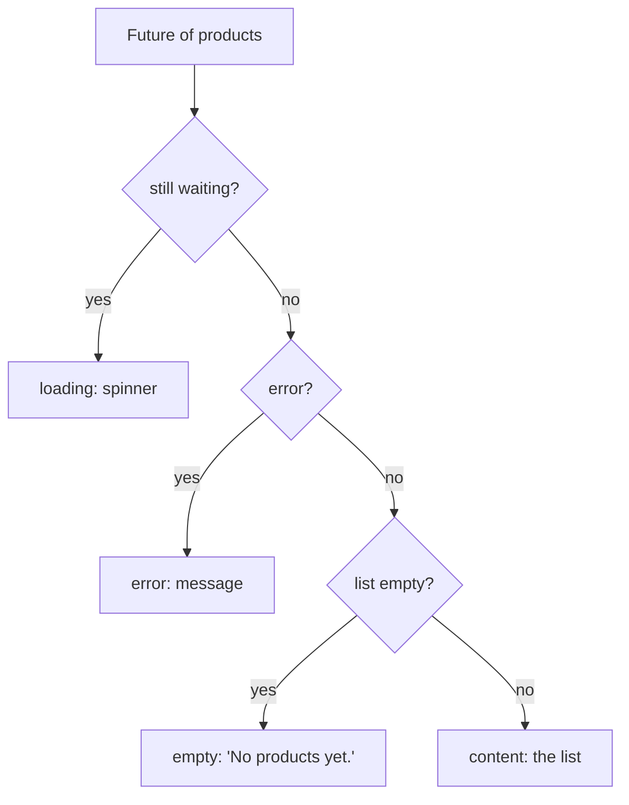

## Before you start

- [[frontend.l1.fetching-with-http-package]] — you know `fetchProducts` returns a `Future<List<Product>>` that either completes with a list or fails with an error.
- [[frontend.l1.setstate-and-rebuilding]] — you know a `State` keeps its fields between builds and builds again when told to.

## The situation

A customer opens the Đơn Hàng app on a slow train connection and sees an empty white area under the title bar. Are the products still on their way, did the request fail, or does the shop simply have no products? All three look the same if the screen shows nothing, yet each means something different to the customer: wait, try again later, or come back another day. The data arrives as a `Future`, which is first unfinished, then either a list or an error. How does a screen show each of those moments differently?

## Core concepts

- **loading/error/empty** — the three states a screen fetching data must handle separately: still loading, failed, or finished with no results.
- `FutureBuilder` — a widget that watches a `Future` and builds again each time it moves on: while waiting, and once it completes.
- snapshot — what `FutureBuilder` passes to its builder each time: whether the `Future` is still waiting, and its data or error once it has one.

## How it works



A screen that fetches data is not in one state but in several over time, and each needs its own UI. Loading means the answer has not arrived: the right thing is to show that something is happening. Error means it will not arrive this time: the right thing is to say so. Empty means it arrived, successfully, with nothing in it: that is a real answer. Content is the normal case.

`FutureBuilder` makes these states easy to tell apart. It is given the `Future` and a builder function. It builds with a snapshot saying "waiting" while the `Future` has not completed, and builds again once it completes; it may also build at other times, for example when its parent builds again, so the builder decides what to show from the snapshot it is given each time. Each time it passes a snapshot: `connectionState` says whether it is still waiting, `hasError` and `error` say whether it failed, and `data` holds the result once there is one. The builder checks these in order and returns a different widget for each state.

The order matters: while the first `Future` is still waiting, or after it has failed, there is no data, so checking for "empty" first would show "No products yet." when the truth is "still loading" or "failed". Keeping the states apart matters too. A screen that shows the same blank area for loading and for empty hides the difference between "wait a moment" and "there is nothing". Loading ends on its own; empty is the final answer. An error is different again: something went wrong somewhere between sending the request and turning the answer into products, and the user should hear about it rather than stare at a blank screen.

## In the Đơn Hàng system

The product screen gets its first `Future` when its `State` is created:

```dart file=DonHang.App/lib/screens/product_list_screen.dart tag=stage-1 lines=17-24
class _ProductListScreenState extends State<ProductListScreen> {
  late Future<List<Product>> _products;

  @override
  void initState() {
    super.initState();
    _products = widget.apiClient.fetchProducts();
  }
```

Starting the load in `initState` and keeping it in a field means a rebuild hands the same `Future` to the `FutureBuilder` instead of starting a new request each time the screen is described; the `Future` is replaced only on purpose, when the user refreshes. The body then checks the states in order:

```dart file=DonHang.App/lib/screens/product_list_screen.dart tag=stage-1 lines=43-55
      body: FutureBuilder<List<Product>>(
        future: _products,
        builder: (context, snapshot) {
          if (snapshot.connectionState == ConnectionState.waiting) {
            return const Center(child: CircularProgressIndicator());
          }
          if (snapshot.hasError) {
            return Center(child: Text('Could not load products: ${snapshot.error}'));
          }
          final products = snapshot.data ?? [];
          if (products.isEmpty) {
            return const Center(child: Text('No products yet.'));
          }
```

Waiting shows a spinner. An error shows a message that includes the error itself, such as the exception `fetchProducts` threw. A finished, error-free result that turns out to be an empty list shows "No products yet.". Only after all three checks does the code build the list of products. The `?? []` is a guard: if the `Future` ever finished with no data at all, the screen would treat it as empty rather than crash.

## Beginners often think…

- **"An empty product list and a still-loading one can show the same blank screen; the user can't tell the difference anyway."** → Actually that is exactly the problem: the user cannot tell, so they cannot decide whether to wait or give up. A spinner says "wait"; "No products yet." says "this is the answer". You notice this when users report a "broken" screen that was really just loading, or keep waiting on one that was really empty.
- **"Error handling only matters for the request itself; once data arrives, nothing else can go wrong."** → Actually the `Future` from `fetchProducts` also fails after the response has arrived, if the status is not `200` or if `Product.fromJson` cannot read a field. Both reach the builder as `hasError`. You notice this when the network looks fine in the developer tools, yet the screen shows "Could not load products".

## Try it (3 minutes)

With the lab running and the app open at `http://localhost:8081`:

1. In the browser's developer tools, open the Network tab, use its setting that slows the connection down on purpose (pick one of the slow options), and reload the page. Watch the body while the products load.
2. From the repository root, run `docker compose stop api`, then reload the page.
3. Run `docker compose start api`, wait a few seconds, and reload the page again.

Expected result: 1 — a spinner shows for longer, then the list. 2 — the spinner, then a message starting "Could not load products: ClientException: Failed to fetch" (the exact wording depends on the browser). 3 — the list again.

In step 2, the app never got a response it could read. Which line of `fetchProducts` threw, and did the check for `200` ever run?

<details><summary>Suggested answer</summary>

The `await http.get(...)` line threw: the browser reported that the request failed, and the `http` package turned that into a `ClientException`. The status check never ran, because there was no response to check. The exception still ended up in the `Future`, so the `FutureBuilder`'s error branch showed it, just as it would show a bad status or a field `fromJson` could not read.

</details>

## Connections

- [[frontend.l1.fetching-with-http-package]] — where the `Future` and its possible errors come from.
- [[frontend.l1.logging-in-from-the-app]] — the same three states on a screen that sends data instead of fetching it.

## Five-line summary

1. A screen that fetches data must show loading, error and empty differently, as well as the content itself.
2. `FutureBuilder` builds again while its `Future` waits and when it completes, passing a snapshot each time.
3. The product screen checks the snapshot in order: waiting, then error, then empty, then the list.
4. The first `Future` is created in `initState` and replaced only on purpose, so rebuilding the screen does not start new requests.
5. Errors include failures after the response arrives, such as a bad status or a field `fromJson` cannot read.
