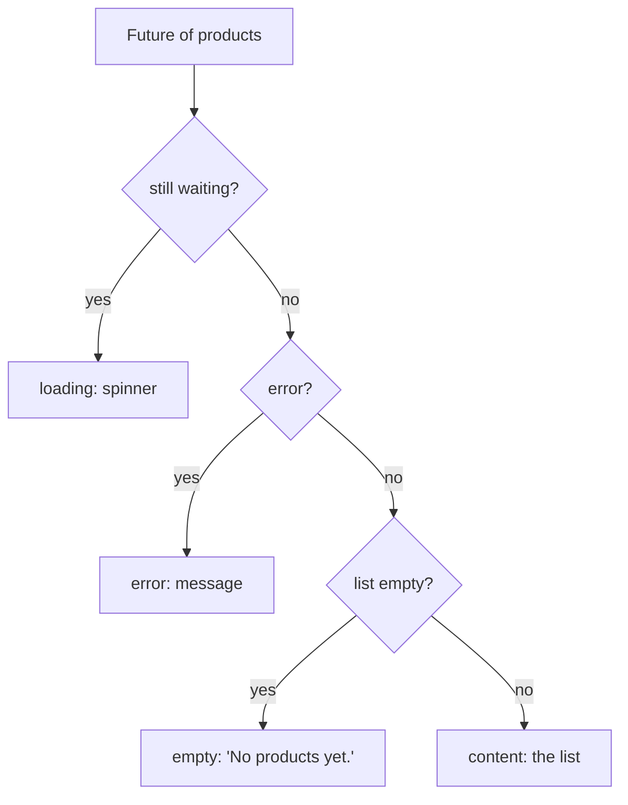

## Bạn cần biết trước

- [[frontend.l1.fetching-with-http-package]] — bạn biết `fetchProducts` trả về một `Future<List<Product>>`, hoặc hoàn tất bằng một danh sách, hoặc thất bại bằng một lỗi.
- [[frontend.l1.setstate-and-rebuilding]] — bạn biết một `State` giữ các field của nó giữa các lần build và build lại khi được bảo.

## Tình huống

Một khách mở app Đơn Hàng trên đường truyền chậm của tàu hỏa và thấy một vùng trắng trống dưới thanh tiêu đề. Sản phẩm vẫn đang trên đường tới, request đã thất bại, hay cửa hàng đơn giản là không có sản phẩm nào? Nếu màn hình không hiện gì, cả ba trông giống hệt nhau, vậy mà mỗi trường hợp lại có ý nghĩa khác với khách: chờ, thử lại sau, hay hôm khác quay lại. Dữ liệu tới dưới dạng một `Future`, lúc đầu chưa xong, rồi thành một danh sách hoặc một lỗi. Làm sao một màn hình hiện mỗi thời điểm đó theo cách riêng?

## Khái niệm cốt lõi

- **loading/error/empty** — ba trạng thái mà một màn hình lấy dữ liệu phải xử lý riêng: đang tải, thất bại, hoặc đã xong mà không có kết quả.
- `FutureBuilder` — một widget theo dõi một `Future` và build lại mỗi khi nó tiến thêm một bước: trong lúc chờ, và khi nó hoàn tất.
- snapshot — thứ `FutureBuilder` truyền cho builder của nó mỗi lần: `Future` còn đang chờ hay không, và dữ liệu hoặc lỗi của nó khi đã có.

## Cơ chế hoạt động



Một màn hình lấy dữ liệu không ở một trạng thái mà ở nhiều trạng thái theo thời gian, và mỗi trạng thái cần UI riêng. Loading nghĩa là câu trả lời chưa tới: điều đúng là cho thấy có việc đang diễn ra. Error nghĩa là lần này nó sẽ không tới: điều đúng là nói ra như vậy. Empty nghĩa là nó đã tới, thành công, và không có gì bên trong: đó là một câu trả lời thật. Nội dung là trường hợp bình thường.

`FutureBuilder` giúp phân biệt các trạng thái này dễ dàng. Nó nhận `Future` và một hàm builder. Nó build với một snapshot báo "đang chờ" khi `Future` chưa hoàn tất, và build lại khi nó hoàn tất; nó cũng có thể build vào lúc khác, chẳng hạn khi widget cha build lại, nên builder quyết định hiện gì dựa trên snapshot được đưa cho mỗi lần. Mỗi lần nó truyền một snapshot: `connectionState` cho biết còn đang chờ không, `hasError` và `error` cho biết có thất bại không, và `data` giữ kết quả khi đã có. Builder kiểm tra những thứ này theo thứ tự và trả về một widget khác cho mỗi trạng thái.

Thứ tự là quan trọng: khi `Future` đầu tiên còn đang chờ, hoặc sau khi nó thất bại, không có dữ liệu nào, nên kiểm tra "rỗng" trước sẽ hiện "No products yet." trong khi sự thật là "đang tải" hoặc "đã thất bại". Tách các trạng thái ra cũng quan trọng. Một màn hình hiện cùng một vùng trống cho loading và cho empty sẽ che mất khác biệt giữa "chờ một chút" và "không có gì cả". Loading tự kết thúc; empty là câu trả lời cuối cùng. Error lại khác nữa: có gì đó hỏng ở đâu đó giữa lúc gửi request và lúc biến câu trả lời thành sản phẩm, và người dùng nên được biết thay vì nhìn chằm chằm vào màn hình trống.

## Trong hệ thống Đơn Hàng

Màn hình sản phẩm nhận `Future` đầu tiên khi `State` của nó được tạo:

```dart file=DonHang.App/lib/screens/product_list_screen.dart tag=stage-1 lines=17-24
class _ProductListScreenState extends State<ProductListScreen> {
  late Future<List<Product>> _products;

  @override
  void initState() {
    super.initState();
    _products = widget.apiClient.fetchProducts();
  }
```

Bắt đầu tải trong `initState` và giữ nó trong một field nghĩa là một lần build lại sẽ đưa cùng `Future` đó cho `FutureBuilder`, thay vì bắt đầu request mới mỗi lần màn hình được mô tả; `Future` chỉ bị thay có chủ đích, khi người dùng làm mới. Phần body sau đó kiểm tra các trạng thái theo thứ tự:

```dart file=DonHang.App/lib/screens/product_list_screen.dart tag=stage-1 lines=43-55
      body: FutureBuilder<List<Product>>(
        future: _products,
        builder: (context, snapshot) {
          if (snapshot.connectionState == ConnectionState.waiting) {
            return const Center(child: CircularProgressIndicator());
          }
          if (snapshot.hasError) {
            return Center(child: Text('Could not load products: ${snapshot.error}'));
          }
          final products = snapshot.data ?? [];
          if (products.isEmpty) {
            return const Center(child: Text('No products yet.'));
          }
```

Đang chờ thì hiện vòng quay. Lỗi thì hiện một thông báo kèm chính lỗi đó, chẳng hạn exception mà `fetchProducts` đã throw. Một kết quả đã xong, không lỗi, mà hóa ra là danh sách rỗng thì hiện "No products yet.". Chỉ sau cả ba phép kiểm tra, code mới dựng danh sách sản phẩm. `?? []` là một lớp chặn: nếu `Future` có lúc nào xong mà không có dữ liệu, màn hình sẽ coi đó là rỗng thay vì crash.

## Người mới hay nghĩ rằng…

- **"Danh sách sản phẩm rỗng và danh sách đang tải có thể hiện cùng một màn hình trống; dù sao người dùng cũng không phân biệt được."** → Thực ra đó chính là vấn đề: người dùng không phân biệt được, nên họ không quyết được nên chờ hay bỏ cuộc. Vòng quay nói "chờ đi"; "No products yet." nói "đây là câu trả lời". Bạn sẽ nhận ra khi người dùng báo một màn hình "hỏng" mà thật ra chỉ đang tải, hoặc cứ chờ mãi một màn hình mà thật ra đã rỗng.
- **"Xử lý lỗi chỉ quan trọng với bản thân request; khi dữ liệu đã tới thì không gì có thể hỏng nữa."** → Thực ra `Future` từ `fetchProducts` còn thất bại sau khi response đã tới, nếu status không phải `200` hoặc nếu `Product.fromJson` không đọc được một field. Cả hai đều tới builder dưới dạng `hasError`. Bạn sẽ nhận ra khi mạng trông vẫn ổn trong công cụ dành cho nhà phát triển, vậy mà màn hình lại hiện "Could not load products".

## Thử ngay (3 phút)

Khi lab đang chạy và app đang mở ở `http://localhost:8081`:

1. Trong công cụ dành cho nhà phát triển của trình duyệt, mở tab Network, dùng thiết lập của nó để cố ý làm chậm kết nối (chọn một tùy chọn chậm), rồi tải lại trang. Quan sát phần body trong lúc sản phẩm đang tải.
2. Từ thư mục gốc của repository, chạy `docker compose stop api`, rồi tải lại trang.
3. Chạy `docker compose start api`, chờ vài giây, rồi tải lại trang lần nữa.

Kết quả mong đợi: 1 — vòng quay hiện lâu hơn, rồi tới danh sách. 2 — vòng quay, rồi một thông báo bắt đầu bằng "Could not load products: ClientException: Failed to fetch" (câu chữ chính xác tùy trình duyệt). 3 — danh sách hiện lại.

Ở bước 2, app không hề nhận được một response mà nó đọc được. Dòng nào của `fetchProducts` đã throw, và phép kiểm tra `200` có chạy không?

<details><summary>Gợi ý đáp án</summary>

Dòng `await http.get(...)` đã throw: trình duyệt báo request thất bại, và package `http` biến điều đó thành một `ClientException`. Phép kiểm tra status không hề chạy, vì không có response nào để kiểm tra. Exception đó vẫn được cất vào `Future`, nên nhánh lỗi của `FutureBuilder` hiện nó ra, đúng như cách nó sẽ hiện một status sai hoặc một field mà `fromJson` không đọc được.

</details>

## Liên hệ

- [[frontend.l1.fetching-with-http-package]] — nơi `Future` và các lỗi có thể có của nó bắt nguồn.
- [[frontend.l1.logging-in-from-the-app]] — cùng ba trạng thái đó trên một màn hình gửi dữ liệu thay vì lấy dữ liệu.

## Tóm tắt 5 dòng

1. Một màn hình lấy dữ liệu phải hiện loading, error và empty khác nhau, bên cạnh chính nội dung.
2. `FutureBuilder` build lại khi `Future` của nó đang chờ và khi nó hoàn tất, mỗi lần truyền một snapshot.
3. Màn hình sản phẩm kiểm tra snapshot theo thứ tự: đang chờ, rồi lỗi, rồi rỗng, rồi danh sách.
4. `Future` đầu tiên được tạo trong `initState` và chỉ bị thay có chủ đích, nên build lại màn hình không bắt đầu request mới.
5. Lỗi bao gồm cả thất bại sau khi response đã tới, như status sai hoặc một field mà `fromJson` không đọc được.
