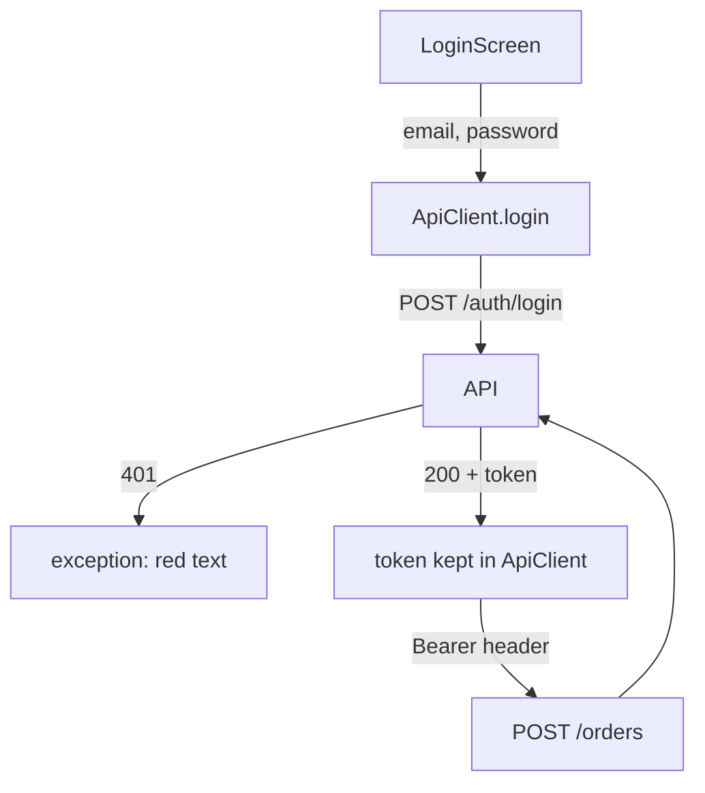

## Before you start

- [[frontend.l1.futurebuilder-loading-error-empty]] — you know a screen that talks to the API must show loading and error differently from its normal content.
- [[backend.l1.issuing-a-jwt]] — you know the API signs a JWT for a customer who logs in, and that anyone holding it can read its claims.

## The situation

The product list in the Đơn Hàng app works for anyone, but placing an order does not: `POST /api/v1/orders` answers `401` unless the request carries a valid JWT. You have seen the API issue that token when `POST /api/v1/auth/login` receives a correct email and password, and check it again on later requests. Now a customer has to do the same by typing into a screen, without ever seeing the token. Where does the app keep the token after login, and how does it end up on the order request? And what should the customer see when the password is wrong?

## Core concepts

- `ApiClient.login` — the method that sends the email and password to `POST /api/v1/auth/login` and, on `200`, keeps the returned token inside the `ApiClient`.
- `Authorization: Bearer <token>` — the header that carries the token on a later request; the API's authentication middleware reads it to learn who is asking.
- in-memory token — a token kept only in a field of a running object, so it is gone when the app starts again.

## How it works



The API keeps no record of who has logged in. Each request is checked on its own, so a request that needs a signed-in customer must prove it by itself. Logging in is how the app gets that proof: it sends the email and password once, in the body of a `POST`, and if they match, the API answers `200` with a JWT in a JSON body. The app does not send the password again after that. It keeps the token and adds it to every later request that needs a customer, as an `Authorization: Bearer <token>` header. On the API side, the authentication middleware checks the token's signature and expiry and records who the caller is; an `[Authorize]` endpoint with no caller answers `401`.

A wrong email or password gets `401` from the login endpoint too, with no token. The app must treat that as a failure and say so on the login screen, not carry on as if they were signed in; otherwise the order request would fail later with its own `401`, and the user would not know why.

Where the token is kept matters as much as sending it. It works like a key: anyone who holds it can act as that customer until it expires, with no password needed. In this stage the app keeps it only in memory, in a field of the one `ApiClient` object, and nothing writes it anywhere else. The cost is that the user signs in again whenever the app starts again.

## In the Đơn Hàng system

`ApiClient.login`, in `DonHang.App/lib/api_client.dart`:

```dart file=DonHang.App/lib/api_client.dart tag=stage-1 lines=33-45
  Future<String> login(String email, String password) async {
    final response = await http.post(
      Uri.parse('$baseUrl/auth/login'),
      headers: {'Content-Type': 'application/json'},
      body: jsonEncode({'email': email, 'password': password}),
    );
    if (response.statusCode != 200) {
      throw Exception('login failed (${response.statusCode})');
    }
    final token = (jsonDecode(response.body) as Map<String, dynamic>)['token'] as String;
    _token = token;
    return token;
  }
```

It posts the two fields as JSON, with a `Content-Type` header saying so. Any status other than `200` becomes an exception whose text includes the status, so a wrong password ends here with `login failed (401)`. On `200`, it decodes the body, reads its `token` field, and stores it in `_token` before returning it. The rest of the app never handles the token: `ApiClient` has a `_headers` getter that adds `'Authorization': 'Bearer $_token'` whenever `_token` is set, and the order request in the next lesson sends those headers. The product list request does not, because listing products needs no sign-in.

`LoginScreen` calls it when the user taps "Sign in":

```dart file=DonHang.App/lib/screens/login_screen.dart tag=stage-1 lines=23-39
  Future<void> _submit() async {
    setState(() {
      _loading = true;
      _error = null;
    });
    try {
      await widget.apiClient.login(_emailController.text, _passwordController.text);
      if (!mounted) return;
      Navigator.of(context).pushReplacement(
        MaterialPageRoute(builder: (_) => CreateOrderScreen(apiClient: widget.apiClient)),
      );
    } catch (e) {
      setState(() => _error = e.toString());
    } finally {
      if (mounted) setState(() => _loading = false);
    }
  }
```

`_emailController` and `_passwordController` hold the text of the two input fields, which start filled in with the lab's demo customer, `anh.tran@example.com`. `_submit` first sets `_loading` and clears any earlier error; while `_loading` is true, the "Sign in" button is disabled and shows a spinner. If `login` completes, `Navigator.of(context).pushReplacement(...)` swaps this screen for `CreateOrderScreen`. It passes along `widget.apiClient`, the same `ApiClient` whose `_token` was just set, which is how the token reaches the order request.

The `mounted` check before that makes sure the screen is still in the widget tree after the wait (the user may have left it with Back), because the `context` of a screen that is gone can no longer be used. If `login` throws, the `catch` stores the exception's text in `_error`, and `build` shows it in red above the button: for a wrong password, "Exception: login failed (401)". Either way, `finally` turns `_loading` off again. These are the loading and error states from the last lesson, on a screen that sends data instead of fetching it.

## Beginners often think…

- **"Once logged in, the app doesn't need to send anything special on later requests; the server remembers who's asking."** → Actually the API saves nothing when it issues a token; it checks each request on its own, from that request's `Authorization` header. A request without the header comes from nobody, no matter when the app logged in. You notice this when login succeeds but the next request that needs a customer fails with `401`, because the token was never attached.
- **"Storing the token anywhere in the app is equally safe, since it's just a string."** → Actually that string is a key to the customer's account until it expires: whoever reads it can place orders as them. Every place it is written is one more place it can leak from, such as a log line, a saved file, or a screenshot. You notice this when a token turns up in a log or a bug report, and anyone who copies it can call the API as that customer.

## Try it (3 minutes)

Start the lab (`scripts/up.sh` from the repository root) and open the app at `http://localhost:8081`. Open the browser's developer tools (F12 in most browsers) on the Network tab, which lists every request the page sends and lets you open each response:

1. Tap the sign-in icon at the top right of the product screen. The "Sign in" screen opens with the email and password already filled in. Replace the password with anything else and tap "Sign in".
2. Type `donhang-dev-password` as the password and tap "Sign in" again. In the Network tab, select the last `login` request, the `POST` with status `200`, and open its response.

Expected result: 1 — red text "Exception: login failed (401)" above the button, and the screen stays where it is. 2 — the order screen opens, and the `login` response is a JSON object with a single `token` field.

After step 2, you reload the page. Is the customer still signed in, and why?

<details><summary>Suggested answer</summary>

No. The token lived only in `_token`, a field of the `ApiClient` the app created when it started. A reload starts the app again with a new `ApiClient` whose `_token` is empty, so the next request that needs a customer would go out without an `Authorization` header and get `401`. The customer has to sign in again.

</details>

## Connections

- [[frontend.l1.futurebuilder-loading-error-empty]] — the loading and error states this screen reuses.
- [[backend.l1.validating-a-jwt]] — what the API does with the `Authorization` header this client sends.
- [[frontend.l1.creating-an-order]] — the first request that sends the token.

## Five-line summary

1. `ApiClient.login` `POST`s the email and password to `/api/v1/auth/login` and, on `200`, keeps the returned token in `_token`.
2. Later requests that need a customer carry it as an `Authorization: Bearer <token>` header; the API saves nothing at login.
3. Any other status becomes an exception, and `LoginScreen` shows its text in red instead of moving on.
4. The token acts like a key to the account until it expires, so every place it is stored is a place it can leak.
5. In this stage it lives only in memory, so starting the app again means signing in again.
