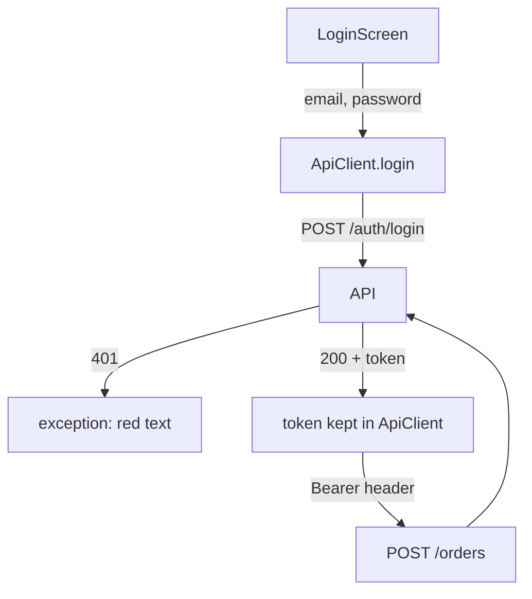

## Bạn cần biết trước

- [[frontend.l1.futurebuilder-loading-error-empty]] — bạn biết một màn hình nói chuyện với API phải hiện loading và error khác với nội dung bình thường của nó.
- [[backend.l1.issuing-a-jwt]] — bạn biết API ký một JWT cho khách hàng đăng nhập, và ai cầm nó cũng đọc được các claim của nó.

## Tình huống

Danh sách sản phẩm trong app Đơn Hàng dùng được với bất kỳ ai, nhưng đặt đơn thì không: `POST /api/v1/orders` trả `401` trừ khi request mang theo một JWT hợp lệ. Bạn đã thấy API cấp token đó khi `POST /api/v1/auth/login` nhận đúng email và mật khẩu, rồi kiểm tra lại nó ở các request sau. Giờ một khách hàng phải làm đúng điều đó bằng cách gõ vào một màn hình, mà không bao giờ nhìn thấy token. Sau khi đăng nhập, app giữ token ở đâu, và bằng cách nào nó tới được request tạo đơn? Và khách nên thấy gì khi gõ sai mật khẩu?

## Khái niệm cốt lõi

- `ApiClient.login` — method gửi email và mật khẩu tới `POST /api/v1/auth/login` và, khi nhận `200`, giữ token trả về bên trong `ApiClient`.
- `Authorization: Bearer <token>` — header mang token trên một request sau đó; middleware authentication của API đọc nó để biết ai đang hỏi.
- token trong bộ nhớ — token chỉ được giữ trong một field của một object đang chạy, nên sẽ mất khi app khởi động lại.

## Cơ chế hoạt động



API không ghi lại ai đã đăng nhập. Mỗi request được kiểm tra riêng, nên một request cần khách hàng đã đăng nhập phải tự chứng minh điều đó. Đăng nhập là cách app lấy được bằng chứng ấy: nó gửi email và mật khẩu một lần, trong body của một `POST`, và nếu khớp, API trả `200` kèm một JWT trong body JSON. Sau đó app không gửi lại mật khẩu nữa. Nó giữ token và gắn vào mọi request sau cần khách hàng, dưới dạng header `Authorization: Bearer <token>`. Phía API, middleware authentication kiểm tra chữ ký và hạn dùng của token rồi ghi nhận người gọi là ai; một endpoint `[Authorize]` không có người gọi sẽ trả `401`.

Email hoặc mật khẩu sai cũng nhận `401` từ endpoint đăng nhập, và không có token. App phải coi đó là thất bại và nói ra trên màn hình đăng nhập, chứ không tiếp tục như thể người dùng đã đăng nhập; nếu không, request tạo đơn sẽ thất bại sau đó với `401` của riêng nó, và người dùng không biết vì sao.

Giữ token ở đâu cũng quan trọng như việc gửi nó. Nó hoạt động như một chìa khóa: ai cầm nó cũng có thể hành động như khách hàng đó cho tới khi nó hết hạn, không cần mật khẩu. Ở giai đoạn này app chỉ giữ nó trong bộ nhớ, trong một field của đúng một object `ApiClient`, và không có gì ghi nó ra chỗ khác. Cái giá là người dùng phải đăng nhập lại mỗi khi app khởi động lại.

## Trong hệ thống Đơn Hàng

`ApiClient.login`, trong `DonHang.App/lib/api_client.dart`:

```dart file=DonHang.App/lib/api_client.dart tag=stage-1 lines=33-45
  Future<String> login(String email, String password) async {
    final response = await http.post(
      Uri.parse('$baseUrl/auth/login'),
      headers: {'Content-Type': 'application/json'},
      body: jsonEncode({'email': email, 'password': password}),
    );
    if (response.statusCode != 200) {
      throw Exception('login failed (${response.statusCode})');
    }
    final token = (jsonDecode(response.body) as Map<String, dynamic>)['token'] as String;
    _token = token;
    return token;
  }
```

Nó gửi hai field dưới dạng JSON, kèm header `Content-Type` nói rõ điều đó. Mọi status khác `200` đều thành một exception có chứa status, nên mật khẩu sai sẽ dừng ở đây với `login failed (401)`. Khi nhận `200`, nó giải mã body, đọc field `token`, và lưu vào `_token` trước khi trả về. Phần còn lại của app không bao giờ đụng tới token: `ApiClient` có getter `_headers` thêm `'Authorization': 'Bearer $_token'` mỗi khi `_token` đã được gán, và request tạo đơn ở bài sau gửi kèm các header đó. Request lấy danh sách sản phẩm thì không, vì xem sản phẩm không cần đăng nhập.

`LoginScreen` gọi nó khi người dùng bấm "Sign in":

```dart file=DonHang.App/lib/screens/login_screen.dart tag=stage-1 lines=23-39
  Future<void> _submit() async {
    setState(() {
      _loading = true;
      _error = null;
    });
    try {
      await widget.apiClient.login(_emailController.text, _passwordController.text);
      if (!mounted) return;
      Navigator.of(context).pushReplacement(
        MaterialPageRoute(builder: (_) => CreateOrderScreen(apiClient: widget.apiClient)),
      );
    } catch (e) {
      setState(() => _error = e.toString());
    } finally {
      if (mounted) setState(() => _loading = false);
    }
  }
```

`_emailController` và `_passwordController` giữ chữ trong hai ô nhập, vốn được điền sẵn khách hàng demo của lab, `anh.tran@example.com`. `_submit` trước tiên bật `_loading` và xóa lỗi cũ nếu có; khi `_loading` là true, nút "Sign in" bị vô hiệu và hiện vòng quay. Nếu `login` hoàn tất, `Navigator.of(context).pushReplacement(...)` thay màn hình này bằng `CreateOrderScreen`. Nó truyền theo `widget.apiClient`, đúng `ApiClient` vừa được gán `_token`, và đó là cách token tới được request tạo đơn.

Phép kiểm tra `mounted` trước đó đảm bảo màn hình vẫn còn trong widget tree sau khi chờ (người dùng có thể đã rời nó bằng nút Back), vì `context` của một màn hình đã mất thì không dùng được nữa. Nếu `login` throw, `catch` lưu nội dung của exception vào `_error`, và `build` hiện nó màu đỏ phía trên nút: với mật khẩu sai là "Exception: login failed (401)". Dù thế nào, `finally` cũng tắt `_loading`. Đây là các trạng thái loading và error của bài trước, trên một màn hình gửi dữ liệu thay vì lấy dữ liệu.

## Người mới hay nghĩ rằng…

- **"Đăng nhập xong thì app không cần gửi gì đặc biệt trên các request sau; server nhớ ai đang hỏi."** → Thực ra API không lưu gì khi cấp token; nó kiểm tra từng request riêng, dựa trên header `Authorization` của chính request đó. Một request không có header là request của không ai cả, bất kể app đã đăng nhập lúc nào. Bạn sẽ nhận ra khi đăng nhập thành công nhưng request tiếp theo cần khách hàng lại thất bại với `401`, vì token chưa bao giờ được gắn vào.
- **"Lưu token ở đâu trong app cũng an toàn như nhau, vì nó chỉ là một chuỗi."** → Thực ra chuỗi đó là chìa khóa vào tài khoản của khách cho tới khi hết hạn: ai đọc được nó đều có thể đặt đơn dưới tên họ. Mỗi nơi nó được ghi ra là thêm một nơi nó có thể bị lộ, như một dòng log, một file đã lưu, hay một ảnh chụp màn hình. Bạn sẽ nhận ra khi một token xuất hiện trong log hay trong một bug report, và bất kỳ ai chép nó đều gọi được API dưới danh nghĩa khách hàng đó.

## Thử ngay (3 phút)

Khởi động lab (`scripts/up.sh` từ thư mục gốc của repository) và mở app ở `http://localhost:8081`. Mở công cụ dành cho nhà phát triển của trình duyệt (F12 trên hầu hết trình duyệt) ở tab Network, nơi liệt kê mọi request trang gửi đi và cho bạn mở từng response:

1. Bấm biểu tượng đăng nhập ở góc trên bên phải màn hình sản phẩm. Màn hình "Sign in" mở ra với email và mật khẩu đã điền sẵn. Thay mật khẩu bằng bất cứ gì khác và bấm "Sign in".
2. Gõ `donhang-dev-password` làm mật khẩu và bấm "Sign in" lần nữa. Trong tab Network, chọn request `login` cuối cùng, cái `POST` có status `200`, và mở response của nó.

Kết quả mong đợi: 1 — dòng chữ đỏ "Exception: login failed (401)" phía trên nút, và màn hình đứng yên. 2 — màn hình tạo đơn mở ra, và response của `login` là một object JSON chỉ có một field `token`.

Sau bước 2, bạn tải lại trang. Khách hàng còn đăng nhập không, và vì sao?

<details><summary>Gợi ý đáp án</summary>

Không. Token chỉ sống trong `_token`, một field của `ApiClient` mà app tạo ra khi khởi động. Tải lại trang là khởi động app lại với một `ApiClient` mới có `_token` rỗng, nên request tiếp theo cần khách hàng sẽ đi ra mà không có header `Authorization` và nhận `401`. Khách hàng phải đăng nhập lại.

</details>

## Liên hệ

- [[frontend.l1.futurebuilder-loading-error-empty]] — các trạng thái loading và error mà màn hình này dùng lại.
- [[backend.l1.validating-a-jwt]] — API làm gì với header `Authorization` mà client này gửi.
- [[frontend.l1.creating-an-order]] — request đầu tiên gửi kèm token.

## Tóm tắt 5 dòng

1. `ApiClient.login` `POST` email và mật khẩu tới `/api/v1/auth/login` và, khi nhận `200`, giữ token trả về trong `_token`.
2. Các request sau cần khách hàng mang nó trong header `Authorization: Bearer <token>`; API không lưu gì lúc đăng nhập.
3. Mọi status khác thành một exception, và `LoginScreen` hiện nội dung của nó màu đỏ thay vì chuyển tiếp.
4. Token như chìa khóa vào tài khoản cho tới khi hết hạn, nên mỗi nơi lưu nó là một nơi nó có thể bị lộ.
5. Ở giai đoạn này nó chỉ sống trong bộ nhớ, nên khởi động app lại nghĩa là đăng nhập lại.
