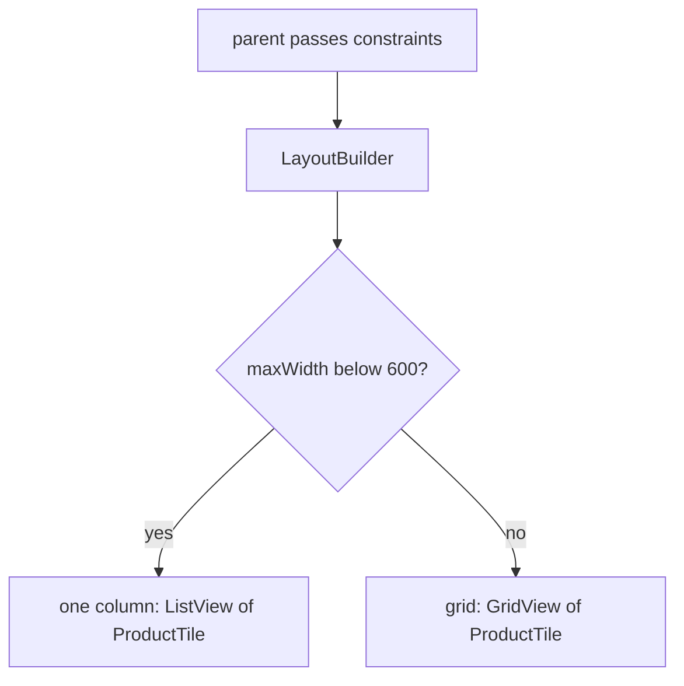

## Before you start

- [[frontend.l1.creating-an-order]] — you know how the app sends a new order and shows its result, and you have used the product screen that lists what can be ordered.

## The situation

The product screen shows one product per row, which looks right on a phone. Someone opens the web version of the app on a wide office monitor, and the same list now stretches each row across almost two thousand pixels: a name at the far left, a price at the far right, and a lot of empty space between. A teammate suggests checking whether the app window is wider than 1920 pixels and switching to a grid if it is. Another asks what happens when the same list sits in a narrow panel beside the order form on that monitor. Which width should the layout actually look at?

## Core concepts

- **responsive** — a layout that adapts to the space it is actually given, instead of assuming one fixed screen size.
- constraints — the smallest and largest width and height a parent allows its child during layout.
- `LayoutBuilder` — a widget that calls a builder function with the constraints its parent gives it, so the builder can return a different subtree for different space.
- arrangement — how the same pieces are placed: one column, or several.

## How it works



A **responsive** layout adapts to the space it is given. In Flutter, that space arrives as constraints: during layout, each parent tells its child the smallest and largest width and height it may take. Most widgets use those constraints without you seeing them. `LayoutBuilder` hands them to you, by calling a builder function with them, so the widget you return can depend on how much room there really is.

That is the whole trick in the diagram. The builder reads `constraints.maxWidth`, compares it with a width the team chose, 600 in the diagram, and returns one subtree or another: a `ListView` or a `GridView`. Both use the same piece, `ProductTile`. Only the arrangement changes: a single column when space is tight, several columns when there is room.

The number being compared matters less than what it is compared with. Deciding from the size of the whole app window gives the wrong answer when this widget gets only part of that window, such as a panel beside another panel. Its constraints describe the space this widget actually has, wherever it is placed.

## In the Đơn Hàng system

`ProductCatalog` in `DonHang.App/lib/widgets/product_catalog.dart` at stage-1 is the responsive version of the product list:

```dart file=DonHang.App/lib/widgets/product_catalog.dart tag=stage-1 lines=17-37
  Widget build(BuildContext context) {
    return LayoutBuilder(
      builder: (context, constraints) {
        if (constraints.maxWidth < wideLayoutMinWidth) {
          return ListView.builder(
            itemCount: products.length,
            itemBuilder: (context, index) => ProductTile(product: products[index]),
          );
        }
        final columns = (constraints.maxWidth / columnWidth).floor();
        return GridView.builder(
          gridDelegate: SliverGridDelegateWithFixedCrossAxisCount(
            crossAxisCount: columns,
            mainAxisExtent: 72,
          ),
          itemCount: products.length,
          itemBuilder: (context, index) => ProductTile(product: products[index]),
        );
      },
    );
  }
```

`ProductTile` is the widget that shows one product, its name and price. When `maxWidth` is below `wideLayoutMinWidth`, 600, the catalog returns a `ListView` with one `ProductTile` per row. Otherwise it divides `maxWidth` by `columnWidth`, 300, rounds down, and returns a `GridView` of the same tiles. `crossAxisCount` is that column count; `mainAxisExtent: 72` sets each tile's height. At stage-1 no screen uses `ProductCatalog` yet; the product screen still builds its own `ListView`, and replacing it with `ProductCatalog` is what would fix the stretched rows from the situation.

A test in `DonHang.App/test/product_catalog_test.dart` builds the catalog without a device: `pumpWidget` builds it, and `expect` with `find.byType` checks which widgets ended up in the tree. It gives the catalog two widths:

```dart file=DonHang.App/test/product_catalog_test.dart tag=stage-1 lines=16-36
  Widget catalogWithWidth(double width) => MaterialApp(
        home: Scaffold(
          body: Center(
            child: SizedBox(width: width, height: 400, child: ProductCatalog(products: products)),
          ),
        ),
      );

  testWidgets('a narrow width shows a single-column list', (tester) async {
    await tester.pumpWidget(catalogWithWidth(360));

    expect(find.byType(ListView), findsOneWidget);
    expect(find.byType(GridView), findsNothing);
  });

  testWidgets('a wide width shows a grid of the same tiles', (tester) async {
    await tester.pumpWidget(catalogWithWidth(900));

    expect(find.byType(GridView), findsOneWidget);
    expect(find.byType(ProductTile), findsNWidgets(2));
  });
```

`MaterialApp`, `Scaffold` and `Center` are the usual page wrappers. `catalogWithWidth` places the catalog inside a `SizedBox` of the given width, but a box cannot be wider than the space its own parent allows. The test screen is 800 pixels wide by default, so at 360 the catalog gets 360 and the test finds a list and no grid. At 900 it gets 800, still wide enough for a grid holding the same two tiles.

## Beginners often think…

- **"Responsive design is only relevant for a web browser, not a Flutter app running on a phone or tablet."** → Actually any widget can be given less or more room than you expected: a tablet has a wider screen than a phone, and a panel gets only part of the screen. You notice this when a layout written for one phone width looks cramped or stretched on a tablet, although no browser is involved.
- **"Using a fixed pixel width for every widget makes a layout more predictable, and predictable is what responsive means."** → Actually a fixed width is predictable only on the screen it was chosen for; responsive means the layout follows the space it is given. You notice this when a layout drawn for exactly 400 pixels gets squeezed or cut off on a 360-pixel phone and leaves most of a monitor empty.

## Try it (3 minutes)

Using the `ProductCatalog` code above, predict what it builds when `LayoutBuilder` reports each of these `maxWidth` values:

1. 360
2. 599
3. 600
4. 900
5. 1250

Expected result: 1 — a `ListView`, one tile per row. 2 — still a `ListView`, because 599 is below 600. 3 — a `GridView` with 2 columns: 600 divided by 300 is 2. 4 — a `GridView` with 3 columns. 5 — a `GridView` with 4 columns: 1250 divided by 300 is about 4.17, rounded down to 4.

On the same monitor, the app window is wide, but `ProductCatalog` sits in a 500-pixel panel beside an order form. What does it build, and why would a check on the window's width get this wrong?

<details><summary>Suggested answer</summary>

It builds the one-column `ListView`, because the constraints it receives are 500 pixels wide, below 600. A check on the window's width would see a wide window and choose the grid, squeezing several columns into a panel that has room for one. `LayoutBuilder` looks at the space the widget actually has, not the device it happens to run on.

</details>

## Connections

- [[frontend.l1.accessibility-basics]] — the `ProductTile` used in both arrangements, and making it usable by everyone.
- [[frontend.l1.build-layout-paint]] — where constraints come from during layout.

## Five-line summary

1. A **responsive** layout adapts to the space it is actually given, not to one assumed screen size.
2. `LayoutBuilder` passes a widget's constraints to a builder, which can return different subtrees for different widths.
3. `ProductCatalog` returns a one-column `ListView` below 600 pixels, and from 600 up a `GridView` with as many columns as 300 pixels fits into the width.
4. Both arrangements use the same `ProductTile`; responsiveness changes the arrangement, not the pieces.
5. Checking the whole window's width breaks when the widget gets only part of it; checking its constraints keeps working.
