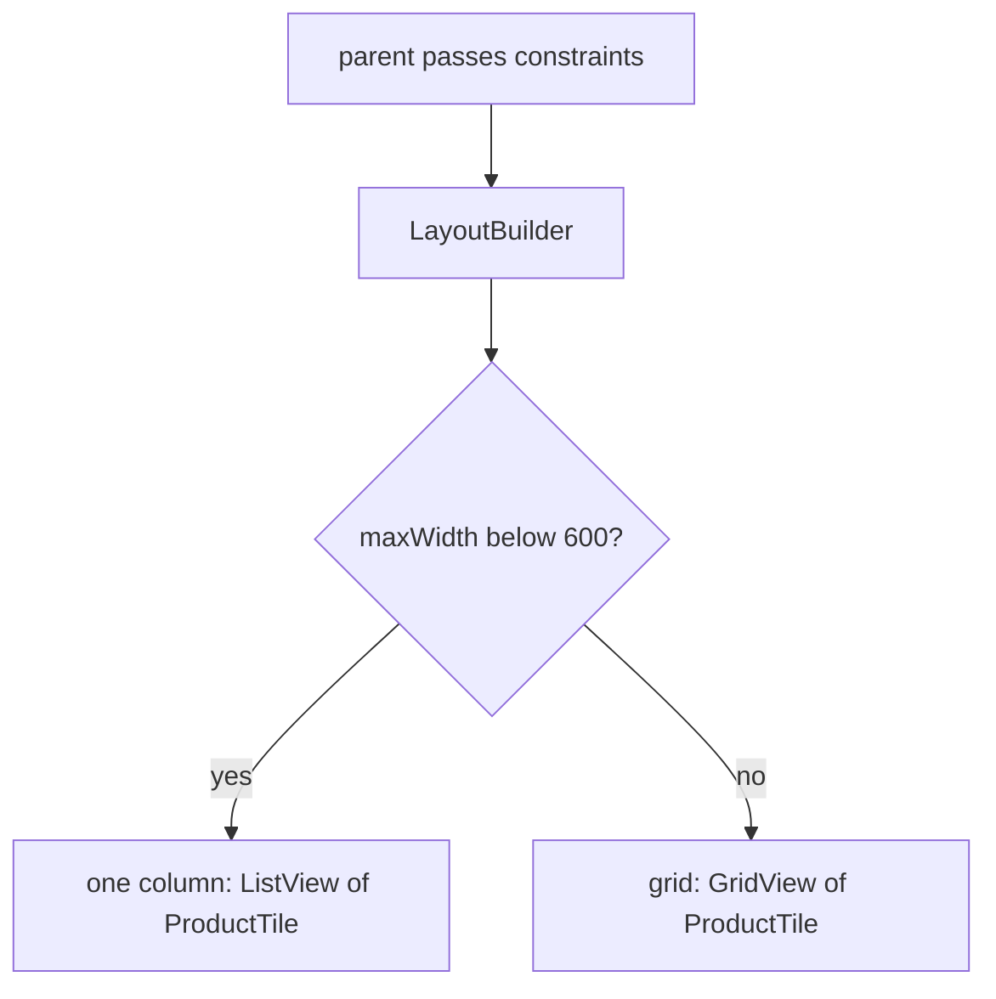

## Bạn cần biết trước

- [[frontend.l1.creating-an-order]] — bạn biết app gửi một đơn mới và hiện kết quả của nó thế nào, và bạn đã dùng màn hình sản phẩm liệt kê những thứ có thể đặt.

## Tình huống

Màn hình sản phẩm hiện mỗi sản phẩm trên một dòng, và trên điện thoại thì trông ổn. Có người mở bản web của app trên một màn hình rộng ở văn phòng, và cùng danh sách đó giờ kéo mỗi dòng dài gần hai nghìn pixel: tên ở tận bên trái, giá ở tận bên phải, và rất nhiều khoảng trống ở giữa. Một đồng đội đề xuất kiểm tra xem cửa sổ app có rộng hơn 1920 pixel không, nếu có thì chuyển sang dạng lưới. Một người khác hỏi chuyện gì xảy ra khi cũng danh sách đó nằm trong một panel hẹp cạnh form đặt đơn trên chính màn hình ấy. Layout thật ra nên nhìn vào độ rộng nào?

## Khái niệm cốt lõi

- **responsive** (layout thích ứng theo không gian thật sự có, thay vì giả định một kích thước màn hình cố định) — layout không giả định trước một màn hình nào, mà dựng theo lượng chỗ nó thật sự nhận được.
- constraints — độ rộng và chiều cao nhỏ nhất, lớn nhất mà widget cha cho phép widget con chiếm trong bước layout.
- `LayoutBuilder` — widget gọi một hàm builder với các constraints mà widget cha truyền cho nó, để builder trả về một cây con khác tùy theo không gian.
- cách sắp xếp — cùng những mảnh ghép được đặt ra sao: một cột, hay nhiều cột.

## Cơ chế hoạt động



Một layout **responsive** thay đổi theo không gian nó được cấp. Trong Flutter, không gian đó đến dưới dạng constraints: trong bước layout, mỗi widget cha cho widget con biết độ rộng và chiều cao nhỏ nhất, lớn nhất mà con được chiếm. Phần lớn widget dùng các constraints này mà bạn không hề thấy. `LayoutBuilder` đưa chúng cho bạn bằng cách gọi một hàm builder với chúng, nên widget bạn trả về có thể phụ thuộc vào lượng chỗ thật sự có.

Toàn bộ mẹo nằm ở sơ đồ trên. Builder đọc `constraints.maxWidth`, so với một độ rộng do nhóm chọn, trong sơ đồ là 600, rồi trả về cây con này hoặc cây con kia: một `ListView` hoặc một `GridView`. Cả hai dùng cùng một mảnh ghép, `ProductTile`. Chỉ cách sắp xếp thay đổi: một cột khi chật chỗ, nhiều cột khi rộng rãi.

Con số đem ra so không quan trọng bằng thứ nó được so với. Quyết định theo kích thước của cả cửa sổ app sẽ cho kết quả sai khi widget này chỉ được một phần cửa sổ, chẳng hạn một panel nằm cạnh panel khác. Constraints của nó mô tả không gian widget này thật sự có, dù nó được đặt ở đâu.

## Trong hệ thống Đơn Hàng

`ProductCatalog` trong `DonHang.App/lib/widgets/product_catalog.dart` ở stage-1 là phiên bản responsive của danh sách sản phẩm:

```dart file=DonHang.App/lib/widgets/product_catalog.dart tag=stage-1 lines=17-37
  Widget build(BuildContext context) {
    return LayoutBuilder(
      builder: (context, constraints) {
        if (constraints.maxWidth < wideLayoutMinWidth) {
          return ListView.builder(
            itemCount: products.length,
            itemBuilder: (context, index) => ProductTile(product: products[index]),
          );
        }
        final columns = (constraints.maxWidth / columnWidth).floor();
        return GridView.builder(
          gridDelegate: SliverGridDelegateWithFixedCrossAxisCount(
            crossAxisCount: columns,
            mainAxisExtent: 72,
          ),
          itemCount: products.length,
          itemBuilder: (context, index) => ProductTile(product: products[index]),
        );
      },
    );
  }
```

`ProductTile` là widget hiện một sản phẩm, gồm tên và giá. Khi `maxWidth` nhỏ hơn `wideLayoutMinWidth`, tức 600, catalog trả về một `ListView` với mỗi `ProductTile` trên một dòng. Ngược lại, nó chia `maxWidth` cho `columnWidth`, tức 300, làm tròn xuống, rồi trả về một `GridView` gồm cũng những tile đó. `crossAxisCount` là số cột vừa tính, còn `mainAxisExtent: 72` đặt chiều cao của mỗi tile. Ở stage-1 chưa màn hình nào dùng `ProductCatalog`. Màn hình sản phẩm vẫn tự dựng `ListView` của riêng nó, và thay nó bằng `ProductCatalog` chính là cách sửa những dòng bị kéo dài trong tình huống.

Một test trong `DonHang.App/test/product_catalog_test.dart` dựng catalog mà không cần thiết bị: `pumpWidget` dựng nó, và `expect` cùng `find.byType` kiểm tra những widget nào có mặt trong cây. Test cho catalog hai độ rộng:

```dart file=DonHang.App/test/product_catalog_test.dart tag=stage-1 lines=16-36
  Widget catalogWithWidth(double width) => MaterialApp(
        home: Scaffold(
          body: Center(
            child: SizedBox(width: width, height: 400, child: ProductCatalog(products: products)),
          ),
        ),
      );

  testWidgets('a narrow width shows a single-column list', (tester) async {
    await tester.pumpWidget(catalogWithWidth(360));

    expect(find.byType(ListView), findsOneWidget);
    expect(find.byType(GridView), findsNothing);
  });

  testWidgets('a wide width shows a grid of the same tiles', (tester) async {
    await tester.pumpWidget(catalogWithWidth(900));

    expect(find.byType(GridView), findsOneWidget);
    expect(find.byType(ProductTile), findsNWidgets(2));
  });
```

`MaterialApp`, `Scaffold` và `Center` là các lớp bọc trang quen thuộc. `catalogWithWidth` đặt catalog trong một `SizedBox` có độ rộng cho trước, nhưng một hộp không thể rộng hơn không gian mà chính widget cha của nó cho phép. Màn hình test mặc định rộng 800 pixel, nên với 360 thì catalog nhận 360, và test tìm thấy một list, không có lưới. Với 900 thì nó nhận 800, vẫn đủ rộng cho một lưới chứa cùng hai tile.

## Người mới hay nghĩ rằng…

- **"Thiết kế responsive chỉ liên quan tới trình duyệt web, không liên quan tới app Flutter chạy trên điện thoại hay máy tính bảng."** → Thực ra widget nào cũng có thể được cấp ít hoặc nhiều chỗ hơn bạn nghĩ: máy tính bảng có màn hình rộng hơn điện thoại, và một panel chỉ được một phần màn hình. Bạn sẽ nhận ra khi một layout viết cho độ rộng của một chiếc điện thoại trông chật chội hoặc bị kéo giãn trên máy tính bảng, dù chẳng có trình duyệt nào ở đây.
- **"Dùng độ rộng pixel cố định cho mọi widget giúp layout dễ đoán hơn, và dễ đoán chính là ý nghĩa của responsive."** → Thực ra độ rộng cố định chỉ dễ đoán trên đúng màn hình nó được chọn cho, vì responsive nghĩa là layout đi theo không gian nó được cấp. Bạn sẽ nhận ra khi một layout vẽ cho đúng 400 pixel bị ép hoặc bị cắt trên điện thoại rộng 360 pixel, và để trống gần hết một màn hình máy tính.

## Thử ngay (3 phút)

Dựa vào đoạn code `ProductCatalog` ở trên, đoán xem nó dựng ra gì khi `LayoutBuilder` báo từng giá trị `maxWidth` sau:

1. 360
2. 599
3. 600
4. 900
5. 1250

Kết quả mong đợi: 1 — một `ListView`, mỗi tile một dòng. 2 — vẫn là `ListView`, vì 599 nhỏ hơn 600. 3 — một `GridView` 2 cột: 600 chia 300 bằng 2. 4 — một `GridView` 3 cột. 5 — một `GridView` 4 cột: 1250 chia 300 xấp xỉ 4,17, làm tròn xuống thành 4.

Cũng trên màn hình đó, cửa sổ app rất rộng, nhưng `ProductCatalog` nằm trong một panel rộng 500 pixel cạnh form đặt đơn. Nó dựng ra gì, và vì sao kiểm tra độ rộng cửa sổ sẽ cho kết quả sai?

<details><summary>Gợi ý đáp án</summary>

Nó dựng `ListView` một cột, vì constraints nó nhận rộng 500 pixel, nhỏ hơn 600. Kiểm tra độ rộng cửa sổ sẽ thấy cửa sổ rộng và chọn lưới, ép nhiều cột vào một panel chỉ đủ chỗ cho một cột. `LayoutBuilder` nhìn vào không gian widget thật sự có, không phải thiết bị mà app tình cờ chạy trên đó.

</details>

## Liên hệ

- [[frontend.l1.accessibility-basics]] — `ProductTile` dùng trong cả hai cách sắp xếp, và cách làm nó dùng được cho mọi người.
- [[frontend.l1.build-layout-paint]] — constraints đến từ đâu trong bước layout.

## Tóm tắt 5 dòng

1. Layout **responsive** thay đổi theo không gian nó thật sự được cấp, không theo một kích thước màn hình giả định.
2. `LayoutBuilder` truyền constraints của widget cho một builder, và builder có thể trả về cây con khác nhau cho các độ rộng khác nhau.
3. `ProductCatalog` trả về `ListView` một cột khi dưới 600 pixel, và từ 600 trở lên trả về `GridView` với số cột bằng số lần 300 pixel vừa trong độ rộng.
4. Cả hai cách sắp xếp dùng cùng `ProductTile`: responsive đổi cách sắp xếp, không đổi các mảnh ghép.
5. Kiểm tra độ rộng cả cửa sổ sẽ hỏng khi widget chỉ được một phần cửa sổ, còn kiểm tra constraints của nó thì vẫn đúng.
