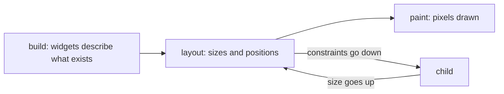

## Before you start

- [[frontend.l1.the-widget-tree]] — you know the Đơn Hàng app's screen is a tree of widgets, described by `build` methods.
- [[frontend.l1.render]] — you know a browser turns the DOM and CSS into pixels in steps: match styles, layout, paint.

## The situation

The spinner in the Đơn Hàng app sits exactly in the middle of the screen, whatever the size of the window. Each product's price sits at the right edge of its row, however long the product's name is. Yet nothing in `product_list_screen.dart` gives a single coordinate or width: no "x = 400", no "300 pixels wide". The widgets only say "a `Center` around a spinner" and "a `ListTile` with a title and a trailing price". So who decides how big each widget is and where it goes, and when does that happen?

## Core concepts

- **build/layout/paint** — the three phases in which Flutter turns a widget tree into pixels: build describes what should exist, layout gives each piece a size and position, and paint draws it.
- constraints — the limits a parent passes down to a child during layout: the smallest and largest width and height the child may take.
- size — what the child reports back up after choosing, within those limits, how big it will be.

## How it works



Flutter goes from widgets to pixels in three phases, much like the browser's steps in the render lesson. **Build** comes first: the `build` methods run and return the widget tree, a description of what should exist. At this point nothing has a size or a position. A parent's `build` can create a child widget, but neither of them yet knows how big it will be.

Layout comes next. It works down the tree and back up. Each parent passes its child constraints: "you may be anywhere from 0 to 400 pixels wide". The child picks a size within those limits, asking its own children the same way, and reports its size back up. Then the parent decides where to place the child. A widget does not choose its size on its own: it chooses inside the limits its parent gives it, and its parent chooses where it goes.

Paint comes last. Only once every size and position is known can Flutter draw the pixels: the text, the spinner, the colours. That is why the phases go in this order. Paint needs layout's answers, and layout needs build's tree.

## In the Đơn Hàng system

The spinner and the error message on the product screen:

```dart file=DonHang.App/lib/screens/product_list_screen.dart tag=stage-1 lines=43-51
      body: FutureBuilder<List<Product>>(
        future: _products,
        builder: (context, snapshot) {
          if (snapshot.connectionState == ConnectionState.waiting) {
            return const Center(child: CircularProgressIndicator());
          }
          if (snapshot.hasError) {
            return Center(child: Text('Could not load products: ${snapshot.error}'));
          }
```

In build, this only says "a `Center` with a `CircularProgressIndicator` inside". In layout, the `Scaffold` gives its body the space below the title bar. The `Center` takes that whole space, and passes its child looser constraints: "any size up to the space I have". The spinner picks its own small size, reports it back, and the `Center` places it in the middle. Paint then draws the spinner there. Make the window wider, and layout runs again with new constraints: the `Center` grows, the spinner keeps its size, and its position moves to the new middle.

Each product row works the same way:

```dart file=DonHang.App/lib/screens/product_list_screen.dart tag=stage-1 lines=60-63
              return ListTile(
                title: Text(product.name),
                trailing: Text('${product.priceVnd} đ'),
              );
```

The list gives each `ListTile` the full width of the list. The `ListTile` gives its `trailing` price only as much width as the text needs and places it at the end of the row, and gives the `title` the space that is left at the start. No line of this code mentions a pixel: the positions come out of layout.

## Beginners often think…

- **"Layout and paint are the same step, since layout only matters visually anyway."** → Actually layout decides sizes and positions, and paint draws pixels using them; paint cannot start until layout has finished. When only a colour changes, sizes stay the same and only painting has to be redone. You notice the difference when resizing the window moves the spinner: that is layout at work, before any pixel is drawn in its new place.
- **"A widget decides its own size and position independently, without anything from its parent."** → Actually a widget chooses its size within the constraints its parent passes down, and the parent decides where it goes. The spinner is small because it chose to be, but it is in the middle because the `Center` put it there. You notice this when the same widget ends up in different places, or at different sizes, depending on what it is placed inside.

## Try it (3 minutes)

Start the lab (`scripts/up.sh` from the repository root; it needs the Flutter SDK installed) and open `http://localhost:8081`.

1. While the products load, or after pressing the refresh button, watch the spinner, then make the browser window narrower and wider.
2. With the list showing, make the window narrower until the product names get close to the prices.

Expected result: in step 1, the spinner stays the same size and stays in the middle of the body as the window changes. In step 2, the prices stay at the right edge of each row, and the names get the space that is left.

Which phase runs again when you resize the window, and which widget decides where the spinner goes?

<details><summary>Suggested answer</summary>

Layout runs again, because the constraints the window gives the app have changed, and paint follows with the new positions. The `Center` decides where the spinner goes: it places its child in the middle of whatever space it is given.

</details>

## Connections

- [[frontend.l1.render]] — the browser's own style, layout and paint steps.
- [[frontend.l1.buildcontext]] — what each `build` method receives about its place in the tree.

## Five-line summary

1. Flutter turns widgets into pixels in three phases: build, then layout, then paint.
2. Build produces the widget tree; at that point no widget has a size or position yet.
3. In layout, constraints go down from parent to child, sizes come back up, and the parent places the child.
4. Paint draws only after every size and position is known.
5. `Center` places the spinner in the middle and `ListTile` puts the price at the row's end, without any pixel in the code.
