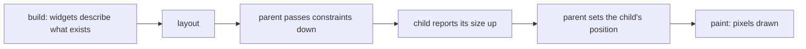

## Before you start

- [[frontend.l1.the-widget-tree]] — you know the Đơn Hàng app's screen is a tree of widgets, described by `build` methods.
- [[frontend.l1.render]] — you know a browser turns the DOM and CSS into pixels in steps: match styles, layout, paint.

## The situation

The spinner in the Đơn Hàng app sits in the middle of the area below the title bar, whatever the size of the window. Each product's price sits at the right edge of its row, however long the product's name is. Yet nothing in `product_list_screen.dart` gives a single coordinate or width: no "x = 400", no "300 pixels wide". The widgets only say "a `Center` around a spinner" and "a `ListTile` with a title and a trailing price". So who decides how big each widget is and where it goes, and when does that happen?

## Core concepts

- **build/layout/paint** — the three phases in which Flutter turns a widget tree into pixels: build describes what should exist, layout gives each piece a size and position, and paint draws it.
- constraints — the limits a parent passes down to a child during layout: the smallest and largest width and height the child may take.
- size — what the child reports back up after choosing, within those limits, how big it will be.

## How it works



Flutter goes from widgets to pixels in three phases, much like the browser's steps in the render lesson. Build comes first for each part of the screen: the `build` methods run and return widgets, a description of what should exist. At this point a widget has no size or position yet. A parent's `build` can create a child widget, but neither of them knows how big it will be.

Layout comes next, and in it each parent works with its children, as the diagram shows. The parent passes its child constraints: "you may be anywhere from 0 to 400 pixels wide". The child picks a size within those limits, asking its own children the same way, and reports its size back up. Then the parent decides where to place the child. A widget does not choose its size on its own: it chooses inside the limits its parent gives it, and its parent chooses where it goes.

Paint comes last. Only once every size and position is known can Flutter draw the pixels: the text, the spinner, the colours. That is the order for every piece of the screen: paint needs layout's answers, and layout needs the widgets that build described.

## In the Đơn Hàng system

The body of the product screen, while it waits for the products or when loading fails:

```dart file=DonHang.App/lib/screens/product_list_screen.dart tag=stage-1 lines=43-51
      body: FutureBuilder<List<Product>>(
        future: _products,
        builder: (context, snapshot) {
          if (snapshot.connectionState == ConnectionState.waiting) {
            return const Center(child: CircularProgressIndicator());
          }
          if (snapshot.hasError) {
            return Center(child: Text('Could not load products: ${snapshot.error}'));
          }
```

The `waiting` check is true while the products are still loading; the two lines to look at are the `return Center(...)` ones. In build, the first only says "a `Center` with a `CircularProgressIndicator` inside", and the second says the same about an error message. In layout, the `Scaffold` gives its body the space below the title bar, and the `Center` takes that space. The spinner picks its own small size, and the `Center` places it in the middle, where paint then draws it. Make the window wider, and layout runs again with the new space: the spinner keeps its size, and its position moves to the new middle. An error message would be placed the same way.

Each product row works on the same principle:

```dart file=DonHang.App/lib/screens/product_list_screen.dart tag=stage-1 lines=60-63
              return ListTile(
                title: Text(product.name),
                trailing: Text('${product.priceVnd} đ'),
              );
```

The list gives each `ListTile` its width, and the `ListTile` places the `trailing` price at the end of the row and the `title` at its start. No line of this code mentions a pixel: the positions come out of layout.

## Beginners often think…

- **"Layout and paint are the same step, since layout only matters visually anyway."** → Actually layout decides sizes and positions, and paint draws pixels using them; paint cannot start until layout has given its answers. You notice the difference when you resize the window and the spinner moves: layout decided the new position before paint drew anything there.
- **"A widget decides its own size and position independently, without anything from its parent."** → Actually a widget chooses its size within the constraints its parent passes down, and the parent decides where it goes. The spinner is small because it chose to be, but it is in the middle because the `Center` put it there. You notice this when the same widget ends up in different places, or at different sizes, depending on what it is placed inside.

## Try it (3 minutes)

Start the lab (`scripts/up.sh` from the repository root; the `flutter` command must be installed) and open the app at `http://localhost:8081`.

1. With the list showing, make the browser window narrower and wider, and watch the prices.
2. Press the refresh button in the bottom-right corner and, while the spinner shows, resize the window again. The spinner may show only for a moment, so repeat this a few times.

Expected result: in step 1, the prices stay at the right edge of each row as the window changes, and the names stay at the start. In step 2, the spinner keeps its size and stays in the middle of the area below the title bar.

Which phase runs again when you resize the window, and which widget decides where the spinner goes?

<details><summary>Suggested answer</summary>

Layout runs again, because the space the window gives the app has changed, and paint follows with the new positions. The `Center` decides where the spinner goes: it places its child in the middle of whatever space it is given.

</details>

## Connections

- [[frontend.l1.render]] — the browser's own style, layout and paint steps.
- [[frontend.l1.buildcontext]] — what each `build` method receives about its place in the tree.

## Five-line summary

1. Flutter turns widgets into pixels in three phases: build, then layout, then paint.
2. Build describes widgets; at that point a widget has no size or position yet.
3. In layout, constraints go down from parent to child, sizes come back up, and the parent places the child.
4. Paint draws only after the sizes and positions are known.
5. `Center` places the spinner in the middle and `ListTile` puts the price at the row's end, without any pixel in the code.
