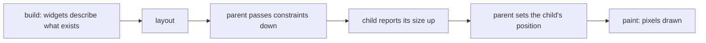

## Bạn cần biết trước

- [[frontend.l1.the-widget-tree]] — bạn biết màn hình của app Đơn Hàng là một cây widget, được mô tả bằng các method `build`.
- [[frontend.l1.render]] — bạn biết trình duyệt biến DOM và CSS thành pixel qua các bước: ghép kiểu, layout, paint.

## Tình huống

Vòng quay trong app Đơn Hàng nằm ở giữa vùng bên dưới thanh tiêu đề, bất kể cửa sổ to hay nhỏ. Giá của mỗi sản phẩm nằm ở mép phải của dòng, dù tên sản phẩm dài cỡ nào. Vậy mà trong `product_list_screen.dart` không có một tọa độ hay độ rộng nào: không "x = 400", không "rộng 300 pixel". Các widget chỉ nói "một `Center` bao quanh vòng quay" và "một `ListTile` có tiêu đề và giá ở cuối". Vậy ai quyết định mỗi widget to cỡ nào và nằm ở đâu, và việc đó diễn ra lúc nào?

## Khái niệm cốt lõi

- **build/layout/paint** — ba giai đoạn Flutter biến một widget tree thành pixel: build mô tả những gì phải tồn tại, layout cho mỗi mảnh một kích thước và vị trí, còn paint vẽ nó ra.
- ràng buộc (constraints) — những giới hạn mà widget cha truyền xuống con trong lúc layout: độ rộng và độ cao nhỏ nhất, lớn nhất mà con được phép có.
- kích thước (size) — thứ widget con báo ngược lên sau khi đã chọn, trong các giới hạn đó, nó sẽ to cỡ nào.

## Cơ chế hoạt động



Flutter đi từ widget tới pixel qua ba giai đoạn, khá giống các bước của trình duyệt trong bài render. Build đến trước với mỗi phần của màn hình: các method `build` chạy và trả về widget, một bản mô tả những gì phải tồn tại. Lúc này widget chưa có kích thước hay vị trí. `build` của widget cha có thể tạo widget con, nhưng cả hai đều chưa biết mình sẽ to cỡ nào.

Tiếp theo là layout, trong đó mỗi widget cha làm việc với các con của nó, như sơ đồ cho thấy. Cha truyền ràng buộc cho con: "con được rộng từ 0 tới 400 pixel". Con chọn một kích thước trong giới hạn đó, hỏi các con của nó theo cùng cách, rồi báo kích thước ngược lên. Sau đó cha quyết định đặt con ở đâu. Một widget không tự mình chọn kích thước: nó chọn trong giới hạn cha đưa cho, và cha chọn nó nằm ở đâu.

Paint đến cuối cùng. Chỉ khi mọi kích thước và vị trí đã biết thì Flutter mới vẽ được pixel: chữ, vòng quay, màu sắc. Đó là thứ tự cho mọi mảnh của màn hình: paint cần câu trả lời của layout, còn layout cần các widget mà build đã mô tả.

## Trong hệ thống Đơn Hàng

Phần thân của màn hình sản phẩm, trong lúc chờ sản phẩm hoặc khi tải lỗi:

```dart file=DonHang.App/lib/screens/product_list_screen.dart tag=stage-1 lines=43-51
      body: FutureBuilder<List<Product>>(
        future: _products,
        builder: (context, snapshot) {
          if (snapshot.connectionState == ConnectionState.waiting) {
            return const Center(child: CircularProgressIndicator());
          }
          if (snapshot.hasError) {
            return Center(child: Text('Could not load products: ${snapshot.error}'));
          }
```

Phép kiểm tra `waiting` đúng trong lúc sản phẩm còn đang tải; hai dòng cần nhìn là hai dòng `return Center(...)`. Trong build, dòng đầu chỉ nói "một `Center` có `CircularProgressIndicator` bên trong", còn dòng thứ hai nói y như vậy về một thông báo lỗi. Trong layout, `Scaffold` cho phần thân của nó khoảng trống bên dưới thanh tiêu đề, và `Center` chiếm khoảng trống đó. Vòng quay tự chọn kích thước nhỏ của nó, và `Center` đặt nó vào giữa, nơi paint sau đó vẽ nó ra. Kéo cửa sổ rộng ra, và layout chạy lại với khoảng trống mới: vòng quay giữ nguyên kích thước, còn vị trí dời tới chính giữa mới. Một thông báo lỗi cũng sẽ được đặt theo cùng cách.

Mỗi dòng sản phẩm hoạt động theo cùng nguyên tắc:

```dart file=DonHang.App/lib/screens/product_list_screen.dart tag=stage-1 lines=60-63
              return ListTile(
                title: Text(product.name),
                trailing: Text('${product.priceVnd} đ'),
              );
```

Danh sách cho mỗi `ListTile` độ rộng của nó, và `ListTile` đặt giá ở `trailing` về cuối dòng, còn `title` ở đầu dòng. Không dòng code nào ở đây nhắc tới pixel: các vị trí đến từ layout.

## Người mới hay nghĩ rằng…

- **"Layout và paint là cùng một bước, vì dù sao layout cũng chỉ là chuyện hiển thị."** → Thực ra layout quyết định kích thước và vị trí, còn paint vẽ pixel dựa trên đó; paint không bắt đầu được cho tới khi layout đưa ra câu trả lời. Bạn sẽ nhận ra khác biệt khi đổi cỡ cửa sổ và vòng quay dịch chuyển: layout đã quyết định vị trí mới trước khi paint vẽ gì ở đó.
- **"Một widget tự quyết kích thước và vị trí của mình, không cần gì từ widget cha."** → Thực ra một widget chọn kích thước trong ràng buộc mà cha truyền xuống, và cha quyết định nó nằm ở đâu. Vòng quay nhỏ vì nó chọn như vậy, nhưng nó nằm giữa là vì `Center` đặt nó ở đó. Bạn sẽ nhận ra khi cùng một widget nằm ở chỗ khác, hoặc có kích thước khác, tùy vào nó được đặt trong thứ gì.

## Thử ngay (3 phút)

Khởi động lab (`scripts/up.sh` từ thư mục gốc của repo; cần cài sẵn lệnh `flutter`) và mở app ở `http://localhost:8081`.

1. Khi danh sách đang hiện, kéo cửa sổ trình duyệt hẹp lại rồi rộng ra, và để ý các giá tiền.
2. Bấm nút làm mới ở góc dưới bên phải và, trong lúc vòng quay đang hiện, đổi cỡ cửa sổ lần nữa. Vòng quay có thể chỉ hiện trong chốc lát, nên lặp lại vài lần.

Kết quả mong đợi: ở bước 1, giá tiền luôn nằm ở mép phải của mỗi dòng khi cửa sổ thay đổi, còn tên nằm ở đầu dòng. Ở bước 2, vòng quay giữ nguyên kích thước và luôn ở giữa vùng bên dưới thanh tiêu đề.

Giai đoạn nào chạy lại khi bạn đổi cỡ cửa sổ, và widget nào quyết định vòng quay nằm ở đâu?

<details><summary>Gợi ý đáp án</summary>

Layout chạy lại, vì khoảng trống cửa sổ dành cho app đã thay đổi, rồi paint theo sau với các vị trí mới. `Center` quyết định vòng quay nằm ở đâu: nó đặt con của mình vào giữa khoảng trống mà nó được cho.

</details>

## Liên hệ

- [[frontend.l1.render]] — các bước ghép kiểu, layout và paint của trình duyệt.
- [[frontend.l1.buildcontext]] — những gì mỗi method `build` nhận được về vị trí của nó trong cây.

## Tóm tắt 5 dòng

1. Flutter biến widget thành pixel qua ba giai đoạn: build, rồi layout, rồi paint.
2. Build mô tả widget; lúc đó widget chưa có kích thước hay vị trí.
3. Trong layout, ràng buộc đi xuống từ cha tới con, kích thước đi ngược lên, và cha đặt vị trí cho con.
4. Paint chỉ vẽ sau khi đã biết kích thước và vị trí.
5. `Center` đặt vòng quay vào giữa và `ListTile` đặt giá về cuối dòng, mà code không hề có pixel nào.
