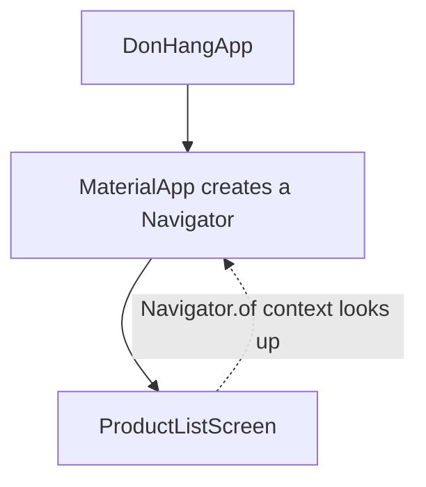

## Before you start

- [[frontend.l1.build-layout-paint]] — you know `build` methods describe the widget tree, and that parents and children in that tree work together.

## The situation

In the Đơn Hàng app, the login icon in the title bar opens the sign-in screen. The code that does it is one line in the product screen: `Navigator.of(context).push(...)`. Nothing in `ProductListScreen` creates a navigator, and nobody passes one in; its constructor requires only an `ApiClient`, the class that talks to the server. The navigator is created higher up in the tree, by `MaterialApp`. And every `build` method you have read takes a parameter called `context` that the code seemed to ignore. How does one line in a screen find something created higher up in the tree, and what is that `context`?

## Core concepts

- **BuildContext** — a reference to where a widget sits in the tree, used to look up what an ancestor provides.
- ancestor — a widget above another one in the tree: its parent, its parent's parent, and so on up to the root.
- `Navigator` — the widget that keeps the app's stack of screens; pushing a screen onto it opens that screen.

## How it works



Every `build` method receives a **BuildContext**, and it always describes one position: the place in the tree of the widget being built. It is not a bag of app data; it is an address. From that address, code can look upward, through the widget's ancestors, for something one of them provides.

That is what `Navigator.of(context)` does. It starts at the position `context` describes — in the diagram, the product screen — and walks up the tree until it finds a `Navigator`. Here `MaterialApp` is given a `home` — the first screen it shows, the product screen — so it creates one, and any widget below `MaterialApp` finds it, however deep it sits, without the navigator being passed down through each constructor. The same kind of lookup is how widgets find other things an ancestor provides, such as the app's colours and fonts.

Because a context is a position, which context you use matters. Looking up from a widget below `MaterialApp` finds its navigator. Looking up from a widget above it, such as `DonHangApp`, finds nothing, because the navigator is not among that widget's ancestors. And a context is only useful while its widget is still in the tree. Once the widget has been removed, for example because the user left that screen, its context no longer describes a position, and code should not use it.

## In the Đơn Hàng system

The login icon on the product screen:

```dart file=DonHang.App/lib/screens/product_list_screen.dart tag=stage-1 lines=34-41
        actions: [
          IconButton(
            icon: const Icon(Icons.login),
            onPressed: () => Navigator.of(context).push(
              MaterialPageRoute(builder: (_) => LoginScreen(apiClient: widget.apiClient)),
            ),
          ),
        ],
```

The `context` here belongs to `ProductListScreen`, the `home` of `MaterialApp`, so it sits below the navigator. When the icon is pressed, `Navigator.of(context)` walks up, finds the navigator, and `push` puts a new `LoginScreen`, wrapped in a `MaterialPageRoute`, on top of the stack. "On top of the stack" means in front of the product screen, not above the navigator: in the tree, the new screen sits below the navigator too. The product screen never had to be given the navigator.

The sign-in screen shows the second rule, that a context is only good while its widget is in the tree. (There, `widget.apiClient` is the `ApiClient` the screen received through its constructor.)

```dart file=DonHang.App/lib/screens/login_screen.dart tag=stage-1 lines=29-33
      await widget.apiClient.login(_emailController.text, _passwordController.text);
      if (!mounted) return;
      Navigator.of(context).pushReplacement(
        MaterialPageRoute(builder: (_) => CreateOrderScreen(apiClient: widget.apiClient)),
      );
```

Logging in sends a request to the server and waits for the response. While it waits, the user might press the back button and leave the sign-in screen. In a class like `_LoginScreenState`, `context` and `mounted` can be used in any method, not only in `build`; the next lesson explains that class. So after the `await`, the code first checks `mounted`, which is true only while the screen is still in the tree. Only then does it use `context` to find the navigator and replace the sign-in screen with the order screen.

## Beginners often think…

- **"BuildContext is just a container for any global app state a widget might need."** → Actually a BuildContext holds no app data of its own; it is a position in the tree. What you can find through it depends on which ancestors provide what above that position. You notice this when a lookup that works in one screen fails in a widget placed somewhere else, because nothing above it provides the thing you asked for.
- **"The same BuildContext works for looking things up no matter which widget's build method it came from."** → Actually each context looks up from its own position. `DonHangApp`'s `build` receives a context above `MaterialApp`, so `Navigator.of` with that context would not find the navigator `MaterialApp` creates below it. You notice this when the same line of code works inside a screen but fails when moved into a widget higher up.

## Try it (3 minutes)

Using the widget tree of the Đơn Hàng app (`DonHangApp` → `MaterialApp` → `ProductListScreen` → …, with `LoginScreen` pushed on top later), decide for each `context` whether `Navigator.of(context)` would find the navigator `MaterialApp` creates:

1. The `context` in `DonHangApp`'s `build`, in `main.dart`.
2. The `context` in the product screen's `build`, used by the login icon.
3. The `context` used in `LoginScreen`'s sign-in code, after the `mounted` check.

Expected result: 1 — no: that position is above `MaterialApp`. 2 — yes: the product screen is below it. 3 — yes: `LoginScreen` was pushed onto that navigator, and the `mounted` check makes sure the screen is still in the tree.

Why does the sign-in code check `mounted` before using `context`, but the login icon on the product screen does not?

<details><summary>Suggested answer</summary>

The login icon uses `context` straight away, while the product screen is on screen. The sign-in code uses it after waiting for the server's response, and during that wait the user could have left the screen, removing it from the tree; `mounted` tells the code whether its context still describes a position.

</details>

## Connections

- [[frontend.l1.build-layout-paint]] — the tree that a context is a position in.
- [[frontend.l1.stateless-vs-stateful]] — the `State` class where `mounted` and `context` come from.

## Five-line summary

1. A BuildContext is a reference to where a widget sits in the tree; every `build` method receives one.
2. Code looks upward from that position to find what an ancestor provides, such as the navigator from `MaterialApp`.
3. `Navigator.of(context)` works from the product screen because the screen sits below `MaterialApp`.
4. A context from a widget above `MaterialApp`, like `DonHangApp`'s, would not find that navigator.
5. A context is only useful while its widget is in the tree, which is why the sign-in code checks `mounted` after waiting.
