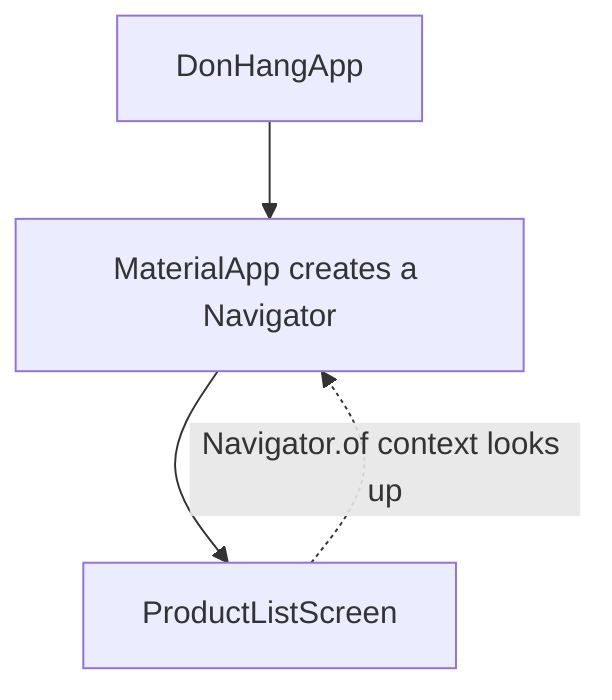

## Bạn cần biết trước

- [[frontend.l1.build-layout-paint]] — bạn biết các method `build` mô tả widget tree, và cha với con trong cây đó làm việc cùng nhau.

## Tình huống

Trong app Đơn Hàng, biểu tượng đăng nhập trên thanh tiêu đề mở màn hình đăng nhập. Code làm việc đó là một dòng trong màn hình sản phẩm: `Navigator.of(context).push(...)`. Không có gì trong `ProductListScreen` tạo ra navigator, và không ai truyền navigator vào; constructor của nó chỉ bắt buộc một `ApiClient`, class nói chuyện với server. Navigator được tạo ở phía trên trong cây, bởi `MaterialApp`. Và mọi method `build` bạn đã đọc đều nhận một tham số tên `context` mà code có vẻ bỏ qua. Làm thế nào một dòng trong một màn hình tìm được thứ được tạo ở phía trên trong cây, và `context` đó là gì?

## Khái niệm cốt lõi

- **BuildContext** — tham chiếu tới vị trí một widget đang nằm trong cây, dùng để tra cứu thứ mà một tổ tiên cung cấp.
- tổ tiên (ancestor) — một widget nằm phía trên widget khác trong cây: cha của nó, cha của cha, cứ thế lên tới gốc.
- `Navigator` — widget giữ ngăn xếp các màn hình của app; đẩy một màn hình vào đó là mở màn hình ấy.

## Cơ chế hoạt động



Mọi method `build` đều nhận một **BuildContext**, và nó luôn mô tả đúng một vị trí: chỗ trong cây của widget đang được build. Nó không phải cái túi chứa dữ liệu app; nó là một địa chỉ. Từ địa chỉ đó, code có thể nhìn ngược lên, qua các tổ tiên của widget, để tìm thứ mà một trong số chúng cung cấp.

Đó chính là việc `Navigator.of(context)` làm. Nó bắt đầu từ vị trí mà `context` mô tả — trong sơ đồ là màn hình sản phẩm — và đi ngược lên cây cho tới khi gặp một `Navigator`. Ở đây `MaterialApp` được cho một `home` — màn hình đầu tiên nó hiển thị, tức màn hình sản phẩm — nên nó tạo một navigator, và mọi widget bên dưới `MaterialApp` đều tìm thấy navigator đó, dù nằm sâu tới đâu, mà không cần navigator được truyền xuống qua từng constructor. Cùng kiểu tra cứu này là cách widget tìm những thứ khác mà tổ tiên cung cấp, như màu sắc và phông chữ của app.

Vì context là một vị trí, dùng context nào là điều quan trọng. Tra ngược lên từ một widget bên dưới `MaterialApp` sẽ tìm thấy navigator của nó. Tra ngược lên từ một widget nằm trên nó, như `DonHangApp`, thì không tìm thấy gì, vì navigator không thuộc tổ tiên của widget đó. Và một context chỉ có ích khi widget của nó vẫn còn trong cây. Một khi widget đã bị gỡ, chẳng hạn vì người dùng rời màn hình đó, context của nó không còn mô tả vị trí nào, và code không nên dùng nó nữa.

## Trong hệ thống Đơn Hàng

Biểu tượng đăng nhập trên màn hình sản phẩm:

```dart file=DonHang.App/lib/screens/product_list_screen.dart tag=stage-1 lines=34-41
        actions: [
          IconButton(
            icon: const Icon(Icons.login),
            onPressed: () => Navigator.of(context).push(
              MaterialPageRoute(builder: (_) => LoginScreen(apiClient: widget.apiClient)),
            ),
          ),
        ],
```

`context` ở đây thuộc về `ProductListScreen`, `home` của `MaterialApp`, nên nó nằm bên dưới navigator. Khi biểu tượng được bấm, `Navigator.of(context)` đi ngược lên, tìm thấy navigator, và `push` đặt một `LoginScreen` mới, bọc trong một `MaterialPageRoute`, lên đỉnh ngăn xếp. "Lên đỉnh ngăn xếp" nghĩa là nằm trước màn hình sản phẩm, không phải nằm trên navigator: trong cây, màn hình mới cũng nằm dưới navigator. Màn hình sản phẩm chưa bao giờ phải được trao navigator.

Màn hình đăng nhập cho thấy quy tắc thứ hai, rằng một context chỉ dùng được khi widget của nó còn trong cây. (Ở đó, `widget.apiClient` là `ApiClient` mà màn hình nhận qua constructor.)

```dart file=DonHang.App/lib/screens/login_screen.dart tag=stage-1 lines=29-33
      await widget.apiClient.login(_emailController.text, _passwordController.text);
      if (!mounted) return;
      Navigator.of(context).pushReplacement(
        MaterialPageRoute(builder: (_) => CreateOrderScreen(apiClient: widget.apiClient)),
      );
```

Đăng nhập gửi một request tới server và chờ response. Trong lúc chờ, người dùng có thể bấm nút quay lại và rời màn hình đăng nhập. Trong một class như `_LoginScreenState`, `context` và `mounted` dùng được trong mọi method, không chỉ trong `build`; bài sau sẽ giải thích class đó. Vì vậy sau `await`, code kiểm tra `mounted` trước, giá trị chỉ đúng khi màn hình còn trong cây. Chỉ khi đó nó mới dùng `context` để tìm navigator và thay màn hình đăng nhập bằng màn hình đặt hàng.

## Người mới hay nghĩ rằng…

- **"BuildContext chỉ là cái hộp chứa mọi state toàn cục của app mà widget có thể cần."** → Thực ra BuildContext không chứa dữ liệu app nào của riêng nó; nó là một vị trí trong cây. Những gì bạn tìm được qua nó phụ thuộc vào việc các tổ tiên phía trên vị trí đó cung cấp gì. Bạn sẽ nhận ra khi một lần tra cứu chạy được trong một màn hình lại thất bại ở một widget đặt chỗ khác, vì không có gì phía trên nó cung cấp thứ bạn cần.
- **"BuildContext nào dùng để tra cứu cũng như nhau, bất kể nó đến từ method build của widget nào."** → Thực ra mỗi context tra cứu từ vị trí của chính nó. `build` của `DonHangApp` nhận một context nằm trên `MaterialApp`, nên `Navigator.of` với context đó sẽ không tìm thấy navigator mà `MaterialApp` tạo ra bên dưới. Bạn sẽ nhận ra khi cùng một dòng code chạy được trong một màn hình nhưng thất bại khi chuyển lên một widget ở cao hơn.

## Thử ngay (3 phút)

Dựa vào widget tree của app Đơn Hàng (`DonHangApp` → `MaterialApp` → `ProductListScreen` → …, với `LoginScreen` được đẩy lên đỉnh sau đó), quyết định với mỗi `context` xem `Navigator.of(context)` có tìm thấy navigator mà `MaterialApp` tạo ra không:

1. `context` trong `build` của `DonHangApp`, ở `main.dart`.
2. `context` trong `build` của màn hình sản phẩm, được biểu tượng đăng nhập dùng.
3. `context` dùng trong code đăng nhập của `LoginScreen`, sau phép kiểm tra `mounted`.

Kết quả mong đợi: 1 — không: vị trí đó nằm trên `MaterialApp`. 2 — có: màn hình sản phẩm nằm dưới nó. 3 — có: `LoginScreen` đã được đẩy vào navigator đó, và phép kiểm tra `mounted` đảm bảo màn hình vẫn còn trong cây.

Vì sao code đăng nhập kiểm tra `mounted` trước khi dùng `context`, còn biểu tượng đăng nhập trên màn hình sản phẩm thì không?

<details><summary>Gợi ý đáp án</summary>

Biểu tượng đăng nhập dùng `context` ngay lập tức, khi màn hình sản phẩm đang hiển thị. Code đăng nhập dùng nó sau khi chờ response của server, và trong lúc chờ người dùng có thể đã rời màn hình, gỡ nó khỏi cây; `mounted` cho code biết context của nó còn mô tả một vị trí hay không.

</details>

## Liên hệ

- [[frontend.l1.build-layout-paint]] — cái cây mà context là một vị trí trong đó.
- [[frontend.l1.stateless-vs-stateful]] — class `State`, nơi `mounted` và `context` đến từ.

## Tóm tắt 5 dòng

1. BuildContext là tham chiếu tới vị trí một widget trong cây; mọi method `build` đều nhận một cái.
2. Code tra ngược lên từ vị trí đó để tìm thứ mà tổ tiên cung cấp, như navigator từ `MaterialApp`.
3. `Navigator.of(context)` chạy được từ màn hình sản phẩm vì màn hình nằm dưới `MaterialApp`.
4. Context của một widget nằm trên `MaterialApp`, như của `DonHangApp`, sẽ không tìm thấy navigator đó.
5. Context chỉ có ích khi widget của nó còn trong cây, nên code đăng nhập kiểm tra `mounted` sau khi chờ.
