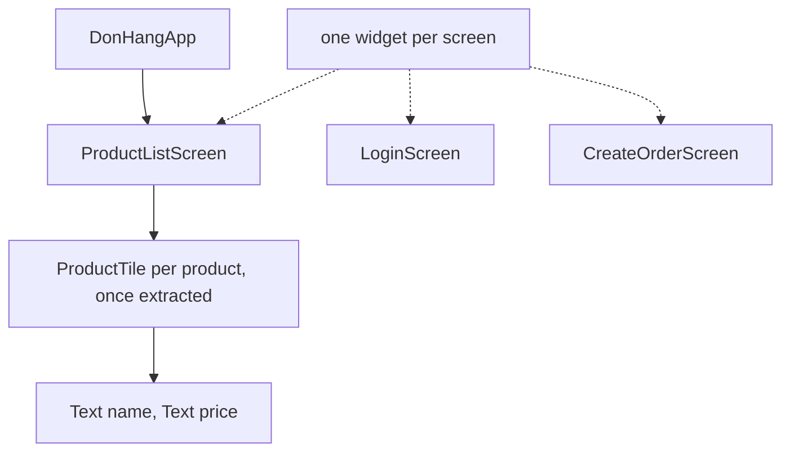

## Before you start

- [[frontend.l1.setstate-and-rebuilding]] — you know a `State` rebuilds its own subtree when its fields change.
- [[design.l1.solid-srp]] — you know SRP asks for one reason to change per class.

## The situation

The shop wants each product row to show a small "new" label for products added this week, and the price in bold. The row is described inside `_ProductListScreenState.build`, in the middle of the code that loads products, shows the loading indicator, handles errors and draws the title bar. To change one row, you have to read, and risk breaking, all of that. The same row will soon be needed on an order screen too, where there is no product list loading at all. Should the row really live inside the product screen's `build`?

## Core concepts

- composition — building a screen out of small widgets, each describing one part, instead of one large `build` method.
- extracting a widget — moving part of a `build` method into a new widget class of its own, which the original code then uses.
- widget contract — the constructor parameters of a widget: everything a user of the widget must give it, and everything the widget depends on.

## How it works



A widget is a class, so the Single Responsibility Principle applies to it the same way it applies to any class: it should have one reason to change. A screen's `build` method that loads data, shows progress, handles errors and describes every row has several reasons to change. Each part can be pulled out into its own widget, and the screen then puts those widgets together. That is composition.

What an extracted widget needs is written in its constructor, and nothing else reaches it. That list of parameters is its contract. A small contract means the widget can be used anywhere those few values exist, and understood without reading the code around it. A row that needs only a product can be shown on the product screen, on an order screen, or in a test, because it knows nothing about where the product came from.

Small widgets also keep state in the right place. A widget that holds state keeps only its own, and the parts that need none stay stateless. When one of them changes, a reader can reason about its tree on its own, and a `setState` in it rebuilds only its own subtree.

## In the Đơn Hàng system

The app's top widget already composes the app this way:

```dart file=DonHang.App/lib/main.dart tag=stage-1 lines=9-24
// lesson: frontend.l1.composing-widgets
// One StatelessWidget composing the app shell; every screen below it is its
// own small widget (design.l1.solid-srp applied to widgets, not classes).
class DonHangApp extends StatelessWidget {
  const DonHangApp({super.key});

  @override
  Widget build(BuildContext context) {
    final apiClient = ApiClient();
    return MaterialApp(
      title: 'Đơn Hàng',
      theme: ThemeData(colorSchemeSeed: Colors.indigo, useMaterial3: true),
      home: ProductListScreen(apiClient: apiClient),
    );
  }
}
```

`DonHangApp` only sets up the app and names its first screen. Each screen is its own widget: `ProductListScreen`, `LoginScreen` and `CreateOrderScreen` each live in their own file, and each requires only an `ApiClient`. None of them knows how the others are built.

Inside the product screen, the rows have not been extracted yet:

```dart file=DonHang.App/lib/screens/product_list_screen.dart tag=stage-1 lines=56-65
          return ListView.builder(
            itemCount: products.length,
            itemBuilder: (context, index) {
              final product = products[index];
              return ListTile(
                title: Text(product.name),
                trailing: Text('${product.priceVnd} đ'),
              );
            },
          );
```

The `ListTile` for one product is written inline, inside the list, inside the `FutureBuilder`, inside the screen. Everything it uses is `product`. So a `ProductTile` widget pulled out of these lines would need only a `Product` in its constructor. The screen's code would shrink to `return ProductTile(product: product);`, and the "new" label and bold price would be changes to `ProductTile` alone.

## Beginners often think…

- **"Extracting a widget into its own class is just about file organization, not about reuse or responsibility."** → Actually the new class gets its own contract and its own reason to change. A `ProductTile` changes when the look of a product row changes, and only then; the product screen changes when loading or layout changes. You notice this when the next change to rows touches one small file and leaves the screen's loading code untouched.
- **"A widget needs access to the whole screen's state to do its job, even if it only displays one row."** → Actually a row needs only what it shows. The inline `ListTile` above uses nothing but `product`, so a `ProductTile` needs only a `Product`, not the screen's `_products` load or its `ApiClient`. You notice this when you try to reuse the row on another screen and find it can be given one product and nothing else.

## Try it (3 minutes)

In `DonHang.App/lib/screens/product_list_screen.dart`, extract the row into a widget of its own:

1. At the bottom of the file, add a `StatelessWidget` named `ProductTile` with one field, `final Product product;`, a constructor that requires it, and a `build` method that returns the same `ListTile` as the inline code.
2. Replace the inline `ListTile` in `itemBuilder` with `ProductTile(product: product)`.
3. Rebuild with `scripts/up.sh` and open `http://localhost:8081`, then undo your changes.

Expected result: the product list looks exactly as before. The screen's `itemBuilder` is now one line, and `ProductTile` needs nothing but a product.

Why can `ProductTile` be a StatelessWidget, while `ProductListScreen` cannot?

<details><summary>Suggested answer</summary>

Everything a row shows comes in through its constructor, the product, and it remembers nothing by itself. `ProductListScreen` has to keep and replace the `_products` load on its own, which needs a `State`. Extracting the row separated the part with state from the part without it.

</details>

## Connections

- [[design.l1.solid-srp]] — the same principle, applied to classes.
- [[frontend.l1.stateless-vs-stateful]] — deciding which extracted widgets need a `State`.

## Five-line summary

1. A widget is a class, so SRP applies: one widget, one reason to change.
2. `DonHangApp` composes the app from one widget per screen, each requiring only an `ApiClient`.
3. A widget's constructor parameters are its contract; a small contract lets it be used anywhere.
4. The product row is still inline, and it uses only `product`, so a `ProductTile` would need only a `Product`.
5. Extracting small widgets keeps each one's tree, and any state it has, easy to reason about on its own.
