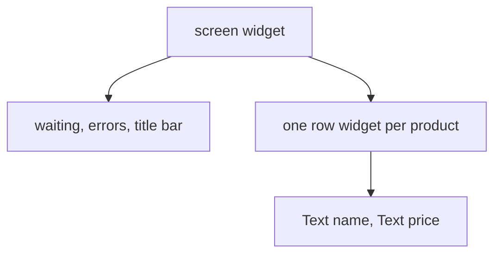

## Before you start

- [[frontend.l1.setstate-and-rebuilding]] — you know a `State` rebuilds its own subtree when `setState` is called.
- [[design.l1.solid-srp]] — you know SRP asks for one reason to change per class.

## The situation

The shop wants each product row to show a small "new" label for products added this week, and the price in bold. The row is described inside `_ProductListScreenState.build`, in the middle of the code that waits for the product list, shows the loading indicator, handles errors and draws the title bar. To change one row, you have to read, and risk breaking, all of that. The same row will soon be needed on an order screen too, where there is no product list at all. Should the row really live inside the product screen's `build`?

## Core concepts

- composition — building a screen out of small widgets, each describing one part, instead of one large `build` method.
- extracting a widget — moving part of a `build` method into a new widget class of its own, which the original code then uses.
- widget contract — the constructor parameters of a widget: the values anyone using it must give it.

## How it works



A widget is a class, so the Single Responsibility Principle applies to it as to any class: it should have one reason to change. A screen whose `build` waits for data, shows progress, handles errors and describes every row has several reasons to change. Each part can be pulled out into its own widget, and the screen then puts those widgets together, as in the diagram: the screen keeps the waiting, errors and title bar, and a separate row widget describes each product with its two `Text` widgets. That is composition.

What an extracted widget needs from its user is written in its constructor. That list of parameters is its contract. A widget still gets its `BuildContext` from where it is placed, and Material widgets such as `ListTile` expect a Material widget like `Scaffold` above them, but everything specific to one use arrives through the constructor. A small contract means the widget can be used on any screen that has those few values, and understood without reading the code around it.

Small widgets also keep state in the right place. A widget that must remember something keeps only its own state, and the parts that remember nothing stay stateless. For example, the product screen keeps the product list load in its `State`, while a row widget needs no `State` at all. A `setState` in a stateful widget rebuilds only that widget's subtree, so the smaller the widget, the less each change touches.

## In the Đơn Hàng system

The app's top widget already keeps each screen in a widget of its own:

```dart file=DonHang.App/lib/main.dart tag=stage-1 lines=9-24
// lesson: frontend.l1.composing-widgets
// One StatelessWidget composing the app shell; every screen below it is its
// own small widget (design.l1.solid-srp applied to widgets, not classes).
class DonHangApp extends StatelessWidget {
  const DonHangApp({super.key});

  @override
  Widget build(BuildContext context) {
    final apiClient = ApiClient();
    return MaterialApp(
      title: 'Đơn Hàng',
      theme: ThemeData(colorSchemeSeed: Colors.indigo, useMaterial3: true),
      home: ProductListScreen(apiClient: apiClient),
    );
  }
}
```

`DonHangApp` only sets up the `MaterialApp` — its name and colours — and names the first screen. It creates an `ApiClient`, the class that talks to the server, and hands it to that screen. The other screens are separate widgets in their own files too: `ProductListScreen` opens `LoginScreen`, and `LoginScreen` opens `CreateOrderScreen`. Each screen's constructor requires only an `ApiClient`, so each can be read and changed on its own.

Inside the product screen, the rows have not been extracted yet. `ListView.builder` builds the list, calling `itemBuilder` once for each of the `itemCount` products:

```dart file=DonHang.App/lib/screens/product_list_screen.dart tag=stage-1 lines=56-65
          return ListView.builder(
            itemCount: products.length,
            itemBuilder: (context, index) {
              final product = products[index];
              return ListTile(
                title: Text(product.name),
                trailing: Text('${product.priceVnd} đ'),
              );
            },
          );
```

The `ListTile` for one product is written inline, inside the list, inside the `FutureBuilder`, inside the screen. The only value it uses is `product`, one `Product` with a name and a price. So a `ProductTile` widget pulled out of these lines would need only a `Product` in its constructor. The screen's code would shrink to `return ProductTile(product: product);`, and the "new" label and bold price would be changes to `ProductTile` alone.

## Beginners often think…

- **"Extracting a widget into its own class is just about file organization, not about reuse or responsibility."** → Actually the new class gets its own contract and its own reason to change. A `ProductTile` changes when the look of a product row changes, and only then; the product screen changes when waiting, errors or layout change. You notice this when the next change to rows touches one small class and leaves the screen's loading code untouched.
- **"A widget needs access to the whole screen's state to do its job, even if it only displays one row."** → Actually a row needs only what it shows. The inline `ListTile` above uses nothing but `product`, so a `ProductTile` needs only a `Product`, not the screen's product list load or its `ApiClient`. You notice this when you try to reuse the row on another screen and find it can be given one product and nothing else.

## Try it (3 minutes)

Plan the extraction of `ProductTile` from the inline `ListTile` above, on paper or in a comment:

1. What field, or fields, does `ProductTile` need?
2. Is it a StatelessWidget or a StatefulWidget?
3. What does its `build` return, and what does the screen's `itemBuilder` return afterwards?

Expected result: 1 — one field, `final Product product;`, set through its constructor, for example `const ProductTile({super.key, required this.product});`. 2 — a StatelessWidget. 3 — `build` returns the same `ListTile` as the inline code; `itemBuilder` returns `ProductTile(product: product)`.

Why can `ProductTile` be a StatelessWidget, while `ProductListScreen` cannot?

<details><summary>Suggested answer</summary>

Everything a row shows comes in through its constructor, the product, and it remembers nothing by itself. `ProductListScreen` has to keep and replace its product list load on its own, which needs a `State`. Extracting the row separates the part with state from the part without it.

</details>

## Connections

- [[design.l1.solid-srp]] — the same principle, applied to classes.
- [[frontend.l1.stateless-vs-stateful]] — deciding which extracted widgets need a `State`.

## Five-line summary

1. A widget is a class, so SRP applies: one widget, one reason to change.
2. In the Đơn Hàng app, each screen is its own widget, and each requires only an `ApiClient`.
3. A widget's constructor parameters are its contract; a small contract lets it be used on any screen that has those values.
4. The product row is still inline and uses only `product`, so a `ProductTile` would need only a `Product`.
5. Small widgets keep state only where it is needed, so each `setState` rebuilds less.
