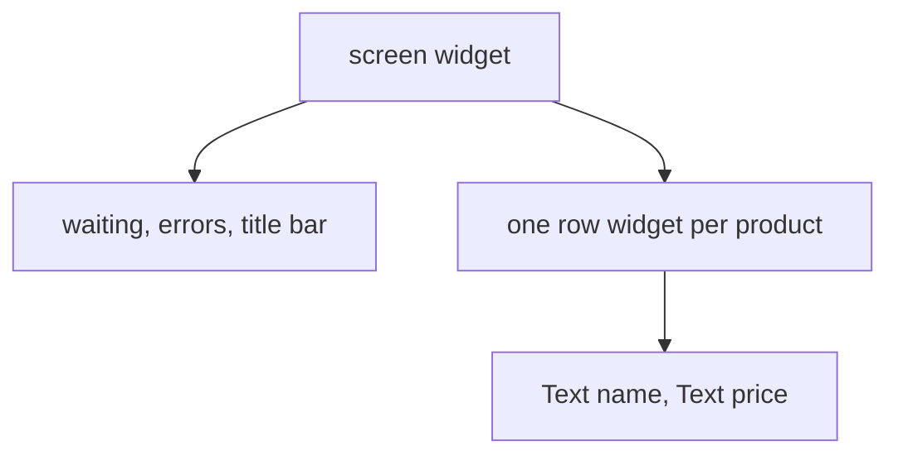

## Bạn cần biết trước

- [[frontend.l1.setstate-and-rebuilding]] — bạn biết một `State` build lại cây con của chính nó khi `setState` được gọi.
- [[design.l1.solid-srp]] — bạn biết SRP đòi mỗi class chỉ có một lý do để thay đổi.

## Tình huống

Cửa hàng muốn mỗi dòng sản phẩm có một nhãn nhỏ "mới" cho sản phẩm thêm trong tuần, và giá in đậm. Dòng đó được mô tả bên trong `_ProductListScreenState.build`, nằm giữa phần code chờ danh sách sản phẩm, hiện dấu hiệu đang tải, xử lý lỗi và vẽ thanh tiêu đề. Muốn đổi một dòng, bạn phải đọc, và có nguy cơ làm hỏng, tất cả những thứ đó. Chẳng bao lâu nữa dòng đó cũng cần có trên một màn hình đặt hàng, nơi không có danh sách sản phẩm nào. Dòng đó có thật sự nên nằm trong `build` của màn hình sản phẩm không?

## Khái niệm cốt lõi

- ghép (composition) — dựng một màn hình từ các widget nhỏ, mỗi cái mô tả một phần, thay vì một method `build` lớn.
- tách widget — chuyển một phần của method `build` sang một class widget mới của riêng nó, rồi code ban đầu dùng lại class đó.
- hợp đồng của widget — các tham số constructor của một widget: những giá trị mà ai dùng nó cũng phải đưa cho nó.

## Cơ chế hoạt động



Widget là một class, nên Nguyên tắc đơn trách nhiệm áp dụng cho nó như cho mọi class: nó chỉ nên có một lý do để thay đổi. Một màn hình mà `build` vừa chờ dữ liệu, vừa hiện tiến độ, vừa xử lý lỗi, vừa mô tả từng dòng thì có nhiều lý do để thay đổi. Mỗi phần có thể được tách ra thành widget riêng, rồi màn hình ghép các widget đó lại, như trong sơ đồ: màn hình giữ phần chờ, lỗi và thanh tiêu đề, còn một widget dòng riêng mô tả từng sản phẩm với hai widget `Text` của nó. Đó là ghép widget.

Những gì một widget được tách ra cần từ bên dùng nó được ghi trong constructor. Danh sách tham số đó là hợp đồng của nó. Widget vẫn nhận `BuildContext` từ chỗ nó được đặt, nhưng mọi thứ riêng cho một lần dùng đều đến qua constructor. Hợp đồng nhỏ nghĩa là widget dùng được trên bất kỳ màn hình nào có vài giá trị đó, và hiểu được mà không cần đọc code xung quanh.

Widget nhỏ còn giữ state ở đúng chỗ. Widget nào phải nhớ điều gì thì chỉ giữ state của chính nó, còn những phần không nhớ gì vẫn là stateless. Ví dụ, màn hình sản phẩm giữ lần tải danh sách sản phẩm trong `State` của nó, còn một widget dòng thì không cần `State` nào. `setState` trong một widget stateful chỉ build lại cây con của widget đó, nên widget càng nhỏ, mỗi thay đổi càng chạm tới ít thứ.

## Trong hệ thống Đơn Hàng

Widget trên cùng của app vốn đã để mỗi màn hình trong một widget riêng:

```dart file=DonHang.App/lib/main.dart tag=stage-1 lines=9-24
// lesson: frontend.l1.composing-widgets
// One StatelessWidget composing the app shell; every screen below it is its
// own small widget (design.l1.solid-srp applied to widgets, not classes).
class DonHangApp extends StatelessWidget {
  const DonHangApp({super.key});

  @override
  Widget build(BuildContext context) {
    final apiClient = ApiClient();
    return MaterialApp(
      title: 'Đơn Hàng',
      theme: ThemeData(colorSchemeSeed: Colors.indigo, useMaterial3: true),
      home: ProductListScreen(apiClient: apiClient),
    );
  }
}
```

Comment gọi `DonHangApp` là app shell, lớp khung ngoài của app, và "SRP applied to widgets, not classes" nghĩa là SRP áp dụng cho các class widget thay vì cho các class service. `DonHangApp` chỉ thiết lập `MaterialApp` — tên và màu sắc của nó — và chỉ định màn hình đầu tiên. Nó tạo một `ApiClient`, class nói chuyện với server, và trao cho màn hình đó. Các màn hình khác cũng là widget riêng trong file riêng: `ProductListScreen` mở `LoginScreen`, và `LoginScreen` mở `CreateOrderScreen`. Constructor của mỗi màn hình chỉ bắt buộc một `ApiClient`, nên mỗi màn hình đọc và sửa được riêng lẻ.

Bên trong màn hình sản phẩm, các dòng vẫn chưa được tách. `ListView.builder` dựng danh sách, gọi `itemBuilder` với một chỉ số nhỏ hơn `itemCount` mỗi khi nó cần dòng cho một sản phẩm:

```dart file=DonHang.App/lib/screens/product_list_screen.dart tag=stage-1 lines=56-65
          return ListView.builder(
            itemCount: products.length,
            itemBuilder: (context, index) {
              final product = products[index];
              return ListTile(
                title: Text(product.name),
                trailing: Text('${product.priceVnd} đ'),
              );
            },
          );
```

`ListTile` cho một sản phẩm được viết inline, bên trong danh sách, bên trong phần code chờ danh sách sản phẩm, bên trong màn hình. Giá trị duy nhất nó dùng là `product`, một `Product` có tên và giá. Vì vậy một widget `ProductTile` tách ra từ những dòng này sẽ chỉ cần một `Product` trong constructor. Code của màn hình sẽ gọn lại thành `return ProductTile(product: product);`, và nhãn "mới" cùng giá in đậm sẽ chỉ là thay đổi trong `ProductTile`.

## Người mới hay nghĩ rằng…

- **"Tách một widget thành class riêng chỉ là chuyện sắp xếp file, không liên quan tới tái sử dụng hay trách nhiệm."** → Thực ra class mới có hợp đồng riêng và lý do thay đổi riêng. `ProductTile` chỉ đổi khi vẻ ngoài của một dòng sản phẩm đổi; màn hình sản phẩm đổi khi phần chờ, lỗi hay bố cục đổi. Bạn sẽ nhận ra khi lần sửa dòng tiếp theo chỉ chạm vào một class nhỏ và không đụng tới code tải dữ liệu của màn hình.
- **"Một widget cần truy cập toàn bộ state của màn hình để làm việc, kể cả khi nó chỉ hiển thị một dòng."** → Thực ra một dòng chỉ cần những gì nó hiển thị. `ListTile` inline ở trên không dùng gì ngoài `product`, nên `ProductTile` chỉ cần một `Product`, không cần lần tải danh sách sản phẩm hay `ApiClient` của màn hình. Bạn sẽ nhận ra khi thử dùng lại dòng đó trên màn hình khác và thấy chỉ cần đưa cho nó một sản phẩm là đủ.

## Thử ngay (3 phút)

Lên kế hoạch tách `ProductTile` khỏi `ListTile` inline ở trên, trên giấy hoặc trong một comment:

1. `ProductTile` cần field nào?
2. Nó là StatelessWidget hay StatefulWidget?
3. `build` của nó trả về gì, và `itemBuilder` của màn hình trả về gì sau đó?

Kết quả mong đợi: 1 — một field, `final Product product;`, gán qua constructor, chẳng hạn `const ProductTile({super.key, required this.product});`, trong đó `super.key` được truyền tiếp y như trong constructor của `DonHangApp`. 2 — StatelessWidget. 3 — `build` trả về đúng `ListTile` như code inline; `itemBuilder` trả về `ProductTile(product: product)`.

Vì sao `ProductTile` có thể là StatelessWidget, còn `ProductListScreen` thì không?

<details><summary>Gợi ý đáp án</summary>

Mọi thứ một dòng hiển thị đều đến qua constructor, tức sản phẩm, và nó không tự nhớ gì. `ProductListScreen` phải tự giữ và thay lần tải danh sách sản phẩm của nó, việc cần một `State`. Tách dòng ra giúp tách phần có state khỏi phần không có.

</details>

## Liên hệ

- [[design.l1.solid-srp]] — cùng nguyên tắc đó, áp dụng cho class.
- [[frontend.l1.stateless-vs-stateful]] — quyết định widget nào được tách ra cần một `State`.

## Tóm tắt 5 dòng

1. Widget là một class, nên SRP áp dụng: một widget, một lý do để thay đổi.
2. Trong app Đơn Hàng, mỗi màn hình là một widget riêng, và mỗi cái chỉ bắt buộc một `ApiClient`.
3. Tham số constructor của một widget là hợp đồng của nó; hợp đồng nhỏ giúp nó dùng được trên mọi màn hình có các giá trị đó.
4. Dòng sản phẩm vẫn viết inline và chỉ dùng `product`, nên `ProductTile` sẽ chỉ cần một `Product`.
5. Widget nhỏ chỉ giữ state ở nơi cần, nên mỗi lần `setState` build lại ít hơn.
