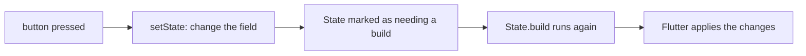

## Before you start

- [[frontend.l1.stateless-vs-stateful]] — you know `_ProductListScreenState` keeps `_products` in its `State`, and that the refresh button replaces it with a new load.

## The situation

A teammate adds a second refresh action to the product screen. Their method assigns a new load to `_products`, exactly like the existing one, but without the extra wrapping they found "noisy". When they press their new button, the server log shows a fresh `GET /api/v1/products`, so the request clearly goes out. Yet the screen does nothing: no loading indicator, no new list, just the old list. The variable has changed; the screen has not. What is missing?

## Core concepts

- **setState** — the call that tells Flutter state changed and schedules that widget's subtree to rebuild.
- subtree — a widget together with everything below it in the tree.
- rebuild — running a `build` method again to get a new description of that part of the UI.

## How it works



A `State` object's fields are ordinary variables. Assigning a new value to one changes the variable and nothing else. Flutter does not watch your fields, so it has no idea anything happened, and the screen keeps showing the last description it was given.

**setState** is how a `State` tells Flutter. You call it with a function that makes the change, such as `setState(() => _products = ...)`. Flutter runs that function straight away, then marks this `State` as needing a new build. Shortly after, before the next frame is drawn, it calls the `State`'s `build` method again. The new description reflects the changed field, and Flutter applies the differences to the screen, as in the widget-tree lesson.

The rebuild covers this widget's subtree, not the whole app. The `State` that called `setState` builds again, and the widgets it returns are updated below it. Widgets above it, such as `DonHangApp` and `MaterialApp`, are not built again, and neither are parts of the app outside this subtree. That keeps a small change cheap: tapping a button on one screen does not redescribe everything else.

## In the Đơn Hàng system

The refresh button on the product screen calls this method:

```dart file=DonHang.App/lib/screens/product_list_screen.dart tag=stage-1 lines=27-27
  void _reload() => setState(() => _products = widget.apiClient.fetchProducts());
```

The function passed to `setState` starts a new load and stores it in `_products`. `setState` then schedules `_ProductListScreenState` to build again. In that build, the `FutureBuilder` receives the new `_products`. It is waiting for it, so it shows the loading indicator; when the products arrive, it builds again and shows the list. That is the whole "a new tree describing the current state" idea, triggered this time by a tap.

The sign-in screen uses the same call to show that work is in progress:

```dart file=DonHang.App/lib/screens/login_screen.dart tag=stage-1 lines=23-27
  Future<void> _submit() async {
    setState(() {
      _loading = true;
      _error = null;
    });
```

Two fields change inside one `setState`, so one rebuild shows both: the button is replaced by a loading indicator, and any old error message disappears. The screen changes before the request to the server has even been sent, because `setState` comes first in `_submit`.

## Beginners often think…

- **"Changing a variable inside a State object updates the screen immediately, without needing setState."** → Actually Flutter does not watch a `State`'s fields; only `setState` tells it that the next description would be different. Without it, the field changes and the screen keeps showing the old description. You notice this as in the teammate's case: the request goes out, the variable holds new data, and nothing on screen moves.
- **"setState rebuilds the entire app, not just the widget whose state changed."** → Actually `setState` schedules a build of the `State` that called it, and of the widgets below it. `DonHangApp` and the other parts of the app above or outside that subtree are not built again. You notice this when you trace what a tap on the refresh button reruns: `_ProductListScreenState.build` and what it returns, nothing above it.

## Try it (3 minutes)

Predict what the product screen does in each case, using `_reload` above as the starting point:

1. `_reload` exactly as it is, and the user presses the refresh button.
2. `_reload` rewritten as `void _reload() { _products = widget.apiClient.fetchProducts(); }`, without `setState`, and the user presses the button.
3. The version from step 2, and then the user resizes the window, which makes Flutter build the screen for its own reasons.

Expected result: 1 — the loading indicator appears, then the refreshed list. 2 — a request goes to the server, but the screen does not change. 3 — at the next build the screen suddenly catches up and shows the new load.

What does case 3 tell you about why case 2 looked broken?

<details><summary>Suggested answer</summary>

The field did change in case 2; nothing asked Flutter to build again, so the screen kept the old description. In case 3 something else caused a build, and that build read the already-changed field. `setState` is what makes the build happen at the moment the state changes, instead of whenever something else happens to trigger one.

</details>

## Connections

- [[frontend.l1.stateless-vs-stateful]] — where the `State` and its fields come from.
- [[frontend.l1.composing-widgets]] — splitting screens into small widgets, each with only the state it needs.

## Five-line summary

1. Assigning to a `State` field changes the variable only; Flutter does not watch fields.
2. `setState` runs your change, then schedules that `State` to build again before the next frame.
3. The rebuild covers the calling widget and what is below it, not the widgets above it.
4. `_reload` wraps the new load in `setState`, so the loading indicator and then the new list appear.
5. One `setState` can change several fields, as `LoginScreen` does, and one rebuild shows them all.
