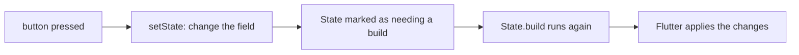

## Bạn cần biết trước

- [[frontend.l1.stateless-vs-stateful]] — bạn biết `_ProductListScreenState` giữ `_products` trong `State` của nó, và nút làm mới thay `_products` bằng một lần tải mới.

## Tình huống

Một đồng nghiệp thêm hành động làm mới thứ hai vào màn hình sản phẩm. Method của anh ấy gán một lần tải mới cho `_products`, y hệt method có sẵn, nhưng bỏ đi lớp bọc thêm mà anh ấy thấy "rườm rà". Khi bấm nút mới, log của server hiện một `GET /api/v1/products` mới, vậy là request rõ ràng đã đi. Thế nhưng màn hình chẳng làm gì: không có dấu hiệu đang tải, không có danh sách mới, chỉ có danh sách cũ. Biến đã đổi, màn hình thì không. Thiếu cái gì?

## Khái niệm cốt lõi

- **setState** — lời gọi báo cho Flutter biết state đã đổi và lên lịch build lại nhánh cây con của widget đó.
- nhánh cây con (subtree) — một widget cùng mọi thứ nằm dưới nó trong cây.
- build lại (rebuild) — chạy lại một method `build` để có bản mô tả mới cho phần UI đó.
- Future — giá trị của Dart cho một việc sẽ xong sau, như lần tải sản phẩm trong `_products`.

## Cơ chế hoạt động



Các field của một object `State` chỉ là biến bình thường. Gán giá trị mới cho một field thì đổi biến đó, ngoài ra không gì khác. Flutter không theo dõi field của bạn, nên nó không hề biết có gì vừa xảy ra, và màn hình vẫn hiện bản mô tả cuối cùng nó nhận được.

Khi có chuyện xảy ra, như người dùng bấm nút, `State` gọi **setState** để báo cho Flutter. Bạn truyền vào một hàm thực hiện thay đổi, chẳng hạn `setState(() { _products = ...; })`. Flutter chạy hàm đó ngay lập tức, rồi đánh dấu `State` này cần build lại. Ngay sau đó, trước lần vẽ màn hình kế tiếp, Flutter gọi lại method `build` của `State`. Bản mô tả mới phản ánh field đã đổi, và Flutter áp những chỗ khác biệt lên màn hình.

Lần tải trong `_products` là một `Future`. Hàm bạn truyền vào không được trả về `Future`: `setState` coi thay đổi là xong khi hàm trả về, và một `Future` được trả về sẽ khiến không rõ lúc nào state mới thật sự đổi. Thân hàm trong cặp ngoặc nhọn không trả về gì. Còn hàm mũi tên như `() => _products = ...` trả về `Future` mới, và Flutter báo lỗi trong lúc bạn đang phát triển.

Lần build lại chỉ phủ nhánh cây con của widget này, không phải cả app. `State` đã gọi `setState` build lại, và các widget nó trả về được cập nhật bên dưới nó. Các widget phía trên, như `DonHangApp` và `MaterialApp`, không build lại, và các phần của app nằm ngoài nhánh cây con này cũng vậy. Nhờ thế một thay đổi nhỏ vẫn rẻ: bấm một nút trên một màn hình không bắt mô tả lại mọi thứ khác.

## Trong hệ thống Đơn Hàng

Nút làm mới trên màn hình sản phẩm gọi method này:

```dart file=DonHang.App/lib/screens/product_list_screen.dart tag=stage-1 lines=27-27
  void _reload() => setState(() { _products = widget.apiClient.fetchProducts(); });
```

Dấu `=>` thuộc về chính `_reload`. Hàm truyền cho `setState` là phần `() { ... }`, dùng ngoặc nhọn. Bên trong hàm đó, `widget.apiClient.fetchProducts()` nhờ `apiClient`, object mà màn hình dùng để nói chuyện với server, lấy lại danh sách sản phẩm, và lần tải mới được lưu vào `_products`. Sau đó `setState` lên lịch cho `_ProductListScreenState` build lại.

Trong lần build đó, `FutureBuilder` (widget trong `build` của màn hình này, hiện dấu hiệu đang tải khi `Future` của nó chưa xong và hiện danh sách khi xong) nhận `_products` mới. Vì vừa được giao một lần tải mới, nó hiện dấu hiệu đang tải. `FutureBuilder` có `State` riêng: khi sản phẩm về tới, nó tự gọi `setState`, build lại và hiện danh sách.

Màn hình đăng nhập, `LoginScreen`, dùng cùng lời gọi đó để cho thấy đang có việc chạy:

```dart file=DonHang.App/lib/screens/login_screen.dart tag=stage-1 lines=23-27
  Future<void> _submit() async {
    setState(() {
      _loading = true;
      _error = null;
    });
```

Hai field đổi bên trong cùng một `setState`, nên một lần build lại hiện cả hai. `build` của màn hình đọc `_loading` để tắt nút và hiện dấu hiệu đang tải thay cho nhãn nút, rồi đọc `_error` để quyết định có hiện thông báo lỗi hay không. Request đăng nhập nằm sau mấy dòng này. Vì `setState` đứng đầu `_submit`, state đổi trước khi request đó bắt đầu, và ở lần vẽ màn hình kế tiếp, dấu hiệu đang tải hiện ra trong lúc request đang chạy.

## Người mới hay nghĩ rằng…

- **"Đổi một biến trong object State là màn hình cập nhật ngay, không cần setState."** → Thực ra Flutter không theo dõi field của `State`. Chỉ `setState` báo cho nó biết bản mô tả kế tiếp sẽ khác. Không có lời gọi đó, field vẫn đổi nhưng màn hình cứ hiện bản mô tả cũ. Bạn sẽ nhận ra như trong trường hợp của đồng nghiệp: request đã đi, biến đã giữ dữ liệu mới, mà màn hình không nhúc nhích.
- **"setState build lại toàn bộ app, không chỉ widget có state vừa đổi."** → Thực ra `setState` lên lịch build cho chính `State` đã gọi nó, và cho các widget bên dưới. `DonHangApp` và các phần khác của app nằm phía trên hoặc ngoài nhánh cây con đó không build lại. Bạn sẽ nhận ra ngay trong code: `setState` của nút làm mới nằm trong `_ProductListScreenState`, còn `DonHangApp`, widget trả về `MaterialApp` chứa màn hình này, nằm phía trên nó.

## Thử ngay (3 phút)

Đoán xem màn hình sản phẩm làm gì trong từng trường hợp, lấy `_reload` ở trên làm điểm xuất phát:

1. `_reload` giữ nguyên như hiện tại, và người dùng bấm nút làm mới.
2. `_reload` được viết lại thành `void _reload() { _products = widget.apiClient.fetchProducts(); }`, không có `setState`, và người dùng bấm nút.
3. Phiên bản ở bước 2, rồi giả sử sau đó có thứ khác làm `build` của màn hình này chạy lại.

Kết quả mong đợi: 1 — dấu hiệu đang tải hiện ra, rồi tới danh sách đã làm mới. 2 — một request đi tới server, nhưng màn hình không đổi. 3 — ở lần build đó màn hình bắt kịp: dấu hiệu đang tải hiện ra (`FutureBuilder` vừa được giao một lần tải mới), rồi tới danh sách mới.

Trường hợp 3 cho bạn biết gì về lý do trường hợp 2 trông như bị hỏng?

<details><summary>Gợi ý đáp án</summary>

Ở trường hợp 2, field đã thật sự đổi. Chỉ là không có gì yêu cầu Flutter build lại, nên màn hình giữ bản mô tả cũ. Ở trường hợp 3, một thứ khác gây ra lần build, và lần build đó đọc field đã đổi từ trước. `setState` là thứ làm lần build xảy ra đúng lúc state đổi, thay vì vào bất cứ lúc nào có thứ khác tình cờ kích hoạt.

</details>

## Liên hệ

- [[frontend.l1.stateless-vs-stateful]] — nơi `State` và các field của nó xuất hiện.
- [[frontend.l1.composing-widgets]] — chia màn hình thành các widget nhỏ, mỗi widget chỉ giữ state nó cần.

## Tóm tắt 5 dòng

1. Gán giá trị cho một field của `State` chỉ đổi biến, Flutter không theo dõi field.
2. `setState` chạy thay đổi của bạn, rồi lên lịch cho `State` đó build lại trước lần vẽ màn hình kế tiếp.
3. Lần build lại phủ widget đã gọi và những gì bên dưới nó, không phải các widget phía trên.
4. `_reload` bọc lần tải mới trong `setState`, nên dấu hiệu đang tải rồi danh sách mới lần lượt hiện ra.
5. Một `setState` có thể đổi nhiều field, như `LoginScreen` làm, và một lần build lại hiện tất cả.
