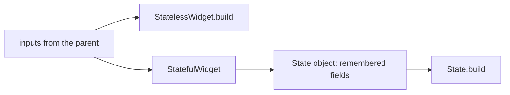

## Before you start

- [[frontend.l1.buildcontext]] — you know every `build` method receives a context for its place in the tree, and that `ProductListScreen` builds its page in a companion class, `_ProductListScreenState`.

## The situation

`DonHangApp` is one short class with a `build` method. `ProductListScreen` is two classes: the widget itself, with almost nothing in it, and `_ProductListScreenState`, which holds a variable called `_products` and does all the building. Both are widgets, both describe part of the same app, and both were written by the same team. So why does one need a second class and the other does not? And when you write the next screen, how do you decide which shape it should take?

## Core concepts

- **StatelessWidget** — a widget that describes the UI from only its inputs; the same inputs always build the same tree.
- **StatefulWidget** — a widget holding a separate `State` that can change over time, without new values passed in from outside.
- `State` object — the companion object of a StatefulWidget; it keeps its fields between builds and has the `build` method.

## How it works



A **StatelessWidget** is the simple case. Everything it shows comes from the values its parent passed into its constructor. Its `build` method reads those values and returns a tree; give it the same values and it returns the same tree. It can still show different things over time, but only because its parent builds it again with different inputs.

A **StatefulWidget** is for a piece of UI that has to remember something by itself, between builds, without anyone passing it a new value. The widget object alone cannot do that: widgets are small descriptions that Flutter creates again every time the parent builds. So a StatefulWidget comes with a separate `State` object. Flutter creates the `State` once, keeps it while the widget stays in the tree, and calls its `build` method whenever the screen needs describing. Anything the `State` stores in its fields is still there on the next build.

That gives a simple test. Ask what the widget needs to show. If all of it arrives from outside, the widget is stateless. If some of it must be remembered or changed by the widget itself — something loading, something typed, something the user picked — it needs a `State`.

## In the Đơn Hàng system

`DonHangApp`, in `main.dart`, is stateless:

```dart file=DonHang.App/lib/main.dart tag=stage-1 lines=12-24
class DonHangApp extends StatelessWidget {
  const DonHangApp({super.key});

  @override
  Widget build(BuildContext context) {
    final apiClient = ApiClient();
    return MaterialApp(
      title: 'Đơn Hàng',
      theme: ThemeData(colorSchemeSeed: Colors.indigo, useMaterial3: true),
      home: ProductListScreen(apiClient: apiClient),
    );
  }
}
```

It has no fields and nothing to remember: every time it builds, it describes the same app, with the same title, colours and first screen. There is nothing for a `State` to hold.

`ProductListScreen` is stateful:

```dart file=DonHang.App/lib/screens/product_list_screen.dart tag=stage-1 lines=8-24
class ProductListScreen extends StatefulWidget {
  final ApiClient apiClient;

  const ProductListScreen({super.key, required this.apiClient});

  @override
  State<ProductListScreen> createState() => _ProductListScreenState();
}

class _ProductListScreenState extends State<ProductListScreen> {
  late Future<List<Product>> _products;

  @override
  void initState() {
    super.initState();
    _products = widget.apiClient.fetchProducts();
  }
```

The widget class keeps only its input, the `apiClient`, and `createState` tells Flutter which `State` to create. The `State` holds `_products`, the product list currently being loaded. `initState` runs once, when the `State` is created, and starts the first load. Because `_products` lives in the `State`, it survives every rebuild of the screen: the load is not started again each time the tree is described. And when the user presses the refresh button, the screen replaces `_products` with a new load by itself; nothing outside passes it a new value. Inside the `State`, `widget.apiClient` reads the input from the widget object.

## Beginners often think…

- **"StatefulWidget is just a StatelessWidget with more code; use it whenever unsure."** → Actually a StatefulWidget adds a second object that Flutter keeps alive and that you must keep correct, for as long as the widget is on screen. If nothing needs remembering, that is extra weight and extra places for mistakes. You notice this when a stateful widget's fields hold values that no code ever changes, which is a sign it should have been stateless.
- **"A StatelessWidget can never change what it shows on screen."** → Actually a stateless widget shows whatever its inputs say, and its parent can build it again with new inputs. Each product's `Text` is stateless, yet the rows show different names, and a row would show a new price if the list were built again with new data. You notice this when a stateless widget's display changes even though it has no fields of its own.

## Try it (3 minutes)

Open these three files from `DonHang.App/lib` and, for each widget, find what it has to remember by itself between builds:

1. `DonHangApp` in `main.dart`.
2. `LoginScreen` in `screens/login_screen.dart`.
3. `CreateOrderScreen` in `screens/create_order_screen.dart`.

Expected result: 1 — nothing, so it is a StatelessWidget. 2 — the error message to show, whether sign-in is in progress, and what is typed in the two fields, so it is a StatefulWidget. 3 — the result message and whether an order is being placed, so it is a StatefulWidget.

Why could `LoginScreen` not be a StatelessWidget that shows a spinner while signing in?

<details><summary>Suggested answer</summary>

Whether sign-in is in progress changes because of something the screen itself does, when the user presses the button. No parent passes it that value, so the screen has to remember it in a `State` field and build again when it changes. A stateless widget has nowhere to keep it.

</details>

## Connections

- [[frontend.l1.buildcontext]] — the `context` and `mounted` that a `State` object provides.
- [[frontend.l1.setstate-and-rebuilding]] — how a `State` tells Flutter that something it remembers has changed.

## Five-line summary

1. A StatelessWidget builds only from its inputs; the same inputs always give the same tree.
2. A StatefulWidget has a separate `State` object that Flutter keeps between builds, holding what the widget remembers.
3. `DonHangApp` has nothing to remember, so it is stateless.
4. `ProductListScreen` keeps the `_products` load in its `State`, so the load survives rebuilds and can be replaced on refresh.
5. Choose stateful only when the widget must remember or change something by itself.
