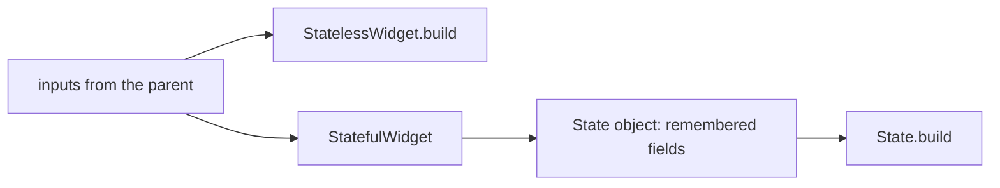

## Bạn cần biết trước

- [[frontend.l1.buildcontext]] — bạn biết mọi method `build` nhận một context cho vị trí của nó trong cây, và `ProductListScreen` dựng trang của nó trong một class đi kèm, `_ProductListScreenState`.

## Tình huống

`DonHangApp` là một class ngắn có một method `build`. `ProductListScreen` thì là hai class: bản thân widget, gần như chẳng có gì bên trong, và `_ProductListScreenState`, class giữ một biến tên `_products` và làm toàn bộ việc dựng. Cả hai đều là widget, cả hai mô tả một phần của cùng một app, và cả hai do cùng một nhóm viết. Vậy vì sao một cái cần class thứ hai còn cái kia thì không? Và khi viết màn hình tiếp theo, bạn quyết định nó nên có dạng nào bằng cách nào?

## Khái niệm cốt lõi

- **StatelessWidget** — widget mô tả giao diện từ đầu vào của nó, cộng với những gì nó tra cứu qua context; cùng đầu vào trong cùng context thì luôn dựng ra cùng một cây.
- **StatefulWidget** — widget giữ một `State` riêng có thể thay đổi theo thời gian, không cần giá trị mới truyền vào từ bên ngoài.
- object `State` — object đi kèm của một StatefulWidget; nó giữ các field của mình giữa các lần build và có method `build`.

## Cơ chế hoạt động



**StatelessWidget** là trường hợp đơn giản. Mọi thứ nó hiển thị đến từ các giá trị widget cha truyền vào constructor, và từ những gì nó tra cứu qua context. Method `build` của nó đọc những thứ đó và trả về một cây; cho nó cùng giá trị trong cùng context thì nó trả về cùng một cây. Nó vẫn có thể hiển thị những thứ khác nhau theo thời gian, khi cha build lại nó với đầu vào khác, hoặc khi thứ nó tra cứu qua context, như màu sắc, thay đổi.

**StatefulWidget** dành cho một mảnh giao diện phải tự nhớ một điều gì đó, giữa các lần build, mà không ai truyền cho nó giá trị mới. StatefulWidget vẫn nhận đầu vào từ cha, như sơ đồ cho thấy, nhưng bản thân object widget không nhớ được gì: widget là những bản mô tả nhỏ mà `build` của cha tạo lại mỗi lần nó chạy. Vì vậy StatefulWidget đi kèm một object `State` riêng. Flutter tạo `State` một lần, giữ nó chừng nào widget còn trong cây, và gọi method `build` của nó mỗi khi màn hình cần được mô tả. Mọi thứ `State` lưu trong field của nó vẫn còn đó ở lần build sau.

Từ đó có một phép thử đơn giản. Hỏi xem widget cần hiển thị gì. Nếu mọi thứ đều đến từ bên ngoài, widget là stateless. Nếu có phần phải do chính widget nhớ hoặc thay đổi — thứ đang tải, thứ được gõ vào, thứ người dùng chọn — nó cần một `State`.

## Trong hệ thống Đơn Hàng

`DonHangApp`, trong `main.dart`, là stateless:

```dart file=DonHang.App/lib/main.dart tag=stage-1 lines=12-24
class DonHangApp extends StatelessWidget {
  const DonHangApp({super.key});

  @override
  Widget build(BuildContext context) {
    final apiClient = ApiClient();
    return MaterialApp(
      title: 'Đơn Hàng',
      theme: ThemeData(colorSchemeSeed: Colors.indigo, useMaterial3: true),
      home: ProductListScreen(apiClient: apiClient),
    );
  }
}
```

Nó không có field nào và không có gì phải nhớ: mỗi lần build, nó mô tả cùng một app, với cùng tiêu đề, màu sắc và màn hình đầu tiên. Không có gì để một `State` giữ.

`ProductListScreen` là stateful:

```dart file=DonHang.App/lib/screens/product_list_screen.dart tag=stage-1 lines=8-24
class ProductListScreen extends StatefulWidget {
  final ApiClient apiClient;

  const ProductListScreen({super.key, required this.apiClient});

  @override
  State<ProductListScreen> createState() => _ProductListScreenState();
}

class _ProductListScreenState extends State<ProductListScreen> {
  late Future<List<Product>> _products;

  @override
  void initState() {
    super.initState();
    _products = widget.apiClient.fetchProducts();
  }
```

Class widget chỉ giữ đầu vào của nó, `apiClient`, còn `createState` cho Flutter biết phải tạo `State` nào. `State` giữ `_products`, danh sách sản phẩm đang được tải; `late` nghĩa là field này nhận giá trị sau khi object được tạo, ở đây là trong `initState`. `initState` chạy một lần, khi `State` được tạo, và bắt đầu lần tải đầu tiên. Vì `_products` nằm trong `State`, nó sống qua mọi lần build lại màn hình: lần tải không bị bắt đầu lại mỗi khi cây được mô tả.

Và khi người dùng bấm nút làm mới, màn hình tự thay `_products` bằng một lần tải mới, trong method `_reload` ở phía dưới cùng file; không có gì bên ngoài truyền cho nó giá trị mới. Bên trong `State`, `widget.apiClient` đọc đầu vào từ object widget. Cách `State` báo Flutter build lại sau khi thay `_products` là chủ đề của bài sau.

## Người mới hay nghĩ rằng…

- **"StatefulWidget chỉ là StatelessWidget có thêm code; cứ dùng nó khi không chắc."** → Thực ra StatefulWidget thêm một object thứ hai mà Flutter giữ sống, có các field mà bạn phải tự gán và cập nhật, chừng nào widget còn trên màn hình. Nếu không có gì cần nhớ, đó là gánh nặng thừa và thêm chỗ để sai. Bạn sẽ nhận ra khi không có gì trong `State` của một widget từng được tải, được gõ, được chọn hay được thay sau lần build đầu, dấu hiệu cho thấy nó lẽ ra có thể là stateless.
- **"StatelessWidget không bao giờ thay đổi được thứ nó hiển thị trên màn hình."** → Thực ra widget stateless hiển thị bất cứ thứ gì đầu vào của nó nói, và cha có thể build lại nó với đầu vào mới. Trong danh sách của `ProductListScreen`, tên mỗi sản phẩm được hiển thị bằng một `Text`, vốn là stateless, vậy mà các dòng hiện tên khác nhau, và một dòng sẽ hiện giá mới nếu danh sách được build lại với dữ liệu mới. Bạn sẽ nhận ra khi phần hiển thị của một widget stateless thay đổi dù nó không có field riêng nào.

## Thử ngay (3 phút)

Mở ba file sau trong `DonHang.App/lib` và, với mỗi widget, tìm xem nó phải tự nhớ gì giữa các lần build:

1. `DonHangApp` trong `main.dart`.
2. `LoginScreen` trong `screens/login_screen.dart`.
3. `CreateOrderScreen` trong `screens/create_order_screen.dart`.

Kết quả mong đợi: 1 — không gì cả, nên nó là StatelessWidget. 2 — thông báo lỗi cần hiện, việc đăng nhập có đang diễn ra hay không, và những gì được gõ vào ô email và ô mật khẩu, nên nó là StatefulWidget. 3 — thông báo kết quả và việc có đang đặt hàng hay không, nên nó là StatefulWidget.

Vì sao `LoginScreen` không thể là một StatelessWidget hiện dấu hiệu đang tải trong lúc đăng nhập?

<details><summary>Gợi ý đáp án</summary>

Việc đăng nhập có đang diễn ra hay không thay đổi do chính màn hình làm, khi người dùng bấm nút. Không có cha nào truyền cho nó giá trị đó, nên màn hình phải nhớ nó trong một field của `State` và build lại khi nó thay đổi. Widget stateless không có chỗ nào để giữ giá trị đó.

</details>

## Liên hệ

- [[frontend.l1.buildcontext]] — `context` và `mounted` được dùng bên trong `_LoginScreenState`, một class `State`.
- [[frontend.l1.setstate-and-rebuilding]] — cách một `State` báo cho Flutter biết thứ nó nhớ đã thay đổi.

## Tóm tắt 5 dòng

1. StatelessWidget dựng từ đầu vào và context của nó; cùng đầu vào trong cùng context thì cho cùng một cây.
2. StatefulWidget có một object `State` riêng mà Flutter giữ giữa các lần build, chứa những gì widget nhớ.
3. `DonHangApp` không có gì phải nhớ, nên nó là stateless.
4. `ProductListScreen` giữ lần tải `_products` trong `State`, nên lần tải sống qua các lần build lại và có thể được thay khi làm mới.
5. Chỉ chọn stateful khi widget phải tự nhớ hoặc tự thay đổi điều gì đó.
