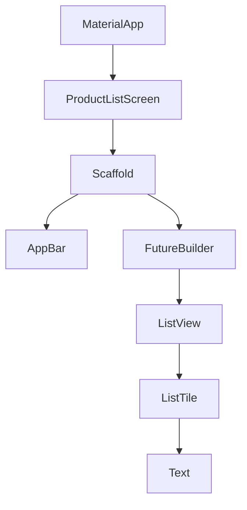

## Before you start

- [[frontend.l1.the-dom]] — you know a web page on screen is drawn from the DOM, a tree the browser builds from HTML and that JavaScript changes in place.

## The situation

With the lab running, `http://localhost:8081` opens the Đơn Hàng app: a title bar reading "Đơn Hàng", a list of products with their prices, and a round refresh button in the corner. `scripts/up.sh` built it with `flutter build web`, and yet there is no HTML for the list anywhere in the repository. The app is written in Dart, in `DonHang.App/lib`. So what describes that title bar, that list and that button, and how does the code say which one sits inside which?

## Core concepts

- **widget** — the unit describing a piece of Flutter UI, from spacing and a line of text up to a whole screen.
- **widget tree** — the nested structure of widgets describing what the UI should look like right now.
- `build` method — the method in which a widget returns the widgets it is made of, one level further down the tree.

## How it works



In Flutter, everything you see is a **widget**. A line of text is a `Text` widget. Space around it is a `Padding` widget. A row in a list is a `ListTile`. A whole screen, with its title bar and body, is a widget too. Each widget describes one piece of the UI and, through its `build` method or its constructor, which widgets sit inside it.

Put together, those descriptions form the **widget tree**: the app at the top, a screen under it, a page layout under that, and so on down to single lines of text. It plays the role nested HTML elements played on a web page: containment, level by level.

The big difference is what happens when something changes. On a web page, JavaScript finds a DOM node and changes it in place. In Flutter, code does not edit the old tree. It builds a new description of what the UI should be now, and Flutter compares that description with the previous one and updates the screen only where they differ. Building the description is cheap; widgets are small, short-lived objects. Redrawing is done only for what actually changed.

## In the Đơn Hàng system

The top of the tree is `DonHangApp`, in `DonHang.App/lib/main.dart`:

```dart file=DonHang.App/lib/main.dart tag=stage-1 lines=15-23
  @override
  Widget build(BuildContext context) {
    final apiClient = ApiClient();
    return MaterialApp(
      title: 'Đơn Hàng',
      theme: ThemeData(colorSchemeSeed: Colors.indigo, useMaterial3: true),
      home: ProductListScreen(apiClient: apiClient),
    );
  }
```

Its `build` returns a `MaterialApp`, which sets the app's title and colours, and whose first screen, `home`, is a `ProductListScreen`. That screen's own `build` returns a `Scaffold`: the standard page layout, with an `AppBar` holding the "Đơn Hàng" title and the login icon, a `body`, and the round refresh button. The body is a `FutureBuilder`, which shows a spinner while the products load and, once they arrive, the list:

```dart file=DonHang.App/lib/screens/product_list_screen.dart tag=stage-1 lines=52-65
          final products = snapshot.data ?? [];
          if (products.isEmpty) {
            return const Center(child: Text('No products yet.'));
          }
          return ListView.builder(
            itemCount: products.length,
            itemBuilder: (context, index) {
              final product = products[index];
              return ListTile(
                title: Text(product.name),
                trailing: Text('${product.priceVnd} đ'),
              );
            },
          );
```

The list is a `ListView`, and each product is a `ListTile` with two `Text` widgets inside it: the name as its `title`, the price at its `trailing` end. Reading the code from `MaterialApp` down to these `Text` widgets is reading the widget tree from its root to its leaves. Each step down that chain is one widget naming another as its child, either in a `build` method or in a constructor argument such as `home`, `body` or `title`.

## Beginners often think…

- **"A widget is a screen; a whole app has one widget per screen."** → Actually a screen is one widget among many. `ProductListScreen` is a widget, but so are its `Scaffold`, its `AppBar`, each `ListTile`, and each `Text` inside a tile. You notice this when you count the widgets behind one product row and find a `ListTile` and two `Text` widgets.
- **"Building a new widget tree on every change means Flutter redraws every pixel from scratch every time."** → Actually the widget tree is only a description. Flutter compares the new description with the previous one and redraws only what differs. You notice this when a screen with a long list rebuilds its description after a change and stays smooth, because only the changed part is drawn again.

## Try it (3 minutes)

Start the lab (`scripts/up.sh` from the repository root), open `http://localhost:8081`, and open `DonHang.App/lib/screens/product_list_screen.dart` next to it. For each thing on screen, name the widget in the code that describes it:

1. The "Đơn Hàng" title at the top.
2. One product's name and one product's price.
3. The round button in the bottom corner.

Expected result: 1 — a `Text` inside the `AppBar`'s `title`. 2 — two `Text` widgets inside one `ListTile`, as its `title` and `trailing`. 3 — the `FloatingActionButton`, with an `Icon` inside it.

Which widget in this file describes the whole screen, and which widget is its parent in the tree?

<details><summary>Suggested answer</summary>

The `Scaffold` returned by `ProductListScreen`'s `build` describes the whole page layout: title bar, body and button. Its parent is `ProductListScreen` itself, which in turn sits under `MaterialApp` as its `home`.

</details>

## Connections

- [[frontend.l1.the-dom]] — the web's tree, changed in place instead of rebuilt.
- [[frontend.l1.build-layout-paint]] — how Flutter turns the widget tree into pixels.

## Five-line summary

1. In Flutter, everything on screen is a widget, from a line of text to a whole screen.
2. Widgets nest inside each other, through `build` methods and constructor arguments, forming the widget tree.
3. The Đơn Hàng app's tree runs `MaterialApp` → `ProductListScreen` → `Scaffold` → `FutureBuilder` → `ListView` → `ListTile` → `Text`.
4. A change builds a new description of the tree instead of editing the old one in place.
5. Flutter compares the new description with the old and redraws only what differs.
