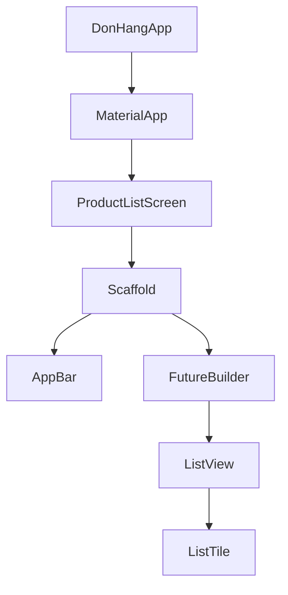

## Before you start

- [[frontend.l1.the-dom]] — you know a web page on screen is drawn from the DOM, a tree the browser builds from HTML and that JavaScript changes in place.

## The situation

With the lab running, `http://localhost:8081` opens the Đơn Hàng app: a title bar reading "Đơn Hàng", a list of products with their prices, and a refresh button in the bottom corner. The app is written with Flutter, a toolkit for building an app's screens in the Dart language; `scripts/up.sh` turns it into files a browser can run with `flutter build web`. Yet there is no HTML for the list anywhere in the repository, only Dart files in `DonHang.App/lib`. So what describes that title bar, that list and that button, and how does the code say which one sits inside which?

## Core concepts

- **widget** — the unit describing a piece of Flutter UI, from spacing and a line of text up to a whole screen.
- **widget tree** — the nested structure of widgets describing what the UI should look like right now.
- `build` method — the method that returns the widgets something is made of, one level further down the tree.

## How it works



In Flutter, almost everything you see is a **widget**. A line of text is a `Text` widget. Space around it is a `Padding` widget. A row in a list is a `ListTile`. A whole screen, with its title bar and body, is a widget too. Each widget describes one piece of the UI and says which widgets sit inside it, either in a `build` method or through constructor arguments.

Put together, those descriptions form the **widget tree**. In the diagram, each arrow points from a widget to one it contains: the app at the top, a screen under it, a page layout under that, and so on down to single rows; the next section names each box. It plays the role nested HTML elements played on a web page: containment, level by level.

The big difference is what happens when something changes. On a web page, JavaScript finds a DOM node and changes it in place. In Flutter, code does not edit the old tree. The `build` method runs again and returns a new description of what the UI should be now. Flutter compares it with the previous description, works out the smallest set of changes between the two, and applies only those to the screen. Building the description is cheap, because widgets are small, short-lived objects.

## In the Đơn Hàng system

The tree starts with `DonHangApp`, a widget in `DonHang.App/lib/main.dart`:

```dart file=DonHang.App/lib/main.dart tag=stage-1 lines=15-23
  @override
  Widget build(BuildContext context) {
    final apiClient = ApiClient();
    return MaterialApp(
      title: 'Đơn Hàng',
      theme: ThemeData(colorSchemeSeed: Colors.indigo, useMaterial3: true),
      home: ProductListScreen(apiClient: apiClient),
    );
  }
```

It creates an `ApiClient`, the class that calls the API (`context` can be ignored for now). Its `build` returns a `MaterialApp`, which sets the app's name and colours — not the text in the title bar — and whose first screen, `home`, is a `ProductListScreen`.

`ProductListScreen` describes its page in a companion class, `_ProductListScreenState`; a later lesson explains why some widgets need one. That class's `build` returns a `Scaffold`, the standard page layout.

The `Scaffold` holds an `AppBar` with the "Đơn Hàng" title, a `body`, and the refresh button. The body is a `FutureBuilder`, which shows a spinner while the products load. When they arrive, it builds again and returns the list instead; `snapshot.data` is that list of products:

```dart file=DonHang.App/lib/screens/product_list_screen.dart tag=stage-1 lines=52-65
          final products = snapshot.data ?? [];
          if (products.isEmpty) {
            return const Center(child: Text('No products yet.'));
          }
          return ListView.builder(
            itemCount: products.length,
            itemBuilder: (context, index) {
              final product = products[index];
              return ListTile(
                title: Text(product.name),
                trailing: Text('${product.priceVnd} đ'),
              );
            },
          );
```

`ListView.builder` creates a list with one row per product. Each row is a `ListTile` with two `Text` widgets inside it: the name as its `title`, the price at its `trailing` end. Nothing edited the spinner into a list; the second build simply described a list.

## Beginners often think…

- **"A widget is a screen; a whole app has one widget per screen."** → Actually a screen is one widget among many. `ProductListScreen` is a widget, but so are its `Scaffold`, its `AppBar`, each `ListTile`, and each `Text` inside a tile. You notice this when you count the widgets behind one product row and find a `ListTile` and two `Text` widgets.
- **"Building a new widget tree on every change means Flutter redraws every pixel from scratch every time."** → Actually the widget tree is only a description. Flutter compares the new description with the previous one and applies only the changes between them. You notice this when you press the refresh button: the `build` of `_ProductListScreenState` runs again and describes the title bar exactly as before, and the title bar stays as it was while the body changes.

## Try it (3 minutes)

Start the lab (`scripts/up.sh` from the repository root; it needs the Flutter SDK installed on your machine, and the app is served on port 8081), open `http://localhost:8081`, and open `DonHang.App/lib/screens/product_list_screen.dart` next to it. For each thing on screen, name the widget in the code that describes it:

1. The "Đơn Hàng" title at the top.
2. One product's name and one product's price.
3. The refresh button in the bottom corner.

Expected result: 1 — a `Text` inside the `AppBar`'s `title`. 2 — two `Text` widgets inside one `ListTile`, as its `title` and `trailing`. 3 — the `FloatingActionButton`, with an `Icon` inside it.

Which widget in this file lays out the whole page — title bar, body and button together — and which class's `build` returns it?

<details><summary>Suggested answer</summary>

The `Scaffold`. It is returned by the `build` of `_ProductListScreenState`, the companion class of `ProductListScreen`, which in turn sits under `MaterialApp` as its `home`.

</details>

## Connections

- [[frontend.l1.the-dom]] — the web's tree, changed in place instead of rebuilt.
- [[frontend.l1.build-layout-paint]] — how Flutter turns the widget tree into pixels.

## Five-line summary

1. In Flutter, almost everything on screen is a widget, from a line of text to a whole screen.
2. Widgets nest inside each other, through `build` methods and constructor arguments, forming the widget tree.
3. The Đơn Hàng app's tree runs `DonHangApp` → `MaterialApp` → `ProductListScreen` → `Scaffold` → `FutureBuilder` → `ListView` → `ListTile`.
4. A change runs `build` again and produces a new description instead of editing the old tree in place.
5. Flutter compares the new description with the old one and applies only the changes between them.
