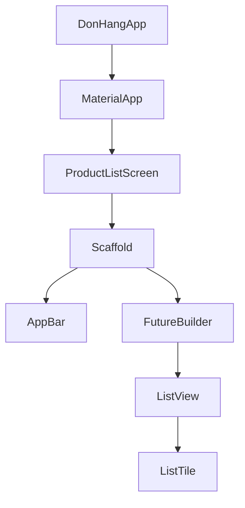

## Bạn cần biết trước

- [[frontend.l1.the-dom]] — bạn biết một trang web trên màn hình được vẽ từ DOM, một cái cây trình duyệt dựng từ HTML và JavaScript sửa tại chỗ.

## Tình huống

Khi lab đang chạy, `http://localhost:8081` mở app Đơn Hàng: một thanh tiêu đề ghi "Đơn Hàng", một danh sách sản phẩm kèm giá, và một nút làm mới ở góc dưới. App được viết bằng Flutter, bộ công cụ để xây các màn hình của app bằng ngôn ngữ Dart; `scripts/up.sh` biến nó thành các file trình duyệt chạy được bằng `flutter build web`. Vậy mà trong repo không có dòng HTML nào cho danh sách, chỉ có các file Dart trong `DonHang.App/lib`. Vậy thứ gì mô tả thanh tiêu đề, danh sách và nút bấm đó, và code nói cái nào nằm trong cái nào bằng cách nào?

## Khái niệm cốt lõi

- **widget** — đơn vị mô tả một mảnh giao diện Flutter, từ khoảng cách và một dòng chữ cho tới cả một màn hình.
- **widget tree** — cấu trúc lồng nhau của các widget, mô tả giao diện lúc này phải trông ra sao.
- method `build` — method trả về các widget tạo nên một thứ gì đó, xuống thêm một tầng trong cây.

## Cơ chế hoạt động



Trong Flutter, gần như mọi thứ bạn thấy đều là **widget**. Một dòng chữ là widget `Text`. Khoảng trống quanh nó là widget `Padding`. Một dòng trong danh sách là `ListTile`. Cả một màn hình, với thanh tiêu đề và phần thân, cũng là một widget. Mỗi widget mô tả một mảnh giao diện và nói widget nào nằm bên trong nó, hoặc trong method `build`, hoặc qua tham số constructor.

Gộp lại, những mô tả đó tạo thành **widget tree**. Trong sơ đồ, mỗi mũi tên chỉ từ một widget tới một widget mà nó chứa: app ở trên cùng, một màn hình dưới nó, một bố cục trang dưới nữa, cứ thế xuống tới từng dòng; phần sau sẽ gọi tên từng ô. Nó đóng vai trò mà các phần tử HTML lồng nhau đảm nhận trên trang web: chứa nhau, từng tầng một.

Khác biệt lớn nằm ở chuyện xảy ra khi có gì đó thay đổi. Trên trang web, JavaScript tìm một node DOM và sửa nó tại chỗ. Trong Flutter, code không sửa cây cũ. Method `build` chạy lại và trả về một bản mô tả mới về giao diện lúc này phải ra sao. Flutter so nó với bản mô tả trước, tính ra tập thay đổi nhỏ nhất giữa hai bản, và chỉ áp những thay đổi đó lên màn hình. Dựng bản mô tả thì rẻ, vì widget là những object nhỏ, sống ngắn.

## Trong hệ thống Đơn Hàng

Cây bắt đầu từ `DonHangApp`, một widget trong `DonHang.App/lib/main.dart`:

```dart file=DonHang.App/lib/main.dart tag=stage-1 lines=15-23
  @override
  Widget build(BuildContext context) {
    final apiClient = ApiClient();
    return MaterialApp(
      title: 'Đơn Hàng',
      theme: ThemeData(colorSchemeSeed: Colors.indigo, useMaterial3: true),
      home: ProductListScreen(apiClient: apiClient),
    );
  }
```

Nó tạo một `ApiClient`, class gọi API (tạm bỏ qua `context`). `build` của nó trả về một `MaterialApp`, thứ đặt tên và màu sắc cho app — không phải chữ trên thanh tiêu đề — và màn hình đầu tiên của nó, `home`, là một `ProductListScreen`.

`ProductListScreen` mô tả trang của nó trong một class đi kèm, `_ProductListScreenState`; một bài sau sẽ giải thích vì sao có widget cần class như vậy. `build` của class đó trả về một `Scaffold`, bố cục trang chuẩn.

`Scaffold` chứa một `AppBar` với tiêu đề "Đơn Hàng", một `body`, và nút làm mới. Phần thân là một `FutureBuilder`, hiện vòng quay trong lúc sản phẩm đang tải. Khi sản phẩm về, nó build lại và trả về danh sách thay cho vòng quay; `snapshot.data` chính là danh sách sản phẩm đó:

```dart file=DonHang.App/lib/screens/product_list_screen.dart tag=stage-1 lines=52-65
          final products = snapshot.data ?? [];
          if (products.isEmpty) {
            return const Center(child: Text('No products yet.'));
          }
          return ListView.builder(
            itemCount: products.length,
            itemBuilder: (context, index) {
              final product = products[index];
              return ListTile(
                title: Text(product.name),
                trailing: Text('${product.priceVnd} đ'),
              );
            },
          );
```

`ListView.builder` tạo một danh sách có mỗi sản phẩm một dòng. Mỗi dòng là một `ListTile` chứa hai widget `Text`: tên làm `title`, giá ở đầu `trailing`. Không có gì sửa vòng quay thành danh sách; lần build thứ hai đơn giản là mô tả một danh sách.

## Người mới hay nghĩ rằng…

- **"Widget là một màn hình; cả app có mỗi màn hình một widget."** → Thực ra một màn hình chỉ là một widget trong rất nhiều widget. `ProductListScreen` là widget, nhưng `Scaffold`, `AppBar`, từng `ListTile` và từng `Text` trong một dòng cũng vậy. Bạn sẽ nhận ra khi đếm các widget đứng sau một dòng sản phẩm và thấy một `ListTile` cùng hai `Text`.
- **"Dựng một widget tree mới ở mỗi thay đổi nghĩa là Flutter vẽ lại mọi pixel từ đầu mỗi lần."** → Thực ra widget tree chỉ là một bản mô tả. Flutter so bản mô tả mới với bản trước và chỉ áp những thay đổi giữa hai bản. Bạn sẽ nhận ra khi bấm nút làm mới: `build` của `_ProductListScreenState` chạy lại và mô tả thanh tiêu đề y hệt như trước, và thanh tiêu đề giữ nguyên trong khi phần thân thay đổi.

## Thử ngay (3 phút)

Khởi động lab (`scripts/up.sh` từ thư mục gốc của repo; cần cài Flutter SDK trên máy, và app được phục vụ ở cổng 8081), mở `http://localhost:8081`, và mở `DonHang.App/lib/screens/product_list_screen.dart` bên cạnh. Với mỗi thứ trên màn hình, gọi tên widget trong code mô tả nó:

1. Tiêu đề "Đơn Hàng" ở trên cùng.
2. Tên của một sản phẩm và giá của một sản phẩm.
3. Nút làm mới ở góc dưới.

Kết quả mong đợi: 1 — một `Text` trong `title` của `AppBar`. 2 — hai widget `Text` trong một `ListTile`, làm `title` và `trailing` của nó. 3 — `FloatingActionButton`, với một `Icon` bên trong.

Widget nào trong file này bố cục cả trang — thanh tiêu đề, phần thân và nút bấm cùng lúc — và `build` của class nào trả về nó?

<details><summary>Gợi ý đáp án</summary>

`Scaffold`. Nó được trả về bởi `build` của `_ProductListScreenState`, class đi kèm của `ProductListScreen`, mà `ProductListScreen` lại nằm dưới `MaterialApp` làm `home` của nó.

</details>

## Liên hệ

- [[frontend.l1.the-dom]] — cái cây của web, được sửa tại chỗ thay vì dựng lại.
- [[frontend.l1.build-layout-paint]] — cách Flutter biến widget tree thành pixel.

## Tóm tắt 5 dòng

1. Trong Flutter, gần như mọi thứ trên màn hình là widget, từ một dòng chữ tới cả một màn hình.
2. Widget lồng vào nhau, qua method `build` và tham số constructor, tạo thành widget tree.
3. Cây của app Đơn Hàng đi `DonHangApp` → `MaterialApp` → `ProductListScreen` → `Scaffold` → `FutureBuilder` → `ListView` → `ListTile`.
4. Một thay đổi làm `build` chạy lại và tạo ra bản mô tả mới, thay vì sửa cây cũ tại chỗ.
5. Flutter so bản mô tả mới với bản cũ và chỉ áp những thay đổi giữa hai bản.
