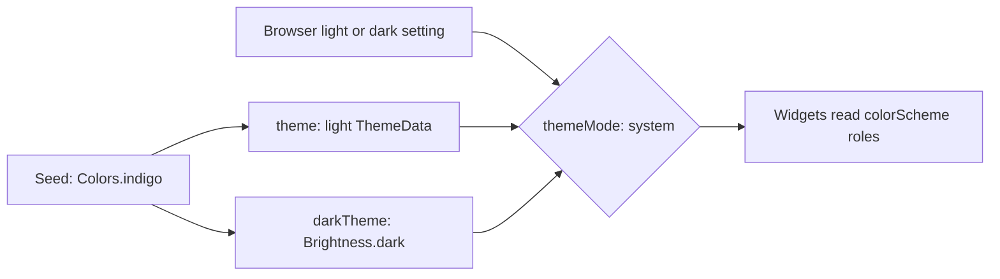

## Before you start

- [[frontend.l2.theme-and-color-scheme]] — you know that `colorSchemeSeed` generates a color scheme of named roles, and that widgets reading those roles follow the theme.
- [[frontend.l2.routes-with-go-router]] — you know that at stage-2 `DonHangApp` builds `MaterialApp.router`, which takes the router from `routerProvider`.

## The situation

It is late, and your laptop is set to its dark appearance. You open DonHang.App at `http://localhost:8081`. The product list shows up on an almost black page, with light text and a deep indigo refresh button, matching the rest of your screen. Nobody on the team picked a single dark color for the app, and the app has no button for light or dark. At stage-1 you saw that every color came from one seed and one theme. How does the app get a whole second set of colors, and how does it know when to use it?

## Core concepts

- **dark mode** — a second, dark-background theme that keeps the same color roles with different values, usually chosen by following the device's setting.
- `darkTheme` — the `MaterialApp` parameter, next to `theme`, that holds the `ThemeData` for dark mode.
- `Brightness.dark` — the value you pass as `brightness` to `ThemeData`, so that the color scheme generated from the seed is the dark one.
- `themeMode` — the `MaterialApp` parameter that chooses between `theme` and `darkTheme`: `ThemeMode.system` follows the device or browser, while `ThemeMode.light` and `ThemeMode.dark` always use one of them.

## How it works



Start at the left. In the situation above, `main.dart` builds two `ThemeData` objects from the same indigo seed. The first is the light theme you know from stage-1. The second adds `brightness: Brightness.dark`, and Flutter generates a dark color scheme from the same seed. No dark color is picked by hand: the generator decides every value.

Both schemes have the same roles, with different values. In the light scheme, `surface` is almost white and `onSurface`, the color for text on it, is almost black. In the dark scheme, `surface` is almost black and `onSurface` is light. `primary` turns from a deep indigo into a light indigo, so it stays readable on a dark page. Not every role gets lighter: `primaryContainer`, the fill of the refresh button, turns from a pale lavender into a deep indigo.

Next, `MaterialApp` has to pick one. That is the job of `themeMode`. DonHang.App does not set it, so it keeps the default, `ThemeMode.system`. In a browser, the system setting is the page's light or dark preference, which the browser sets, usually from the device's appearance. Your laptop said dark, so `MaterialApp` used `darkTheme`, and when the setting changes, the app changes with it.

Finally, the widgets. They never ask which mode is on. They read `Theme.of(context).colorScheme` as before, and they get whichever scheme `MaterialApp` picked. Code that names a role needs no change for dark mode. Only a hardcoded color, such as stage-1's `Colors.red`, stays the same on both backgrounds.

That answers the question: one seed, two generated themes, and a default `themeMode` that follows the device.

## In the Đơn Hàng system

The app, in `DonHang.App/lib/main.dart`:

```dart file=DonHang.App/lib/main.dart tag=stage-2 lines=18-37
// lesson: frontend.l2.routes-with-go-router
// lesson: frontend.l2.dark-mode
// lesson: frontend.l2.localizing-with-arb
// The router decides which screen shows; both themes grow from one seed;
// the text comes from the ARB file of the browser's language.
class DonHangApp extends ConsumerWidget {
  const DonHangApp({super.key});

  @override
  Widget build(BuildContext context, WidgetRef ref) {
    return MaterialApp.router(
      routerConfig: ref.watch(routerProvider),
      onGenerateTitle: (context) => AppLocalizations.of(context).appTitle,
      theme: ThemeData(colorSchemeSeed: Colors.indigo),
      darkTheme: ThemeData(colorSchemeSeed: Colors.indigo, brightness: Brightness.dark),
      localizationsDelegates: AppLocalizations.localizationsDelegates,
      supportedLocales: AppLocalizations.supportedLocales,
    );
  }
}
```

Look at lines 31 and 32. The seed is written twice, once per theme, and the only difference is `brightness: Brightness.dark`. That one argument is the whole dark design of the app. The other lines choose the screens and the language of the text, and do not matter here; the comment's last line is about where the translated texts are kept, covered in [[frontend.l2.localizing-with-arb]].

What is missing matters too: there is no `themeMode:` line. Leaving it out means `ThemeMode.system`, so the choice belongs to the browser. At stage-2 no screen in `DonHang.App/lib` writes a color like `Colors.red` either. The order form, for example, shows a server error with `Theme.of(context).colorScheme.error`, so in dark mode that line gets the dark scheme's `error`, a lighter red made for a dark page.

## Beginners often think…

- **"Dark mode means inverting every color of the light theme."** → Actually the dark scheme is generated separately from the same seed and keeps each role's purpose. Inverting the light `primary`, a deep indigo, would give a khaki yellow, while the dark `primary` is a light indigo. You notice this when accents in dark mode still look like the same brand, only lighter.
- **"Without a switch inside the app, the app always stays light."** → Actually `themeMode` defaults to `ThemeMode.system`, so an app with a `darkTheme` follows the device or browser with no switch at all. You notice this when DonHang.App turns dark as soon as your laptop does, although nobody built a toggle.
- **"Every color in the app has to be written twice, once for each mode."** → Actually only the seed appears twice, in `main.dart`. Screens name roles once, and each role has a value in both schemes. You notice this when the order form's error line changes color in dark mode, although its code names `error` only once.

## Try it (3 minutes)

1. With the Đơn Hàng system running on your machine (`scripts/up.sh` from the repository root), open `http://localhost:8081` in Chrome and look at the product list. If your device is already dark, switch it to light first, so the page starts light.
2. Switch to dark: change your device's appearance to dark, or use DevTools, Chrome's built-in panel for inspecting a page. Open it with `F12`, press `Ctrl+Shift+P`, type `dark` and choose `Emulate CSS prefers-color-scheme: dark`, which makes Chrome tell the page its preference is dark, as if the device had switched.
3. Look at the product list again without reloading.

Expected result: after step 2 the page turns almost black, the product names and prices become light, and the refresh button at the bottom right turns from a pale lavender to a deep indigo. The layout and the text stay the same.

What would you add or change in `main.dart` to make DonHang.App stay light, whatever the browser says?

<details><summary>Suggested answer</summary>

You would add one argument to `MaterialApp.router`, `themeMode: ThemeMode.light`, next to lines 31 and 32. `MaterialApp` would then always use `theme` and ignore `darkTheme`. Deleting line 32 would also work, because with no `darkTheme` the app has only the light theme to use.

</details>

## Connections

- [[frontend.l2.theme-and-color-scheme]] — builds on it: the same seed now generates two color schemes, and naming roles is what lets screens follow both.
- [[frontend.l2.routes-with-go-router]] — the same place in the code: `MaterialApp.router` takes the router and both themes side by side.
- [[frontend.l2.localizing-with-arb]] — the same pattern for text: `MaterialApp` follows the browser's language the way it follows its light or dark setting.

## Five-line summary

1. Dark mode is a second theme with the same color roles and different values, generated from the same seed.
2. DonHang.App passes `darkTheme` next to `theme`, both from the indigo seed; the dark one adds `brightness: Brightness.dark`.
3. `themeMode` picks the theme; DonHang.App keeps the default `ThemeMode.system`, which follows the device or browser setting.
4. In dark mode `surface` becomes dark and `onSurface` light, so code that names a role needs no change.
5. Widgets reading `Theme.of(context).colorScheme` change with the mode; a hardcoded color like `Colors.red` stays the same.
